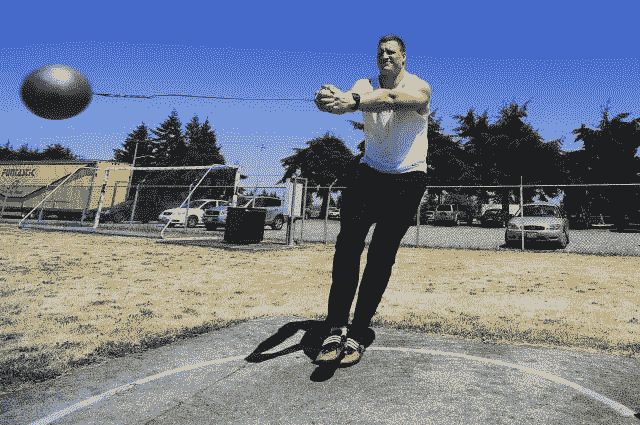
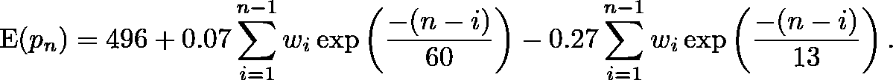

# 累积影响建模—第一部分

> 原文：<https://towardsdatascience.com/modeling-cumulative-impact-part-i-f7ef490ed5e3?source=collection_archive---------8----------------------->

## 创建累积影响的简单特征，使用健身疲劳模型预测运动表现

“一点一点，一点变成很多。”——坦桑尼亚谚语

欢迎来到*建模累积影响*，这是一个通过各种建模镜头查看**运动训练对运动表现**的累积影响的系列。旅程从第一部分开始，从生理学的一个模型“体能疲劳模型”开始，它使用指数衰减的训练强度的卷积。从第二部分开始，该系列将向更通用的技术过渡，包括样条、卡尔曼滤波器和 LSTM 驱动的神经网络。

纵向数据集，尤其是那些具有丰富事件历史的数据集，在公共领域很难找到。本文介绍了一个模拟链球运动员，该运动员模仿了 Busso、Candau 和 Lacour [1]在 1994 年发表的一篇论文中描述的一个真实的对手，在此称为“BCL94”我们称之为“H.T .”的掷链球运动员在研究时 20 岁，有 7 年的掷链球经验。这个模拟的所有代码都是 Github 上的[。](https://github.com/baogorek/Miscellaneous/blob/master/R-code/sports/fitness-fatigue-convolution.ipynb)

The modern sport of hammer throwing. By US Army. Photo credit: Phil Sussman. — [Fort Lewis Soldier…](http://www.army.mil/-news/2009/07/09/24147-fort-lewis-soldier-nails-down-spot-at-12th-world-track-and-field-championships/), Public Domain, [Wikimedia](https://commons.wikimedia.org/w/index.php?curid=8280370)

对于真实的和模拟的 H.T .，训练强度和表现数据是在比赛前 37 周(259 天)内收集的，包括两个一般阶段:

1.  “积累”阶段持续到第 147 天，
2.  平均强度较低的“竞争”期持续到第 259 天，即“主要竞争”日

Simulated daily training intensities for our hammer thrower under a consistent weekly pattern of training intensity and different averages for the two periods.

作者的一个目标是使用训练强度的每日系列来模拟 H.T .的表现， *w_n* ， *n* = 1，…，259。(参见 BCL94 对强度的定义，强度是一个基于判断的公式，它将托举次数、练习投掷次数和跳跃次数合并为一个值。)这些强度在准备期平均为 34 个单位，在比赛期平均为 24 个单位，在最紧张的几周接近 50 个单位，至少低于 20 个单位。[模拟](https://github.com/baogorek/Miscellaneous/blob/master/R-code/sports/fitness-fatigue-convolution.ipynb)大致模拟了这一点。

和训练强度一样， *w_n* ，H.T .每天测得的成绩值， *p_n* ，是艺术和科学的混合体。它们基于人类跑步表现的理论[模型，该模型强化了一种直觉，即接近世界纪录的进步大于接近更普通水平的收获。就规模而言， *p_n =* 1000 相当于世界纪录，而 *p_n =* 0 相当于“任何身体健全的健康人都应该能够[做]”的基线表现](https://www.researchgate.net/publication/20910238_Modeling_human_performance_in_running)

用来解释 H.T .在 BCL94 中表现的模型是“健身疲劳模型”，也以生理学家 [Eric Banister](https://www.tandfonline.com/doi/pdf/10.1080/15438627.2011.556533) 命名为“ [Banister 模型](http://fellrnr.com/wiki/Modeling_Human_Performance#The_Banister_Model)”。在体能-疲劳模型中，一次运动训练引起两种对立效应，*体能*和*疲劳*、*、T19*、*同时以相反的方向影响表现。乍一看，该模型表现为对两个对立协变量的线性回归:*

e(*p*)*=*496+0 . 069**体能* - 0.27 **疲劳。*

注意*疲劳*对表现的负面影响几乎是*健身正面影响的四倍。*

到底什么是*健身*和*疲劳？*体能疲劳模型将两者表征为以下形式的指数衰减量:

g(t) = *k* * exp(-t / τ)，

其中 *k* 是初始量，τ是“衰减时间常数”(虽然健身疲劳是一个特定领域的模型，但读者可能会意识到由指数衰减近似的其他现象，如放射性衰减、[记忆丧失](https://en.wikipedia.org/wiki/Forgetting_curve)，甚至[啤酒泡沫衰退](http://iopscience.iop.org/article/10.1088/0143-0807/23/1/304/meta)。)两者的关键区别在于，对于*适应度，衰减时间常数要大得多；*在 H.T .的情况下，*适应性的τ_ 1 = 60*相对于*疲劳的τ_ 2 = 13*。这导致脉冲响应的显著差异:

Under typical fitness-fatigue configurations, fatigue decays much more quickly than fitness. The impulse from fatigue at any time, however, is typically much greater than the impulse from fitness.

这些指数模型描述了初始水平的*体能*和*疲劳*的衰减，但 H.T .的*体能*和*疲劳*水平是基于过去许多训练课程的效果。应用[叠加原理](https://en.wikipedia.org/wiki/Superposition_principle)(适用于所有线性系统)，对一组刺激的总反应是对单个刺激反应的总和。因此，H.T .在任何时间点的*体能*和*疲劳*由所有过去训练期的时间递减效应的总和来定义。

该操作通过训练历史与指数衰减函数的离散卷积进行数学处理:

有无限数量的这样的特征可以用单个训练历史来构建，首先通过在上面的等式中调制τ，然后从除了纯指数衰减之外的模型中构建。

基于 BCL94 中给出的估计，H.T .的链球投掷成绩的个人体能-疲劳模型为:

Though it’s possible to code in a compact fashion, computing the *fitness* and fatigue features involves inner and outer loops through the data.

这导致了 h . t .*疲劳*、*健康*和相对(基线移除)性能的以下轨迹:

The plot above shows H.T.’s modeled antagonistic fitness (green) and fatigue (red) levels over time, as well as H.T.’s modeled performance sans the offset (i.e., 0.07 * fitness — 0.27 * fatigue).

最终的模拟性能还包括少量伪随机高斯噪声，以创建更真实的估计场景。

## 估计

为了估计体能疲劳模型中的参数，BCL94 首先创建时间常数τ_1 和τ_2 的值的网格。将网格中每个点的时间常数视为已知，通过时间计算*健康度*和*疲劳度*。用普通多元回归拟合 E(p _ n)=μ+k _ 1** fitness _ n**-*k _ 2** fatigue _ n*，其中 *n* 随时间递增，记录每一步的残差平方和(RSS)。具有最小 RSS 的时间常数对与它们相关的回归估计相结合，完成了估计。

或者，也可以通过残差平方和的非线性最小化来直接恢复参数:

The fitness-fatigue parameters can be recovered using non-linear minimization of mean squared error, but it required some tweaking in R.

R 的通用优化器 *optim* 提供的“BFGS”方法在这个例子中运行良好，但是选择合理的初始值仍然是必要的。由于只有两个时变参数和每层的封闭解，BCL94 使用的“网格搜索”是一种有吸引力的估计方法。下面是模拟的实际性能(包括高斯噪声)和拟合模型的预测的全貌:

The points are the actual (simulated) performance measurements from H.T.; the blue line is the fitness-fatigue model’s predictions through time.

# 讨论和后续步骤

本文研究了一个运动表现模型，该模型利用两个对立的、基于卷积的特征来编码训练的效果。这两个特征都是指数衰减的训练强度的离散卷积，只是时间常数不同。该模型在整套参数中是非线性的，但当时间常数是固定的并被认为是已知的时是线性的，这使得网格搜索成为一种可行的估计方法。

虽然体能疲劳模型是一个来自生理学的领域特定模型，但它提出了一个更通用的特征工程策略:当存在一系列具有持续影响但也会随时间衰减的事件时，从具有指数衰减的卷积中构建特征。尝试不同的时间常数，或使用网格搜索交叉验证来探索不同的可能性。

本系列的下一部分将不再假设理论模型中的指数衰减，而是研究如何使用样条来模拟一般的衰减曲线。当手头的理论有限，或者你只是不信任存在的模型时，它会更有用。由于这位作者确实相信指数记忆衰退模型，请继续关注第二部分。

# 参考

[1] T. Busso，R. Candau 和 J. Lacour，[疲劳和健康模拟训练对表现的影响](https://www.researchgate.net/profile/Robin_Candau/publication/15242395_Fatigue_and_fitness_modelled_from_the_effects_of_training_on_performance/links/55720f2608ae7536374cdc09/Fatigue-and-fitness-modelled-from-the-effects-of-training-on-performance.pdf) (1994)，欧洲应用生理学杂志

[2] R. Morton，R. Fitz-Clarke，E. Banister，[模拟人类在跑步中的表现](https://www.researchgate.net/publication/20910238_Modeling_human_performance_in_running) (1985)，应用生理学杂志