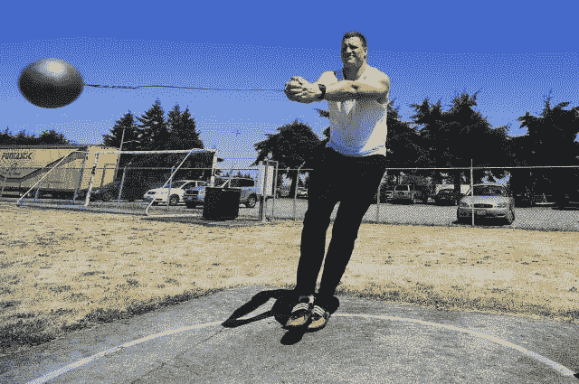
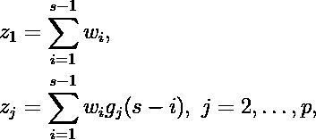
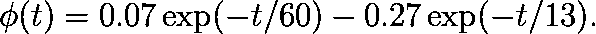
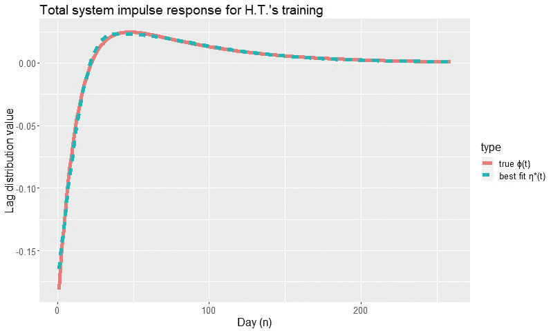
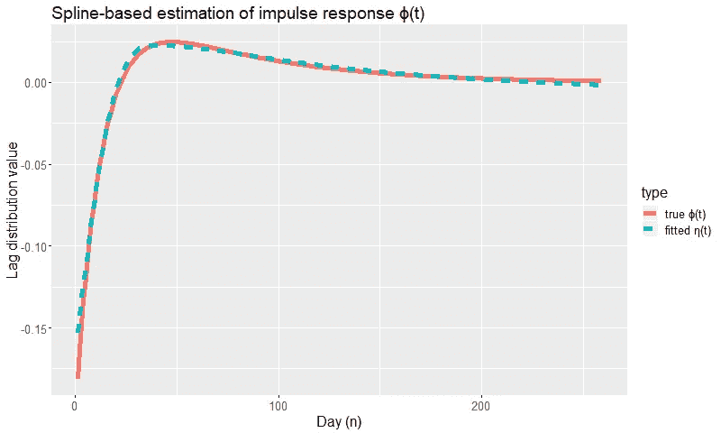
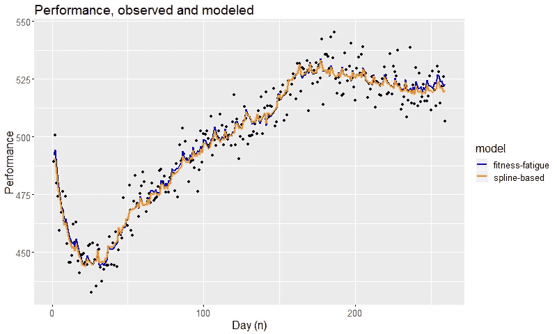

# 累积影响建模—第二部分

> 原文：<https://towardsdatascience.com/modeling-cumulative-impact-part-ii-2bf65db3bb98?source=collection_archive---------28----------------------->

## 超越指数衰减-用样条函数模拟累积影响



Welcome back, “H.T.” The sport of hammer throwing. By US Army. Photo credit: Phil Sussman. — [Fort Lewis Soldier…](http://www.army.mil/-news/2009/07/09/24147-fort-lewis-soldier-nails-down-spot-at-12th-world-track-and-field-championships/), Public Domain, [Wikimedia](https://commons.wikimedia.org/w/index.php?curid=8280370)

在[累积影响建模—第一部分](/modeling-cumulative-impact-part-i-f7ef490ed5e3)中，体能疲劳模型通过期望值方程解释了我们模拟的链球运动员“H.T .”的平均表现:


在上面的预期中，“performance”*p _ n*经过校准，以使 0 到 1000 包括健全人到世界纪录[1]，而 *w_i* 是 H.T .的 performance、Busso、Candau 和 Lacour 的研究人员定义的强度加权训练量[2]。这个等式在概念上可以写成:

*预期成绩= 496 + .07 *体能-.27 *疲劳，*

其中*体能*和*疲劳*是训练强度 *w_i* 的卷积，呈指数衰减。第一部分对此进行了详细解释，但代码块 1 中的 R 代码完成了性能模拟，足以赶上:

Code Block 1\. Simulating H.T.’s training and performance data using the fitness-fatigue model from Physiology.

另外，一个 [Jupyter 笔记本](https://github.com/baogorek/Miscellaneous/blob/master/R-code/sports/fitness-fatigue-convolution.ipynb)有第一部分和第二部分的代码。为简明起见，用于绘图的 ggplot2 代码从代码块中省略，但可在笔记本或[本要点](https://gist.github.com/baogorek/fd8044630383e6cb4f34b32cccd6c0a8)中找到。

虽然体能疲劳模型在解释现实世界中许多运动员的表现方面做得很好，但我们怎么知道数据总是支持双重对抗指数呢？为了回答这个问题,《累积影响建模》的第二部分开发了一个灵活的基于样条的培训和绩效模型。为了进行测试，我们将使用它来恢复用于模拟 H.T .数据的理论模型，在下一部分中，我们将在一些真实的运动员身上进行尝试。

对于基函数 g_j(t)，t = 2，…， *p* ，参数 B 样条表示为η(t)=θ_ 1+σθ_ j g _ j(t)。使用 R 的*样条*包中的`ns()`函数，基函数完全由结位置的选择决定。给定一组合理的结，如果我们可以从数据中估计θ_1，…θ_j，我们将有一个具有灵活脉冲响应的新模型。

由于卷积在加法上是分布式的，所以用η(t)替换*适应度*和*疲劳*构造就可以了，最后我们得到了 *p* 基于卷积的变量，而不是性能回归中的两个变量。请参见下面的代数嵌入:

上面数学计算的结果是，我们不是用指数衰减来卷积训练强度，而是用样条基函数和常数偏移来卷积它们。这些新的卷积变量是:



而这些就像第一部分中的*体能*和*疲劳*一样进入了性能回归公式

为了获得我们的基函数 g_j，我们将不得不面对与参数样条相关的节点选择问题。纽结是两个近似三次多项式相遇的“断点”，应该选择它们来捕捉重要的非线性行为。但是，在一开始不知道要估计的函数的情况下，如何知道重要的非线性行为呢？

为了用鸡开始这个先有鸡还是先有蛋的问题，我们将为我们的模拟数据使用一个近乎理想的结放置。在健康-疲劳模型中，组合脉冲响应是*健康*和*疲劳*指数的线性组合:



用训练强度卷积这个单个函数与卷积两个独立的指数是一样的，我们的最终目标是用我们的样条方法从数据中估计ϕ(t。该函数反映了同时考虑健康和疲劳的训练事件的真实脉冲响应。



Figure 1\. Theoretical system response (solid line) to one of H.T.’s training events. With three carefully chosen knots, our B-spline (dashed) is capable of approximating the function with minimal bias.

考察ϕ(t 的图表(图 1)与 H.T .的表现之间的关系，我们看到在培训活动后的最初几天，对 H.T .的表现有净负面影响。在训练活动后的第 25 天左右，净负面影响已经被中和。在比赛后的第 40 天左右，随着疲劳在体能训练中消散，H.T .仍能从最初的训练中获得最大收益。在第 40 天之后，体能指数缓慢下降，在大约 200 天后，一次锻炼的益处逐渐为零。

在这篇文章中，我们没有直接看到ϕ(t)，但将通过我们的 b 样条η(t)以灵活的方式估计它，它本身取决于估计的参数。一个只有三个内部节点的 B 样条曲线可以确定近似值，如果你把节点放在正确的位置，比如 14 天，40 天和 100 天，但是即使这样也会有偏差。图 1 还显示了η*(t)，或者我们的样条曲线通过线性回归直接拟合真实函数ϕ(t，这非常接近。代码块 2 中的回归代码如下所示:

Code Block 2\. Comparing the true theoretical impulse response with B-spline approximation. Full example with plots shown in the [Jupyter notebook](https://github.com/baogorek/Miscellaneous/blob/master/R-code/sports/fitness-fatigue-convolution.ipynb).

除了直观地向我们展示η(t)与ϕ(t 的接近程度，η*(t)回归为我们提供了逼近ϕ(t).的最佳参数值θ_1，…，θ_p 如果我们可以使用训练和性能数据接近这些系数值，我们就在正确的轨道上。

```
print(eta_star_lm)Call:
lm(formula = plot_df$level ~ my_spline)Coefficients:
(Intercept)   my_spline1   my_spline2   my_spline3   my_spline4  
    -0.1646       0.1909       0.1014       0.3221       0.0756
```

是时候从实际训练和表现数据中用我们的 b 样条η(t)来估计ϕ(t 了。在这篇文章中，我们将带来另一件东西:我们完美选择的结。这是为了说明的简单性，考虑到我们对模拟世界的了解，这是“欺骗”。在本系列的下一部分中，我们将使用真正的游泳运动员的表现数据，而我们将没有这种奢侈。

回想一下[第一部分](/modeling-cumulative-impact-part-i-f7ef490ed5e3)中，通过对抗性*适应度*和*疲劳*结构来估算ϕ(t 是一项数值工作，需要直接非线性估算或 OLS 回归后的时间常数网格搜索。样条卷积方法提供的灵活性的另一个好处是它完全是线性的。

以下 20 行代码仅依赖于`train_df`中的模拟数据，完成基于样条的卷积估计:

Code Block 3: Introducing a spline-based method for modeling cumulative impact.

回归系数估计与上述η*(t)回归的估计相匹配，至少达到估计误差。请注意，变量`z_1`实际上对应于η*(t)回归的截距，因为该变量是通过一列 1 与训练强度的卷积创建的。新的截距只是性能基线，在概念上与体能疲劳模型相同。

```
> summary(spline_reg)Call:
lm(formula = perf ~ z_1 + z_2 + z_3 + z_4 + z_5, data = train_aug_df)Residuals:
     Min       1Q   Median       3Q      Max
-16.6576  -4.3120  -0.0274   4.1162  18.6338Coefficients:
              Estimate Std. Error t value Pr(>|t|)
(Intercept) 491.668936   2.947533  166.81   <2e-16 ***
z_1          -0.153090   0.012525  -12.22   <2e-16 ***
z_2           0.177312   0.011952   14.84   <2e-16 ***
z_3           0.096656   0.007135   13.55   <2e-16 ***
z_4           0.301346   0.026191   11.51   <2e-16 ***
z_5           0.066427   0.005505   12.07   <2e-16 ***
---
Signif. codes:  0 '***' 0.001 '**' 0.01 '*' 0.05 '.' 0.1 ' ' 1Residual standard error: 6.965 on 253 degrees of freedom
Multiple R-squared:  0.9408,    Adjusted R-squared:  0.9396
F-statistic: 803.5 on 5 and 253 DF,  p-value: < 2.2e-16 
```

出于预测的目的，不需要重建ϕ(t 的估计)并重新与数据进行交互。基于卷积的特征已经在回归中，预测是存储在`train_aug_df$perf_hat`中的拟合值。从建模和预测的角度来看，我们用经验驱动的替代方法取代理论驱动的体能疲劳模型的工作已经完成。就像在[第一部分](/modeling-cumulative-impact-part-i-f7ef490ed5e3)中一样，我们根据过去的训练课程和重建总脉冲响应函数的方法进行性能预测。

为了完全关闭循环，代码块 4 执行以下操作:

*   使用上面获得的回归系数从数据中估计真实脉冲响应ϕ(t，即“η(t) hat”
*   用拟合的脉冲响应η(t)进行卷积训练，以证明除了端部效应，回归的拟合值是等价的。
*   卷积训练与真实脉冲响应ϕ(t)，即本文中的体能疲劳模型，以作比较。

Code Block 4\. Closing the loop.

请注意，`get_eta_hat`函数丢弃了第一个系数，即性能基线，并将其添加回第 23 行。第二个系数也是截距，η(t)中的常数项，解释了附加到样条变量的一列。

上述计算导致[遵循基于样条的方法的对比图](https://gist.github.com/baogorek/fd8044630383e6cb4f34b32cccd6c0a8)和用于模拟数据的健身疲劳模型。



Figure 2\. As in Figure 1, the solid line is still the theoretical system response to one of H.T.’s training events. The dashed line also looks similar, but here it is eta_hat, the spline fit from the training and performance data.



Figure 3\. Performance predictions based on past training sessions for classical fitness-fatigue and presented spline-based method.

虽然指数衰减广泛适用，但还有许多其他有趣的衰减曲线。例如，时间序列中的移动平均模型认为，随机冲击在完全消失之前会影响固定数量的时间段。或者，也许一个事件的影响会衰减到非零水平，就像我们愿意相信的那样。本文展示的基于样条的方法适应了指数衰减的这些偏差。

这篇文章是累积影响建模的第二部分，仍然依赖于模拟数据，并能够根据对世界不切实际的了解来选择结。下一部分将在真实的运动员身上研究这种方法，其中存在不同时间尺度上发生的缺失数据和动态。

虽然该方法失去了作为模型构造的*健康*和*疲劳*的直观吸引力，但封闭形式的解决方案和对初始值的缺乏使其成为一种有吸引力的替代方案。该方法做出的性能预测非常类似于其理论驱动的、完全参数化的对应方法，并且提供了脉冲响应的估计，该估计继续具有直观的主题解释。

在下一篇文章中，我们“放下锤子”和五个真正的游泳者一起下水，在实践中测试这个方法。它将出现在累积影响建模的第三部分。

# 参考

[1] R. Morton，R. Fitz-Clarke，E. Banister，[模拟人类在跑步中的表现](https://www.researchgate.net/publication/20910238_Modeling_human_performance_in_running) (1985 年)，《应用生理学杂志》

[2] T. Busso、R. Candau 和 J. Lacour，[疲劳和健康，模拟训练对表现的影响](https://www.researchgate.net/profile/Robin_Candau/publication/15242395_Fatigue_and_fitness_modelled_from_the_effects_of_training_on_performance/links/55720f2608ae7536374cdc09/Fatigue-and-fitness-modelled-from-the-effects-of-training-on-performance.pdf) (1994 年)，《欧洲应用生理学杂志》