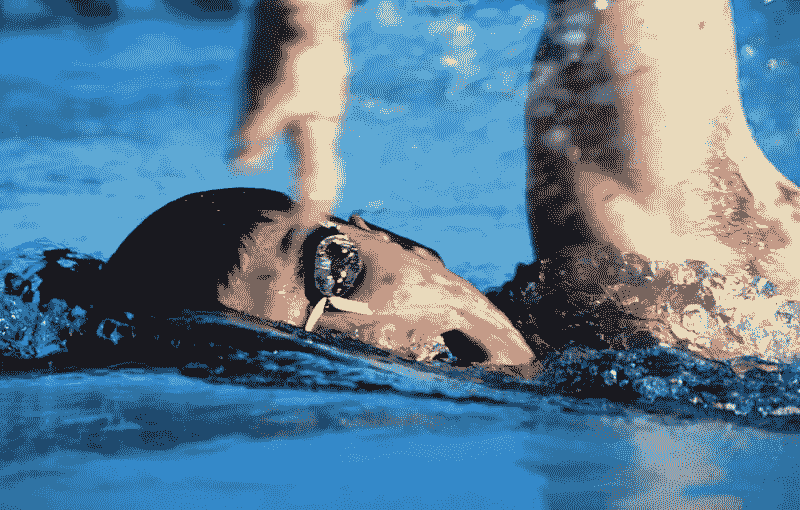
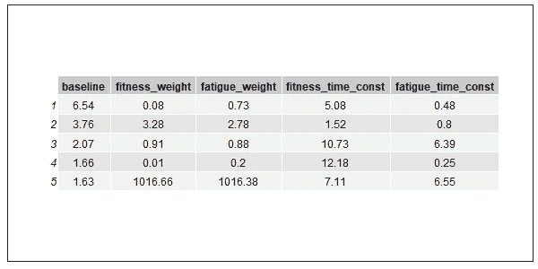
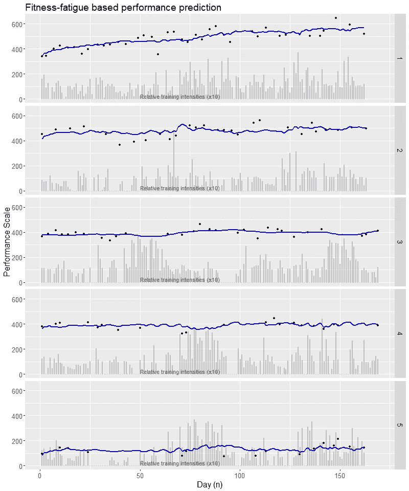
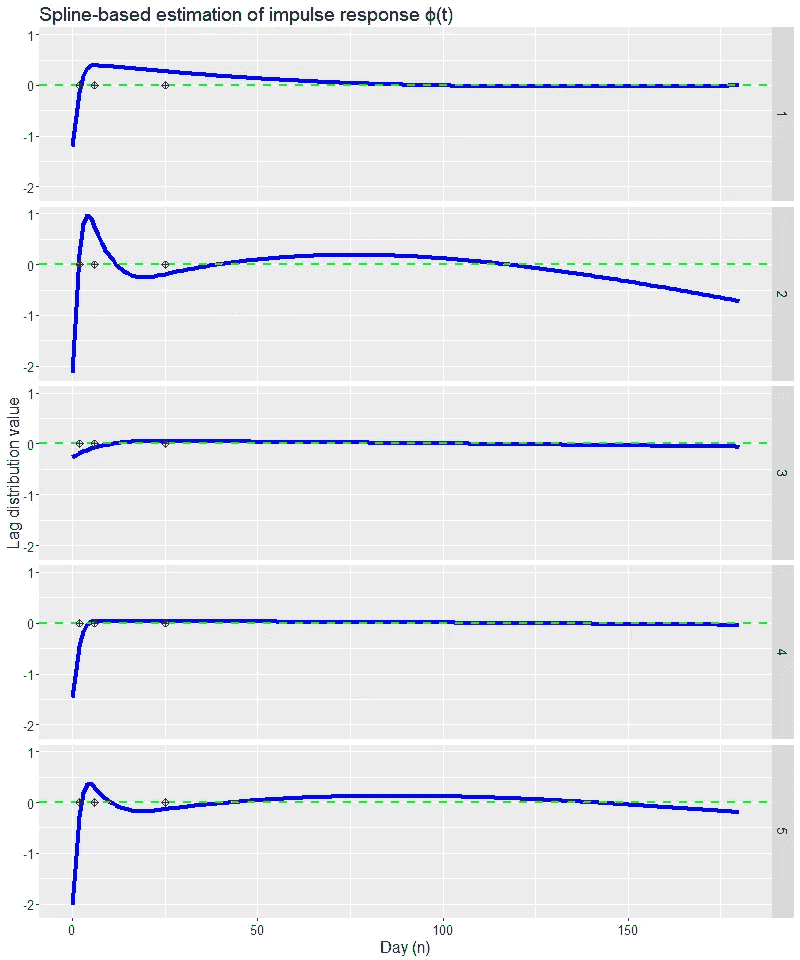
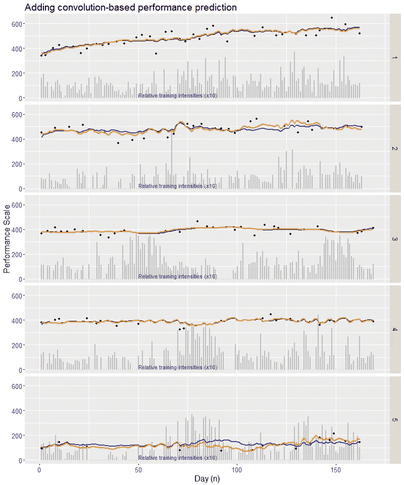
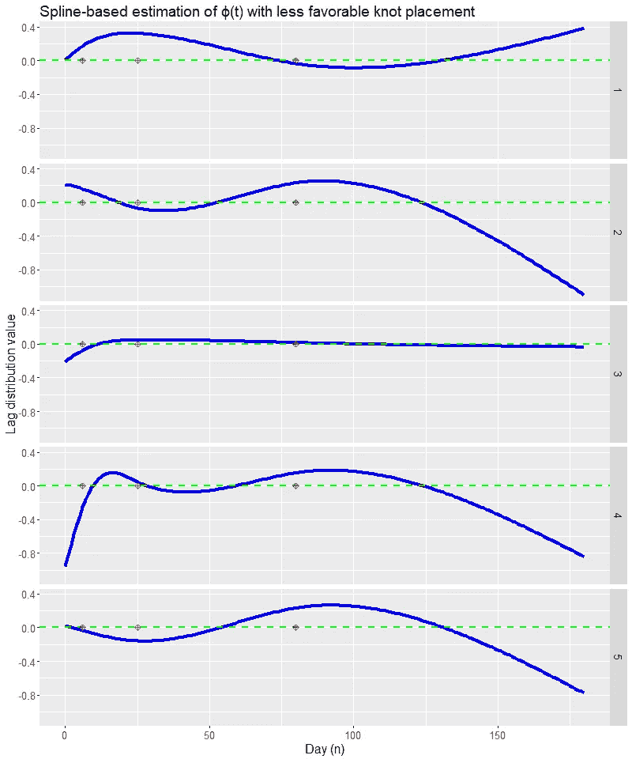

# 累积影响建模第三部分

> 原文：<https://towardsdatascience.com/modeling-cumulative-impact-part-iii-1b216273b499?source=collection_archive---------12----------------------->

## 根据过去的训练强度，模拟五名优秀游泳运动员的表现



A swimmer performing freestyle, [from Wikipedia](https://en.wikipedia.org/wiki/Swimming#/media/File:Natacio.jpg)

到目前为止，本系列已经研究了来自生理模型的模拟数据，即运动表现的“健康-疲劳”模型。虽然模型是特定的，但获得的关于累积影响的见解是普遍适用的。回想一下[第一部分](/modeling-cumulative-impact-part-i-f7ef490ed5e3)展示了指数衰减卷积的使用，而[第二部分](/modeling-cumulative-impact-part-ii-2bf65db3bb98)使用样条函数概括了卷积函数。

虽然模拟数据是理解方法的优秀工具，但它为我们提供了一些不自然的优势(例如，在选择参数初始值和样条节点放置方面)。本文将第一部分和第二部分中的方法应用于一个真实的数据集，涉及转换、试错和一点直觉。我们还将计算标准误差，因为不再可能“看到值已经恢复”

这些数据由克里斯蒂安·拉舍(约翰内斯·古腾堡大学美因茨**)体育科学研究所 Mark Pfeiffer 教授的工作组)提供，并由 Kolossa 等人[1]研究，这些数据来自一项持续 160 天的实验，其中五名游泳运动员在水中和陆地上进行训练，并进行每周一次的游泳速度测试。在水中，训练被量化为游泳强度(1、2、3、5 或 8)乘以每个强度下游泳的距离。在陆地上，1 小时的训练被转换为 2 公里的游泳距离，并根据训练类型进行加权(耐力 2，体能 5，力量 8)。水和陆地训练都累积到每日水平，并且该剂量在数据集中的范围从恰好零(即休息日)到 48.6 单位。**

原始成绩是游泳测试中三次重复的平均速度(m/s ),每次重复时增加阻力，游泳者必须在不爬墙的情况下游完 20 米。与[2]中的链球投掷器(在本系列的前两部分中研究过)不同，这里没有日常测试，因此在响应列中有“缺失值”。下面是游泳者 1 号的第一行数据，对它们的原始形式稍加处理。

```
day training_dose mean_velocity
1   16.02         1.241971153
2   19.31268      NA
3   9.03          1.250052057
4   12.91618      NA
5   0             NA
6   9.6657        NA
7   5.87          1.329180349
```

什么是绩效指标？投掷距离和游泳速度都是“越大越好”类型的变量，并且以它们的原始形式工作。然而，第一部分和第二部分使用了一个被称为“标准点”的转换后的性能指标对于标准点指标，0 代表身体健康的人的表现，1000 代表世界纪录的表现，接近人类极限的进步比更普通水平的进步更有价值。

克里斯蒂安·拉舍(提供了数据)提到，在当前背景下，使用标准点转换是“有争议的”。注意到他的谨慎，我们将在这里使用它。第一个原因是为了实现第一部分和第二部分的连续性，第一部分和第二部分使用了链球运动的标准点。第二个原因是，转换本身就是一个主题，是任何数据科学工具箱的一个有价值的补充。

在 1990 年的文章*模拟人类在跑步中的表现* [3]中，一种量化表现测量的方法基于这样的观察，即随着时间的推移，世界记录近似遵循形式 *y = L + a* exp *(-x / b)，*以由时间常数 *b* 确定的速率接近渐近线 L。参数 *a* 可设为正值或负值，以在越大越好(如投掷)或越小越好(如计时跑步项目)类型评分之间切换。


Figure 1\. World record progression for the men’s 200 m. [By Ar558 — Own work, CC BY-SA 3.0](https://commons.wikimedia.org/w/index.php?curid=7611173)

为了得到原始性能 *y* 的变换，作者建议求解上式中的时间，即*x*=*b*ln(*a*/(*y*—*L*)。从字面上理解很奇怪:一名运动员的表现是人类历史上本应创造世界纪录的时间。作者称这个转换后的量为“临界点”，或“Cp”。

有一个程序先得到 *a* 、 *b* 和 *L.* ，设定 *L* 为人类表现的假设极限，留下两个未知数 *a* 和 *b* 。然后用*x*=*b*ln(*a*/(*y*—*L*))创建两个方程。第一个将左侧设置为 1000，并用世界纪录性能代替 *y* 。第二个将左侧设置为 0，并用健全人的表演替换 *y* 。有了两个方程和两个未知数，这个系统可以解出 *a* 和*b。*它是一个非线性系统，然而，下面的代码块 1 包含一个解算器 R 函数，它将世界纪录、健全人和人类极限表现作为输入，并返回一个包括 *a* 和 *b* 的列表。

Code Block 1\. An R function to solve for *a* and *b* given assumptions about the world record, able-bodied and human-limit performances. Supports types “running” (smaller is better) and “jumping” (larger is better).

没有办法知道*甚至*这个非常特殊的游泳测试的世界纪录，但是假设每秒 2.0 米的人类极限(记住阻力是加进去的)、每秒 1.8 米的世界纪录和每秒 0.5 米的健全人表现导致这样的规模，即我们的五名游泳运动员集体表现接近 0 到 1000 范围的中间(类似于之前研究的链球运动员)。使用这些输入和代码块 1 中提供的 R 函数，我们得到 *a* = -1.5 和 *b* = 496.3。

```
get_perf_params(world_record_perf = 1.8,
                able_bodied_perf = 0.5, limit = 2.0,
                type = "jumping")
```

在从五个游泳者的原始数据文件中读入数据后，下面的代码块 2 也使用了`get_perf_params`。它还将测量值转换为标准点(Cp)标度，并绘制数据。

Code Block 2\. Reading in data, followed by transformation and plotting.


Figure 2\. Transformed performance measurements and daily relative training intensities for the five swimmers.

当将上面的图表与我们在第一部分和第二部分中的链球投掷者进行比较时，有两点非常突出:

*   表现趋势比我们的链球运动员更微妙，他经历了相当剧烈的表现波动。游泳者 1 号在整个研究中的进步是最容易辨别的趋势。
*   与链球运动员相比，收集成绩数据的频率较低，一些游泳运动员比其他人更频繁。

T 体能-疲劳模型提供了一个有用的起点，因为它所强加的结构，我们将在本文后面考虑样条节点放置时从中受益。代码块 3 分别拟合每个游泳者的模型，产生参数估计值(表 1)、标准误差(表 2)和覆盖数据的拟合值图(图 3)。

Code Block 3\. Fitting the fitness-fatigue model for each swimmer, and plotting the fitted values.

因为性能变量中有缺失值，所以在计算平方和时，`rss`函数(第 30 行)现在必须使用选项`na.rm = TRUE`。所有日常训练强度数据都是可用的，卷积变量的计算与之前完全一样。

第 36 到 60 行是计算非线性最小二乘标准误差的特殊函数。它们通过近似 n*x*p*矩阵来工作*


就像普通线性回归中的 **X** 矩阵一样进入方差公式。

和以前一样，我们需要初始值。在代码块 3 的第 72 行，前面文章中的起始值被注释掉，以支持第 73 行的值。当初始化为之前的值时，游泳运动员 1、2 和 4 收敛到一个比链球运动员具有更小的体能和疲劳时间常数的解，这表明游泳运动员总体上具有更快的动力学。另一方面，游泳者 3 和 5 收敛到奇怪的地方(例如，时间常数接近 2000)。更改为较小的开始时间常数不会改变游泳者 1、2 和 4 的解决方案，但会为游泳者 3 和 5 带来更直观的解决方案，因此将用于本文的剩余部分。这些解决方案以参数估计值(表 1)和近似标准误差(表 2)的形式显示如下。


Table 1\. Fitness-fatigue model solutions for Swimmers 1–5.



Table 2\. Fitness-fatigue model approximate standard errors for Swimmers 1–5.

在一封讨论他的数据集的电子邮件中，克里斯蒂安·拉舍提到这项研究中的游泳运动员被认为是“精英”他解释说，由于优秀运动员已经达到了高水平的表现，并且习惯于训练，他们可能不会表现出典型的表现差异。当*有*明显的性能改善时，他的经验法则是“疲劳延迟(时间常数)需要大于适应延迟(大约是适应延迟的两到三倍)，疲劳与适应的比率需要为> 1。”

对于游泳运动员 1，在整个研究中至少取得了一些明显的进步，估计的健康时间常数是游泳运动员中第二大的，为 34.5 天(仍然比链球运动员的 60 天短得多)。估计的疲劳时间常数非常小，只有 1.35 天(只有链球运动员的十分之一)，表明从高强度训练中恢复非常快。尽管衰减非常快，但疲劳重量是健康重量的 4.6 倍(相比之下链球运动员是 2.6 倍)。表 2 中的标准误差计算表明了这些估计值的一些质量，尽管疲劳参数的标准误差相对于其他参数相对较高。

游泳运动员 3 号的疲劳时间常数是所有运动员中最大的，仅略超过链球运动员的 13.4 天。疲劳重量仅比健康重量大 1.5 倍，减少了较长疲劳时间常数的后果。估计的健康时间常数是 23.5 天。除截距之外，游泳者 3 的参数的标准误差估计对于所有参数都相当大。

根据模型拟合，游泳运动员 4 的健身效果微乎其微，稍微积极的健身体重由疲劳体重主导(几乎是 30 倍！).疲劳再次消失得非常快，估计的健康时间常数是五名游泳运动员中最长的，为 46 天。除了健康时间常数之外，Swimmer 4 的标准误差相对较小，这表明各种参数估计值具有一定程度的精确度。

2 号和 5 号游泳运动员的体能和疲劳都非常短暂。对于游泳运动员 5，估计的体能和疲劳影响几乎相等，他也具有最少的测试数据点。这两位游泳运动员的标准误差估计值大得离谱。请特别注意游泳运动员 5 的健身和疲劳重量的标准误差，这说明了关于这两种影响的不同信息是多么少。

承认这里推论的局限性，这些优秀游泳运动员的体能和疲劳动态似乎比我们的大学生链球运动员发生得更快。在五分之四的情况下，疲劳效应消失得非常快。疲劳效应对健康效应的相对强度在模型拟合之间变化很大，但在所有情况下(甚至是游泳运动员 5 的情况)，疲劳重量大于健康重量。

下图 3 显示了上述模型拟合的预测图。该模型能够捕捉到游泳者 1 的积极趋势，但是没有捕捉到许多其他有趣的变化。游泳运动员 2 的模型预测，在第 60 天左右的大强度训练后，成绩会略有提高，这看起来可能已经发生了(也可能是巧合)。对于 3-5 岁的游泳者来说，没什么可看的。



Figure 3\. Transformed performance measurements and daily relative training intensities for the five swimmers overlaid with fitness-fatigue model fitted values.

通过直接估计与训练数据卷积的滞后分布，plines 可以提供额外的灵活性。我们在[第二部分](/modeling-cumulative-impact-part-ii-2bf65db3bb98)中看到了这一点，但现在是时候将它应用到真实数据中了；代码块 4 为每个游泳者分别实现该方法。

Code Block 4\. Implementing the spline-based convolution approach for the five swimmers and plotting both the estimated impulse responses and the fitted values.

由于回归过程默认情况下会弹出缺少值的行，因此该过程无需修改即可运行。注意第 6 行中结位置的选择。第 2 天和第 6 天的内部结捕获了由体能-疲劳拟合建议的短期动态，而第 25 天的结则适应了对游泳者 1 观察到的长期动态。拟合的脉冲响应如图 4 所示。

这些是由于第 0 天的一次训练而随着时间影响表现的冲动。在一个经典的设置中，我们期望它开始时为负，因为疲劳效应最初超过了健身效应，随着疲劳的消散达到正的最大值，随着健身效应的衰减慢慢衰减到零。详见第二部分。



Figure 4\. The fitted impulse responses for the five swimmers. Knots are represented by the crosshairs on the green horizontal line.

在图 4 中，立即明显的是相对较弱的健身效果，考虑到游泳运动员的精英地位，这并不奇怪。游泳运动员 3 和 4 根本没有明显的健身效果，游泳运动员 3 甚至没有表现出太多的疲劳效果。游泳运动员 1 具有最类似于具有相对长的体能衰减曲线的经典体能-疲劳曲线的脉冲响应曲线(在 25 天时放置的结是为游泳运动员 1 准备的)。

游泳者 2 的估计脉冲响应具有一些伪像，这些伪像可以通过定制结放置(即，在 25 天时去除结)来减少。值得注意的是，游泳运动员 2 的健身效果是五名游泳运动员中最明显的，尽管它是短暂的。作为一种推测，也许这是一个不同于游泳者 1 的“健康”现象。

给定游泳者 5 的体能-疲劳拟合的尴尬参数估计，令人惊讶的是脉冲响应看起来与其他人(尤其是游泳者 2)相似。

下面，我们可以看到基于样条的卷积方法所做的性能预测(橙色)以及参数化健身疲劳模型的预测(蓝色)。两个模型的预测非常相似。



Figure 5\. Predictions made by the spline-based convolution approach (in orange) together with the parametric fitness-fatigue model’s predictions (in blue).

在上面的绳结放置过程中，我们进行了反复试验。另一种方法是在最初几周和大约 160 天的最后边界之间打一个结。图 6 显示这导致了糟糕的结果。



Figure 6\. Effects of a bad knot placement for the fitted impulse responses. Knots are represented by the crosshairs on the green horizontal line.

一种解释是，80 天的时滞在研究中几乎没有观察到两次，而从训练到表现的较小时滞观察得更频繁。在如此低的信息点放置一个结对我们的分析没有任何好处，并对这种基于样条的卷积方法提出了警告:在真正探索的情况下(没有参数模型指导我们)，一个不幸的结放置可能会导致我们产生不切实际的脉冲响应。明智的做法是关注时滞轴上可用的信息量。

真实数据总是会带来与模拟数据不同的体验，我们很幸运，这种体验和模拟数据一样相似。我们确实发现了游泳者的健康和疲劳效应，尽管这些效应的强度和时间尺度有很大的不同。标准误差表明在许多参数估计中存在高度的不确定性，我们对起始值和结选择的试错法增加了额外的不容易量化的手术变异。

我们将原始性能变量(米/秒的速度)转换为标准点(Cp)尺度。这引入了一个有趣的非线性转换，并创造了一种连续性的感觉，即使运动发生了变化。我们对值 *a* 、 *b* 和 *L* 做了强有力的假设，但是这些似乎不太可能从质量上改变分析。只需做一些小的调整就可以处理日常级别的“缺失”性能数据。

在第四部分中，累积影响的建模将最终超越基于卷积的特征，转向使用动态形式。这将使我们更接近标准的时间序列方法。在这个旅程的第一阶段，将通过使用*潜在状态向量*来适应累积影响，使得卡尔曼滤波器成为处理状态空间形式的健康-疲劳模型的优秀工具。当我们使用 statsmodels 工具包中的 [MLEModel 类](https://www.statsmodels.org/dev/generated/statsmodels.tsa.statespace.mlemodel.MLEModel.html)时，这也将激励我们将 R 留给 Python。

[1] D .科洛萨、M .宾.阿兹哈尔、c .拉什、s .恩德勒、f .哈纳卡姆、a .费劳提和 M .普发弗，[使用带有卡尔曼滤波器反馈的健身疲劳模型进行性能评估](https://www.researchgate.net/publication/321637829_Performance_Estimation_using_the_Fitness-Fatigue_Model_with_Kalman_Filter_Feedback) (2017)，《国际体育计算机科学杂志》

[2] T. Busso、R. Candau 和 J. Lacour，[疲劳和健康，模拟训练对表现的影响](https://www.researchgate.net/profile/Robin_Candau/publication/15242395_Fatigue_and_fitness_modelled_from_the_effects_of_training_on_performance/links/55720f2608ae7536374cdc09/Fatigue-and-fitness-modelled-from-the-effects-of-training-on-performance.pdf) (1994 年)，《欧洲应用生理学杂志》

[3] R. Morton，R. Fitz-Clarke，E. Banister，[模拟人类在跑步中的表现](https://www.researchgate.net/publication/20910238_Modeling_human_performance_in_running) (1985 年)，《应用生理学杂志》