# 用 Python 为一家电子商务公司建模客户流失

> 原文：<https://towardsdatascience.com/modeling-customer-churn-for-an-e-commerce-business-with-python-874315e688bf?source=collection_archive---------5----------------------->


Photo by mohamad_hassan on Pixabay

## 如何使用寿命包来预测非合同流失风险

留住现有客户比获得新客户更具成本效益，这就是为什么跟踪高流失风险(流失)的客户并针对他们制定保留策略非常重要。

在这个项目中，我将基于巴西电子商务网站 Olist 的数据建立一个客户流失模型。我会用它来识别高风险客户，并告知保留策略和营销实验。

电子商务有一个复杂之处。虽然衡量合同业务(基于订阅的业务)的客户流失很简单，但在非合同业务(电子商务)中却看不到客户流失。在这些情况下，概率模型在估计客户死亡时间时会派上用场。我将使用的概率模型是寿命包中的 BG/NBD 模型。

# 加载数据

```
import pandas as pd
import numpy as np
import datetime as dt
import seaborn as sns
import matplotlib.pyplot as pltfrom lifetimes.utils import *
from lifetimes import BetaGeoFitter,GammaGammaFitter
from lifetimes.plotting import plot_probability_alive_matrix, plot_frequency_recency_matrix, plot_period_transactions, plot_cumulative_transactions,plot_incremental_transactions
from lifetimes.generate_data import beta_geometric_nbd_model
from lifetimes.plotting import plot_calibration_purchases_vs_holdout_purchases, plot_period_transactions,plot_history_aliveorders = pd.read_csv(‘brazilian-ecommerce/olist_orders_dataset.csv’)
items = pd.read_csv(‘brazilian-ecommerce/olist_order_items_dataset.csv’)
cust = pd.read_csv(‘brazilian-ecommerce/olist_customers_dataset.csv’)
```

生命周期包依赖于最近频率货币(RFM)分析来模拟客户流失和客户生命周期价值(CLV)。为了制作我们的模型，我们需要一个由最近、频率和货币列组成的数据框架。每个的定义如下。

*   最近:初次购买和最近(最后一次)购买之间的时间
*   频率:客户重复购买的次数(总购买次数— 1)
*   货币:购买的总支出

客户 ID 信息将来自`cust`。订单日期将从`orders`开始。价格将来自`items`。

# 构建数据集

```
print(cust.columns)
```

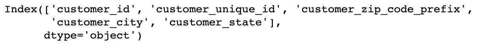

有两列用于标识客户。`customer_id`是为每个订单生成的客户 ID 令牌。如果同一个客户下了多个订单，他就有多个 customer_id 标识符。我们希望在这个分析中使用的是`customer_unique_id`，它对每个购买者都是唯一的，可以用来跟踪他们一段时间内的购买情况。

这是顾客购物的分布情况。

```
cust.groupby('customer_unique_id').size().value_counts()
```

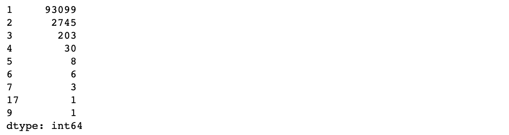

大多数顾客只进行了一次购买。

```
orders = pd.merge(orders,cust[['customer_id','customer_unique_id']],on='customer_id')
orders.columns
```

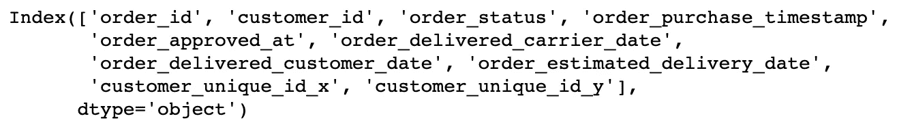

在`items`数据集中，订单中的每一项都有单独的一行。`price`栏指的是累计订单购买量，而不是单项价格。因为我只需要订单价格，所以我会保留每个订单的第一个项目。

```
print(items.columns)
```

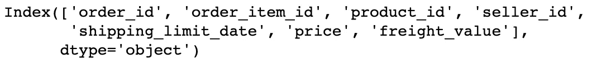

```
items.drop_duplicates('order_id',keep='first',inplace=True)
```

接下来，我将把订单与商品连接起来，以附加价格信息。

```
transaction_data = pd.merge(orders,items,'inner','order_id')
transaction_data = transaction_data[['customer_unique_id','order_purchase_timestamp','price']]## convert timestamp to date; only need the day
transaction_data['date'] = pd.to_datetime(transaction_data['order_purchase_timestamp']).dt.date
transaction_data = transaction_data.drop('order_purchase_timestamp',axis=1)
transaction_data.head()
```

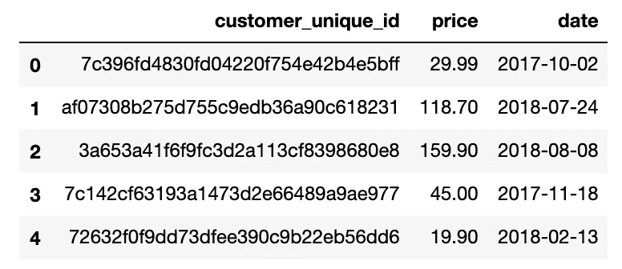

现在我有了交易数据，我想用我在引言中提到的 RFM 变量将它转换成数据帧。生存期包具有将事务数据转换为 RFM 数据帧的功能。

```
summary = summary_data_from_transaction_data(transaction_data,'customer_unique_id','date',monetary_value_col='price',)
summary.describe()
```

# 了解 RFM 数据框架

```
summary.head()
```

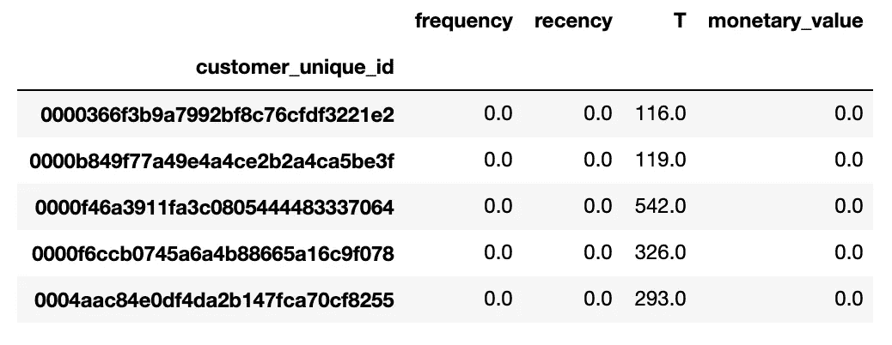

summary 函数将客户交易转换为汇总表。许多客户的频率、新近度和货币= 0，如客户`0000366f3b9a7992bf8c76cfdf3221e2`。这是因为 Lifetimes 只考虑重复购买的顾客。

使用天数作为时间段(也可以定义为周或月)，生命周期模型的变量定义如下:

*   `frequency`:客户重复购买的天数
*   `T`:客户年龄天数
*   `recency`:客户最近一次购买时的年龄(天数)
*   `monetary_value`:客户购买的平均值，不包括第一次购买

`frequency`不包括客户的第一次购买，因为那是客户出生的那一天。之后，你可以开始质疑那个客户是否还活着。

```
summary[summary['frequency']>0].head()
```

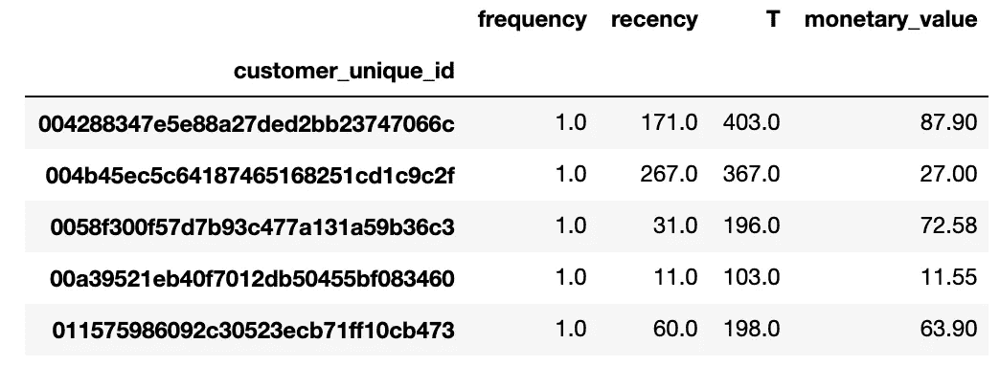

```
transaction_data[transaction_data['customer_unique_id']=='004288347e5e88a27ded2bb23747066c']
```

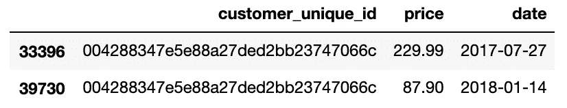

请注意客户`004288347e5e88a27ded2bb23747066c`如何使用 Olist 进行了两次购买，但是根据频率和货币值的定义，他的`frequency`是 1 而`monetary_value`是 87.90 美元。

# 可视化 RFM 数据框架

我们将使用贝塔几何/NBD (BG/NBD)模型来分析客户流失。BG/NBD 模型是对帕累托/NBD 模型的改编。两个模型都描述了顾客流动不明显的企业中的重复购买模式；然而，BG/NBD 在计算上更加可行。

BG/NBD 模型的假设:

*   客户关系有两个阶段:“存活”一段时间，然后“死亡”
*   在活动期间，客户进行的交易数量遵循交易速率为λ的泊松分布
*   λ的不均匀性遵循伽马分布
*   在任何交易之后，客户以概率 p 死亡；客户在多次交易后死亡的概率服从几何分布
*   p 服从贝塔分布
*   λ和 p 因客户而异

有关 BG/NBD 模型的更多信息，请查看彼得·法德尔的这篇[论文](http://brucehardie.com/papers/bgnbd_2004-04-20.pdf)和卡姆·戴维森-皮隆的这篇[帖子](https://medium.com/data-shopify/how-shopify-merchants-can-measure-retention-c12284bfed6f)。

```
bgf = BetaGeoFitter(penalizer_coef=0.0)
bgf.fit(summary['frequency'], summary['recency'], summary['T']);
```

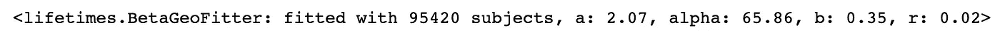

```
plot_frequency_recency_matrix(bgf);
```

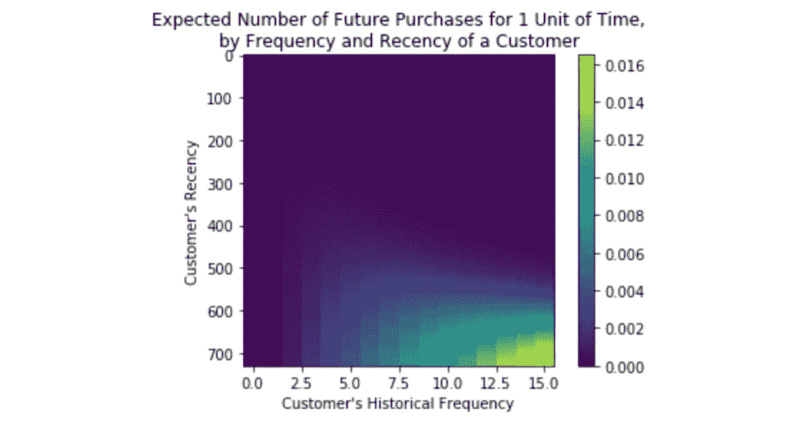

```
plot_probability_alive_matrix(bgf);
```

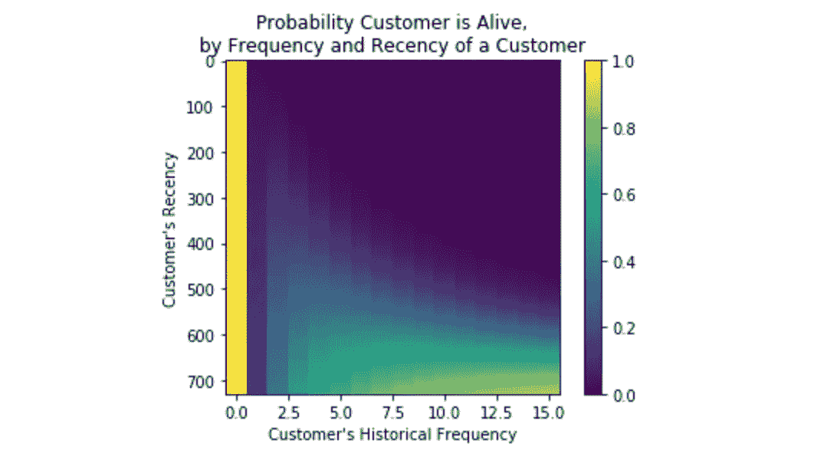

# 训练模型并评估模型性能

接下来，我们要评估该模型，看看它在未来的表现如何。我会将数据分为训练(校准)期和维持(观察)期，训练 BG/NBD 模型，并使用 Peter Fader 在本次演讲[(@ 26:10)中概述的四幅图来评估性能。这些地块是:](https://www.youtube.com/watch?v=guj2gVEEx4s)

**1)校准周期直方图**:模型是否符合训练数据？

**2)累计成交图**:模型对累计销售额的预测效果好吗？

**3)增量交易图**:模型是否捕捉到了交易的整体趋势？

**4)条件期望图**:模型能否根据训练数据预测客户的购买数量？

## 1)校准周期直方图

```
plot_period_transactions(bgf).set_yscale('log');
```

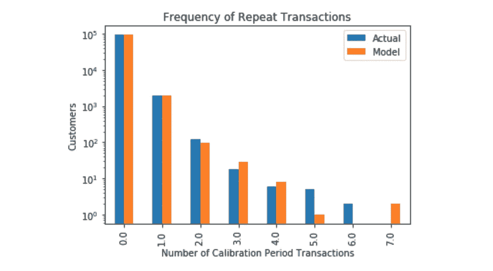

该模型相当好地代表了直到四次重复交易的真实数据。很少有顾客购买更多的东西。

## 2)累积交易图

```
summary_cal_holdout = calibration_and_holdout_data(transaction_data, 'customer_unique_id', 'date',calibration_period_end='2017-09-03', observation_period_end='2018-09-03' )
```

我们可以通过绘制两者来评估数据集的工作方式。

```
bgf.fit(summary_cal_holdout['frequency_cal'], summary_cal_holdout['recency_cal'], summary_cal_holdout['T_cal'])plot_cumulative_transactions(bgf, transaction_data, 'date', 'customer_unique_id', 730, 365);
```

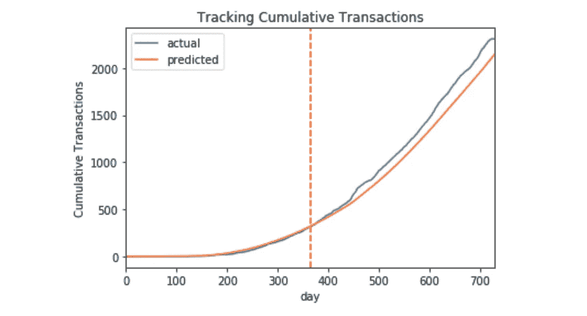

红线代表左侧校准周期和右侧维持周期之间的边界。如你所见，BG/NBD 模型在预测累积交易方面做得非常出色。

## 3)增量交易图

```
plot_incremental_transactions(bgf, transaction_data, 'date', 'customer_unique_id', 730, 365);
```

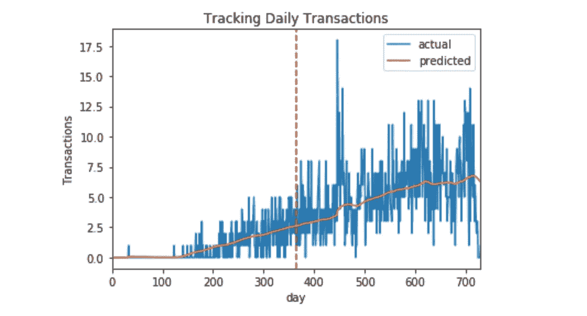

该图表明，该模型在捕捉数据的总体趋势方面做得不错。

## 4)条件期望图

```
plot_calibration_purchases_vs_holdout_purchases(bgf, summary_cal_holdout);
```

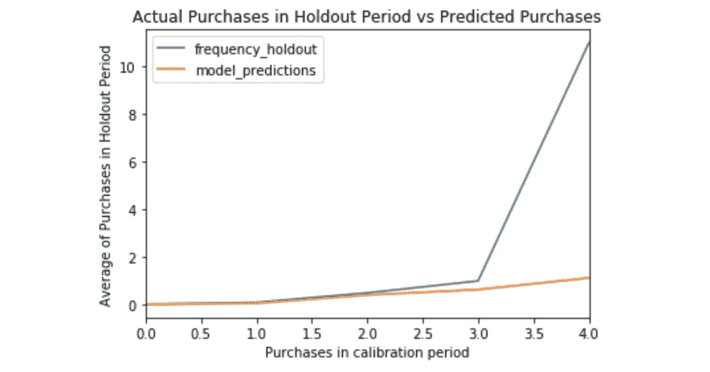

该模型在三个校准周期内性能良好，但由于数据的分布，与维持数据存在偏差。

```
cust.groupby('customer_unique_id').size().value_counts()
```

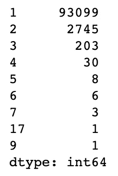

只有不到 1%的顾客进行了四次或更多的购买，所以 BG/NBD 模型没有太多的数据来了解那些进行了多次重复交易的顾客。

实际上，如果我要继续对客户流失建模，我会考虑收集更多的数据。但是出于学习的目的，预测客户流失仍然是一个很好的练习。

# 客户流失风险建模

BG/NBD 模型假设只有在重复购买后才会发生死亡，因为顾客在购买过程中离开，而第一次购买被保留下来以表示顾客的出生。

正因为如此，只有一笔交易的客户，会有 100%的概率是活着的，这是值得怀疑的。考虑到这一限制，我们将只预测至少进行过一次重复交易的客户的流失风险。

```
df = summary[summary['frequency']>0]
df['prob_alive'] = bgf.conditional_probability_alive(df['frequency'],df['recency'],df['T'])
sns.distplot(df['prob_alive']);
```

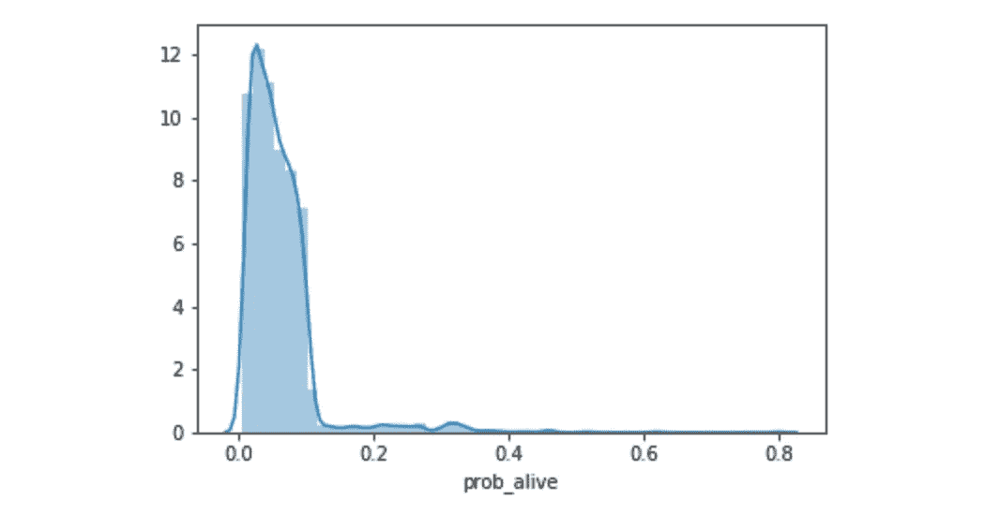

从这里，我们可以根据客户“活着”的概率来可视化他们。利用领域知识，我们也许能够为可能已经流失的客户设定一个阈值，并且还能识别出处于流失风险中但尚未消失的客户。

接下来，我想为客户流失设定一个决策阈值。这是一个注入个人专业知识或与领域专家交流的机会。假设我与销售和营销经理交谈，我们同意考虑一位客户，感谢他阅读！如果你想跟着代码走，这里有[*GitHub repo*](https://github.com/collindching/Olist-Customer-Churn)*。随时欢迎反馈和问题。下面评论！*

```
df['churn'] = ['churned' if p < .1 else 'not churned' for p in df['prob_alive']]
sns.countplot(df['churn']);
```

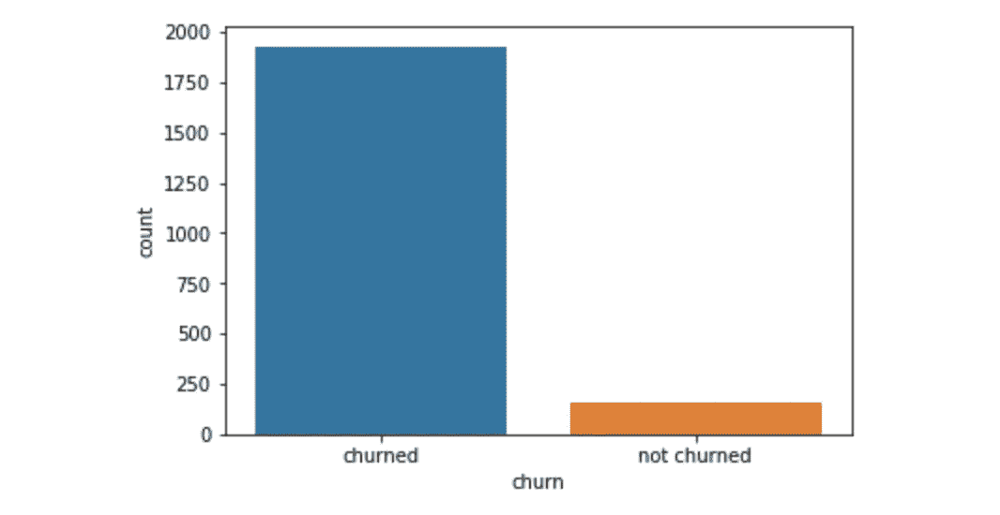

A little over 92% of customers have churned, meaning that there’s a lot of opportunity for improvement regarding retention.

We can assume that the customers who have churned are already lost. But what is interesting in a business setting is the customers who are at high risk for churn, but haven’t churned yet. Later on, it might still be a good idea to apply different treatments to the churned group.

If I can identify them, maybe I can encourage the marketing team to target them with promotions.

```
sns.distplot(df[df['churn']=='not churned']['prob_alive']).set_title('Probability alive, not churned');
```

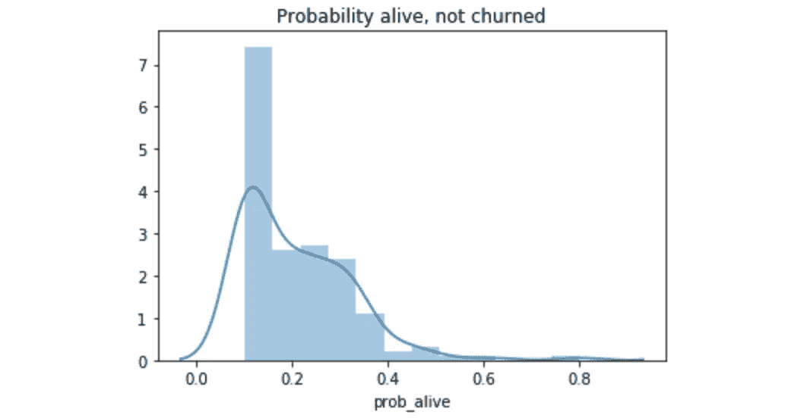

It seems reasonable to bucket customers with 80% or more churn risk to be considered high risk for churn.

```
df['churn'][(df['prob_alive']>=.1) & (df['prob_alive']<.2)] = "high risk"
df['churn'].value_counts()
```

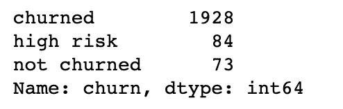

Now that I have these churn groupings, I can move forward and apply special treatments to these groups. Ideally there would be more data and a bigger population of high-risk customers.

# Conclusion

We’ve modeled churn risk in a non-contractual setting, and now have three customer segments — not churned, high risk, and churned. This could feed into a dashboard to give stakeholders a glimpse of “at-risk” customers. It also provides three different groups that we can run specific actions. Some ideas:

1) Reach out to churned customers to figure out why they left.

2) Send different types of targeted emails and special offers to the high risk group. If the sample size of high risk customers is large enough, you could split off a few small treatment groups and compare how their retention and CLV change with different promotional or customer relationship strategies.

3) Determine the the highest value customers in the non-churn group, and serve them additional benefits to ensure that they remain loyal customers.

*Thanks for reading! If you want to follow along with the code, here’s the* [*GitHub repo*](https://github.com/collindching/Olist-Customer-Churn)*. Always open to feedback and questions. Comment below!*