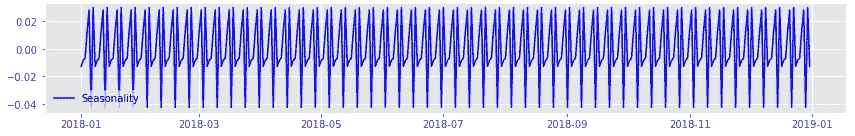
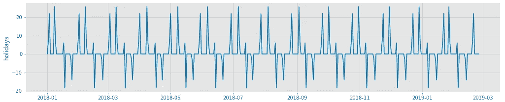
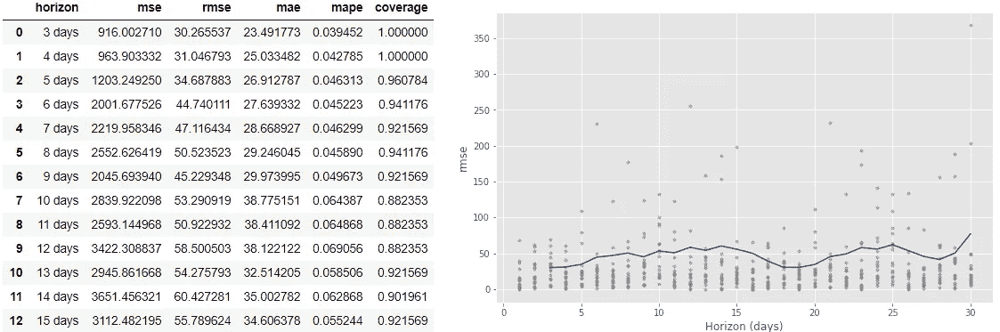
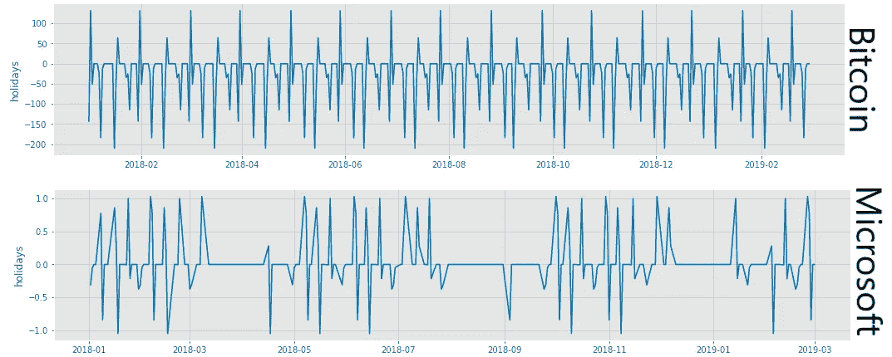
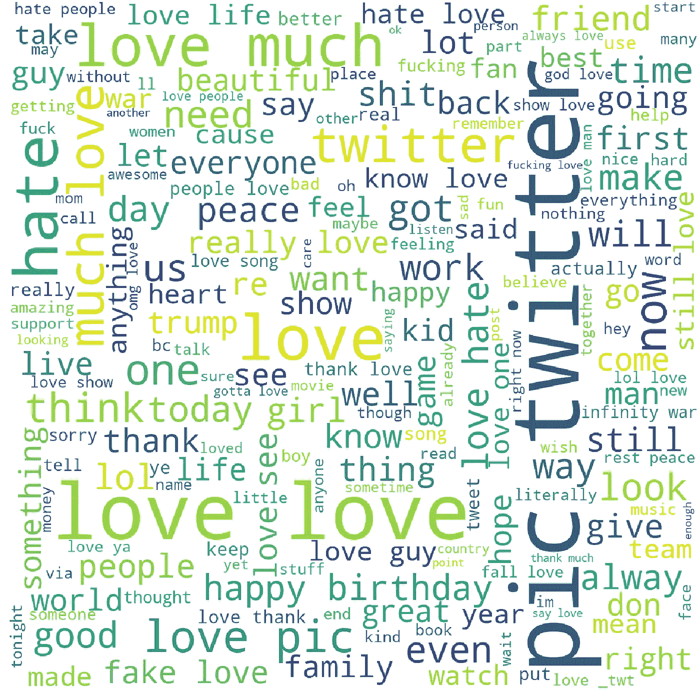
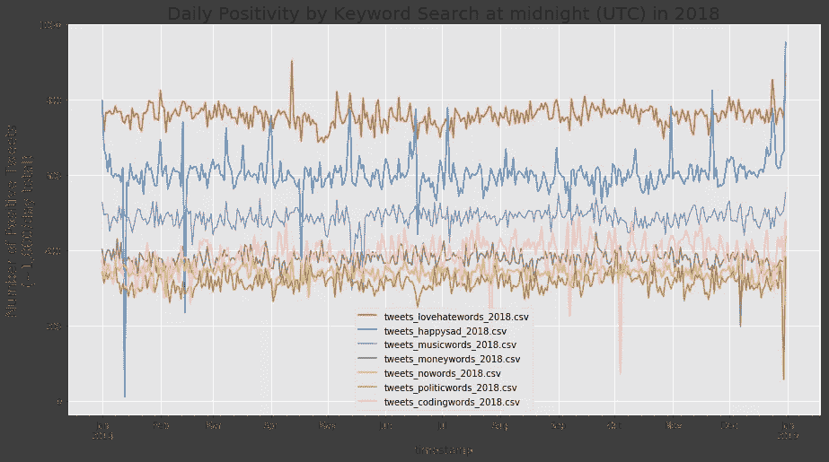
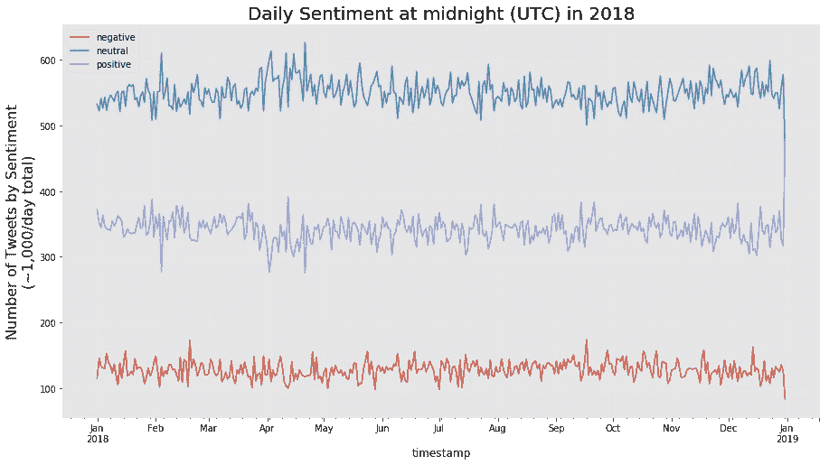
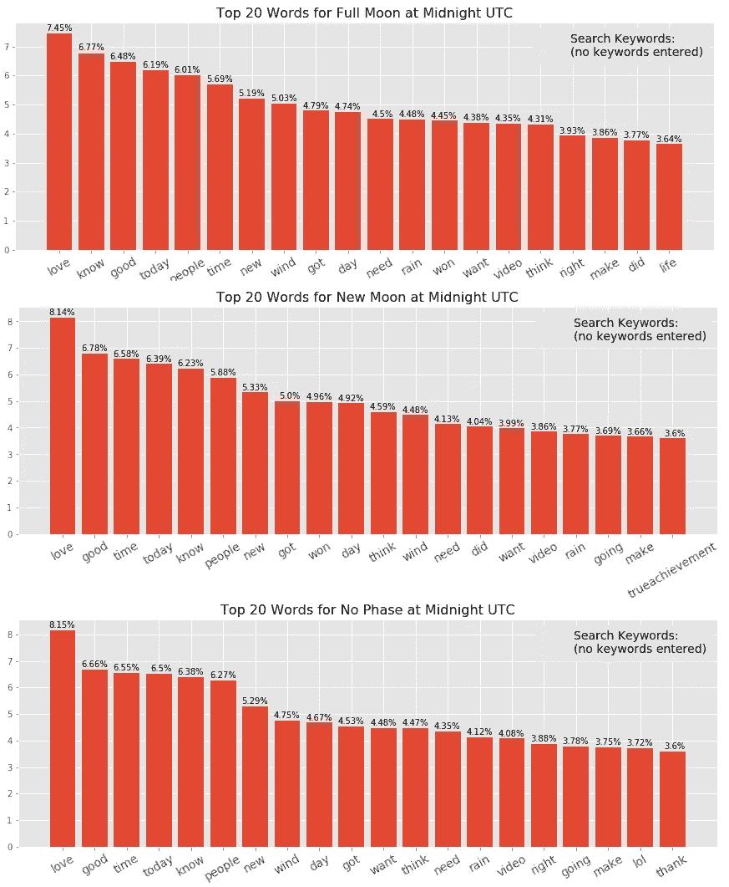
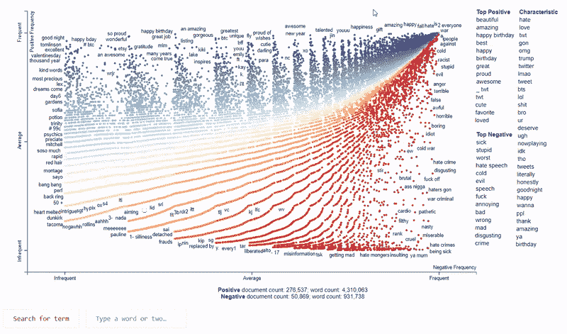

# 使用脸书预言家为推特和金融市场中的月亮周期建模

> 原文：<https://towardsdatascience.com/modeling-lunar-cycles-in-tweets-and-financial-markets-using-facebook-prophet-d6ec0e9e20f?source=collection_archive---------26----------------------->

我最近读了一篇文章，认为满月时犯罪率会上升。出于对这种效应的好奇，我做了一点研究，似乎月亮周期是否影响人类行为的问题已经在学术界激烈争论了几十年(见[塔库尔和夏尔马，1984](https://www.ncbi.nlm.nih.gov/pmc/articles/PMC1444800/) 和[罗顿和凯利，1985](https://www.researchgate.net/publication/19277222_Much_Ado_About_the_Full_Moon_A_Meta-Analysis_of_Lunar-Lunacy_Research) 反对观点的例子；这场争论的双方都有很多学者)。不满意，我决定通过检查一年的推文和财务数据来进行调查。

# 概观

这个项目的完整 Python 代码可以在这个 [GitHub 库](https://github.com/magnawhale/capstone_project)中找到。如果你想玩玩我的发现，我还做了一个[交互式仪表盘](https://human-lunar-cycles.herokuapp.com/)。

为了这个项目，我使用各种关键词搜索短语在 2018 年的每一天收集了大约 1000 条推文。这一过程产生了每个搜索短语超过 365，000 条推文的数据集。然后，对产生的数据集进行情绪处理，并按日期汇总，以检查情绪随时间的趋势。此外，2018 年各种股票、货币和市场指数的每日金融数据都是从互联网上收集的。

然后，Twitter 和金融数据都使用脸书预言家进行建模，以确定与月亮可见阶段相关的任何季节性的程度(或缺失)。事实证明，月亮周期和人类行为之间确实存在关联，尽管影响的大小并不明显。

# 获取数据并探索它

当使用 [twitterscraper](https://github.com/taspinar/twitterscraper) 库时，抓取 Tweets 是一个相当简单的过程(警告，这可能需要几个小时才能完全执行):

```
**import** pandas **as** pd **import** json **from** twitterscraper **import** query_tweets
**import** twitterscraper def scrape_tweets(query, year=2018, num_tweets=1000):
    *"""scrapes X Tweets per day for a year.*
 *Scraping works backwards from midnight.*
 *'query' must be a string.*
 *------------------------------------*
 *Generates a JSON file for each day scraped.*
 *"""*
    dates_year = [str(date)[:10] for date in pd.date_range(start=f'1/1/{year}', end=f'12/31/{year}')]
    for i in range(len(dates_year)):
        begin_date = dates_year[i]
        if i == len(dates_year)-1:
            end_date = f'{year+1}-01-01'
        else:
            end_date = dates_year[i+1]
        day = dates_year[i]
        cmd = 'twitterscraper "{}" -l {} -o t{}.json -bd {} -ed {} --lang en'.format(query, num_tweets, day, begin_date, end_date)
        subprocess.run(cmd)
        if (i+1)%5 == 0:
            print(f"finished scraping {i+1} days of {year}")
    print("SCRAPING PROCESS COMPLETE!")
    pass
```

使用 alphavantage.co 的 API 搜集财务数据也相当容易，尽管这些数据需要一些额外的条件使其更有用。

```
**import** requests
**import** matplotlib.pyplot **as** plt
plt.style.use('ggplot')
%matplotlib inlinedef get_financial_data(symbol, stocks_apikey, column="close_24", year=2018, verbose=True):
    *"""Inputs:*
 *symbol         (string) Stock or Currency symbol*
 *stocks_apikey  (string) your API key for* 
 *https://www.alphavantage.co
    column         (string) column of output to use for plotting
    year           (int) the year you wish to examine*
 *=========================================*
 *Returns a DataFrame of daily financial information containing*
 *at least opening, closing, high, and low values.*
 *"""*
    valid_types = ['stock','index','currency','cryptocurrency']
    credentials = {'function':'TIME_SERIES_DAILY',
                       'symbol':symbol,
                       'outputsize':'full',
                       'apikey':stocks_apikey}
    r = requests.get('https://www.alphavantage.co/query', params=credentials)
    df = pd.DataFrame(r.json()["Time Series (Daily)"])
    df = df.T.reset_index()
    df.columns = ['date','open','high','low','close','volume']
    df.date = pd.to_datetime(df.date)
    df[['open','high','low','close','volume']] = df[['open',
            'high','low','close','volume']].astype(float) *# create a new column to account for after-hours trading*
    *# uses the next day's open value as the prior day's close value*
    cl24 = [df.loc[0].close]
    for val in df.open.values:
        cl24.append(val)
    cl24 = pd.DataFrame(cl24[:-1], columns=['close_24'])
    df = df.join(cl24)
   *# now account for after-hours trading exceeding high/low values*
    df['high_24'] = df[['high', 'close_24']].values.max(1)
    df['low_24'] = df[['low', 'close_24']].values.min(1)
    df['range'] = df['high'] - df['low']
    df['range_24'] = df['high_24'] - df['low_24']
    df['change_24'] = df['close_24'] - df['open']
    df.set_index('date', inplace=True)
    year_df = df[f'{year}':f'{year}']    *# getting 1 year's data* *# plotting the results* plt.figure(figsize=(15,5))
    plt.plot(df[column], label=column)
    plt.title(f"{symbol} Daily Performance for {year}", fontsize=16)
    plt.ylabel("Price (in USD)", fontsize=14)
    plt.legend(loc='best', borderpad=1, fontsize=14);
    return df
```

有了数据集，下一步是确定我们收集的所有推文的总体情绪。为此， [TextBlob](https://textblob.readthedocs.io/en/dev/) 库非常有用。TextBlob 可以快速解析文本以确定文本本质上通常是正面的还是负面的。我选择扩展“中性”极性值，以包含从-0.1 到 0.1 的所有极性分数，从而消除+/-类别中的一些噪声。

```
**from** **textblob** **import** **TextBlob**def get_tweet_sentiment(tweet): 
    analysis = TextBlob(tweet)
    polarity = analysis.sentiment.polarity
    subjectivity = analysis.sentiment.subjectivity
    if analysis.sentiment.polarity > 0.1: 
        sentiment = 'positive'
    elif analysis.sentiment.polarity < -0.1: 
        sentiment = 'negative'
    else: 
        sentiment = 'neutral'
    return sentiment, polarity, subjectivity
```

在所有这些处理之后，我最终可以使用 statmodels 的`[seasonal_decompose](https://www.statsmodels.org/stable/generated/statsmodels.tsa.seasonal.seasonal_decompose.html)`方法来确定收集到的 Twitter 数据中是否存在任何季节性。你瞧，事实证明 ***是***7.4 和 29.5 天的季节性，这与月亮周期完全吻合。



Seasonal Decomposition of scraped tweets

# 和脸书先知一起做模特

[脸书预言家](https://facebook.github.io/prophet/)，虽然很新，却是一个非常强大的适应性建模工具。幸运的是，`Prophet()`包含一个名为`holidays=`的参数，它允许用户输入一个格式正确的数据帧，FBProphet 会特别注意这个数据帧。其中，该功能模拟了`holidays`对所研究的时间序列的季节性影响。在下图中，满月发生在 1 月 2-3 日，2 月 1 日，3 月 1-2 日，等等。

```
**# `phases` was a pre-generated DataFrame of lunar phase dates****from** fbprophet **import** Prophet
**from** fbprophet.plot **import** plot_plotly, plot_cross_validation_metric
**from** fbprophet.diagnostics **import** cross_validation, performance_metrics*#to maintain pd.plotting functionality* pd.plotting.register_matplotlib_converters()def tweet_fbprophet(filename=''):
    tweets_df = pd.read_csv(filename)
    tweets_df.timestamp = pd.to_datetime(tw_df.timestamp, format='%Y%m%d')
    grouped = pd.DataFrame(tweets_df.groupby(['timestamp', 'sentiment'])['tally'].sum()).reset_index()

    *#prepare grouped sentiment data for FBProphet processing*
    *#here, positive sentiment only*
    grp_pos = grouped[grouped.sentiment == 'positive'].drop('sentiment', axis=1).reset_index(drop=True)
    grp_pos.columns = ['ds','y']

    m = Prophet(holidays=phases)
    m.fit(grp_pos)
    future = m.make_future_dataframe(periods=60, freq='D')
    forecast = m.predict(future)
    forecast[(forecast['fullmoon'] + forecast['lastquarter'] + 
             forecast['newmoon'] + forecast['firstquarter']).abs() > 
             0][['ds', 'fullmoon', 'lastquarter', 'newmoon', 'firstquarter']][:10]
    fig1 = m.plot(forecast);
    fig1.set_size_inches(15, 5)
    plt.show();
    fig2 = m.plot_components(forecast)
    fig2.set_size_inches(15, 10)
    plt.show();
    return m
```



Example of seasonality effect of lunar cycles found in tweets using FBProphet

FBProphet 的另一个好处是种类繁多的`performance_metrics`，很容易访问。我选择研究 RMSE(均方根误差),因为它很容易用原始数据集的单位来解释。实际上，在所有情况下，(推特和金融数据)RMSE 平均比月球周期的季节性影响高出 50%。虽然从纯预测的角度来看这并不太好，但需要注意的是，该项目的目标是确定是否存在相关性，而不是创建一个可以准确预测 twitter 情绪或股票价格的模型...这需要太多的额外变量。下面是性能指标的示例表和不同时间跨度的 RMSE 图。



RMSE plot from FBProphet cross-validation method

随着 Twitter 阴历季节性的确立，我对财务数据运行了同样的 FBProphet 程序。该数据还显示了与月亮周期相关的明显的季节性。然而，对于每个金融对象，相关性并不相同。一些股票/货币在满月时上涨，而另一些在满月时下跌。此外，似乎许多月相都有一个初始峰值，然后在第二天出现相应的修正(甚至过度修正)。例如，比较下面为比特币和微软生成的农历季节性图表。



Lunar seasonality comparison of BTC and MSFT (Microsoft does not trade on weekends, hence the gaps)

# 寻找信息的视觉化

最初，我认为生成单词云可能是从我的数据中提取更多信息的一种好方法。毕竟，单词云可以在视觉上提供大量信息，而其他图形则不能(因为它们缺乏单词云的莫邪)。不幸的是，由于我正在处理的语料库的规模(每个关键词搜索大约 5-6，000，000 个单词)，使用极其简单的 [wordcloud](http://amueller.github.io/word_cloud/) 库被证明是不切实际的，因为执行时间延长到 10 多个小时。然而，这是我一次运行这个过程的代码和图表。

```
**from** wordcloud **import** WordCloud
**from** sklearn.feature_extraction.stop_words **import** ENGLISH_STOP_WORDSdf = pd.read_csv('tweets.csv')
df.timestamp = pd.to_datetime(df.timestamp, format='%Y%m%d')  
comment_words = ' '
stopwords = set(ENGLISH_STOP_WORDS)
stopwords.update(['com','ve','ll','just','don','really','00'])*#* ***this for loop took hours to run***
it = 0
for val in df.text: 
    val = str(val)          *# typecaste each val to string* 
    tokens = val.split()    *# split the value* 
    for i in range(len(tokens)): 
        tokens[i] = tokens[i].lower() *# Convert tokens to lowercase*
    for words in tokens: 
        comment_words = comment_words + words + ' '
    it += 1
    if (it)%10 == 0:
        print(f"Completed {i} of {len(df.text)} loops")

*# generate the word cloud*
wordcloud = WordCloud(width = 1200, height = 1200, 
                background_color ='white', 
                stopwords = stopwords, 
                min_font_size = 10).generate(comment_words)*# plot & save the WordCloud image  *                      
plt.figure(figsize = (20, 20), facecolor = None) 
plt.imshow(wordcloud) 
plt.axis("off") 
plt.tight_layout(pad = 0) 
plt.savefig('images/tweets_wordcloud.png')
```



Word cloud for the search “love OR hate OR peace OR war”

通过在一个查询语料库中比较正面/负面/中性，或者将一个语料库与另一个语料库进行比较，可以进行快速和简单的可视化来绘制每个搜索短语的情绪的每日变化。



Unsurprisingly, tweeters had the least positive things to say regarding politics.



Daily sentiment of Tweets with no search phrase given

一个更简单的方法是创建一个单词包，只过滤出现次数最多的第 n 个 T2，然后绘制一个直方图。这种简单的方法，当与日期过滤器结合使用来区分月相日期和非月相日期时，会为每个搜索短语产生一些有趣的结果(见下面的例子)。虽然没有出现什么过分令人担忧的情况，但有趣的是看到词频的顺序是如何根据月相变化的。



Comparison of most common words when no search phrase was entered

最后，也可能是我最喜欢的，是利用[散点图](https://github.com/JasonKessler/scattertext)库来制作一个漂亮的、交互式的、可搜索的 Twitter 数据图表。这个库实际上生成一个 HTML 文件来显示图表，对于像我这样大的语料库，每个 HTML 文件平均 30MB，这导致 web 浏览器的加载时间大约为 5-10 分钟。该库是为中小型数据集设计的，不是我的怪物，但结果仍然值得等待。可视化是交互式的(鼠标悬停在每个数据点上，会出现一个信息提示),并且是可关键字搜索的。最重要的是，选择一个关键字还会在图表下方显示该词的大量分类(肯定/否定)出现，以了解它在每个场景中的常用情况。我可以立即看到，这个图书馆有很大的潜力，有利于学术研究人员，特别是在文学，历史，政治学等领域。这里有一个[精简后的例子](https://nbviewer.jupyter.org/github/magnawhale/capstone_project/blob/master/Scattertext_nowords_example.html)，应该可以快速加载，还有一个下面功能的. gif 文件。



以下是我用于散文本的代码。

```
*!pip install scattertext
!pip install spacy
!python -m spacy download en_core_web_sm* **import** scattertext **as** st
**import** pandas **as** pd
**import** numpy **as** np **import** spacy
**import** en_core_web_smdf = pd.read_csv('tweets.csv')
df.timestamp = pd.to_datetime(df.timestamp, format='%Y%m%d')  
df = df[df['sentiment'].isin(['positive','negative'])]*# Turn DataFrame into a Scattertext Corpus*
nlp = en_core_web_sm.load()
corpus = st.CorpusFromPandas(data_frame=df,
                             category_col='sentiment',
                             text_col='text',
                             nlp=nlp).build()*# Create an HTML page for the interactive visualization*
html = st.produce_scattertext_explorer(corpus,
    category='positive',
    category_name='Positive',
    not_category_name='Negative',
    minimum_term_frequency=25,   *### high values reduce load time*
    minimum_not_category_term_frequency=25,  *### high values reduce load time*
    max_terms=5000,   *### aim for at least 1000 for a pretty graph*
    max_snippets=50,
    show_characteristic=True,
    width_in_pixels=1000)open("tweet_scattertext".html", 'wb').write(html.encode('utf-8'))
```

# 最终想法和建议

基于我的分析，似乎相当清楚的是，事实上人类行为和月相之间存在关联。然而，这必须留给未来的研究人员来确定这种相关性的本质和原因。这种影响相对较小，但仍然存在。就推文中的整体情绪而言，满月和上弦月似乎与积极情绪的增加相关，而新月和上弦月与消极情绪的增加相关。

金融市场也表现出月球季节性，包括股票、市场指数、货币和加密货币。然而，这种相关性并不是全面一致的；一些股票与满月正相关，其他的负相关。此外，大多数股票/货币在月相数据中表现出在一个方向上飙升的强烈趋势，然后在第二天立即在相反方向上修正(或过度修正)。任何试图使用这一信息的人都必须在个案的基础上检查季节性。尽管相关性很小(季节性占价格变化的大约 1%)，我怀疑从事算法交易的新兴实践的投资者将能够从将月球季节性纳入他们的投资算法中获利。