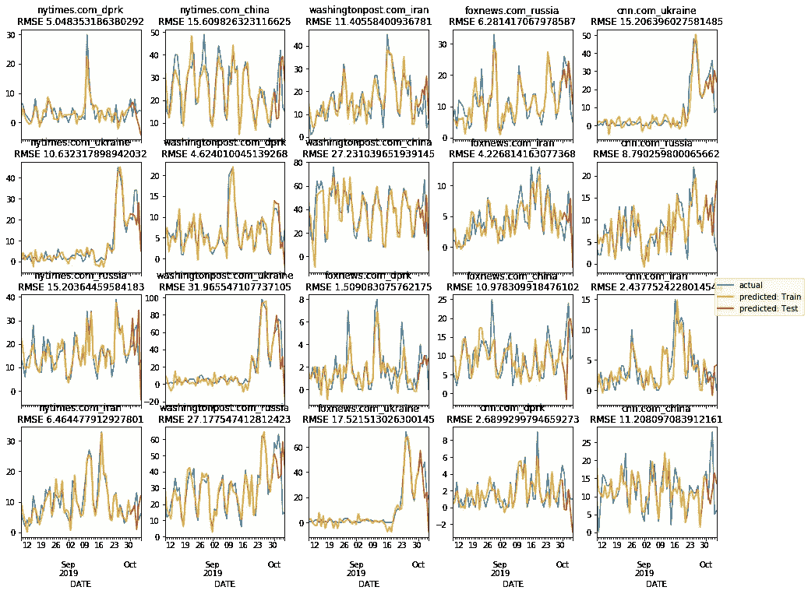
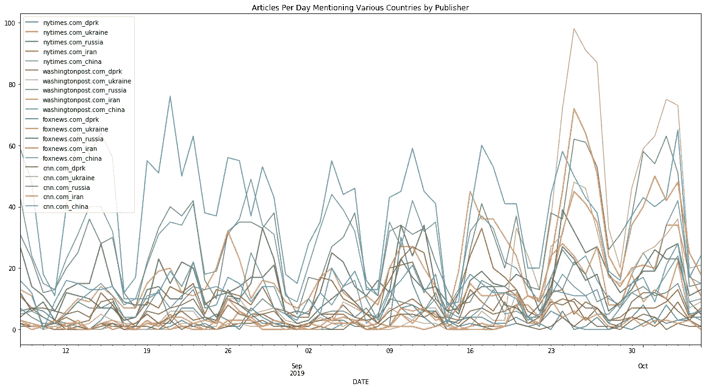
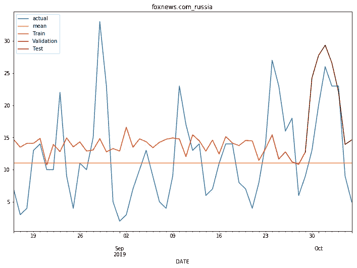
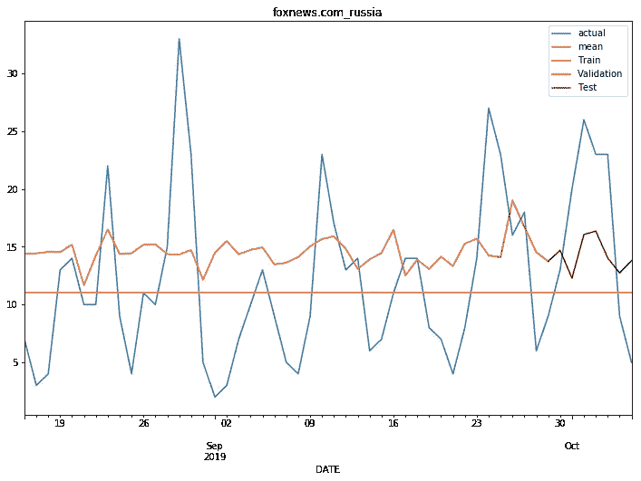
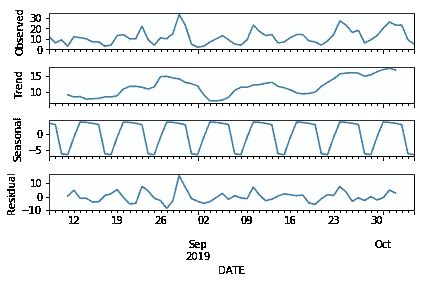
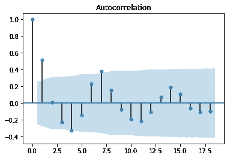
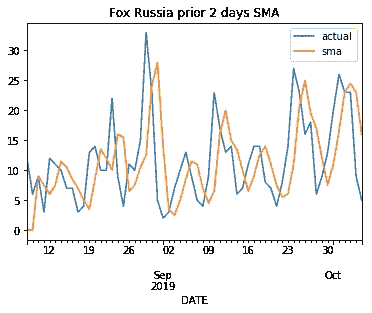
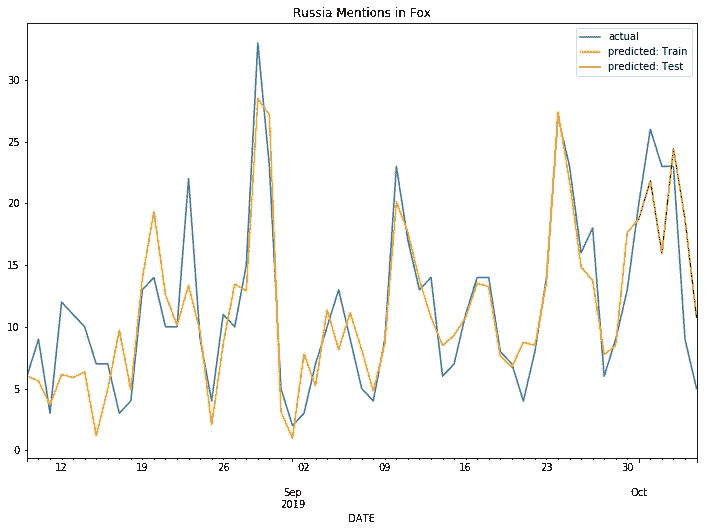

# 用 Python 建模新闻报道。第 2 部分:用有限的数据开始新闻预测

> 原文：<https://towardsdatascience.com/modeling-news-coverage-with-python-part-2-starting-news-forecasting-with-limited-data-5c1092de3ea9?source=collection_archive---------36----------------------->

早些时候[我写了一点](/making-sense-of-the-news-part-1-introduction-f171d1da65a8)关于获取新闻故事开始建模，现在我将玩一玩如何预测覆盖范围和衡量一个模型是否好。

我将使用 fast.ai 的现成神经网络来开始这篇文章，使用一组出版商的一些文章来生成一些出版商日常生产的模型，评估模型的拟合度，然后展示为什么这些模型对于我们正在处理的数据集的限制来说不是那么好(完全任意的限制以使代码易于运行，打乱粒度和添加更长时间的文章将会获得更好的结果)。然后，这将使用自动回归和移动平均，看看对于我们利用的有限数据，它如何优于神经网络，从而生成每个出版物的覆盖趋势，如下所示:



SARIMA models for select publications for select coverage with error on test predictions

我们开始吧！

## 检查我们是否还有数据

上次我们从 GDELT(【https://www.gdeltproject.org】T2)获取了 60 天的新闻报道。我们将开始确保我们仍然有它，如果我们没有，我们将下载它。

现在我们已经确认了我们需要的所有文件，我们可以像以前一样浏览它们，并为《纽约时报》、《华盛顿邮报》、《福克斯新闻频道》和《CNN》提取文章。

运行代码后，我们的 df 中就有了新闻文章。接下来，我们可以细分每个出版商每天在每个目标国家的覆盖范围。

首先，我们将确保该日期是一个好的日期时间，并将我们的索引设置为该日期。

```
df.DATE = df.DATE.apply(lambda x: str(x))
df.DATE = pd.to_datetime(df.DATE)
df.fillna("", inplace=True)
df.set_index("DATE", drop=True, inplace=True)
```

接下来，我们将对 df 进行一次性编码，以确定该文章是否被出版商和日期标记为与我们的某个国家或集团相关。

```
df["dprk"] = df["LOCATIONS"].apply(lambda x: x.find("North Korea") > -1)
df["ukraine"] = df["LOCATIONS"].apply(lambda x: x.find("Ukraine") > -1)
df["russia"] = df["LOCATIONS"].apply(lambda x: x.find("Russia") > -1)
df["iran"] = df["LOCATIONS"].apply(lambda x: x.find("Iran") > -1)
df["china"] = df["LOCATIONS"].apply(lambda x: x.find("China") > -1)loc_df = df.groupby(["SOURCES", "DATE"])[["dprk", "ukraine", "russia", "iran", "china"]].sum()
```

所以现在我们可以创建一个大的 df，我们称之为*时间序列*来保存每个出版商和国家的日期值，其中的列都有这样的标签。

```
time_series = pd.DataFrame()
for publisher in mySources:
  time_series = pd.concat([time_series, loc_df.ix[publisher].add_prefix(“{}_”.format(publisher))], axis=1)time_series.plot(figsize=(20,10))
```



很好，所以你现在应该有类似的东西，我们可以看到数据有每周的季节性。此外，乌克兰的东西大约在 9 月 23 日起飞。

因此，让我们通过神经网络运行这些时间序列，看看它会得出什么结果！

## 使用 Fast.ai 中的表格模型

所以现在我们将使用 fastai 的表格模型([https://docs.fast.ai/tabular.html](https://docs.fast.ai/tabular.html))。我使用表格模型是因为它快速而简单，即使时间序列太短，不能期望一个很好的结果，我也不打算摆弄得到好的结果，但它能表达重点。

注意到季节性，我们希望模型查看最近几天的数据。由于是每周一次的季节性数据，我们可以只给出最近 7 天的数据，希望这能帮助它发现数据中有季节性成分。此外，我们可以给出文章是在一周的哪一天发表的，这可能会有所帮助。例如，对于第 X 天朝鲜的福克斯新闻频道，我们需要第 X-1 天、第 X-2 天的所有发布数据，依此类推。所以我们可以创建一个函数来完成这个任务。

然后，我们可以创建一种方法，让我们从我们的*时间序列*数据帧中选取一个序列，并训练一个神经网络来尝试对其建模。

为了演示的目的，我们可以选择一个时间序列，看看它生成的模型是什么样的。我们将以相当大的学习速度快速浏览一遍，看看它是什么样子。如果你不熟悉 fastai，去参加这个课程吧。否则，你基本上是想看看你用 fit_one_cycle 数打高尔夫能打多好，虽然这只是一个任意的例子。

```
learn = genNN(time_series, “foxnews.com_russia”)
learn.fit_one_cycle(1, 3e-02)
```

因此，为了可视化结果，我们需要从我们的学习者那里提取预测，并根据实际结果绘制图表。我们可以对训练集、验证集和测试集进行不同的着色，以了解模型不同部分的表现。



那么我们的模式是好是坏呢？10 月份的准确性可能是侥幸。如果你注意到了，我们还提取了训练集的平均值，这样我们就可以比较到目前为止我们是否比机会做得更好。我们将使用均方根误差来评估模型的表现。

```
>>> RMSE training  using mean: 7.255011530500299
>>> RMSE training using model: 7.2815201128101155
>>> RMSE testing using mean: 8.930425521776664
>>> RMSE testing using model: 6.544865479426577
```

所以这个模型实际上并不太糟糕。它在预测训练集将会发生什么方面做得非常糟糕，但它以某种方式计算出了 10 月初的报告高峰。(不知道为什么)。但是让我们重新运行模型生成，看看它是否会再次发生。我们应该得到不同的结果，因为模型开始时一切都是随机的，而我们只是遵循梯度。

```
learn = genNN(time_series, “foxnews.com_russia”)
learn.fit_one_cycle(1, 3e-02)
```

并重新运行代码以显示图形结果:



重新运行评估，我得到的结果是，通过取训练集的平均值，它的表现比之前的稍差。

```
>>> RMSE training  using mean: 7.255011530500299
>>> RMSE training using model: 7.314209362904273
>>> RMSE testing using mean: 8.930425521776664
>>> RMSE testing using model: 7.068090866517802
```

我们可以改变学习率，让它变得更好，

```
learn = genNN(time_series, "foxnews.com_russia")
learn.fit_one_cycle(1, 2e-02)
learn.fit_one_cycle(5, max_lr =3e-04)
...
>>> RMSE training  using mean: 7.255011530500299
>>> RMSE training using model: 9.782066217485792
>>> RMSE testing using mean: 8.930425521776664
>>> RMSE testing using model: 5.876779847258329
```

但总的来说，这并不是一个好的模型。但话说回来，这不应该是因为它只使用了几个出版商和几个普通国家的 60 天数据。

那很有趣。我们训练了一个神经网络，但它不是很聪明；尽管我们每天都给它喂食，但它似乎并不知道每周的季节性。让我们继续，如果我们使用更传统的模型来研究移动平均线的自回归，会发生什么。(我想我们应该从这里开始)。

## 季节性、自回归和移动平均线

用 python 分解时间序列非常容易。假设您仍然加载了*时间序列*数据框架，我们可以使用 stats models(【https://www.statsmodels.org/stable/index.html】)将每一列分解为其观察成分、趋势成分、季节成分和剩余成分，并绘制它们。

```
import statsmodels.api as sm
res = sm.tsa.seasonal_decompose(time_series["foxnews.com_russia"])
res.plot()
```



Foxnews Coverage including Russia Decomposed

它腐烂了！

我们还可以查看自相关，或者值与先前值的相关程度。

```
from statsmodels.graphics.tsaplots import plot_acf
plot_acf(time_series["foxnews.com_russia"])
```



我们可以看到季节性因素和趋势。

我们可以看看移动平均线。我们将取前两天的两天简单平均值。

```
f_ru = time_series[["foxnews.com_russia"]].copy()
f_ru.columns = ["actual"]
f_ru["sma"] = 0for i in range(0,len(f_ru)-2):
  f_ru.iloc[i+2,1] = np.round(((f_ru.iloc[i,0]+
  f_ru.iloc[i+1,0])/2),1)f_ru.plot(title="Fox Russia prior 2 days SMA")
```



我们可以检查一下 RSME

```
f_ru = f_ru[2:]
print("RMSE testing using SMA2: {}".format(sqrt(mean_squared_error(f_ru.actual, f_ru.sma))))>>> RMSE testing using SMA2: 7.666822836990112
```

所以我们有一个比上面的稍微差一点的 RSME，但是要少得多(除了我忘记了我必须使用它。复制()让熊猫不抱怨)。不算太寒酸，但其实比只取中庸还不如。大概吧。与这次相反，我实际上没有检查整个持续时间。因此，让我们使用 Python Statstools SARIMA 包来集成季节性、自回归和移动平均。

所以我们要关注一下这个的参数。基本上，我们将需要自回归移动平均组件和时间序列组件作为模型的订单和季节性订单。我们将假设它也是每周一次的季节性，这通常是正确的。

所以现在开始。首先，我们声明并拟合一个模型。

```
from statsmodels.tsa.statespace.sarimax import SARIMAX
issue = “foxnews.com_russia”
train_l = 55s_model = SARIMAX(endog = time_series[[issue]][:train_l][1:], 
 exog = time_series[[x for x in time_series.columns if x != issue]][:train_l].shift().add_suffix(“_l1”)[1:], order=(2,0,1), seasonal_order=(1,0,1,7)).fit()
```

现在我们想去得到我们的预测。我们可以使用以前计数的真实值，因为我们在现实世界中会有这些值，除非我们预测得非常远(但我们之前没有这样做)。

```
f_ru = time_series[[issue]].copy()[1:]
f_ru.columns = ["actual"]f_ru["predicted"] = s_model.predict(end=datetime.datetime(2019, 10, 6), endog = time_series[[issue]][-5:],exog = time_series[[x for x in time_series.columns if x != issue]].shift()[-5:], dynamic= False)#plotting
ax = f_ru["actual"].plot(title="Russia Mentions in Fox", figsize=(12,8))
f_ru["predicted"][:-5].plot(color="orangered")
f_ru["predicted"][-6:].plot(color="red")
```



所以我们有了一个看起来相当不错的 SARIMA 模型！RMSEs 怎么样了？

```
testing = f_ru[:-5].copy()
print("RMSE training using model: {}".format(sqrt(mean_squared_error(testing.actual, testing.predicted))))testing = f_ru[-5:].copy()
print("RMSE testing using model: {}".format(sqrt(mean_squared_error(testing.actual, testing.predicted))))>>> RMSE training using model: 3.098788909893913
>>> RMSE testing using model: 6.281417067978587
```

所以这里的 SARIMAX 比上面的神经网络做得更好。如果我们愿意的话，我们可以在一个循环中为我们正在寻找的所有组合重新运行代码(并且您可以添加您喜欢的发布者和主题的任何组合)。只是提醒一下，代码会发出很多警告。


It doesn’t do too well on the Ukraine forecasting but that should be expected because it didn’t fit the previous trends

尝试调整模型的参数，并围绕出版物和报道主题进行更改。或者更好的是，回去下载更长时间的文章，看看更多的数据如何改善训练和测试。

## 继续前进

在[第一部分:介绍](/making-sense-of-the-news-part-1-introduction-f171d1da65a8)和这之间，你应该对我们能理解多少报纸之间的相互作用有一个很好的想法。通过对一段时间内的新闻报道进行建模，我们可以评估一个模型是否比其他模型更好地包含了影响新闻报道的因素。

这有什么关系？嗯，当人们跑来跑去说新闻在做这个或那个的时候，如果我们没有模型来评估他们的说法，真的很难分辨谁说的是真话还是假话。但是在仅仅几分钟内(希望如此),我们就能够获取数据，运行计算模型，并根据媒体报道预测未来的报道。所有这些都与关于议程设置的政治学/传播学/新闻学研究有关(例如:https://www . tandfonline . com/doi/full/10.1080/15205436.2014 . 964871)，但实际上预测新闻报道并不像我想象的那样广泛，我不确定这是为什么。

现在，这里无疑有很多数学问题，我把这些留给读者自己去解决(或者写下他们的结果:)数据也有问题；我们使用了 100，000 个可用新闻来源中的 4 个，从主题、地点和人物的可能组合的非常大的域中选择了 5 个地点，以及一年中只有 60 天的报道。我们也观察了这里的许多参数；最终，你不希望只关注一个主题，而是不断地监控所有的主题。然而，希望这足够简单，任何人都可以拿起它，搞乱他们感兴趣的任何东西。

我不完全确定我将在第 3 部分中涵盖什么。在谷歌搜索或各种 Twitter 数据的操作化问题上，可能包括公众利益的措施可能会很有趣，尽管一篇博客帖子的困难部分是确保数据易于访问。也可能做更长期的趋势。我刚刚开始写这些来拖延期中考试的学习，所以还没有想好。