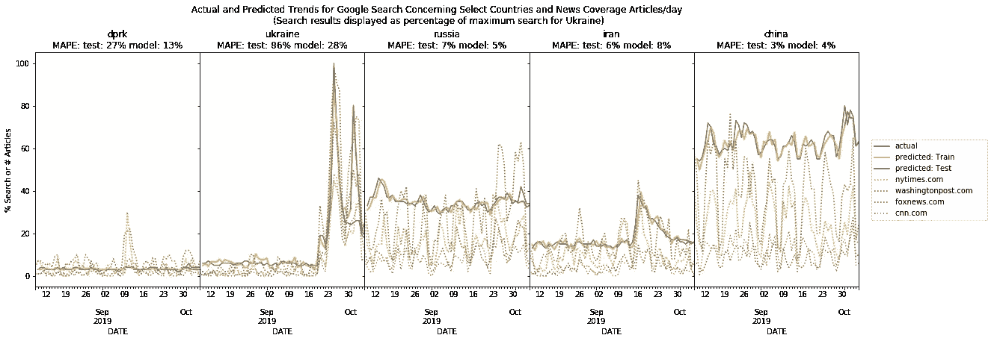
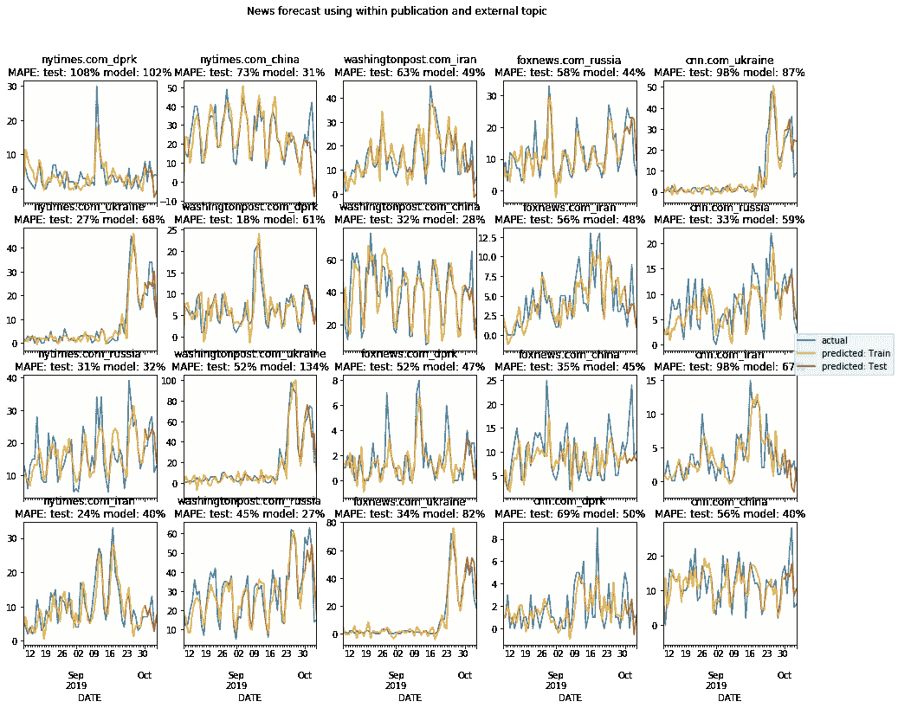
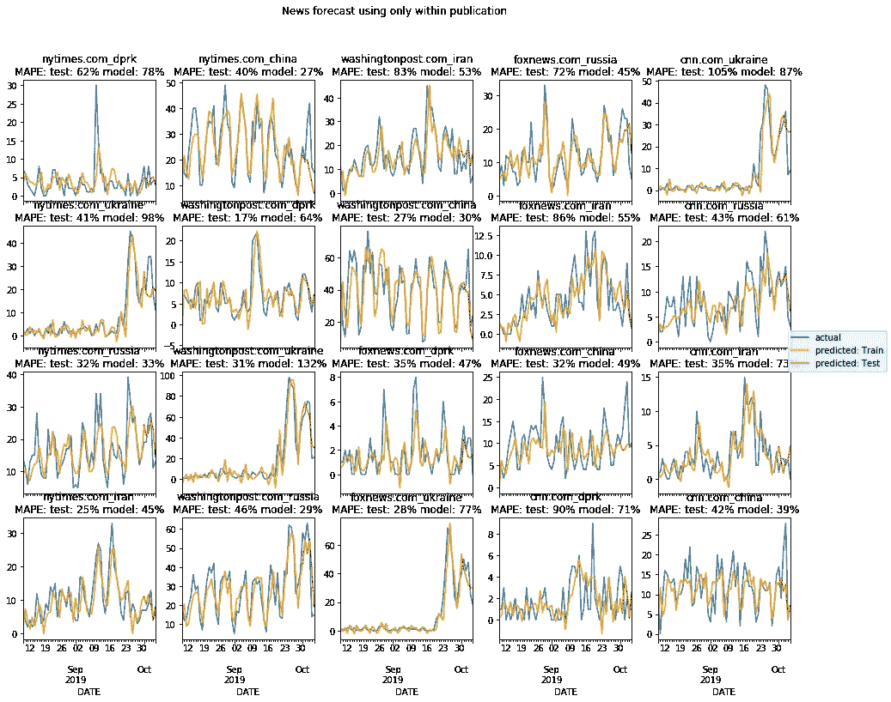
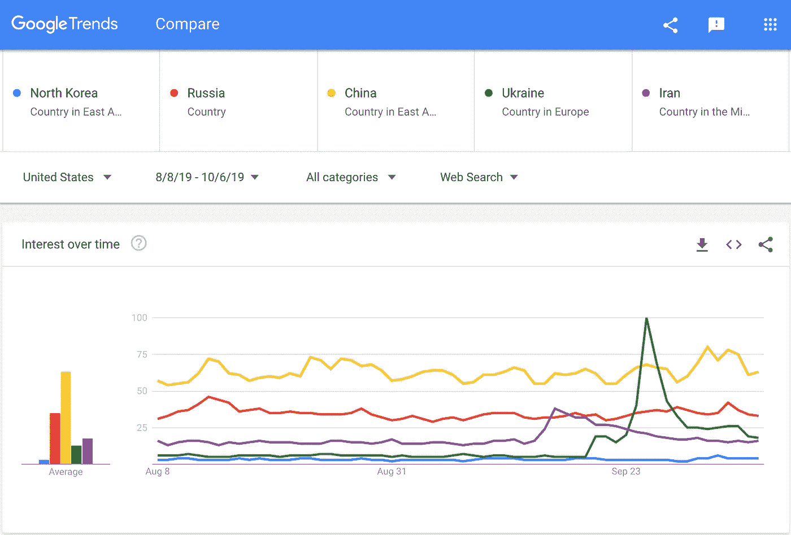
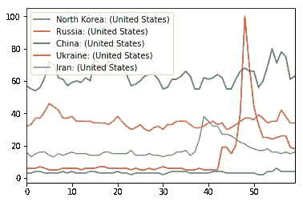
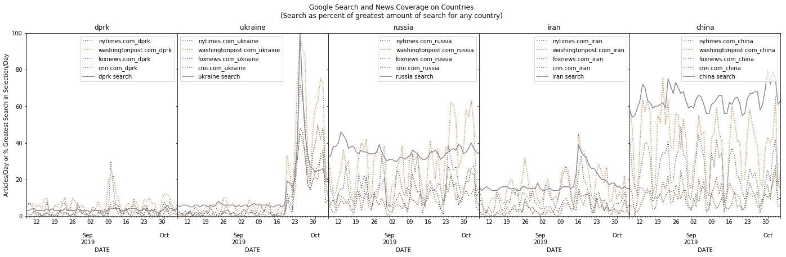
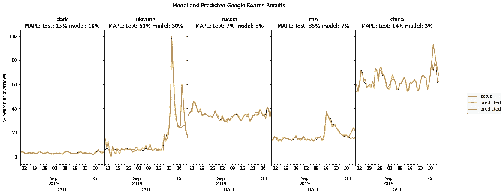
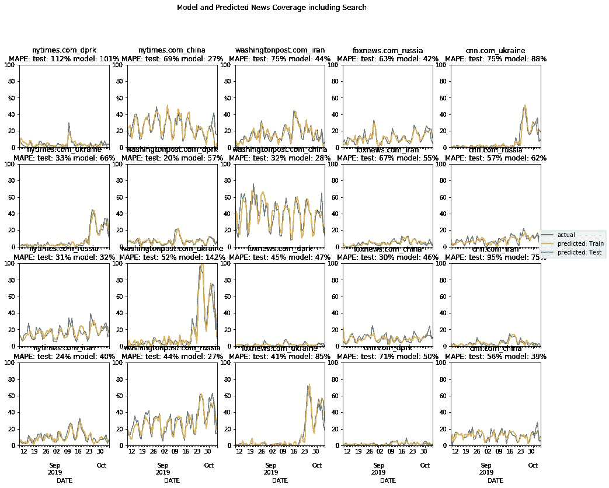

# 用 Python 建模新闻报道。第 3 部分:新闻网站与 Google 搜索趋势的交互

> 原文：<https://towardsdatascience.com/modeling-news-coverage-with-python-part-3-newspaper-coverage-and-google-search-trends-dca50f60a9c8?source=collection_archive---------22----------------------->



Fitting models of Google Search to Search Trends and News Articles

这篇文章整合了来自有限的报纸报道样本和谷歌搜索趋势的数据，以模拟两者之间的互动。在这些例子中，初步分析发现，新闻报道对于预测搜索趋势是有用的，但在另一个方向上，结果却是小而杂的。这些例子是在博客文章中用有限的资源和时间选择完成的，但是一切都足够通用，你可以交换你自己的主题或数据，这应该足以让你开始。

这是用 Python 演示新闻建模的系列博文中的第三篇。本系列的第一篇文章着眼于什么是时间序列，以及媒体中的交互可以被建模。[的第二篇帖子](/modeling-news-coverage-with-python-part-2-starting-news-forecasting-with-limited-data-5c1092de3ea9)查看了一些出版物和主题的新闻报道，用不同的方法预测报道。

## 装载物品

和以前一样，模型的所有必要代码都在本文中提供。它被格式化后可以复制粘贴到 Jupyter 笔记本文件中。该代码将获取文章数据，但是您可能希望按照说明和链接下载 Google 搜索趋势数据，或者如果您熟悉的话，自己下载。

我们将从使用 Python 包(【https://www.gdeltproject.org/data.html#rawdatafiles】T4)从 GDELT 获取 60 天的文章开始。这些文章都标有主题、人物和地点。这将检查文件是否已经下载，如果没有，则下载它们，并将其格式化为 pandas 数据帧，以便我们可以操作该系列。

现在我们将通过一个 SARIMA 模型来运行它，这个模型带有我们上次观察过的参数。在上一篇文章中，我们使用均方差来评估准确性，但这次我们将使用平均绝对百分比误差(MAPE)。这让我们可以对不同值的时间序列的误差进行标准化。我们将跟踪 mape_df 数据帧中的 MAPE 值，以便能够比较结果。

我们测试的第一个模型将同时使用出版物中其他国家的覆盖范围和其他出版物中该国家的覆盖范围，以符合之前的做法，确保一切都可以再次工作。



然后，我们可以更改外生系列，只从同一出版物中选择适合模型的文章，将结果保存到 mape_df dataframe 列“WithinNewspapersOnly_predicted”。



我们可以比较两者之间的 mape_df 差异:

```
mape_df["news_dif"] = mape_df["WithinNewspapersOnly_predicted"] - mape_df["NewspapersOnly_predicted"]for country in myCountries:
  print("{} mean hat change of {}".format(country, mape_df[mape_df.index.map(lambda x: x.find(country) > -1)]["news_dif"].mean()))>>> dprk mean hat change of -10.75
>>> ukraine mean hat change of -1.5
>>> russia mean hat change of 6.5
>>> iran mean hat change of -3.0
>>> china mean hat change of -13.75
```

看起来似乎大多数时候只使用同一份出版物比使用其他出版物的报道要好。也就是说，那是针对这个数据集和一小段时间的覆盖范围。好吧，那么谷歌搜索趋势会发生什么？下一步，我们将模型与搜索趋势相匹配，然后将新闻模型与新闻数据和搜索趋势相匹配。

## 谷歌搜索趋势

我们首先需要获得谷歌搜索数据。谷歌在 https://trends.google.com 发布他们的搜索趋势。如果你不熟悉的话，那里有很多有趣的功能。为了加快速度，我去[此链接](https://trends.google.com/trends/explore?date=2019-08-08%202019-10-06&geo=US&q=%2Fm%2F05b7q,%2Fm%2F06bnz,%2Fm%2F0d05w3,%2Fm%2F07t21,%2Fm%2F03shp)搜索了 2019 年 8 月 8 日至 2019 年 10 月 6 日相关国家(朝鲜、中国、俄国、伊朗和叙利亚)的趋势。

该页面应如下所示:



Google Trend Search Results

谷歌给出的搜索趋势是相对于搜索查询中最高搜索项的百分比，而不是原始搜索数字。在这里，乌克兰获得了最高数量的搜索结果，因此所有其他数据点都以乌克兰最大搜索量的百分比表示。我们可以点击“利息随时间变化”标签右侧的向下箭头下载 CSV 格式的文件。

然后，我们可以将 CSV 放入我们当前的工作目录中(或者其他位置，如果您想更改代码的话)，并使用 pandas 加载它。注意:Google 的 CSV 的第一行是某种元数据标签，所以我们跳过它，以便在加载时正确格式化列。

```
gdata = pd.read_csv("multiTimeline.csv", skiprows=2)
gdata.plot()
```



目测显示它看起来与网站上的原始数据相同，因此它似乎已经正确加载。现在，我们可以将其格式化为与我们之前的新闻媒体数据框相同的格式，并将它们放在一起，创建原始时间序列 df 的副本作为原始数据，以防我们搞砸了什么，需要返回。

```
gdata.columns = [x.replace(": (United States)", "").replace("North Korea", "dprk").lower() for x in gdata.columns]gdata.day = pd.to_datetime(gdata.day)gdata.set_index("day", inplace=True, drop=True)original = time_series.copy()time_series = time_series.join(gdata)
```

因此，现在我们可以继续前进，绘制报纸报道和谷歌搜索趋势，以直观地检查他们有多少排队。



我们可以先做一些观察。一些搜索趋势有明显的每周季节性(如中国)，但对于其他搜索趋势(如乌克兰、伊朗)，季节性不如那些随着新闻报道增加而出现的大峰值重要。这种差异会有点问题，因为搜索似乎忽略了朝鲜的新闻报道趋势，对乌克兰的第二次飙升做出了反应，对伊朗的第三次飙升做出了反应。

我们可以快速检查新闻对搜索是否有影响。为了建立基准错误率，我们可以继续在搜索结果上运行与新闻网站相同的 SARIMA 模型，只使用以前的 Google 搜索趋势和新闻媒体对模型相同主题的报道。


朝鲜和乌克兰在这一点上的误差最大。正如我们之前看到的，谷歌搜索偏离了新闻结果。果不其然，该模型从乌克兰的第一次高峰中吸取了经验，并预测到搜索趋势将再次出现高峰，而实际情况并非如此。此外，搜索趋势也忽略了朝鲜的新闻内容。我们真的没有任何东西可以预测这种数据中的行为，所以不去费心做分解，但更长时间的数据可能会让我们知道这是多么正常。

由于每个出版物每天的文章总数通常是相同的，覆盖一个国家可能会导致另一个国家的覆盖面减少(除非在同一篇文章中同时覆盖两个国家)，所以我们可以看看是否只包括所有内容会改进模型。



看起来，加入所有其他时间序列提高了对朝鲜和乌克兰的预测，而对俄罗斯没有影响，对伊朗和中国则有负面影响。更长的时间肯定有助于梳理出我们真正想要的数据类型，但我不想在这些博客文章中建立数据库，这已经足够说明问题了。

看起来新闻趋势帮助我们预测搜索趋势。反过来成立吗？

## 将谷歌搜索添加回新闻模式

到目前为止，我们已经了解了新闻如何预测谷歌搜索趋势。但是反过来呢？

因为我们已经将 Google 搜索趋势添加到 time_series 数据帧中，所以我们可以重新运行原始代码，稍微修改一下，只包含报纸，然后在 dataframe 列中保存 MAPE 值。



我们可以检查新模型在精确度上与原始模型有何不同，

```
mape_df["overall_change"] =mape_df["WithSearch_predicted"] - mape_df["NewspapersOnly_predicted"]for country in myCountries:
  print("{} mean hat change of {}".format(country, mape_df[mape_df.index.map(lambda x: x.find(country) > -1)]["overall_change"].mean()))>>> dprk mean hat change of 0.25
>>> ukraine mean hat change of -2.5
>>> russia mean hat change of 7.0
>>> iran mean hat change of 5.0
>>> china mean hat change of -2.25
```

有了这些参数和数据，加入谷歌搜索趋势对模型有混合但小的影响。不过这也没什么，对于 60 天的数据，我们也不指望会有很好的结果。

## 最后

我们看到，有时新闻可以帮助预测谷歌搜索趋势，但并不总是如此。SARIMA 模型在搜索趋势偏离新闻报道趋势的主题上表现更差，这是意料之中的。如果没有之前乌克兰峰值的例子，我们不会指望这个模型真的能猜到覆盖范围会有这么大的差异。

我们没有从将搜索结果添加回新闻模型中得到很好的结果。那很好。这些模型的参数并没有针对任何搜索词的细节进行调整，而且涵盖的时间也很短。看看新闻->搜索和搜索->新闻之间的关系如何维持更长的时间会很有趣。此外，这些都是相当广泛的主题。在下一篇文章中，我们将看看每一期子主题出版物的趋势。