# 用正则化线性模型& Xgboost 对价格建模

> 原文：<https://towardsdatascience.com/modeling-price-with-regularized-linear-model-xgboost-55e59eae4482?source=collection_archive---------5----------------------->


Photo Credit: Pixabay

## 开发用于预测个人房价的统计模型

我们想模拟房子的价格，我们知道价格取决于房子的位置、房子的面积、建造年份、翻新年份、卧室数量、车库数量等。因此，这些因素促成了这种模式——优质的位置通常会导致更高的价格。然而，在相同的面积和相同的平方英尺内，所有的房子并没有完全相同的价格。价格的变化就是噪音。我们在价格建模中的目标是对模式建模，忽略噪声。同样的概念也适用于建模酒店房间价格。

因此，首先，我们将为房价数据的线性回归实现正则化技术。

# 数据

有一个优秀的房价数据集可以在这里找到[。](https://www.kaggle.com/c/house-prices-advanced-regression-techniques/data)

```
import warnings
def ignore_warn(*args, **kwargs):
    pass
warnings.warn = ignore_warn
import numpy as np 
import pandas as pd 
%matplotlib inline
import matplotlib.pyplot as plt 
import seaborn as sns
from scipy import stats
from scipy.stats import norm, skew
from sklearn import preprocessing
from sklearn.metrics import r2_score
from sklearn.metrics import mean_squared_error
from sklearn.model_selection import train_test_split
from sklearn.linear_model import ElasticNetCV, ElasticNet
from xgboost import XGBRegressor, plot_importance 
from sklearn.model_selection import RandomizedSearchCV
from sklearn.model_selection import StratifiedKFold
pd.set_option('display.float_format', lambda x: '{:.3f}'.format(x))
df = pd.read_csv('house_train.csv')
df.shape
```

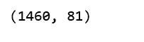

Figure 1

```
(df.isnull().sum() / len(df)).sort_values(ascending=False)[:20]
```

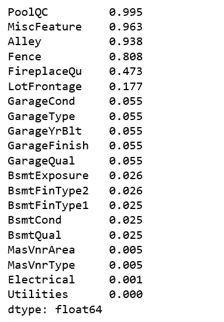

Figure 2

好消息是我们有很多特性可以玩(81)，坏消息是 19 个特性有缺失值，其中 4 个缺失值超过 80%。对于任何特性，如果它丢失了 80%的值，那么它就不会那么重要，因此，我决定删除这 4 个特性。

```
df.drop(['PoolQC', 'MiscFeature', 'Alley', 'Fence', 'Id'], axis=1, inplace=True)
```

# 探索功能

## 目标特征分布

```
sns.distplot(df['SalePrice'] , fit=norm);# Get the fitted parameters used by the function
(mu, sigma) = norm.fit(df['SalePrice'])
print( '\n mu = {:.2f} and sigma = {:.2f}\n'.format(mu, sigma))#Now plot the distribution
plt.legend(['Normal dist. ($\mu=$ {:.2f} and $\sigma=$ {:.2f} )'.format(mu, sigma)],
            loc='best')
plt.ylabel('Frequency')
plt.title('Sale Price distribution')#Get also the QQ-plot
fig = plt.figure()
res = stats.probplot(df['SalePrice'], plot=plt)
plt.show();
```

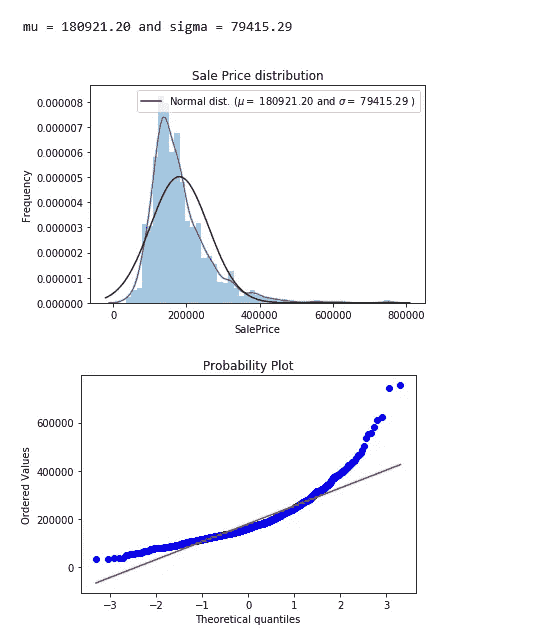

Figure 3

目标特征 SalePrice 是右偏的。由于线性模型喜欢正态分布的数据，我们将对 SalePrice 进行转换，使其更符合正态分布。

```
sns.distplot(np.log1p(df['SalePrice']) , fit=norm);# Get the fitted parameters used by the function
(mu, sigma) = norm.fit(np.log1p(df['SalePrice']))
print( '\n mu = {:.2f} and sigma = {:.2f}\n'.format(mu, sigma))#Now plot the distribution
plt.legend(['Normal dist. ($\mu=$ {:.2f} and $\sigma=$ {:.2f} )'.format(mu, sigma)],
            loc='best')
plt.ylabel('Frequency')
plt.title('log(Sale Price+1) distribution')#Get also the QQ-plot
fig = plt.figure()
res = stats.probplot(np.log1p(df['SalePrice']), plot=plt)
plt.show();
```

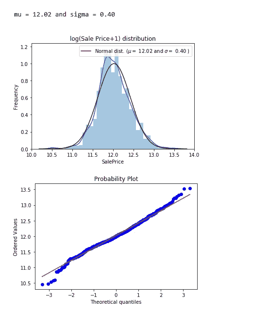

Figure 4

## **数字特征之间的相关性**

```
pd.set_option('precision',2)
plt.figure(figsize=(10, 8))
sns.heatmap(df.drop(['SalePrice'],axis=1).corr(), square=True)
plt.suptitle("Pearson Correlation Heatmap")
plt.show();
```

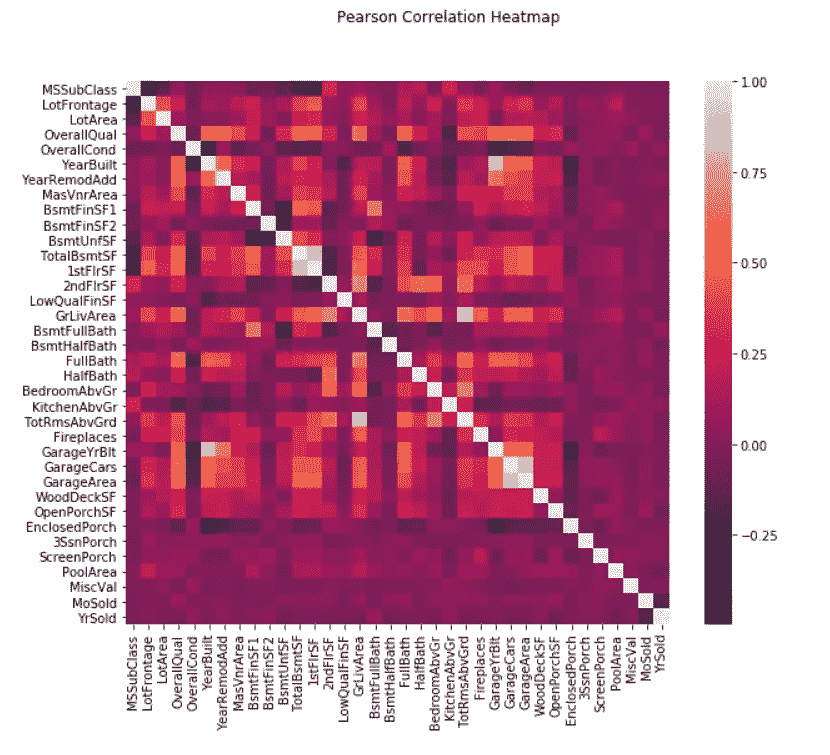

Figure 5

一些特征之间存在很强的相关性。比如 GarageYrBlt 和 YearBuilt，TotRmsAbvGrd 和 GrLivArea，GarageArea 和 GarageCars 都是强相关的。它们实际上或多或少表达了相同的东西。我以后会让[***elastic netcv***](https://scikit-learn.org/stable/modules/generated/sklearn.linear_model.ElasticNetCV.html)帮助减少冗余。

## **销售价格和其他数字特征之间的相关性**

```
corr_with_sale_price = df.corr()["SalePrice"].sort_values(ascending=False)
plt.figure(figsize=(14,6))
corr_with_sale_price.drop("SalePrice").plot.bar()
plt.show();
```

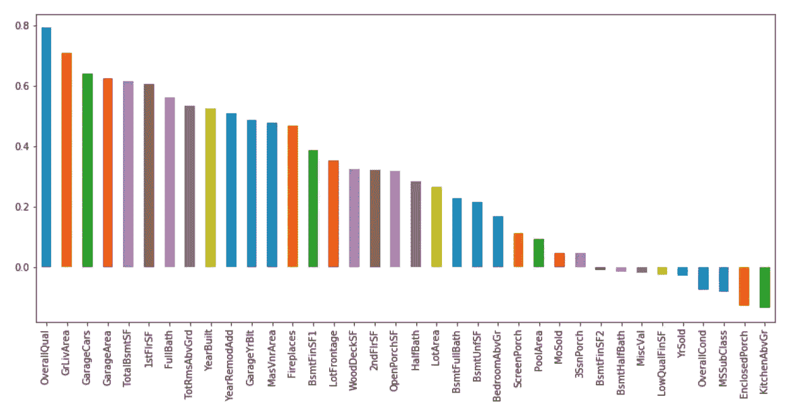

Figure 6

销售价格与总体质量的相关性最大(约 0.8)。此外，GrLivArea 的相关性超过 0.7，GarageCars 的相关性超过 0.6。让我们更详细地看一下这 4 个特性。

```
sns.pairplot(df[['SalePrice', 'OverallQual', 'GrLivArea', 'GarageCars']])
plt.show();
```

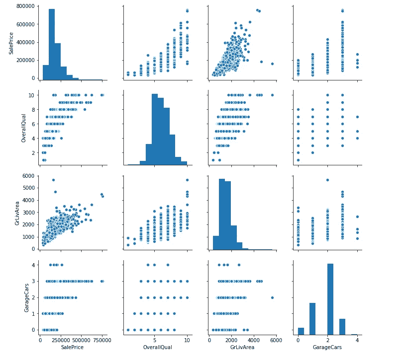

Figure 7

# 特征工程

*   具有高度偏斜分布(偏斜> 0.75)的对数变换要素
*   虚拟编码分类特征
*   用该列的平均值填写 NaN。
*   训练集和测试集分离。

feature_engineering_price.py

# **弹力网**

*   **岭**和**套索**回归是正则化的线性回归模型。
*   **ElasticNe** t 本质上是一个**套索/脊**混合体，它需要一个目标函数的最小化，这个目标函数包括 **L1** (套索)和 **L2** (脊)规范。
*   **当存在多个相互关联的特征时，ElasticNet** 非常有用。
*   类 **ElasticNetCV** 可用于通过交叉验证设置参数`alpha` (α)和`l1_ratio` (ρ)。
*   **elastic net cv**:**elastic net**模型，通过交叉验证选择最佳模型。

让我们看看**elastic tcv**将为我们选择什么。

ElasticNetCV.py

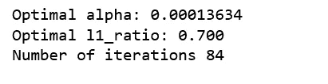

Figure 8

0 < The optimal l1_ratio <1 , indicating the penalty is a combination of L1 and L2, that is, the combination of **拉索**和**脊**。

## 模型评估

ElasticNetCV_evaluation.py

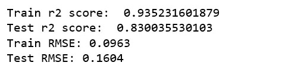

Figure 9

这里的 **RMSE** 其实就是 **RMSLE** (均方根对数误差)。因为我们取了实际值的对数。这是一篇很好的文章，解释了 RMSE 和 RMSLE 的不同之处。

## 特征重要性

```
feature_importance = pd.Series(index = X_train.columns, data = np.abs(cv_model.coef_))n_selected_features = (feature_importance>0).sum()
print('{0:d} features, reduction of {1:2.2f}%'.format(
    n_selected_features,(1-n_selected_features/len(feature_importance))*100))feature_importance.sort_values().tail(30).plot(kind = 'bar', figsize = (12,5));
```

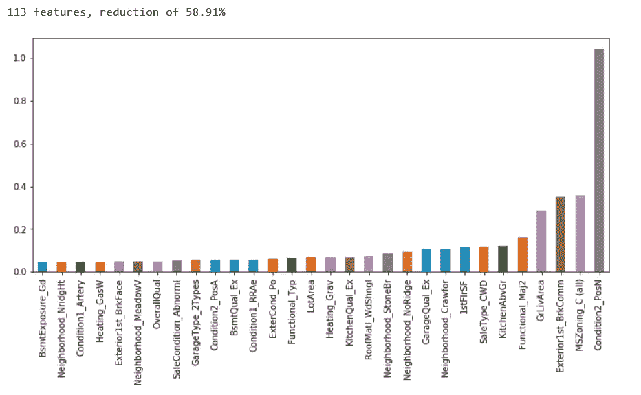

Figure 10

减少 58.91%的功能看起来很有效。ElasticNetCV 选出的前 4 个最重要的特性分别是 **Condition2_PosN** 、 **MSZoning_C(all)** 、**exterior 1st _ brk comm**&**GrLivArea**。我们将看看这些特性与 Xgboost 选择的特性相比如何。

# Xgboost

第一个 Xgboost 模型，我们从默认参数开始。

xgb_model1.py

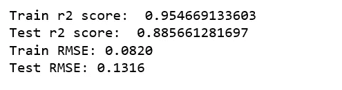

Figure 11

它已经比 ElasticNetCV 选择的型号好得多了！

第二个 Xgboost 模型，我们逐渐添加一些参数，以增加模型的准确性。

xgb_model2.py

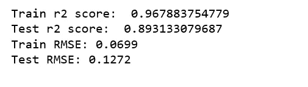

Figure 12

又有进步了！

第三个 Xgboost 模型，我们添加了一个学习率，希望它会产生一个更准确的模型。

xgb_model3.py

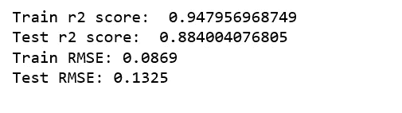

Figure 13

可惜没有什么起色。我的结论是 xgb_model2 是最好的型号。

## 特征重要性

```
from collections import OrderedDict
OrderedDict(sorted(xgb_model2.get_booster().get_fscore().items(), key=lambda t: t[1], reverse=True))
```

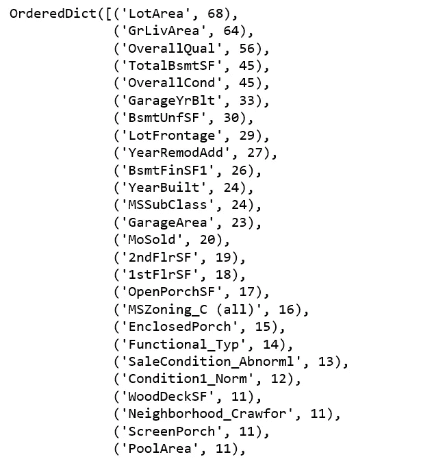

Figure 14

Xgboost 选择的前 4 个最重要的特性是 **LotArea** ， **GrLivArea** ，**overall qual**&**TotalBsmtSF**。

只有一个特性 **GrLivArea** 被 ElasticNetCV 和 Xgboost 同时选中。

因此，现在我们将选择一些相关的功能，并再次适应 Xgboost。

xgb_model5.py

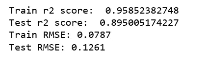

Figure 15

又一个小改进！

Jupyter 笔记本可以在 [Github](https://github.com/susanli2016/Machine-Learning-with-Python/blob/master/Modeling%20House%20Price%20with%20Regularized%20Linear%20Model%20%26%20Xgboost.ipynb) 上找到。享受这周剩下的时光吧！