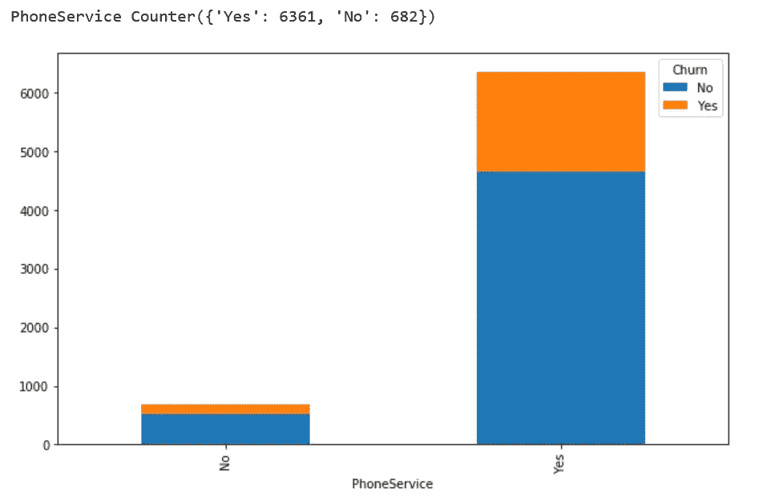
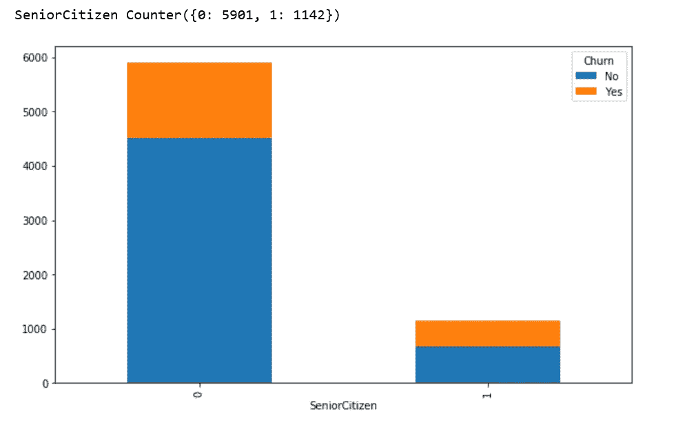

# 基于变分自动编码器的电信客户流失建模

> 原文：<https://towardsdatascience.com/modeling-telecom-customer-churn-with-variational-autoencoder-4e5cf6194871?source=collection_archive---------10----------------------->


Photo credit: Pixabay

## 如何应用**深度卷积神经网络和自动编码器**建立**流失**预测模型。

An [**autoencoder**](https://en.wikipedia.org/wiki/Autoencoder) 是深度学习对降维的回答。这个想法非常简单:通过一系列隐藏层来转换输入，但要确保最终的输出层与输入层具有相同的维度。然而，插入的隐藏层具有逐渐减少的节点数量(因此，减少了输入矩阵的维数)。如果输出与输入紧密匹配或编码，则最小隐藏层的节点可以作为有效的降维数据集。

[**变分自动编码器**](http://kvfrans.com/variational-autoencoders-explained/) (VAE)类似于经典自动编码器，是由编码器、解码器和损失函数组成的神经网络。它们让我们设计复杂的数据生成模型，并使它们适合大型数据集。

在阅读了一篇关于使用卷积网络和自动编码器洞察用户流失的文章后。我决定对电信客户流失数据集实现 VAE，该数据集可以从 IBM 样本数据集下载。将 VAE 应用于这样一个相对较小的数据集有点矫枉过正，但为了学习 VAE，我还是要这么做。

# 数据

每行代表一个客户，每列包含列元数据上描述的客户属性。

数据集包括以下信息:

*   上个月内离开的客户—这一列称为流失
*   每位客户已注册的服务—电话、多条线路、互联网、在线安全、在线备份、设备保护、技术支持以及流媒体电视和电影
*   客户账户信息——他们成为客户的时间、合同、支付方式、无纸化账单、每月费用和总费用
*   客户的人口统计信息—性别、年龄范围，以及他们是否有伴侣和家属。

```
import pandas as pd
import numpy as np
from sklearn.preprocessing import StandardScaler,MinMaxScaler
import collections
%matplotlib inline
import matplotlib.pyplot as plt
import seaborn as sns
from sklearn import preprocessing
from sklearn.metrics import (confusion_matrix, precision_recall_curve, auc,
                             roc_curve, recall_score, classification_report, f1_score,
                             precision_recall_fscore_support)
from sklearn.model_selection import train_test_split
from sklearn.preprocessing import StandardScaler,MinMaxScaler
from keras.layers import Input, Dense, Lambda
from keras.models import Model
from keras.objectives import binary_crossentropy
from keras.callbacks import LearningRateScheduler
from keras.utils.vis_utils import model_to_dot
from keras.callbacks import EarlyStopping, ModelCheckpoint
import keras.backend as K
from keras.callbacks import Callback
import matplotlib
matplotlib.rcParams['figure.figsize'] = (10.0, 6.0)df = pd.read_csv('WA_Fn-UseC_-Telco-Customer-Churn.csv')
df.info()
```


Figure 1

总费用应转换成数字。

```
df['TotalCharges'] = pd.to_numeric(df['TotalCharges'], errors='coerce')
```

数据集中的大多数特征都是分类的。我们将首先可视化它们，然后创建虚拟变量。

# **可视化并分析分类特征**

## 性别

```
gender_plot = df.groupby(['gender', 'Churn']).size().reset_index().pivot(columns='Churn', index='gender', values=0)
gender_plot.plot(x=gender_plot.index, kind='bar', stacked=True);
print('Gender', collections.Counter(df['gender']))
```


Figure 2

性别似乎对客户流失没有影响。

## **合作伙伴**

```
partner_plot = df.groupby(['Partner', 'Churn']).size().reset_index().pivot(columns='Churn', index='Partner', values=0)
partner_plot.plot(x=partner_plot.index, kind='bar', stacked=True);
print('Partner', collections.Counter(df['Partner']))
```


Figure 3

客户是否有合作伙伴似乎对客户流失有一些影响。

## 受赡养者

```
dependents_plot = df.groupby(['Dependents', 'Churn']).size().reset_index().pivot(columns='Churn', index='Dependents', values=0)
dependents_plot.plot(x=dependents_plot.index, kind='bar', stacked=True);
print('Dependents', collections.Counter(df['Dependents']))
```


Figure 4

没有家属的客户比有家属的客户更容易流失。

## **电话服务**

```
phoneservice_plot = df.groupby(['PhoneService', 'Churn']).size().reset_index().pivot(columns='Churn', index='PhoneService', values=0)
phoneservice_plot.plot(x=phoneservice_plot.index, kind='bar', stacked=True);
print('PhoneService', collections.Counter(df['PhoneService']))
```



Figure 5

没有多少客户没有注册电话服务，客户是否有电话服务似乎对客户流失没有影响。

## **多线**

```
multiplelines_plot = df.groupby(['MultipleLines', 'Churn']).size().reset_index().pivot(columns='Churn', index='MultipleLines', values=0)
multiplelines_plot.plot(x=multiplelines_plot.index, kind='bar', stacked=True);
print('MultipleLines', collections.Counter(df['MultipleLines']))
```


Figure 6

客户是否签署了多线似乎对客户流失没有影响。

## **互联网服务**

```
internetservice_plot = df.groupby(['InternetService', 'Churn']).size().reset_index().pivot(columns='Churn', index='InternetService', values=0)
internetservice_plot.plot(x=internetservice_plot.index, kind='bar', stacked=True);
print('InternetService', collections.Counter(df['InternetService']))
```


Figure 7

似乎注册光纤的客户最有可能流失，几乎 50%的客户流失了。

## **在线安全**

```
onlinesecurity_plot = df.groupby(['OnlineSecurity', 'Churn']).size().reset_index().pivot(columns='Churn', index='OnlineSecurity', values=0)
onlinesecurity_plot.plot(x=onlinesecurity_plot.index, kind='bar', stacked=True);
print('OnlineSecurity', collections.Counter(df['OnlineSecurity']))
```


Figure 8

没有注册 OnlineSecurity 的客户最有可能流失。

## **在线备份**

```
onlinebackup_plot = df.groupby(['OnlineBackup', 'Churn']).size().reset_index().pivot(columns='Churn', index='OnlineBackup', values=0)
onlinebackup_plot.plot(x=onlinebackup_plot.index, kind='bar', stacked=True);
print('OnlineBackup', collections.Counter(df['OnlineBackup']))
```


Figure 9

没有注册 OnlineBackUp 的客户最有可能流失。

## **设备保护**

```
deviceprotection_plot = df.groupby(['DeviceProtection', 'Churn']).size().reset_index().pivot(columns='Churn', index='DeviceProtection', values=0)
deviceprotection_plot.plot(x=deviceprotection_plot.index, kind='bar', stacked=True);
print('DeviceProtection', collections.Counter(df['DeviceProtection']))
```


Figure 10

没有注册 DeviceProtection 的客户最有可能流失。

## **技术支持**

```
techsupport_plot = df.groupby(['TechSupport', 'Churn']).size().reset_index().pivot(columns='Churn', index='TechSupport', values=0)
techsupport_plot.plot(x=techsupport_plot.index, kind='bar', stacked=True);
print('TechSupport', collections.Counter(df['TechSupport']))
```


Figure 11

没有注册技术支持的客户最有可能流失。

## **流媒体电视**

```
streamingtv_plot = df.groupby(['StreamingTV', 'Churn']).size().reset_index().pivot(columns='Churn', index='StreamingTV', values=0)
streamingtv_plot.plot(x=streamingtv_plot.index, kind='bar', stacked=True);
print('StreamingTV', collections.Counter(df['StreamingTV']))
```


Figure 12

## **流媒体电影**

```
streamingmovies_plot = df.groupby(['StreamingMovies', 'Churn']).size().reset_index().pivot(columns='Churn', index='StreamingMovies', values=0)
streamingmovies_plot.plot(x=streamingmovies_plot.index, kind='bar', stacked=True);
print('StreamingMovies', collections.Counter(df['StreamingMovies']))
```


Figure 13

从以上七个图中，我们可以看到，没有互联网服务的客户流失率非常低。

## **合同**

```
contract_plot = df.groupby(['Contract', 'Churn']).size().reset_index().pivot(columns='Churn', index='Contract', values=0)
contract_plot.plot(x=contract_plot.index, kind='bar', stacked=True);
print('Contract', collections.Counter(df['Contract']))
```


Figure 14

很明显，合同条款确实对客户流失有影响。当客户有一份两年的合同时，很少有不愉快的事情发生。大多数客户都有逐月合约。

## **无纸账单**

```
paperlessbilling_plot = df.groupby(['PaperlessBilling', 'Churn']).size().reset_index().pivot(columns='Churn', index='PaperlessBilling', values=0)
paperlessbilling_plot.plot(x=paperlessbilling_plot.index, kind='bar', stacked=True);
print('PaperlessBilling', collections.Counter(df['PaperlessBilling']))
```


Figure 15

## **支付方式**

```
paymentmethod_plot = df.groupby(['PaymentMethod', 'Churn']).size().reset_index().pivot(columns='Churn', index='PaymentMethod', values=0)
paymentmethod_plot.plot(x=paymentmethod_plot.index, kind='bar', stacked=True);
print('PaymentMethod', collections.Counter(df['PaymentMethod']))
```


Figure 16

支付方式似乎对流失率有影响，尤其是电子支票支付的流失率最高。

## 老年人

```
seniorcitizen_plot = df.groupby(['SeniorCitizen', 'Churn']).size().reset_index().pivot(columns='Churn', index='SeniorCitizen', values=0)
seniorcitizen_plot.plot(x=seniorcitizen_plot.index, kind='bar', stacked=True);
print('SeniorCitizen', collections.Counter(df['SeniorCitizen']))
```



Figure 17

我们的数据中没有很多老年人。看起来顾客是否是老年人对客户流失率没有影响。

# **探索数字特征**

## **任期**

```
sns.kdeplot(df['tenure'].loc[df['Churn'] == 'No'], label='not churn', shade=True);
sns.kdeplot(df['tenure'].loc[df['Churn'] == 'Yes'], label='churn', shade=True);
```


Figure 18

```
df['tenure'].loc[df['Churn'] == 'No'].describe()
```


Figure 19

```
df['tenure'].loc[df['Churn'] == 'Yes'].describe()
```


Figure 20

没有流失的客户比流失的客户拥有更长的平均任期(20 个月)。

## **月费**

```
sns.kdeplot(df['MonthlyCharges'].loc[df['Churn'] == 'No'], label='not churn', shade=True);
sns.kdeplot(df['MonthlyCharges'].loc[df['Churn'] == 'Yes'], label='churn', shade=True);
```


Figure 21

```
df['MonthlyCharges'].loc[df['Churn'] == 'No'].describe()
```


Figure 22

```
df['MonthlyCharges'].loc[df['Churn'] == 'Yes'].describe()
```


Figure 23

流失客户支付的月平均费用比非流失客户高 20%以上。

## **总费用**

```
sns.kdeplot(df['TotalCharges'].loc[df['Churn'] == 'No'], label='not churn', shade=True);
sns.kdeplot(df['TotalCharges'].loc[df['Churn'] == 'Yes'], label='churn', shade=True);
```


Figure 24

# 数据预处理

用 0 到 1 之间的值对标签进行编码。

```
le = preprocessing.LabelEncoder()
df['Churn'] = le.fit_transform(df.Churn.values)
```

用该列的平均值填写 nan。

```
df = df.fillna(df.mean())
```

编码分类特征。

```
categorical =  ['gender', 'Partner', 'Dependents', 'PhoneService', 'MultipleLines', 'InternetService', 'OnlineSecurity', 'OnlineBackup', 'DeviceProtection', 'TechSupport', 'StreamingTV', 'StreamingMovies', 'Contract', 'PaperlessBilling', 'PaymentMethod']
for f in categorical:
    dummies = pd.get_dummies(df[f], prefix = f, prefix_sep = '_')
    df = pd.concat([df, dummies], axis = 1)
# drop original categorical features
df.drop(categorical, axis = 1, inplace = True)
```

将数据分为训练集、验证集和测试集，并创建批处理通过我们的网络发送。

autoencoder_preprocessing.py

# VAE 在喀拉斯的实施

以下代码脚本主要来自 [Agustinus Kristiadi 的博客文章:变化的自动编码器:直觉和实现](https://wiseodd.github.io/techblog/2016/12/10/variational-autoencoder/)。

*   定义输入层。
*   定义编码器层。
*   编码器模型，将输入编码为潜在变量。
*   我们使用平均值作为输出，因为它是中心点，代表高斯分布。
*   我们从 2 个密集层的输出中取样。
*   定义 VAE 模型中的解码层。
*   定义总体 VAE 模型，用于重建和培训。
*   定义生成器模型，生成给定潜在变量 z 的新数据。
*   将我们的损失转化为 Keras 代码。
*   开始训练。

VAE.py

该模型在批量为 100 个样本的 55 个时期后停止训练。

# 估价

```
plt.plot(vae_history.history['loss'])
plt.plot(vae_history.history['val_loss'])
plt.title('model loss')
plt.ylabel('loss')
plt.xlabel('epoch')
plt.legend(['train', 'test'], loc='upper left')
plt.show();
```


Figure 25

从上面的损失图中，我们可以看到，该模型在训练和验证数据集上都具有可比的性能，并且在最后似乎收敛得很好。

我们使用重构误差来衡量解码器的性能。训练自动编码器以减少重建误差，如下所示:

```
x_train_encoded = encoder.predict(X_train)pred_train = decoder.predict(x_train_encoded)
mse = np.mean(np.power(X_train - pred_train, 2), axis=1)
error_df = pd.DataFrame({'recon_error': mse,
                        'churn': y_train})plt.figure(figsize=(10,6))
sns.kdeplot(error_df.recon_error[error_df.churn==0], label='not churn', shade=True, clip=(0,10))
sns.kdeplot(error_df.recon_error[error_df.churn==1], label='churn', shade=True, clip=(0,10))
plt.xlabel('reconstruction error');
plt.title('Reconstruction error - Train set');
```


Figure 26

```
x_val_encoded = encoder.predict(X_val)pred = decoder.predict(x_val_encoded)
mseV = np.mean(np.power(X_val - pred, 2), axis=1)
error_df = pd.DataFrame({'recon_error': mseV,
                        'churn': y_val})plt.figure(figsize=(10,6))
sns.kdeplot(error_df.recon_error[error_df.churn==0], label='not churn', shade=True, clip=(0,10))
sns.kdeplot(error_df.recon_error[error_df.churn==1], label='churn', shade=True, clip=(0,10))
plt.xlabel('reconstruction error');
plt.title('Reconstruction error - Validation set');
```


Figure 27

## 潜在空间可视化

我们可以在 2D 潜在空间中聚类客户，并可视化搅动和未搅动的客户，它们可以在潜在空间中分离，并揭示不同聚类的形成。

```
x_train_encoded = encoder.predict(X_train)plt.scatter(x_train_encoded[:, 0], x_train_encoded[:, 1], 
            c=y_train, alpha=0.6)
plt.title('Train set in latent space')
plt.show();
```


Figure 28

```
x_val_encoded = encoder.predict(X_val)plt.scatter(x_val_encoded[:, 0], x_val_encoded[:, 1], 
            c=y_val, alpha=0.6)plt.title('Validation set in latent space')
plt.show();
```


Figure 29

## 对验证集的预测

```
x_val_encoded = encoder.predict(X_val)
fpr, tpr, thresholds = roc_curve(y_val, clf.predict(x_val_encoded))
roc_auc = auc(fpr, tpr)plt.title('Receiver Operating Characteristic')
plt.plot(fpr, tpr, label='AUC = %0.4f'% roc_auc)
plt.legend(loc='lower right')
plt.plot([0,1],[0,1],'r--')
plt.xlim([-0.001, 1])
plt.ylim([0, 1.001])
plt.ylabel('True Positive Rate')
plt.xlabel('False Positive Rate')
plt.show();
```


Figure 29

```
print('Accuracy:')
print(accuracy_score(y_val, clf.predict(x_val_encoded)))
print("Confusion Matrix:")
print(confusion_matrix(y_val,clf.predict(x_val_encoded)))
print("Classification Report:")
print(classification_report(y_val,clf.predict(x_val_encoded)))
```


Figure 30

## 对测试集的预测

```
x_test_encoded = encoder.predict(X_test)
fpr, tpr, thresholds = roc_curve(y_test, clf.predict(x_test_encoded))
roc_auc = auc(fpr, tpr)
plt.title('Receiver Operating Characteristic')
plt.plot(fpr, tpr, label='AUC = %0.4f'% roc_auc)
plt.legend(loc='lower right')
plt.plot([0,1],[0,1],'r--')
plt.xlim([-0.001, 1])
plt.ylim([0, 1.001])
plt.ylabel('True Positive Rate')
plt.xlabel('False Positive Rate')
plt.show();
```


Figure 31

```
print('Accuracy:')
print(accuracy_score(y_test, clf.predict(x_test_encoded)))
print("Confusion Matrix:")
print(confusion_matrix(y_test,clf.predict(x_test_encoded)))
print("Classification Report:")
print(classification_report(y_test,clf.predict(x_test_encoded)))
```


Figure 32

就是这样！Jupyter 笔记本可以在 [Github](https://github.com/susanli2016/Machine-Learning-with-Python/blob/master/Autoencoder%20for%20Customer%20Churn.ipynb) 上找到。周一快乐！

参考资料:

 [## 可变自动编码器。

### 在我关于自动编码器的介绍性文章中，我讨论了各种模型(欠完整、稀疏、去噪、收缩)…

www.jeremyjordan.me](https://www.jeremyjordan.me/variational-autoencoders/)  [## 教程-什么是变分自动编码器？-贾恩·阿尔托萨尔

### 从两个角度理解变分自动编码器:深度学习和图形模型。

jaan.io](https://jaan.io/what-is-variational-autoencoder-vae-tutorial/) [](http://kvfrans.com/variational-autoencoders-explained/) [## 解释了各种自动编码器

### 在我上一篇关于生成对立网络的文章中，我介绍了一个简单的方法来训练一个可以…

kvfrans.com](http://kvfrans.com/variational-autoencoders-explained/) [](https://medium.com/@curiousily/credit-card-fraud-detection-using-autoencoders-in-keras-tensorflow-for-hackers-part-vii-20e0c85301bd) [## 使用 Keras 中的自动编码器检测信用卡欺诈——面向黑客的 TensorFlow(第七部分)

### 信用卡交易中的异常检测是如何工作的？

medium.com](https://medium.com/@curiousily/credit-card-fraud-detection-using-autoencoders-in-keras-tensorflow-for-hackers-part-vii-20e0c85301bd) [](https://deeplearning4j.org/tutorials/05-basic-autoencoder-anomaly-detection-using-reconstruction-error) [## 基本自动编码器-使用重构误差进行异常检测| Deeplearning4j

### 下载此笔记本请查看自述文件，了解安装、设置依赖关系和导入…

deeplearning4j.org](https://deeplearning4j.org/tutorials/05-basic-autoencoder-anomaly-detection-using-reconstruction-error) [](https://github.com/naomifridman/Deep-VAE-prediction-of-churn-customer) [## Naomi fridman/深度 VAE 客户流失预测

### 预测客户流失的可变深度自动编码器-Naomi fridman/深度 VAE-客户流失预测

github.co](https://github.com/naomifridman/Deep-VAE-prediction-of-churn-customer)