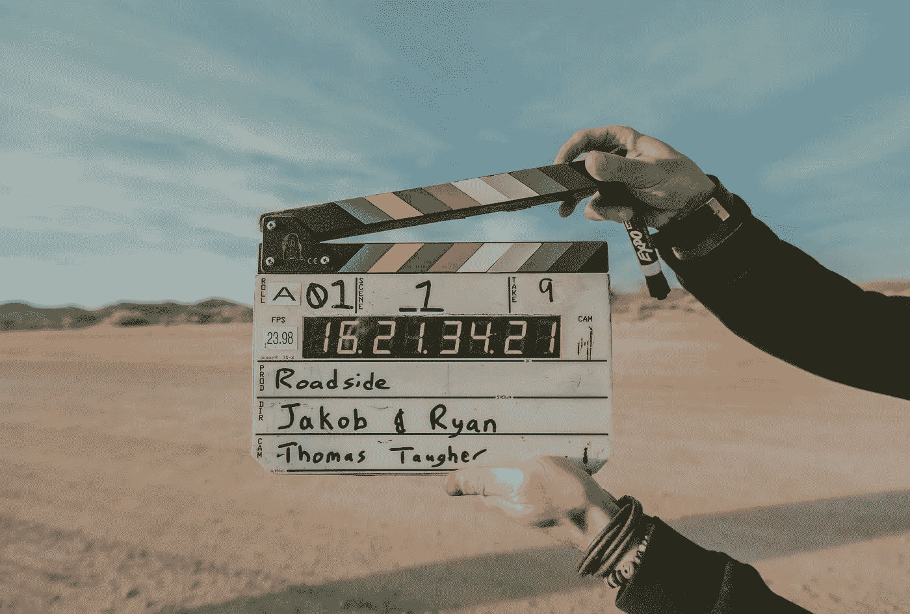
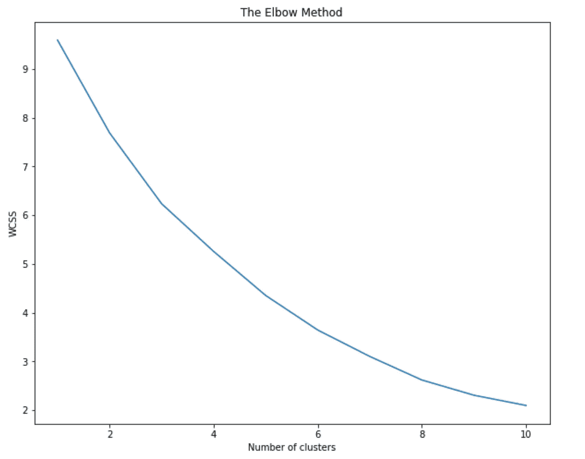
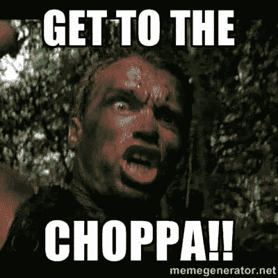

# 在动作/冒险类型中塑造有毒的男子气概

> 原文：<https://towardsdatascience.com/modeling-toxic-masculinity-in-the-action-adventure-genre-24478bf4c199?source=collection_archive---------15----------------------->

## 使用 NLTK，Gensim，Spacy 和 pyLDAvis 揭示行动主角之间的说话模式。

Photo by [Jakob Owens](https://unsplash.com/@jakobowens1?utm_source=unsplash&utm_medium=referral&utm_content=creditCopyText) on [Unsplash](https://unsplash.com/search/photos/action?utm_source=unsplash&utm_medium=referral&utm_content=creditCopyText)

动作/冒险电影多年来一直吸引着观众。从《Bullit》(1968 年)中的惊险汽车追逐到《John Wick 3》(2019 年)中的激烈战斗，电影观众一次又一次地涌向电影院，寻求肾上腺素的刺激。

虽然这种类型确实有很多乐趣，但也有一些非常明显的问题，我很好奇想了解一下。首先，绝大多数动作/冒险电影都有一个白人男性主角。其次，所说的主角往往把女性和配角当作被征服的对象。这一点在《詹姆斯·邦德》系列中表现得很明显，但我会引用范·迪塞尔主演的《XXX》系列中的一句话来总结它:

> “让我为你简化一下。踢一些屁股，得到女孩，并试图看起来像毒品，而你做到了这一点。”

考虑到这一切，我没有必要去发现我在这个项目中最终发现了什么。事实上，我最初试图通过对话提取个性，试图通过降维将五大特征映射到口语中。虽然我无法使用下面的技术来揭示人格特征，但我能够在几个主题中找到清晰的有毒的演讲模式。所以…让我们开始吧！

# 数据

为了这个项目，我利用了来自加州大学圣克鲁斯分校的[大型电影语料库](https://nlds.soe.ucsc.edu/fc2)。语料库按类型细分，包含 960 个电影剧本，其中电影中的对话与场景描述分离。在这里，我选择特别关注动作/冒险类型，包括从《兰博》到《虎胆龙威》的 143 部电影。

我最近完成了一个项目，[打印出了语料库中每个电影主角](/visualizing-the-personality-profile-of-any-film-character-using-python-and-ibm-watson-78ad2fcee065)的个性特征，在这个项目中，我将更详细地介绍文本预处理，所以在这篇文章中，我将重点介绍一些更详细的 NLP 技术和主题建模。

可以说，在我最初的预处理之后，我有了一个熊猫数据帧，其中有两列(人物和对话)用于语料库中的每个主角，每行对话作为单独的行，总共 127K 个话语，跨越大约 150 个人物。

# 处理自然语言

Photo by [Patrick Tomasso](https://unsplash.com/@impatrickt?utm_source=unsplash&utm_medium=referral&utm_content=creditCopyText) on [Unsplash](https://unsplash.com/search/photos/words?utm_source=unsplash&utm_medium=referral&utm_content=creditCopyText)

准备好数据后，现在是时候引入自然语言工具包并为主题建模准备好语料库了。

关于 NLP(自然语言处理)有趣的部分是，对于过程或工具没有硬性的和固定的规则。通常，在预处理/标准化之后是标记化、词干化/词干化、向量化、维度缩减和可视化。但是，根据上下文的不同，步骤和细微差别会有很大的不同。例如，在一种情况下，对计数矢量器和 LSA 使用二元模型可能有意义，而对 TFIDF 和 NMF 使用三元模型可能有意义。你可以把这想象成一个工作室里的艺术家，用模型和雕塑做实验，直到你有了美丽的东西。

为了这篇文章的目的，我不会在整个项目中经历许多迭代(和失败),而是会遍历产生最佳结果的步骤和模型。

首先，我将每个句子标记成一个单词列表，使用 Gensim 的 simple_preprocess()函数删除标点符号和不必要的字符，如下面的代码所示:

接下来，我定义了二元模型和三元模型。实质上，这捕获了两个相邻的单词，并确保应该在一起的单词(如“旧金山”)仍然是一个单元。换句话说:二元模型是在文档中频繁出现的两个词。三元模型是三个经常出现的词。

Gensim 的`Phrases`模型可以构建和实现二元模型、三元模型、四元模型等等。`Phrases`的两个重要参数是`min_count`和`threshold`。这些参数的值越高，单词就越难组合成二元模型。这方面的代码如下:

接下来，我定义了一些函数。也就是说，我对单词进行了词汇化，去掉了停用词，词汇化就是把一个单词转换成它的词根。例如:单词‘trees’的引理是‘tree’。同样，“说话”–>“说话”，“鹅”–>“鹅”等等。停用词本质上是英语中非常常见的词，我们不想将它们包括在我们的分析中。像“the”和“for”等词。对于下面的代码，我使用 Spacy 导入了停用词和词汇化。

## 从单词到词典/语料库到 LDA

既然我已经越来越接近能够将这些高维数据提取到主题中，我接下来使用 id2word 将我的单词列表转换为字典和语料库。原因是 LDA 主题模型的两个主要输入是(你猜对了！)词典(`id2word`)和文集:

这让我非常接近做好模型的准备！难题的最后一块是确定我想探索多少主题。这里有许多技术，包括[剪影方法](https://en.wikipedia.org/wiki/Silhouette_(clustering))，但我选择生成所谓的肘图:本质上是一种启发式方法，以帮助找到运行模型所需的集群数量。这种方法将方差的百分比解释为聚类数的函数:应该选择多个聚类，这样添加另一个聚类不会提供更好的数据建模。在图上，这通常是看起来像肘的点。

在这种情况下，我没有一个强大的“肘”来形象化。也许是 3 或 4 岁，但还不确定。这必须是另一个例子，我尝试了一些事情，并解释了结果的质量。

好了，终于到模型了！接下来，我将词典和语料库以及我想要探索的主题数量放入我的 LDA 模型中。我找到了 4 个主题最容易理解的结果。除了主题的数量，`alpha`和`eta`是影响主题稀疏度的超参数。根据 [Gensim 文档](https://radimrehurek.com/gensim/)，两者都默认为 1.0/num _ topics previous。

`chunksize`是每个训练组块中要使用的文档数。`update_every`决定模型参数更新的频率，而`passes`是训练通过的总次数。以下是该模型的代码:

太好了。现在来看一些结果。虽然简单地打印出模型主题是有效的，但有一种更直观、更具交互性的方式来显示结果:pyLDAvis。左侧图中的每个气泡代表一个主题。泡沫越大，这个话题就越流行。对于 4 个主题，我能够得到相当不同的(非重叠的)气泡，并得到有意义的结果，如下所示:

# 调查结果+结论性想法

在语料库的所有四个主题中，我看到了命令和厌恶女性的词汇。在更“驯服”的一边，有像“去”“得到”“想要”“拿走”这样的动作词，一直到只能被描述为“不那么驯服”的词，像“干”“宝贝”“杀死”等等。

当然，有许多电影的主角需要简单地…

……但是像“得到”这样的词似乎反复暗示着对他人的占有和强制命令，而不仅仅是去某个地方的需要。撇开幽默不谈，这种形象化表明，从 60 年代到现在，动作主角的写作确实存在问题，如果我不得不说出我上面的视觉主题，我会说它们可以归结为:

*   命令和强烈的要求
*   威胁
*   作为物品的女人
*   武器

我们希望这种趋势会改变，我们不仅会看到动作片中男女主角的多元化表现，还会看到他们的言行更具同理心。

这就是这个项目的全部，但展望未来，我有兴趣对语料库中的其他体裁进行同样的处理。与此同时，如果你有兴趣更深入地研究代码，请随时查看我的[项目回购。](https://github.com/nicholassherwin/Natural-Language-Processing)

## 附录

[Github](https://github.com/nicholassherwin) 、 [LinkedIn](https://www.linkedin.com/in/nicksherwinjr/) 、[投资组合](https://www.nicholassherwin.com/)