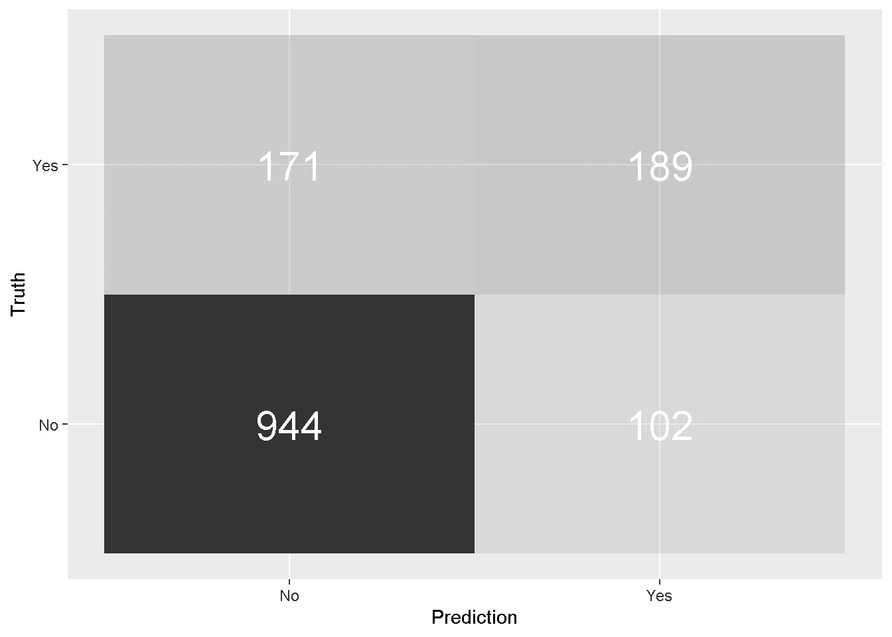

# 用潮汐模型和防风草建模

> 原文：<https://towardsdatascience.com/modelling-with-tidymodels-and-parsnip-bae2c01c131c?source=collection_archive---------5----------------------->

## 一种解决分类问题的简洁方法


Photo by [Karim Ghantous](https://unsplash.com/@kdghantous?utm_source=medium&utm_medium=referral) on [Unsplash](https://unsplash.com?utm_source=medium&utm_medium=referral)

# 概观

最近，我完成了与 R 合作的 [**业务分析在线课程，该课程侧重于与 R 合作的*应用数据和商业科学，向我介绍了一些新的建模概念和方法。特别引起我注意的一个是`parsnip`，它试图实现一个统一的建模和分析接口(类似于 **python 的** `scikit-learn`)来无缝访问 r 中的几个建模平台***](https://university.business-science.io/p/ds4b-101-r-business-analysis-r)

`parsnip`是 RStudio 的 [**Max Khun**](https://twitter.com/topepos) (因`caret`成名)和 [**Davis Vaughan**](https://twitter.com/dvaughan32) 的产物，是`tidymodels`的一部分，这是一个不断发展的工具集合，用于探索和迭代建模任务，与`tidyverse`有着共同的理念(和一些库)。

尽管有许多软件包处于开发的不同阶段，我还是决定用`tidymodels`来“兜一圈”，也就是说，创建并执行一个“整洁的”建模工作流来解决一个**分类**问题。我的目的是展示在 R 的`glm`中安装一个简单的**逻辑回归**是多么容易，并且只需更改几行代码，就可以使用`ranger`引擎快速切换到一个交叉验证的**随机森林**。

对于这篇文章，我特别关注来自`tidymodels`套件的四个不同的库:`rsample`用于数据采样和交叉验证，`recipes`用于数据预处理，`parsnip`用于模型建立和估计，以及`yardstick`用于模型评估。

**注意**重点是建模工作流和库交互。出于这个原因，我将数据探索和特性工程保持在最低限度。

# 建立

首先，我加载了这个分析所需的包。

```
**library**(tidymodels)
**library**(skimr)
**library**(tibble)
```

对于这个项目，我使用来自 IBM 分析社区之一的 [IBM Watson Analytics](https://www.ibm.com/communities/analytics/watson-analytics/) 的 [**电信客户流失**](https://www.ibm.com/communities/analytics/watson-analytics-blog/predictive-insights-in-the-telco-customer-churn-data-set/) 。该数据包含 7，043 行，每行代表一个客户，21 列代表潜在预测者，提供预测客户行为的信息，并帮助制定有针对性的客户保留计划。

`Churn`是**因变量**，显示上个月离开的客户。数据集还包括每个客户已经注册的**服务**的详细信息，以及**客户账户**和**人口统计**信息。

```
telco <- readr::**read_csv**("WA_Fn-UseC_-Telco-Customer-Churn.csv")telco %>% 
  skimr::**skim**()## Skim summary statistics
##  n obs: 7043 
##  n variables: 21 
## 
## -- Variable type:character -------------
##          variable missing complete    n min max empty n_unique
##             Churn       0     7043 7043   2   3     0        2
##          Contract       0     7043 7043   8  14     0        3
##        customerID       0     7043 7043  10  10     0     7043
##        Dependents       0     7043 7043   2   3     0        2
##  DeviceProtection       0     7043 7043   2  19     0        3
##            gender       0     7043 7043   4   6     0        2
##   InternetService       0     7043 7043   2  11     0        3
##     MultipleLines       0     7043 7043   2  16     0        3
##      OnlineBackup       0     7043 7043   2  19     0        3
##    OnlineSecurity       0     7043 7043   2  19     0        3
##  PaperlessBilling       0     7043 7043   2   3     0        2
##           Partner       0     7043 7043   2   3     0        2
##     PaymentMethod       0     7043 7043  12  25     0        4
##      PhoneService       0     7043 7043   2   3     0        2
##   StreamingMovies       0     7043 7043   2  19     0        3
##       StreamingTV       0     7043 7043   2  19     0        3
##       TechSupport       0     7043 7043   2  19     0        3
## 
## -- Variable type:numeric ---------------
##        variable missing complete    n    mean      sd    p0    p25     p50
##  MonthlyCharges      0    7043 7043   64.76   30.09 18.25  35.5    70.35
##   SeniorCitizen      0    7043 7043    0.16    0.37  0      0      0   
##          tenure      0    7043 7043   32.37   24.56  0      9     29   
##    TotalCharges     11    7032 7043 2283.3  2266.77 18.8  401.45 1397.47
##      p75    p100
##    89.85  118.75
##     0       1   
##    55      72   
##  3794.74 8684.8
```

这里有几件事需要注意:

*   **customerID** 是每一行的唯一标识符。因此，它没有描述或预测能力，需要删除。
*   鉴于 **TotalCharges** 中缺失值相对较少(只有 11 个)，我将它们从数据集中删除。

```
telco <- 
  telco %>%
  **select**(-customerID) %>%
  **drop_na**()
```

# 用`tidymodels`建模

为了展示`tidymodels`框架中的基本步骤，我正在拟合和评估一个简单的**逻辑回归**模型。

# 训练和测试分割

`rsample`提供了一种简化的方法来创建原始数据的随机训练和测试分割。

```
**set.seed**(seed = 1972) train_test_split <-
  rsample::**initial_split**(
    data = telco,     
    prop = 0.80   
  ) train_test_split
## <5626/1406/7032>
```

在总共 7，043 个客户中，5，626 个被分配给训练集，1，406 个被分配给测试集。我将它们保存为`train_tbl`和`test_tbl`。

```
train_tbl <- train_test_split %>% **training**() 
test_tbl  <- train_test_split %>% **testing**()
```

# 简单的食谱

`recipes`包使用了一个**烹饪隐喻**来处理所有的数据预处理，比如缺失值插补、移除预测值、居中和缩放、一次性编码等等。

首先，我创建了一个`recipe`，在这里我定义了我想要应用于我的数据的转换。在这种情况下，我创建了一个简单的方法，将所有的字符变量转换为因子。

然后，我用`prep`混合配料*“准备食谱”*。为了简洁起见，这里我在 recipe 函数中包含了 prep 位。

```
recipe_simple <- **function**(dataset) {
  **recipe**(Churn ~ ., data = dataset) %>%
    **step_string2factor**(**all_nominal**(), -**all_outcomes**()) %>%
    **prep**(data = dataset)
}
```

**注意**为了避免*数据泄漏*(例如:将信息从列车组传输到测试组)，数据应仅使用`train_tbl`进行“准备”。

```
recipe_prepped <- **recipe_simple**(dataset = train_tbl)
```

最后，继续烹饪的比喻，我*“烘焙食谱”*将所有预处理应用于数据集。

```
train_baked <- **bake**(recipe_prepped, new_data = train_tbl)
test_baked  <- **bake**(recipe_prepped, new_data = test_tbl)
```

# 符合模型

`parsnip`是`tidymodels`套件中相对较新的一个，可能是我最喜欢的一个。这个包提供了一个统一的 API，允许访问几个机器学习包，而不需要学习每个单独包的语法。

通过 3 个简单的步骤，您可以:

*   设置您想要安装的**型号**(这里是一个`logistic regression`)及其**模式** ( `classification`)
*   决定使用哪种计算型**引擎**(本例中为`glm`)
*   拼出精确的模型规格以**适合**(我在这里使用所有变量)以及使用什么**数据**(烘焙的训练数据集)

```
logistic_glm <-
  **logistic_reg**(mode = "classification") %>%
  **set_engine**("glm") %>%
  **fit**(Churn ~ ., data = train_baked)
```

如果您想使用另一个引擎，您可以简单地切换`set_engine`参数(对于*逻辑回归*，您可以从`glm`、`glmnet`、`stan`、`spark`和`keras`中选择)，而`parsnip`将负责在幕后为您更改所有其他内容。

# 性能评价

`yardstick`软件包提供了一种简单的方法来计算多个评估指标。但是在我评估我的模型的性能之前，我需要通过将`test_baked`数据传递给`predict`函数来计算一些预测。

```
predictions_glm <- logistic_glm %>%
  **predict**(new_data = test_baked) %>%
  **bind_cols**(test_baked %>% **select**(Churn))head(predictions_glm)
## # A tibble: 6 x 2
##   .pred_class Churn
##   <fct>       <fct>
## 1 Yes         No   
## 2 No          No   
## 3 No          No   
## 4 No          No   
## 5 No          No   
## 6 No          No
```

有几个度量可以用来调查分类模型的性能，但为了简单起见，我只关注其中的一个选择:**准确性**、**精确度**、**召回**和 **F1_Score** 。

所有这些度量(以及更多)都可以通过 [**混淆矩阵**](https://en.wikipedia.org/wiki/Confusion_matrix) 导出，该表用于描述分类模型对一组真实值已知的测试数据的性能。

就其本身而言，混淆矩阵是一个相对容易理解的概念，因为它显示了*假阳性*、*假阴性*、*真阳性*和*真阴性*的数量。然而，从它派生的一些度量可能需要一些推理来完全理解它们的意义和用途。

```
predictions_glm %>%
  **conf_mat**(Churn, .pred_class) %>%
  **pluck**(1) %>%
  **as_tibble**() %>%
  **ggplot**(**aes**(Prediction, Truth, alpha = n)) +
  **geom_tile**(show.legend = FALSE) +
  **geom_text**(**aes**(label = n), colour = "white", alpha = 1, size = 8)
```



模型的**精度**是模型正确预测的分数，可以通过将`predictions_glm`传递给`metrics`函数来轻松计算。然而，准确性并不是一个非常可靠的指标，因为如果数据集不平衡，它将提供误导性的结果。

仅通过基本的数据操作和特征工程，简单的逻辑模型已经达到 80%的准确度。

```
predictions_glm %>%
  **metrics**(Churn, .pred_class) %>%
  **select**(-.estimator) %>%
  **filter**(.metric == "accuracy") ## .metric   .estimate
## accuracy  0.8058321
```

**精度**显示模型对*误报*的敏感程度(即预测客户在他/她实际逗留时离开)，而**召回**查看模型对*误报*的敏感程度(即预测客户在他/她实际离开时仍在逗留)。

这些是非常相关的商业指标，因为组织对准确预测哪些客户真正有流失的风险特别感兴趣，这样他们就可以有针对性地制定保留策略。与此同时，他们希望尽最大努力留住那些被错误归类为离开的客户，因为他们会留下来。

```
**tibble**(
  "precision" = 
     **precision**(predictions_glm, Churn, .pred_class) %>%
     **select**(.estimate),
  "recall" = 
     **recall**(predictions_glm, Churn, .pred_class) %>%
     **select**(.estimate)
) %>%
  **unnest**() %>%
  **kable**()## precision   recall 
## 0.8466368   0.9024857
```

另一个流行的性能评估指标是 [**F1 得分**](https://en.wikipedia.org/wiki/F1_score) ，它是[精度](https://en.wikipedia.org/wiki/Precision_(information_retrieval))和[召回](https://en.wikipedia.org/wiki/Recall_(information_retrieval))的调和平均值。F1 分数在 1 时达到最佳值，具有完美的*精度*和*召回*。

```
predictions_glm %>%
  **f_meas**(Churn, .pred_class) %>%
  **select**(-.estimator) %>%
  **kable**()## .metric  .estimate 
## f_meas   0.8736696
```

# 随机森林

这就是`tidymodels`真正的魅力所在。现在，我可以使用这个整洁的建模框架，用`ranger`引擎装配一个**随机森林**模型。

# 交叉验证设置

为了进一步完善模型的预测能力，我使用来自`rsample`的`vfold_cv`实现了一个 **10 重交叉验证**，它再次分割了初始训练数据。

```
cross_val_tbl <- **vfold_cv**(train_tbl, v = 10)cross_val_tbl
## #  10-fold cross-validation 
## # A tibble: 10 x 2
##    splits             id    
##    <list>             <chr> 
##  1 <split [5.1K/563]> Fold01
##  2 <split [5.1K/563]> Fold02
##  3 <split [5.1K/563]> Fold03
##  4 <split [5.1K/563]> Fold04
##  5 <split [5.1K/563]> Fold05
##  6 <split [5.1K/563]> Fold06
##  7 <split [5.1K/562]> Fold07
##  8 <split [5.1K/562]> Fold08
##  9 <split [5.1K/562]> Fold09
## 10 <split [5.1K/562]> Fold10
```

如果我们进一步观察，我们应该认识到 5626 这个数字，这是初始`train_tbl`中的观察总数。在每一轮中，将依次从估计中保留 563 个观察值，并用于验证该折叠的模型。

```
cross_val_tbl$splits %>%
  **pluck**(1)## <5063/563/5626>
```

为了避免混淆并区分*初始训练/测试分割*和那些用于交叉验证的分割，Max Kuhn**的作者创造了两个新术语:`analysis`和`assessment`集合。前者是用于递归估计模型的训练数据部分，而后者是用于验证每个估计的部分。**

# 更新配方

**注意**一个随机森林需要*所有数字*变量被*居中并缩放*，所有*字符/因子*变量被*【虚拟化】*。这很容易通过用这些转换更新配方来完成。

```
recipe_rf <- **function**(dataset) {
  **recipe**(Churn ~ ., data = dataset) %>%
    **step_string2factor**(**all_nominal**(), -**all_outcomes**()) %>%
    **step_dummy**(**all_nominal**(), -**all_outcomes**()) %>%
    **step_center**(**all_numeric**()) %>%
    **step_scale**(**all_numeric**()) %>%
    **prep**(data = dataset)
}
```

# 评估模型

切换到另一种模式再简单不过了！我所需要做的就是将**型号**改为`random_forest`并添加其超参数，将 **set_engine** 参数改为`ranger`，我就准备好了。

我将所有步骤捆绑到一个函数中，该函数估计所有褶皱的模型，运行预测，并返回一个包含所有结果的方便表格。我需要在配方“准备”之前添加一个额外的步骤，将交叉验证分割映射到`analysis`和`assessment`函数。这将引导 10 次折叠的迭代。

```
rf_fun <- **function**(split, id, try, tree) {

  analysis_set <- split %>% **analysis**()
  analysis_prepped <- analysis_set %>% **recipe_rf**()
  analysis_baked <- analysis_prepped %>% **bake**(new_data = analysis_set) model_rf <-
    **rand_forest**(
      mode = "classification",
      mtry = try,
      trees = tree
    ) %>%
    **set_engine**("ranger",
      importance = "impurity"
    ) %>%
    **fit**(Churn ~ ., data = analysis_baked) assessment_set <- split %>% **assessment**()
  assessment_prepped <- assessment_set %>% **recipe_rf**()
  assessment_baked <- assessment_prepped %>% **bake**(new_data = assessment_set) **tibble**(
    "id" = id,
    "truth" = assessment_baked$Churn,
    "prediction" = model_rf %>%
      **predict**(new_data = assessment_baked) %>%
      **unlist**()
  )

}
```

# 性能评价

我剩下要做的就是将公式映射到数据框。

```
pred_rf <- **map2_df**(
  .x = cross_val_tbl$splits,
  .y = cross_val_tbl$id,
  ~ **rf_fun**(split = .x, id = .y, try = 3, tree = 200)
)**head**(pred_rf)
## # A tibble: 6 x 3
##   id     truth prediction
##   <chr>  <fct> <fct>     
## 1 Fold01 Yes   Yes       
## 2 Fold01 Yes   No        
## 3 Fold01 Yes   Yes       
## 4 Fold01 No    No        
## 5 Fold01 No    No        
## 6 Fold01 Yes   No
```

我发现`yardstick`有一个非常方便的混淆矩阵`summary`函数，它返回一个由 **13 个不同指标**组成的数组，但是在这种情况下，我想看看我在`glm`模型中使用的四个指标。

```
pred_rf %>%
  **conf_mat**(truth, prediction) %>%
  **summary**() %>%
  **select**(-.estimator) %>%
  **filter**(.metric %in%
    c("accuracy", "precision", "recall", "f_meas")) %>%
  **kable**()## .metric    .estimate 
##  accuracy  0.7979026 
##  precision 0.8250436 
##  recall    0.9186301 
##  f_meas    0.8693254
```

`random forest`型号的性能与简单的`logistic regression`不相上下。鉴于我已经完成的非常基本的特征工程，还有进一步改进模型的空间，但这超出了本文的范围。

# 成交注意事项

`tidymodels`的最大优势之一是对分析工作流程每个阶段的灵活性和易用性。创建建模管道轻而易举，通过使用`parsnip`改变模型类型和使用`recipes`进行数据预处理，您可以轻松重用初始框架，并且很快就可以使用`yardstick`检查新模型的性能。

在任何分析中，你通常会审计几个模型，而`parsnip`让你不必学习每个建模引擎的独特语法，这样你就可以专注于寻找手头问题的最佳解决方案。

# 代码库

完整的 R 代码可以在[我的 GitHub 简介](https://github.com/DiegoUsaiUK/Classification_Churn_with_Parsnip)中找到

# 参考

*   非常感谢 *Bruno Rodrigues* 的文章，这篇文章为大评估公式[提供了灵感，这是一篇关于与 R 进行整齐交叉验证的教程](https://www.brodrigues.co/blog/2018-11-25-tidy_cv/)
*   更感谢*本杰明·索伦森*用 `[parsnip](https://www.benjaminsorensen.me/post/modeling-with-parsnip-and-tidymodels/)` [和](https://www.benjaminsorensen.me/post/modeling-with-parsnip-and-tidymodels/) `[tidymodels](https://www.benjaminsorensen.me/post/modeling-with-parsnip-and-tidymodels/)`对[造型的深思熟虑](https://www.benjaminsorensen.me/post/modeling-with-parsnip-and-tidymodels/)
*   关于`[parsnip](https://www.tidyverse.org/articles/2018/11/parsnip-0-0-1/)`的介绍

*原载于 2019 年 6 月 22 日*[*https://diegousei . io*](https://diegousai.io/2019/09/modelling-with-tidymodels-and-parsnip/)*。*