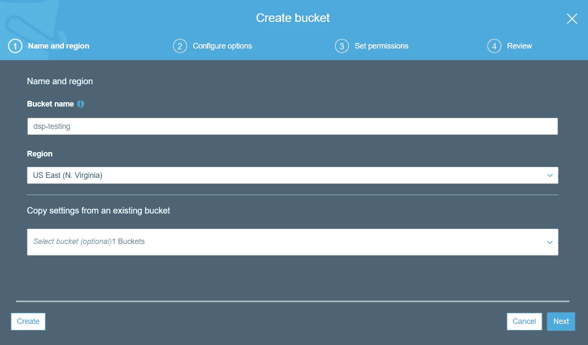

# 作为无服务器功能的模型

> 原文：<https://towardsdatascience.com/models-as-serverless-functions-7930a70193d4?source=collection_archive---------13----------------------->


Source: [Wikimedia](https://commons.wikimedia.org/wiki/File:Wikimedia_Foundation_Servers_2015-63.jpg)

## “生产中的数据科学”第 3 章

我最近出版了我正在编写的关于 [*leanpub*](https://leanpub.com/ProductionDataScience) *的书的第三章。本章的目标是让数据科学家能够利用托管服务将模型部署到生产中，并拥有更多开发运维。*

[](/data-science-in-production-13764b11d68e) [## 生产中的数据科学

### 用 Python 构建可扩展的模型管道

towardsdatascience.com](/data-science-in-production-13764b11d68e) 

无服务器技术使开发人员能够编写和部署代码，而无需担心配置和维护服务器。这种技术最常见的用途之一是无服务器功能，这使得编写可伸缩以适应不同工作负载的代码变得更加容易。在无服务器函数环境中，您编写一个运行时支持的函数，指定一个依赖项列表，然后将该函数部署到生产环境中。云平台负责供应服务器、扩展更多机器以满足需求、管理负载平衡器以及处理版本控制。因为我们已经探索了作为 web 端点的托管模型，所以当您想要快速地将预测模型从原型转移到生产时，无服务器函数是一个很好的工具。

无服务器功能于 2015 年和 2016 年首次在 AWS 和 GCP 上推出。这两个系统都提供了各种可以调用函数的触发器，以及函数可以作为响应触发的大量输出。虽然可以使用无服务器功能来避免编写复杂的代码来将云平台中的不同组件粘合在一起，但我们将在本章中探索一个更窄的用例。我们将编写由 HTTP 请求触发的无服务器函数，为传入的特征向量计算倾向得分，并将预测作为 JSON 返回。对于这个特定的用例，GCP 的云功能更容易启动和运行，但我们将探索 AWS 和 GCP 的解决方案。

在本章中，我们将介绍托管服务的概念，其中云平台负责供应服务器。接下来，我们将介绍使用云功能托管 sklearn 和 Keras 模型。最后，我们将展示如何在 AWS 中使用 Lambda 函数为 sklearn 模型实现相同的结果。我们还将谈到模型更新和访问控制。

# 3.1 托管服务

自 2015 年以来，云计算领域出现了一场运动，将开发人员从手动配置服务器转变为使用抽象出服务器概念的托管服务。这种新模式的主要优势在于，开发人员可以在试运行环境中编写代码，然后将代码推向生产环境，最大限度地减少运营开销，并且可以根据需要自动扩展与所需工作负载相匹配的基础架构。这使得工程师和数据科学家在 DevOps 中更加活跃，因为基础架构的许多运营问题都由云提供商管理。

手动供应服务器，您`ssh`进入机器以设置库和代码，这通常被称为*托管的*部署，而*管理的*解决方案则由云平台负责从用户那里抽象出这种担忧。在本书中，我们将涵盖这两个类别的例子。以下是我们将涉及的一些不同的使用案例:

*   **Web 端点:**单个 EC2 实例(托管)与 AWS Lambda(托管)
*   **Docker:** 单个 EC2 实例(托管)与 ECS(托管)
*   **消息:** Kafka(托管)vs AWS Kinesis(托管)

本章将介绍第一个用例，将 web 端点从一台机器迁移到一个弹性环境。我们还将通过一些例子来说明这种区别，比如使用特定的机器配置和手动集群管理来部署 Spark 环境。

无服务器技术和托管服务是数据科学家的强大工具，因为它们使单个开发人员能够构建可扩展到大规模工作负载的数据管道。这是数据科学家可以使用的强大工具，但是在使用托管服务时需要考虑一些权衡。以下是在选择托管和托管解决方案时要考虑的一些主要问题:

*   **迭代:**您是在产品上快速原型化还是在生产中迭代系统？
*   **延迟:**对于您的 SLA 来说，几秒钟的延迟是可以接受的吗？
*   **扩展:**您的系统能否扩展以满足峰值工作负载需求？
*   **成本:**您是否愿意为无服务器云支付更多成本？

在初创公司，无服务器技术非常棒，因为你的流量很低，并且有能力快速迭代和尝试新的架构。在一定规模下，当您已经有了调配云服务的内部专业知识时，动态变化和使用无服务器技术的成本可能不再那么有吸引力。在我过去的项目中，最担心的问题是延迟，因为它会影响客户体验。在第 8 章中，我们将触及这个主题，因为托管解决方案通常不能很好地扩展到大型工作负载。

即使您的组织在日常运营中不使用托管服务，作为数据科学家，这也是一项有用的技能，因为这意味着您可以将模型培训与模型部署问题分开。本书的主题之一是模型不需要复杂，但是部署模型可能会很复杂。无服务器功能是展示大规模服务模型能力的一个很好的方法，我们将介绍两个提供这种能力的云平台。

# 3.2 云功能(GCP)

谷歌云平台为称为云功能的无服务器功能提供了一个环境。该工具的一般概念是，您可以编写针对 Flask 的代码，但利用 GCP 的托管服务为您的 Python 代码提供弹性计算。GCP 是开始使用无服务器功能的绝佳环境，因为它非常符合标准的 Python 开发生态系统，在这里您可以指定需求文件和应用程序代码。

我们将构建可扩展的端点，通过云功能服务于 sklearn 和 Keras 模型。在这种环境下编写函数时，需要注意几个问题:

*   **存储:**云函数在只读环境下运行，但是可以写入`/tmp`目录。
*   标签:空格和标签会导致云函数出现问题，如果你使用的是 web 编辑器而不是 Sublime Text 等熟悉的工具，这些可能很难发现。
*   当使用一个需求文件时，根据你的导入来区分`sklearn`和`scikit-learn`是很重要的。本章我们会用到 sklearn。

云平台总是在变化，因此本章概述的具体步骤可能会根据这些平台的发展而变化，但部署功能的一般方法应该适用于这些更新。一如既往，我提倡的方法是从一个简单的例子开始，然后根据需要扩展到更复杂的解决方案。在这一节中，我们将首先构建一个 echo 服务，然后探索 sklearn 和 Keras 模型。

# 3.2.1 回声服务

GCP 为创作云函数提供了一个 web 界面。这个 UI 提供了为函数设置触发器、为 Python 函数指定需求文件以及创作满足请求的 Flask 函数实现的选项。首先，我们将设置一个简单的 echo 服务，它从 HTTP 请求中读入一个参数，并将传入的参数作为结果返回。

在 GCP，您可以直接将云功能设置为 HTTP 端点，而无需配置额外的触发器。要开始设置 echo 服务，请在 GCP 控制台中执行以下操作:

1.  搜索“云功能”
2.  点击“创建功能”
3.  选择“HTTP”作为触发器
4.  选择“允许未经验证的调用”
5.  为源代码选择“内联编辑器”
6.  选择 Python 3.7 作为运行时

该过程的一个示例如图 [3.1](/3-2-cloud-functions-gcp.html#fig:CreateFunc3) 所示。在执行这些步骤之后，UI 将为 main.py 和 requirements.txt 文件提供选项卡。需求文件是我们指定库的地方，比如`flask >= 1.1.1`，主文件是我们实现函数行为的地方。


**图 3.1:创建云函数。**

我们将从创建一个简单的 echo 服务开始，该服务从传入的请求中解析出`msg`参数，并将该参数作为 JSON 响应返回。为了使用`jsonify`功能，我们需要在需求文件中包含`flask`库。简单 echo 服务的`requirements.txt`文件和`main.py`文件如下面的代码片段所示。这里的 echo 函数类似于我们在 2.1.1 节中编写的 echo 服务，主要区别在于我们不再使用注释来指定端点和允许的方法。相反，这些设置现在是使用云功能 UI 指定的。

```
***# requirements.txt*** flask ***#main.py*** def echo(request):
    from flask import jsonify data = {"success": False}
    params = request.get_json() if "msg" in params: 
        data["response"] = str(params['msg'])
        data["success"] = True

    return jsonify(data) 
```

我们可以通过执行以下步骤将该功能部署到生产环境中:

1.  将“要执行的功能”更新为“回显”
2.  单击“创建”进行部署

一旦部署了该功能，您可以单击“Testing”选项卡来检查该功能的部署是否如预期的那样工作。您可以指定一个 JSON 对象传递给函数，通过点击“测试函数”来调用函数，如图 [3.2](/3-2-cloud-functions-gcp.html#fig:FuncTest3) 所示。运行这个测试用例的结果是在`Output`对话框中返回的 JSON 对象，这表明调用 echo 函数工作正常。


**图 3.2:测试云函数。**

既然已经部署了该函数，并且我们启用了对该函数的未经身份验证的访问，我们就可以使用 Python 通过 web 调用该函数了。要获取该函数的 URL，请单击“trigger”选项卡。我们可以使用`requests`库将 JSON 对象传递给无服务器函数，如下面的代码片段所示。

```
import requestsresult = **requests.post**(
        "https://us-central1-gameanalytics.cloudfunctions.net/echo"
                    ,json = { 'msg': 'Hello from Cloud Function' })
**print**(**result.json**())
```

运行这个脚本的结果是从无服务器函数返回一个 JSON 有效负载。调用的输出是如下所示的 JSON。

```
{
    'response': 'Hello from Cloud Function', 
    'success': True
}
```

我们现在有了一个无服务器功能，提供了一个 echo 服务。为了使用云函数为模型提供服务，我们需要将模型规范保存在无服务器函数可以访问的地方。为了实现这一点，我们将使用云存储将模型存储在分布式存储层中。

# 云存储(GCS)

GCP 提供了一个名为谷歌云存储(GCS)的弹性存储层，可以用于分布式文件存储，也可以扩展到其他用途，如数据湖。在这一节中，我们将探索利用该服务存储和检索文件以在无服务器功能中使用的第一个用例。GCS 类似于 AWS 的 S3，它在游戏行业被广泛用于构建数据平台。

虽然 GCP 确实提供了与 GCS 交互的 UI，但我们将在这一部分探索命令行界面，因为这种方法对于构建自动化工作流非常有用。GCP 要求与此服务交互时进行身份验证，如果您还没有设置 JSON 凭证文件，请重新阅读 1.1 节。为了使用 Python 与云存储交互，我们还需要安装 GCS 库，使用如下所示的命令:

```
pip install --user google-cloud-storage 
export GOOGLE_APPLICATION_CREDENTIALS=**/**home/ec2-user/dsdemo.json
```

现在我们已经安装了必备库并设置了凭证，我们可以使用 Python 以编程方式与 GCS 进行交互。在存储文件之前，我们需要在 GCS 上设置一个存储桶。bucket 是分配给存储在 GCS 上的所有文件的前缀，每个 bucket 名称必须是全局唯一的。我们将创建一个名为`dsp_model_store`的存储桶，在这里我们将存储模型对象。下面的脚本展示了如何使用`create_bucket`函数创建一个新的存储桶，然后使用`list_buckets`函数遍历所有可用的存储桶。在运行这个脚本之前，您需要将`bucket_name`变量改为一个独特的变量。

```
from google.cloud import storage
bucket_name = "dsp_model_store"storage_client = **storage.Client**()
**storage_client.create_bucket**(bucket_name)**for** bucket **in** **storage_client.list_buckets**():
    **print**(bucket.name)
```

运行这段代码后，脚本的输出应该是一个单独的 bucket，其名称分配给了`bucket_name`变量。我们现在在 GCS 上有了一个可以用来保存文件的路径:`gs://dsp_model_storage`。

我们将重用我们在第 2.2.1 节中训练的模型来部署具有云函数的逻辑回归模型。为了将文件保存到 GCS，我们需要分配一个到目的地的路径，如下面的`bucket.blob`命令所示，并选择一个要上传的本地文件，该文件被传递给上传函数。

```
from google.cloud import storagebucket_name = "dsp_model_store"
storage_client = **storage.Client**()
bucket = **storage_client.get_bucket**(bucket_name)blob = **bucket.blob**("serverless/logit/v1")
**blob.upload_from_filename**("logit.pkl")
```

运行该脚本后，本地文件`logit.pkl`现在可以在 GCS 的以下位置获得:

```
gs:**//**dsp_model_storage/serverless/logit/v1/logit.pkl
```

虽然像这样直接使用 URIs 来访问文件是可能的，正如我们将在第 6 章用 Spark 探索的，在这一节我们将使用桶名和 blob 路径来检索文件。下面的代码片段显示了如何将模型文件从 GCS 下载到本地存储。我们将模型文件下载到本地路径`local_logit.pkl`，然后用这个路径调用`pickle.load`来加载模型。

```
import pickle 
from google.cloud import storagebucket_name = "dsp_model_store"
storage_client = **storage.Client**()
bucket = **storage_client.get_bucket**(bucket_name)blob = **bucket.blob**("serverless/logit/v1")
**blob.download_to_filename**("local_logit.pkl")
model = **pickle.load**(**open**("local_logit.pkl", 'rb'))
model
```

我们现在可以使用 Python 以编程方式将模型文件存储到 GCS 中，并且还可以检索它们，从而使我们能够在云函数中加载模型文件。我们将结合上一章的 Flask 示例，将 sklearn 和 Keras 模型作为云函数。

# 模型功能

我们现在可以设置一个云函数，通过 web 服务于逻辑回归模型预测。我们将在 2.3.1 节中探索的 Flask 示例的基础上进行构建，并对服务进行一些修改，以便在 GCP 上运行。第一步是在`requirements.txt`文件中指定服务请求所需的 Python 库，如下所示。我们还需要 pandas 来建立一个数据框架以进行预测，sklearn 用于应用模型，云存储用于从 GCS 中检索模型对象。

```
google-cloud-storage
sklearn
pandas
flask
```

下一步是在`main.py`文件中实现我们的模型函数。与之前的一个小变化是现在使用`request.get_json()`而不是`flask.request.args`来获取`params`对象。主要的变化是，我们现在从 GCS 下载模型文件，而不是直接从本地存储中检索文件，因为在使用 UI 工具编写云函数时，本地文件是不可用的。与先前函数的另一个变化是，我们现在为每个请求重新加载模型，而不是在启动时加载一次模型文件。在后面的代码片段中，我们将展示如何使用全局对象来缓存加载的模型。

```
def **pred**(request):
    from google.cloud import storage
    import pickle as pk
    import sklearn
    import pandas as pd 
    from flask import jsonify data = {"success": False}
    params = **request.get_json**() **if** "G1" **in** params: 

        new_row = { "G1": **params.get**("G1"),"G2": **params.get**("G2"), 
                    "G3": **params.get**("G3"),"G4": **params.get**("G4"), 
                    "G5": **params.get**("G5"),"G6": **params.get**("G6"), 
                    "G7": **params.get**("G7"),"G8": **params.get**("G8"), 
                    "G9": **params.get**("G9"),"G10":**params.get**("G10")} new_x = **pd.DataFrame.from_dict**(new_row, 
                                      orient = "index")**.transpose**()

        *# set up access to the GCS bucket* 
        bucket_name = "dsp_model_store"
        storage_client = **storage.Client**()
        bucket = **storage_client.get_bucket**(bucket_name) *# download and load the model*
        blob = **bucket.blob**("serverless/logit/v1")
        **blob.download_to_filename**("/tmp/local_logit.pkl")
        model = **pk.load**(**open**("/tmp/local_logit.pkl", 'rb'))

        data["response"] = **str**(**model.predict_proba**(new_x)[0][1])
        data["success"] = True

    return **jsonify**(data)
```

上面的代码片段中需要注意的一点是,`/tmp`目录用于存储下载的模型文件。在云函数中，除了这个目录之外，不能写入本地磁盘。一般来说，最好是将对象直接读入内存，而不是将对象拖到本地存储，但是用于从 GCS 读取对象的 Python 库目前需要这种方法。

对于这个函数，我创建了一个名为`pred`的新云函数，将要执行的函数设置为`pred`，并将该函数部署到生产环境中。我们现在可以从 Python 调用该函数，使用 2.3.1 中的相同方法，URL 现在指向云函数，如下所示:

```
import requestsresult = **requests.post**(
        "https://us-central1-gameanalytics.cloudfunctions.net/pred"
         ,json = { 'G1':'1', 'G2':'0', 'G3':'0', 'G4':'0', 'G5':'0'
               ,'G6':'0', 'G7':'0', 'G8':'0', 'G9':'0', 'G10':'0'})
**print**(**result.json**())
```

Python web 对该函数的请求的结果是一个 JSON 响应，其中包含响应值和模型预测，如下所示:

```
{
  'response': '0.06745113592634559', 
  'success': True
}
```

为了提高函数的性能，使响应时间从几秒缩短到几毫秒，我们需要在两次运行之间缓存模型对象。最好避免在函数范围之外定义变量，因为托管函数的服务器可能会因不活动而终止。当用于在函数调用之间缓存对象时，全局变量是对该规则的执行。下面的代码片段展示了如何在 pred 函数的范围内定义一个全局模型对象，以提供一个跨调用的持久对象。在第一次函数调用期间，将从 GCS 检索模型文件，并通过 pickle 加载。在接下来的运行中，模型对象将被加载到内存中，从而提供更快的响应时间。

```
model = None    

def **pred**(request):
    global model

    **if** not model:
        *# download model from GCS*
        model = **pk.load**(**open**("/tmp/local_logit.pkl", 'rb')) **if** "G1" **in** params: 
        *# apply model* return **jsonify**(data)
```

缓存对象对于创作按需延迟加载对象的响应式模型非常重要。它对于更复杂的模型也很有用，比如 Keras，它需要在调用之间持久化一个张量流图。

# Keras 模型

由于云函数提供了一个需求文件，可以用来向函数添加额外的依赖项，因此也可以用这种方法来服务 Keras 模型。我们将能够重用上一节中的大部分代码，我们还将使用 2.3.2 节中介绍的 Keras 和 Flask 方法。考虑到 Keras 库和依赖项的大小，我们需要将该函数可用的内存从 256 MB 升级到 1GB。我们还需要更新需求文件以包含 Keras:

```
google-cloud-storage
tensorflow
keras
pandas
flask
```

Keras 模型作为云函数的完整实现如下面的代码片段所示。为了确保用于加载模型的 TensorFlow 图可用于模型的未来调用，我们使用全局变量来缓存模型和图对象。为了加载 Keras 模型，我们需要重新定义在模型训练期间使用的`auc`函数，我们将它包含在`predict`函数的范围内。我们重用前一节中的相同方法从 GCS 下载模型文件，但是现在使用 Keras 中的`load_model`将模型文件从临时磁盘位置读入内存。其结果是一个 Keras 预测模型，它可以延迟获取模型文件，并可以作为一个无服务器功能进行扩展以满足各种工作负载。

```
model = None    
graph = Nonedef **predict**(request):
    global model
    global graph

    from google.cloud import storage
    import pandas as pd
    import flask
    import tensorflow as tf
    import keras as k
    from keras.models import load_model
    from flask import jsonify

    def **auc**(y_true, y_pred):
        auc = **tf.metrics.auc**(y_true, y_pred)[1]
        **k.backend.get_session**()**.run**(
                      **tf.local_variables_initializer**())
        return auc

    data = {"success": False}
    params = **request.get_json**() *# download model if now cached* 
    **if** not model:
        graph = **tf.get_default_graph**()

        bucket_name = "dsp_model_store_1"
        storage_client = **storage.Client**()
        bucket = **storage_client.get_bucket**(bucket_name) blob = **bucket.blob**("serverless/keras/v1")
        **blob.download_to_filename**("/tmp/games.h5")
        model = **load_model**('/tmp/games.h5', 
                          custom_objects={'auc':auc})

    *# apply the model* 
    **if** "G1" **in** params: 
        new_row = { "G1": **params.get**("G1"),"G2": **params.get**("G2"), 
                    "G3": **params.get**("G3"),"G4": **params.get**("G4"), 
                    "G5": **params.get**("G5"),"G6": **params.get**("G6"), 
                    "G7": **params.get**("G7"),"G8": **params.get**("G8"), 
                    "G9": **params.get**("G9"),"G10":**params.get**("G10")} new_x = **pd.DataFrame.from_dict**(new_row, 
                                      orient = "index")**.transpose**() 

        with **graph.as_default**():       
            data["response"]= **str**(**model.predict_proba**(new_x)[0][0])
            data["success"] = True

    return **jsonify**(data) 
```

为了测试部署的模型，我们可以重用前一节中的 Python web 请求脚本，并将请求 URL 中的`pred`替换为`predict`。我们现在已经将深度学习模型部署到生产中。

# 访问控制

我们在本章中介绍的云功能对 web 是开放的，这意味着任何人都可以访问它们，并有可能滥用端点。一般来说，最好不要启用未经身份验证的访问，而是锁定该功能，以便只有经过身份验证的用户和服务才能访问它们。这个建议也适用于我们在上一章中部署的 Flask 应用程序，在这种情况下，最佳实践是限制对可以使用 AWS 私有 IP 到达端点的服务的访问。

有几种不同的方法来锁定云功能，以确保只有经过身份验证的用户才能访问这些功能。最简单的方法是在函数设置中禁用“允许未经验证的调用”,以防止在开放的 web 上托管该函数。要使用该函数，您需要为该函数设置 IAM 角色和凭证。这一过程包括若干步骤，并可能随着 GCP 的发展而改变。与其走一遍这个过程，不如参考 GCP [文档](https://cloud.google.com/functions/docs/securing/authenticating)。

另一种设置强制认证功能的方法是使用 GCP 内的其他服务。我们将在第 8 章探索这种方法，该章介绍了 GCP 的 PubSub 系统，用于在 GCP 的生态系统中生成和消费消息。

# 模型更新

我们已经使用云函数将 sklearn 和 Keras 模型部署到生产中，但这些函数的当前实现使用静态模型文件，不会随时间而改变。通常有必要随着时间的推移对模型进行更改，以确保模型的准确性不会偏离预期性能太远。我们可以采用几种不同的方法来更新云函数正在使用的模型规范:

1.  **Redeploy:** 覆盖 GCS 上的模型文件并重新部署函数将导致函数加载更新的文件。
2.  **超时:**我们可以在函数中添加一个超时，在经过一定的时间阈值后，比如 30 分钟，重新下载模型。
3.  **新功能:**我们可以部署一个新功能，比如`pred_v2`并更新调用服务的系统所使用的 URL，或者使用一个负载均衡器来自动化这个过程。
4.  **模型触发器:**我们可以给函数添加额外的触发器，强制函数手动重新加载模型。

虽然第一种方法最容易实现，并且适用于小规模部署，但是第三种方法(使用负载平衡器将调用指向最新的可用函数)可能是生产系统中最健壮的方法。最佳实践是将日志记录添加到函数中，以便随着时间的推移跟踪预测，从而可以记录模型的性能并识别潜在的偏差。

# 3.3λ函数(AWS)

AWS 还提供了一个名为 Lambda 的无服务器功能生态系统。AWS Lambda 对于将 AWS 部署中的不同组件粘合在一起非常有用，因为它支持一组丰富的函数输入和输出触发器。虽然 Lambda 确实为构建数据管道提供了一个强大的工具，但当前的 Python 开发环境比 GCP 稍显笨拙。

在这一节中，我们将通过 Lambda 设置一个 echo 服务和一个 sklearn 模型端点。我们不会讨论 Keras，因为在用 AWS 部署函数时，库的大小会导致问题。与过去我们使用 UI 定义函数的部分不同，我们将使用命令行工具为 Lambda 提供函数定义。

# 回声功能

对于一个简单的函数，您可以使用 Lambda 为创作函数提供的内联代码编辑器。您可以通过在 AWS 控制台中执行以下步骤来创建新功能:

1.  在“查找服务”下，选择“Lambda”
2.  选择“创建功能”
3.  使用“从头开始创作”
4.  指定一个名称(例如 echo)
5.  选择 Python 运行时
6.  点击“创建功能”

运行完这些步骤后，Lambda 会生成一个名为`lambda_function.py`的文件。该文件定义了一个名为`lambda_handler`的函数，我们将使用它来实现 echo 服务。我们将对文件做一个小的修改，如下所示，它将`msg`参数作为响应对象的主体。

```
def **lambda_handler**(event, context): return {
        'statusCode': 200,
        'body': event['msg'] 
    } 
```

单击“保存”部署功能，然后单击“测试”测试文件。如果使用默认的测试参数，那么在运行该函数时将会返回一个错误，因为在事件对象中没有`msg`键可用。点击“配置测试事件”，并定义使用以下配置:

```
{
  "msg": "Hello from Lambda!"
}
```

点击“Test”后，您应该会看到执行结果。响应应该是返回状态代码为 200 的回显消息。还有关于函数执行时间(25.8 毫秒)、计费持续时间(100 毫秒)和使用的最大内存(56 MB)的细节。

我们现在有一个运行在 AWS Lambda 上的简单函数。对于向外部系统公开的这个功能，我们需要设置一个 API 网关，这将在 3.3.3 节中介绍。如果需要，该功能将扩展以满足需求，并且部署后不需要服务器监控。要设置一个部署模型的函数，我们需要使用不同的工作流来创作和发布函数，因为 AWS Lambda 目前不支持用内嵌代码编辑器编写函数时定义依赖关系的`requirements.txt`文件。为了存储我们想要用 Lambda 函数服务的模型文件，我们将使用 S3 作为模型工件的存储层。

# 3.3.2 简单存储服务(S3)

AWS 提供了一个名为 S3 的高性能存储层，可用于托管网站的单个文件，存储用于数据处理的大文件，甚至托管成千上万的文件来构建数据湖。现在，我们的用例将存储一个单独的 zip 文件，我们将使用它来部署新的 Lambda 函数。然而，还有许多更广泛的使用案例，许多公司使用 S3 作为数据平台中数据接收的初始端点。

为了使用 S3 来存储我们要部署的功能，我们需要设置一个新的 S3 存储桶，定义一个访问该存储桶的策略，并为设置对 S3 的命令行访问配置凭证。S3 的桶类似于 GCP 的 GCS 桶。

要设置一个存储桶，请浏览到 AWS 控制台并选择“查找服务”下的“S3”。接下来，选择“创建存储桶”在 S3 上设置存储文件的位置。为 S3 桶创建一个唯一的名称，如图 [3.3](/3-3-lambda-functions-aws.html#fig:bucket3) 所示，点击“下一步”，然后点击“创建桶”，完成桶的设置。



**图 3.3:在 AWS 上创建一个 S3 桶。**

我们现在有了一个在 S3 上存储对象的位置，但是我们仍然需要设置一个用户，然后才能使用命令行工具来读写桶。浏览到 AWS 控制台，在“查找服务”下选择“IAM”。接下来，单击“用户”,然后单击“添加用户”来设置新用户。创建用户名，选择“程序化访问”，如图 [3.4](/3-3-lambda-functions-aws.html#fig:user3) 所示。


**图 3.4:设置具有 S3 访问权限的用户。**

下一步是为用户提供对 S3 的完全访问权限。使用附加现有策略选项并搜索 S3 策略，以便找到并选择`AmazonS3FullAccess`策略，如图 [3.5](/3-3-lambda-functions-aws.html#fig:policy3) 所示。单击“下一步”继续该过程，直到定义了新用户。在此过程结束时，将显示一组凭证，包括访问密钥 ID 和秘密访问密钥。将这些值存储在安全的位置。


**图 3.5:为完全 S3 访问选择策略。**

设置命令行访问 S3 所需的最后一步是从 EC2 实例运行`aws configure`命令。您将被要求提供我们刚刚设置的用户的访问和密钥。为了测试凭据配置是否正确，您可以运行以下命令:

```
aws configure
aws s3 ls
```

结果应该包括我们在本节开始时设置的 S3 存储桶的名称。现在我们已经用命令行访问设置了一个 S3 存储桶，我们可以开始编写 Lambda 函数，使用额外的库，比如 pandas 和 sklearn。

# 模型功能

为了创作一个使用基本 Python 发行版之外的库的 Lambda 函数，您需要设置一个本地环境来定义该函数并包含所有的依赖项。一旦定义了函数，就可以通过创建本地环境的 zip 文件来上传函数，将结果文件上传到 S3，并从上传到 S3 的文件中配置 Lambda 函数。

这个过程的第一步是创建一个目录，其中所有的依赖项都安装在本地。虽然可以在本地机器上执行这个过程，但是我使用了 EC2 实例来提供一个干净的 Python 环境。下一步是安装功能所需的库，分别是熊猫和 sklearn。这些库已经安装在 EC2 实例上，但是需要重新安装在当前目录中，以便包含在我们将上传到 S3 的 zip 文件中。为此，我们可以在 pip 命令的末尾添加`-t .`,以便将库安装到当前目录中。在命令行上运行的最后步骤是将我们的逻辑回归模型复制到当前目录中，并创建一个将实现 Lambda 函数的新文件。

```
mkdir lambda
cd lambda
pip install pandas -t .
pip install sklearn -t .
cp ../logit.pkl logit.pkl
vi logit.py
```

为我们的逻辑回归模型服务的 Lambda 函数的完整源代码显示在下面的代码片段中。文件的结构应该看起来很熟悉，我们首先全局定义一个模型对象，然后实现一个服务于模型请求的函数。该函数首先解析响应以提取模型的输入，然后在结果数据帧上调用`predict_proba`以获得模型预测。然后结果作为包含一个`body`键的 dictionary 对象返回。在`body`键中定义函数响应很重要，否则 Lambda 在通过 web 调用函数时会抛出异常。

```
from sklearn.externals import joblib
import pandas as pd 
import json
model = **joblib.load**('logit.pkl')

def **lambda_handler**(event, context): *# read in the request body as the event dict* 
    **if** "body" **in** event: 
        event = event["body"]

        **if** event is not None:
            event = **json.loads**(event)
        **else**:
            event = {}

    **if** "G1" **in** event: 
        new_row = { "G1": event["G1"],"G2": event["G2"], 
                    "G3": event["G3"],"G4": event["G4"], 
                    "G5": event["G5"],"G6": event["G6"], 
                    "G7": event["G7"],"G8": event["G8"], 
                    "G9": event["G9"],"G10":event["G10"]} new_x = **pd.DataFrame.from_dict**(new_row, 
                             orient = "index")**.transpose**()      
        prediction = **str**(**model.predict_proba**(new_x)[0][1])

        return { "body": "Prediction " + prediction }

    return { "body": "No parameters" } 
```

与云函数不同，用 Python 编写的 Lambda 函数不是建立在 Flask 库之上的。Lambda 函数不需要单个参数(`request`)，而是需要将`event`和`context`对象作为函数参数传入。事件包括请求的参数，上下文提供关于函数执行环境的信息。当使用 Lambda 控制台中的“Test”功能测试 Lambda 函数时，测试配置将作为字典直接传递给该函数的`event`对象。但是，当从 web 调用函数时，事件对象是描述 web 请求的字典，请求参数存储在这个 dict 中的`body`键中。上面 Lambda 函数的第一步检查函数是直接从控制台调用，还是通过 web 调用。如果该函数是从 web 上调用的，那么该函数会用请求体中的内容覆盖事件字典。

这种方法与 GCP 云函数的一个主要区别是，我们不需要显式定义延迟定义的全局变量。使用 Lambda 函数，您可以定义函数范围之外的变量，这些变量在函数被调用之前保持不变。在模型服务函数之外加载模型对象是很重要的，因为在处理大型工作负载时，每次请求时重新加载模型会变得很昂贵。

为了部署模型，我们需要创建当前目录的 zip 文件，并将文件上传到 S3 上的一个位置。下面的代码片段展示了如何执行这些步骤，然后使用`s3 ls`命令确认上传成功。您需要修改路径，以使用您在上一节中定义的 S3 存储桶名称。

```
zip -r logitFunction.zip .
aws s3 cp logitFunction.zip s3:**//**dsp-ch3-logit/logitFunction.zip
aws s3 ls s3:**//**dsp-ch3-logit/
```

一旦您的函数以 zip 文件的形式上传到 S3，您就可以返回 AWS 控制台并设置一个新的 Lambda 函数。像以前一样选择“从头开始创作”，并在“代码输入类型”下选择从 S3 上传的选项，从上面的`cp`命令指定位置。您还需要定义`Handler`，它是 Python 文件名和 Lambda 函数名的组合。logit 功能的配置示例如图 [3.6](/3-3-lambda-functions-aws.html#fig:logit3) 所示。


**图 3.6:在 AWS Lambda 上定义 logit 函数。**

确保选择 Python 运行时与用于在 EC2 实例上运行 pip 命令的 Python 版本相同。一旦通过按“Save”部署了该功能，我们就可以使用下面的测试事件定义来测试该功能。

```
{
  "G1": "1", "G2": "1", "G3": "1",
  "G4": "1", "G5": "1",
  "G6": "1", "G7": "1", "G8": "1",
  "G9": "1", "G10": "1"
}
```

由于模型是在部署功能时加载的，因此测试功能的响应时间应该相对较快。测试功能的输出示例如图 [3.7](/3-3-lambda-functions-aws.html#fig:test3) 所示。该函数的输出是一个字典，其中包含一个主体键和作为值的模型输出。该功能执行时间为 110 毫秒，计费持续时间为 200 毫秒


**图 3.7:在 AWS Lambda 上测试 logit 函数。**

到目前为止，我们只使用 Lambda 的内置测试功能调用了这个函数。为了托管该函数，以便其他服务可以与该函数交互，我们需要定义一个 API 网关。在“设计器”选项卡下，单击“添加触发器”并选择“API 网关”。接下来，选择“创建新的 API”并选择“打开”作为安全设置。设置好触发器后，在设计器布局中应该可以看到一个 API 网关，如图 [3.8](/3-3-lambda-functions-aws.html#fig:designer3) 所示。


**图 3.8:为函数设置 API 网关。**

在从 Python 代码调用函数之前，我们可以使用 API 网关测试功能来确保函数设置正确。我在测试这个 Lambda 函数时遇到的一个挑战是，当从 web 和控制台调用这个函数时，请求的结构会发生变化。这就是为什么该函数首先检查`event`对象是 web 请求还是带参数的字典。当您使用 API 网关测试该函数时，结果调用将模拟作为 web 请求调用该函数。logit 功能的测试示例如图 [3.9](/3-3-lambda-functions-aws.html#fig:gateway3) 所示。


**图 3.9:在 Lambda 函数上测试 post 命令。**

既然网关已经设置好了，我们可以使用 Python 从远程主机调用该函数。下面的代码片段展示了如何使用 POST 命令调用函数并显示结果。因为该函数返回一个字符串作为响应，所以我们使用`text`属性而不是 json 函数来显示结果。

```
import requestsresult = **requests.post**("https://3z5btf0ucb.execute-api.us-east-1.
                                  amazonaws.com/default/logit", 
     json = { 'G1':'1', 'G2':'0', 'G3':'0', 'G4':'0', 'G5':'0', 
              'G6':'0', 'G7':'0', 'G8':'0', 'G9':'0', 'G10':'0' })**print**(result.text)
```

我们现在在 AWS Lambda 上部署了一个预测模型，该模型将根据需要自动扩展以匹配工作负载，并且只需最少的维护开销。

与云功能类似，有几种不同的方法可以用来更新部署的模型。然而，对于我们在本节中使用的方法，更新模型需要在开发环境中更新模型文件，重新构建 zip 文件并将其上传到 S3，然后部署模型的新版本。这是一个手动过程，如果您期望频繁的模型更新，那么最好重写函数，以便它直接从 S3 获取模型定义，而不是期望文件已经在本地上下文中可用。最具伸缩性的方法是为函数设置额外的触发器，通知函数是时候加载新模型了。

# 3.4 结论

无服务器功能是一种托管服务，使开发人员能够部署生产规模的系统，而无需担心基础设施。为了提供这种抽象，不同的云平台确实对必须如何实现功能进行了限制，但这种权衡通常值得这些工具在 DevOps 中实现的改进。虽然像 Cloud Functions 和 Lambda 这样的无服务器技术在运营上可能很昂贵，但它们提供的灵活性可以抵消这些成本。

在本章中，我们使用 GCP 的云功能和 AWS 的 Lambda 产品实现了 echo 服务和 sklearn 模型端点。通过 AWS，我们创建了一个包含所有依赖项的本地 Python 环境，然后将生成的文件上传到 S3 来部署功能，而在 GCP，我们直接使用在线代码编辑器创作功能。最佳系统的使用可能取决于您的组织正在使用的云提供商，但在构建新系统原型时，拥有使用多个无服务器功能生态系统的实践经验是非常有用的。

本·韦伯是 Zynga 的一名杰出的数据科学家。我们正在[招聘](https://www.zynga.com/job-listing-category/data-analytics-user-research/)！