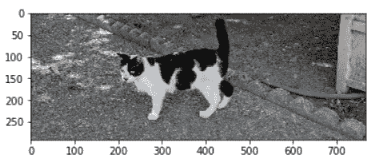

# 作为 Web 端点的模型

> 原文：<https://towardsdatascience.com/models-as-web-endpoints-162cb928a9e6?source=collection_archive---------18----------------------->


Source: [https://www.maxpixel.net/Internet-Hexagon-Icon-Networks-Honeycomb-Hexagons-3143432](https://www.maxpixel.net/Internet-Hexagon-Icon-Networks-Honeycomb-Hexagons-3143432)

## 《生产中的数据科学》摘录

在[生产中的数据科学](https://leanpub.com/ProductionDataScience)的第二章中，我将讨论如何将预测模型设置为 web 端点。这是一项有用的技能，因为它使数据科学家能够从批处理模型应用程序(如输出 CSV 文件)转移到托管其他应用程序可以实时使用的模型。我以前使用 Keras 写过这个过程，但是结果不是一个可伸缩的解决方案。本文的目标是关注 Python 堆栈中可以用来托管预测模型的工具，该模型可以扩展以满足需求。

[](/deploying-keras-deep-learning-models-with-flask-5da4181436a2) [## 使用 Flask 部署 Keras 深度学习模型

### 这篇文章演示了如何使用 Keras 构建的深度学习模型来设置端点以服务于预测。它…

towardsdatascience.com](/deploying-keras-deep-learning-models-with-flask-5da4181436a2) 

在这篇文章中，我将展示如何使用一个简单的 Flask 应用程序，并将其作为服务部署在开放的 web 上，这对于构建数据科学组合非常有用。为了实现这个目标，我们将使用 Gunicorn 和 Heroku。我写这本书的目的之一是展示如何从头开始设置环境，这通常包括在 EC2 上设置一个实例。我已经讨论过在[前一篇文章](/data-science-for-startups-r-python-2ca2cd149c5c)和[书籍样本](http://samples.leanpub.com/ProductionDataScience-sample.pdf)中设置机器。

## 瓶

Flask 是一个多功能的工具，用于使用 Python 构建 web 应用程序和服务。虽然可以直接使用 Flask 创建完整的 web 应用程序，但我通常使用它来创建消费和生成 JSON 响应的端点，而使用[破折号](https://plot.ly/dash/)来创建更多的 UI 应用程序。

在这篇文章中，我们将创建一个返回 JSON 响应的最小服务，如果指定的话，它将回显粘贴的 in `msg`参数。返回的字典包括回显的消息和一个指定消息是否被传递给服务的`success`值。第一步是安装 Flask 和 Gunicorn。

```
pip install flask
pip install gunicorn
```

接下来，我们将创建一个名为 echo.py 的文件，它使用 Flask 来实现这个 echo 功能。这个 web 应用程序的完整代码如下面的代码片段所示。该脚本首先加载 Flask 库，然后实例化一个 Flask 对象。接下来，`@app.route`注释用于定义一个被分配了路由位置和一组 HTTP 方法的函数。在这种情况下，我们在根 URL 处定义函数，`/`。该函数定义了一个用于返回 JSON 响应的 dictionary 对象。该函数使用`request.json`和`request.args`对象检查传入的参数。如果提供了传入的消息，则将它添加到响应字典中，并将成功值设置为 true。最后一步调用应用程序对象上的`run`来启动 Flask 会话。这是我们在直接使用 Flask 作为端点时想要做的事情，而不是在使用 Gunicorn 时。我们将主机设置为`0.0.0.0`来启用远程连接。

```
**# load Flask** import flask
app = flask.Flask(__name__)**# define a predict function as an endpoint** [@app](http://twitter.com/app).route("/", methods=["GET","POST"])
def predict():
    data = {"success": False}

 **# check for passed in parameters**    params = flask.request.json
    if params is None:
        params = flask.request.args

 **# if parameters are found, echo the msg parameter** **if** **"msg"** **in** **params****.keys():**         data["response"] = params.get("msg")
        data["success"] = True

 **# return a response in json format**    return flask.jsonify(data)

**# start the flask app, allow remote connections** if __name__ == '__main__':
    app.run(host='0.0.0.0')
```

我们现在可以使用`python echo.py`运行应用程序。运行该命令的结果如下所示。

```
python3 echo.py
 * Serving Flask app "echo" (lazy loading)
 * Environment: production
   WARNING: This is a development server. 
   Do not use it in a production deployment.
   Use a production WSGI server instead.
 * Debug mode: off
 * Running on [http://0.0.0.0:5000/](http://0.0.0.0:5000/) (Press CTRL+C to quit)
```

您可以使用 web 浏览器或 Python 与服务进行交互。如果使用 AMI 实例，您需要使用机器的公共 IP 并打开端口 5000。该服务可以与 get 和 post 方法一起使用，如下所示。如果您需要向服务发送许多参数，那么 post 方法是生产环境的首选方法。

```
import requestsresult = requests.get("[http://localhost:5000/?msg=Hello](http://52.90.199.190:5000/?msg=Hello) from URL!")
print(result.json())result = requests.get("[http://](http://52.90.199.190:5000/)[localhost](http://52.90.199.190:5000/?msg=Hello)[:5000/](http://52.90.199.190:5000/)",  
                       params = { 'msg': 'Hello from params' })
print(result.json())result = requests.post("[http://localhost:5000/](http://52.90.199.190:5000/)",  
                        json = { 'msg': 'Hello from data' })
print(result.json())
```

该脚本的结果如下所示:

```
{‘response’: ‘Hello from URL!’, ‘success’: True}
{‘response’: ‘Hello from params’, ‘success’: True}
{‘response’: ‘Hello from data’, ‘success’: True}
```

我们现在有了一个可用于托管预测模型的 web 端点，但我们当前的方法无法扩展。开发模式中的 Flask 使用单线程方法，并建议使用 WSGI 服务器来处理生产工作负载。

## 格尼科恩

我们可以使用 Gunicorn 为 Flask 应用程序提供一个 WSGI 服务器。使用 gunicorn 有助于将我们在 Flask 中实现的应用程序的功能与应用程序的部署分开。Gunicorn 是一个轻量级的 WSGI 实现，与 Flask 应用程序配合良好。

直接从使用 Flask 切换到使用 Gunicorn 来运行 web 服务是很简单的。运行应用程序的新命令如下所示。请注意，我们正在传入一个绑定参数来启用到服务的远程连接。

```
gunicorn --bind 0.0.0.0 echo:app
```

命令行上的结果如下所示。与以前的主要区别是，我们现在在端口 8000 而不是端口 5000 上连接服务。如果您想测试服务，您需要在端口 8000 上启用远程访问。

```
gunicorn --bind 0.0.0.0 echo:app
[INFO] Starting gunicorn 19.9.0
[INFO] Listening at: [http://0.0.0.0:8000](http://0.0.0.0:8000) (10310)
[INFO] Using worker: sync
[INFO] Booting worker with pid: 10313
```

同样，我们可以用 Python 测试服务，如下所示。

```
result = requests.get("[http://](http://52.90.199.190:5000/)[localhost](http://52.90.199.190:5000/?msg=Hello)[:8000/](http://52.90.199.190:5000/)",  
                       params = { 'msg': 'Hello from Gunicorn' })
print(result.json())
```

## 赫罗库

现在我们有了一个 gunicorn 应用程序，我们可以使用 [Heroku](https://dashboard.heroku.com/apps) 将它托管在云中。Python 是这种云环境支持的核心语言之一。使用 Heroku 的好处在于，你可以免费托管应用程序，这对于展示数据科学项目来说非常棒。第一步是在网站上建立一个账户:[https://www.heroku.com/](https://www.heroku.com/)

接下来，我们将通过运行如下所示的命令，为 Heroku 设置命令行工具。在 AMI EC2 实例上设置 Heroku 时，可能会有些复杂。这些步骤下载一个版本，提取它，并安装一个附加的依赖项。

```
wget [https://cli-assets.heroku.com/heroku-linux-x64.tar.gz](https://cli-assets.heroku.com/heroku-linux-x64.tar.gz)
unzip heroku-linux-x64.tar.gz
tar xf heroku-linux-x64.tar
sudo yum -y install glibc.i686
/home/ec2-user/heroku/bin/heroku --version
```

最后一步输出安装的 Heroku 版本。我得到了以下输出:`heroku/7.29.0 linux-x64 node-v11.14.0`

接下来，我们将使用 CLI 设置一个新的 Heroku 项目:

```
/home/ec2-user/heroku/bin/heroku login 
/home/ec2-user/heroku/bin/heroku create
```

这将创建一个唯一的应用程序名称，如`obscure-coast-69593`。在部署到生产环境之前，最好在本地测试设置。为了测试设置，您需要安装`django`和`django-heroku`包。

```
pip install --user django
sudo yum install gcc python-setuptools python-devel postgresql-devel
sudo easy_install psycopg2
pip install --user django-heroku
```

要开始设置项目，我们可以从 Heroku 提供的示例 Python 项目开始。

```
sudo yum install git
git clone [https://github.com/heroku/python-getting-started.git](https://github.com/heroku/python-getting-started.git)
cd python-getting-started
```

接下来，我们将对项目进行更改。我们将我们的 echo.py 文件复制到目录中，将 Flask 添加到 requirements.txt 文件的依赖项列表中，覆盖在 Procfile 中运行的命令，然后调用`heroku local`在本地测试配置。

```
cp ../echo.py echo.py 
echo 'flask' >> requirements.txt
echo "web: gunicorn echo:app" > Procfile
/home/ec2-user/heroku/bin/heroku local
```

您应该会看到如下所示的结果:

```
/home/ec2-user/heroku/bin/heroku local
[OKAY] Loaded ENV .env File as KEY=VALUE Format
[INFO] Starting gunicorn 19.9.0
[INFO] Listening at: [http://0.0.0.0:5000](http://0.0.0.0:5000) (10485) 
[INFO] Using worker: sync
[INFO] Booting worker with pid: 10488
```

和以前一样，我们可以使用浏览器或 Python 调用来测试端点，如下所示。在测试配置中，默认情况下使用端口 5000。

```
result = requests.get("[http://](http://52.90.199.190:5000/)[localhost](http://52.90.199.190:5000/?msg=Hello)[:5000/](http://52.90.199.190:5000/)",  
                      params = { 'msg': 'Hello from Heroku Local' })
print(result.json())
```

最后一步是将服务部署到生产环境中。git 命令用于将结果推送到 Heroku，Heroku 会自动发布应用程序的新版本。最后一个命令告诉 Heroku 扩展到单个工人，这是免费的。

```
git add echo.py
git commit . 
git push heroku master
/home/ec2-user/heroku/bin/heroku ps:scale web=1
```

现在我们可以调用端点，它有一个正确的 URL，是安全的，可以用来公开共享数据科学项目。

```
result = requests.get("[https://obscure-coast-69593.herokuapp.com](https://obscure-coast-69593.herokuapp.com)",  
                      params = { 'msg': 'Hello from Heroku Prod' })
print(result.json())
```

我想展示的最后一步是将图像传递到这个端点的能力，这在构建深度学习模型时是一项有用的任务。下面的代码使用 Python 图像库将图像编码为字符串，将结果传递给 echo 服务，然后使用 matplotlib 呈现结果。

```
import matplotlib.pyplot as plt
import numpy as np
from PIL import Image
import io
import base64image = open("luna.png", "rb").read()
encoded = base64.b64encode(image)
result = requests.get("[https://obscure-coast-69593.herokuapp.com](https://obscure-coast-69593.herokuapp.com)", json = {'msg': encoded})encoded = result.json()['response']
imgData = base64.b64decode(encoded)
plt.imshow( np.array(Image.open(io.BytesIO(imgData)) ))
```

结果如下图所示。我们能够对我姻亲的猫的图像进行编码，将其发送到 echo 服务，并呈现返回的图像。这种方法可以用来建立图像分类器作为网络端点。



## **结论**

这篇文章展示了如何使用 Heroku 将 Flask web 应用程序部署到生产环境中。虽然该应用程序是一个简单的 echo 服务，但它确实提供了构建更复杂应用程序所需的脚手架，例如使用 Keras 来识别图像中是否包含猫或狗。下一次，我将介绍使用 AWS Lambda 和 Google Cloud 函数作为构建可伸缩模型端点的替代方法。

[本·韦伯](https://www.linkedin.com/in/ben-weber-3b87482/)是 Zynga 杰出的数据科学家。我们正在[招聘](https://www.zynga.com/job-listing-category/data-analytics-user-research/)！