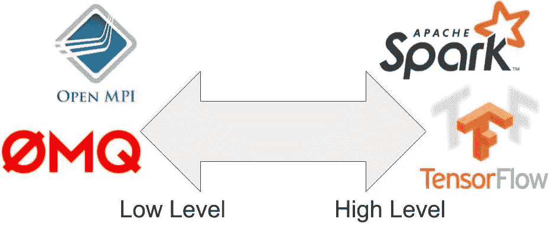
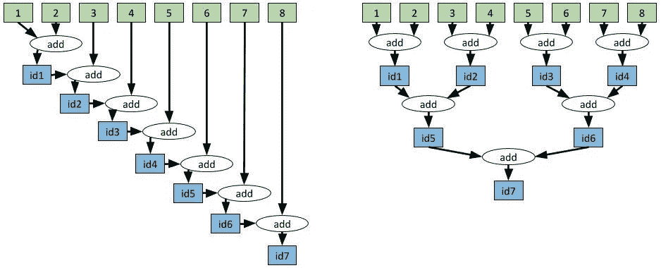

# 现代并行和分布式 Python:Ray 快速教程

> 原文：<https://towardsdatascience.com/modern-parallel-and-distributed-python-a-quick-tutorial-on-ray-99f8d70369b8?source=collection_archive---------4----------------------->

## 一个快速、简单的分布式应用框架

[*Ray*](https://ray.io/) *是并行分布式 Python 的开源项目。*

并行和分布式计算是现代应用的主要内容。我们需要利用多个内核或多台机器来加速应用程序或大规模运行它们。用于抓取网络和响应搜索查询的基础设施不是在某人的笔记本电脑上运行的单线程程序，而是相互通信和交互的服务集合。

The cloud promises unlimited scalability in all directions (memory, compute, storage, etc). Realizing this promise requires new tools for programming the cloud and building distributed applications.

这篇文章将描述如何使用 [**Ray**](https://github.com/ray-project/ray) 轻松构建可以从笔记本电脑扩展到大型集群的应用程序。

# 为什么是雷？

很多教程解释了如何使用 Python 的[多处理模块](https://docs.python.org/2/library/multiprocessing.html)。不幸的是，多处理模块在处理现代应用需求的能力上受到严重限制。这些要求包括以下内容:

*   在多台机器上运行相同的代码。
*   构建[微服务](https://en.wikipedia.org/wiki/Microservices)和[参与者](https://en.wikipedia.org/wiki/Actor_model)有状态并能通信。
*   优雅地处理[机器故障](https://en.wikipedia.org/wiki/Fault_tolerance)。
*   高效处理[大型对象和数值数据](https://ray-project.github.io/2017/10/15/fast-python-serialization-with-ray-and-arrow.html)。

雷解决了所有这些问题，让简单的事情变得简单，让复杂的行为成为可能。

# 必要的概念

传统编程依赖于两个核心概念:**函数**和**类**。使用这些构建模块，编程语言允许我们构建无数的应用程序。

然而，当我们将应用程序迁移到分布式环境时，概念通常会发生变化。

一方面，我们有像 [OpenMPI](https://www.open-mpi.org/) 、 [Python 多处理](https://docs.python.org/2/library/multiprocessing.html)和 [ZeroMQ](http://zeromq.org/) 这样的工具，它们提供了发送和接收消息的底层原语。这些工具非常强大，但它们提供了不同的抽象，因此单线程应用程序必须从头开始重写才能使用它们。

另一方面，我们有特定领域的工具，如用于模型训练的 [TensorFlow](https://www.tensorflow.org/) ，用于数据处理和 SQL 的 [Spark](https://spark.apache.org/) ，以及用于流处理的 [Flink](https://flink.apache.org/) 。这些工具提供了更高层次的抽象，如神经网络、数据集和流。然而，因为它们不同于串行编程所用的抽象，所以应用程序必须从头开始重新编写才能利用它们。

Tools for distributed computing on an axis from low-level primitives to high-level abstractions.

[雷](https://github.com/ray-project/ray)占据了独特的中间地带。而不是引入新的概念。Ray 采用现有的**函数**和**类**的概念，并将它们作为**任务**和**角色**翻译到分布式设置中。这种 API 选择允许串行应用并行化，而无需重大修改。

# 起始光线

`ray.init()`命令启动所有相关的光线过程。在集群上，这是唯一需要更改的行(我们需要传入集群地址)。这些流程包括以下内容:

*   并行执行 Python 函数的多个工作进程(大约每个 CPU 内核一个工作进程)。
*   将“任务”分配给工人(和其他机器)的调度程序。任务是由 Ray 调度的工作单元，对应于一个函数调用或方法调用。
*   一个[共享内存对象存储库](https://arrow.apache.org/docs/python/plasma.html)，用于在工作人员之间高效地共享对象(无需创建副本)。
*   一个内存数据库，用于存储在机器出现故障时重新运行任务所需的元数据。

与线程相反，Ray workers 是独立的进程，因为由于[全局解释器锁](https://wiki.python.org/moin/GlobalInterpreterLock)，Python 中对多线程的支持非常有限。

# 任务并行

为了将 Python 函数`f`转换成“远程函数”(一个可以远程异步执行的函数)，我们用`@ray.remote`装饰器声明该函数。然后通过`f.remote()`的函数调用将立即返回 future(一个 [future](https://en.wikipedia.org/wiki/Futures_and_promises) 是对最终输出的引用)，实际的函数执行将在后台进行(我们将这个执行称为**任务**)。

Code for running parallel tasks in Python.

因为对`f.remote(i)`的调用会立即返回，所以只需运行那行代码四次，就可以并行执行`f`的四个副本。

**任务相关性**

任务也可以依赖于其他任务。下面,`multiply_matrices`任务使用两个`create_matrix`任务的输出，所以直到前两个任务执行完之后它才会开始执行。前两个任务的输出将自动作为参数传递给第三个任务，未来将被替换为它们相应的值)。以这种方式，任务可以与任意的 [DAG](https://en.wikipedia.org/wiki/Directed_acyclic_graph) 依赖项组合在一起。

Code illustrating three tasks, where the third task depends on the outputs of the first two.

**有效地聚合值**

任务相关性可以用更复杂的方式来使用。例如，假设我们希望将 8 个值聚合在一起。这个例子使用了整数加法，但是在许多应用程序中，在多台机器上聚合大向量可能是一个瓶颈。在这种情况下，更改一行代码就可以将聚合的运行时间从线性聚合更改为对数聚合。

The dependency graph on the left has depth 7\. The dependency graph on the right has depth 3\. The computations yield the same result, but the one on the right is much faster.

如上所述，要将一个任务的输出作为后续任务的输入，只需将第一个任务返回的未来作为参数传递给第二个任务。Ray 的调度程序会自动考虑这种任务依赖性。在第一个任务完成之前，第二个任务不会执行，第一个任务的输出会自动发送到正在执行第二个任务的机器上。

Code for aggregating values in a linear fashion versus in a tree-structured fashion.

上面的代码非常清晰，但是请注意，这两种方法都可以使用`while`循环以更简洁的方式实现。

A more concise implementation of the two aggregation schemes. The only difference between the two blocks of code is whether the output of “add.remote” is placed at the front or the back of the list.

# 从班级到演员

在不使用类的情况下编写有趣的应用程序是很有挑战性的，这在分布式环境下和在单核环境下都是如此。

Ray 允许你获取一个 Python 类并用`@ray.remote` decorator 声明它。每当实例化该类时，Ray 都会创建一个新的“actor ”,它是一个在集群中某个地方运行的进程，并保存着该对象的副本。对该角色的方法调用变成了在角色进程上运行的任务，并且可以访问和改变角色的状态。以这种方式，参与者允许在多个任务之间共享可变状态，而远程函数不能。

个体参与者串行执行方法(每个个体方法都是原子的)，因此不存在竞争条件。并行可以通过创建多个参与者来实现。

Code example for instantiating a Python class as an actor.

上面的例子是 actors 最简单的用法。第`Counter.remote()`行创建了一个新的 actor 进程，它有一个`Counter`对象的副本。对`c.get_value.remote()`和`c.inc.remote()`的调用在远程角色进程上执行任务，并改变角色的状态。

**演员处理**

在上面的例子中，我们只调用了主 Python 脚本中 actor 的方法。actor 最强大的方面之一是我们可以*将句柄传递给 actor* ，这允许其他 actor 或其他任务调用同一个 actor 上的所有方法。

以下示例创建了一个存储消息的执行元。几个 worker 任务重复地将消息推送到 actor，主 Python 脚本定期读取消息。

Code for invoking methods on an actor from multiple concurrent tasks.

演员是极其厉害的。它们允许您获取一个 Python 类，并将其实例化为一个微服务，可以从其他参与者和任务甚至其他应用程序查询该微服务。

任务和参与者是 Ray 提供的核心抽象。这两个概念非常通用，可以用来实现复杂的应用程序，包括 Ray 的内置库，用于[强化学习](https://docs.ray.io/en/latest/rllib/index.html)、[超参数调整](https://ray.readthedocs.io/en/latest/tune.html)、[加速熊猫](https://github.com/modin-project/modin)等等。

# 了解更多关于 Ray 的信息

*   查看 [GitHub](https://github.com/ray-project/ray) 上的代码。
*   查看[射线文档](https://docs.ray.io/en/master/index.html)。
*   在[射线论坛](https://discuss.ray.io/)上问答。
*   查看用 Ray 构建的库进行[缩放强化学习](https://docs.ray.io/en/latest/rllib/index.html)、[缩放超参数调优](https://docs.ray.io/en/master/tune/index.html)、[缩放模型服务](https://docs.ray.io/en/master/serve/index.html)、[缩放数据处理](https://docs.ray.io/en/master/data/dask-on-ray.html)。