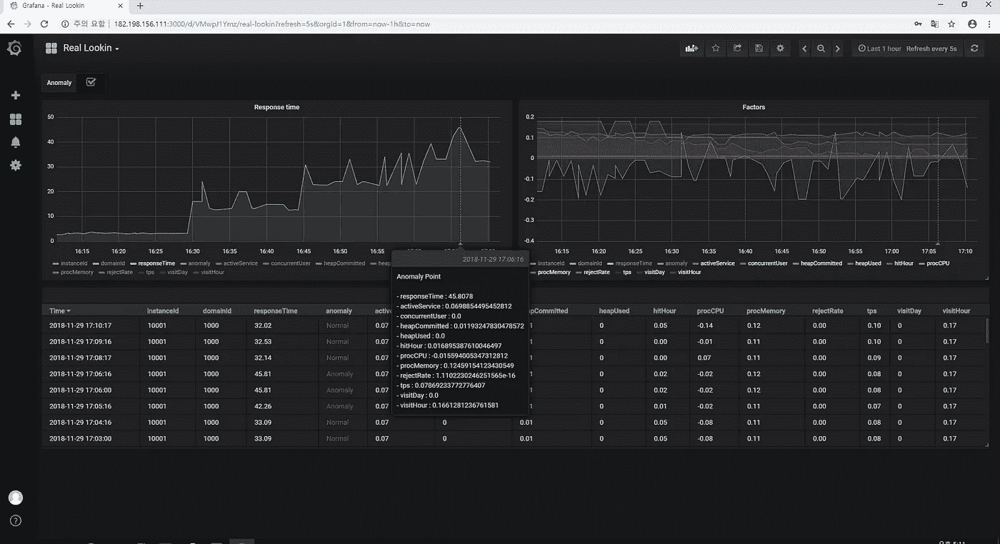

# 通过将时序数据库与机器学习相结合，实现 IT 基础设施监控的现代化

> 原文：<https://towardsdatascience.com/modernize-your-it-infrastructure-monitoring-by-combining-time-series-databases-with-machine-447bb9e9cd35?source=collection_archive---------34----------------------->

让我们探讨一下 IT 基础设施的复杂性和脆弱性，以及如何使用时间序列数据库和机器学习的组合来构建现代 IT 基础设施监控解决方案。

# **IT 基础设施:复杂而脆弱**

iCloud 最近加入了谷歌、脸书、亚马逊等遭遇大规模云中断的主要公司的行列。查看 ZDNet 的[系列文章](https://www.zdnet.com/search/?q=cloud+outages)详细描述了断电情况。此次中断导致 YouTube、Snapchat 和 Gmail 等网站中断。

iCloud 的失败也影响了他们所有的第三方应用和 ApplePay，响彻全球。我们已经很快接受了云，认为它比内部基础设施更有弹性，所以这个消息发人深省。它还显示了 It 基础架构的脆弱性，包括基于云的基础架构和内部基础架构，这些基础架构为我们依赖软件的世界提供了动力，这个世界现在包括娱乐和个人以及专业联系。

IT 基础设施包含所有相关组件，包括网络、安全、存储、操作系统、集线器链接和计算机。每个组件都有许多子组件，如内存、中央处理器等。除此之外，云的采用和虚拟化增加了复杂性。软件定义的网络可以快速自动地更改基础架构，这使得跟踪哪个工作负载驻留在哪个虚拟机上以及将它们与物理服务器相关联变得更加困难。测量一台机器在任何给定时刻的性能影响都是一个严峻的挑战！

在这个数字时代，公司(和人！)依赖于良好的基础设施来支持其关键功能，如通信、融资等。停机时间对企业来说代价高昂且具有破坏性。这增加了各种规模的公司重新考虑其基础设施监控策略的压力。您如何有效地监控随着业务增长而不断扩展的分散 IT 组件？

# **利用时序数据库和机器学习进行预测性基础设施监控**

当前的监控工具通常是特定于供应商的孤立工具，缺乏对整个基础架构环境的全面了解。随着数据量和数据种类的不断增长，它们可能会产生瓶颈和盲点。这些挑战需要一种新的设计，一种为分布式计算、数据收集和大规模并行处理而构建的设计，一种可以从历史中学习并预测停机时间的设计。

设计支持预测分析的现代 IT 基础设施监控平台的构建模块包括以下多步流程:

1.  **数据采集和预处理:**

a.**从各种来源实时收集**数据，包括系统日志、网络流量日志、事件日志以及吞吐量、IOPS 和延迟等指标。
这一步很有挑战性，因为应用程序会生成各种格式的数据，以不同的频率存储数据，而且获取数据的 API 也因应用程序而异。您将需要一个支持大规模数据收集的框架，支持多种协议和数据格式。像 [Nuclio](http://nuclio.io) 、 [OpenFaas](https://www.openfaas.com/) 、 [AWS Lambda](https://aws.amazon.com/lambda/) 、 [Azure Functions](https://azure.microsoft.com/en-in/services/functions/) 等事件驱动框架通过处理数据收集所需的所有操作性繁重工作来应对这些挑战。请记住，除了实时数据之外，还需要为查找表(如设备表)连续收集批量数据。

b.**动态丰富**数据，为更快的分析准备数据，并通过利用外部数据源提供更多见解。这需要一个非常快速的机制来运行实时流数据和额外的数据集连接，同时保持每秒数百万个事件。

c.**在时序数据库中存储**大量时序数据(TSDB)。当每秒钟的事件数量很大时，这种方法特别有效。数据是不可变的，记录是插入的，而不是更新的，为系统中的每次更改创建一个新行。TSDBs 是处理大量实时数据的有效解决方案，还提供了针对基于时间的查询而优化的查询引擎。也就是说，并非所有数据都应该存储在 TSDB 中。客户通常有用于数据丰富的查找表，并且需要在两种格式之间连接数据。在这些情况下，将查找表存储在关系表或键值表结构中更有意义，同时为键访问优化实时运行的连接，以便保持负载。

**2。浏览数据** 你可以用各种方式浏览数据。使用 Prometheus(流行的开源 TSDB)来利用其查询引擎进行基于时间的查询是非常常见的。然而，Prometheus 不可扩展，无法存储或分析大型数据集。需要具有可扩展数据层的分布式数据平台来应对这些挑战，在使用 Prometheus 接口的同时存储和分析数据。然后，您可以使用可视化工具在 Prometheus 上生成交互式报告(例如 Grafana)。

**3。使用 ML:** 获得可行的见解最终目标是获得服务于业务需求的见解。传统上，这是通过基于规则(例如基于规则)的工具来实现的，这些工具根据特定的事件集触发警报和事件。例如，如果 5 分钟时间范围内的平均温度超过某个阈值，则通知管理员。但客户正在寻找更先进的机器学习和预测分析解决方案，这些解决方案可以根据大量指标来识别异常，以找到相关性。虽然机器学习和预测分析支持的不仅仅是基于规则的系统，但企业仍然面临着涉及规模和性能的运营挑战。

这听起来很复杂吗？对我们来说幸运的是，有些人提前考虑了现代解决方案。今天的端到端数据科学平台使得创建您自己的智能解决方案的过程变得更加容易。强大的数据科学平台，如 [Iguazio](http://www.iguazio.com) ，提供集成工具来设计您自己的实时基础设施监控解决方案，这种解决方案超越了传统的反应式 TSDB。

能够监控现代 IT 基础设施的数据科学平台将提供:

●复杂的实时预测

●关联时序数据、运行算法、生成交互式仪表盘和行动建议的工具

●强劲的 TSDB 发动机，兼容普罗米修斯和其他流行的 TSDB API

●在云中、内部或边缘运行的多功能性

●用户可以不受限制地灵活使用喜爱的分析框架(如 Spark)或仪表板工具(如 Grafana)

●以更便宜、简化的方式容纳大量数据并添加相关历史数据

●支持多种数据模型

●在不损害隐私和数据管理的情况下实现安全数据共享；使用身份验证、数据安全、“暗站点”和离线部署

云中断的混乱消息强调了为您的 IT 基础设施制定复杂的监控策略的重要性。一篇[商业内幕文章](https://www.businessinsider.com/google-cloud-outage-could-undercut-reliability-uptime-2019-6)暗示谷歌高调的停机将影响他们的市场份额。谷歌在可靠性上推销自己，这次中断可能会让该公司落后于其劲敌亚马逊和微软。