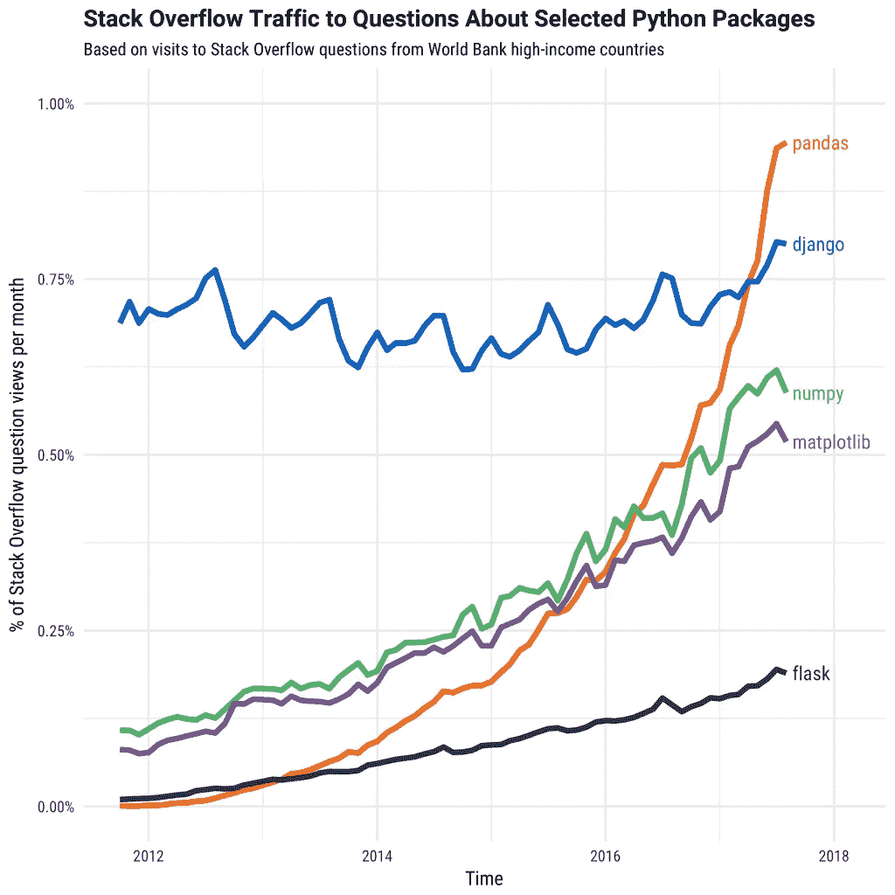
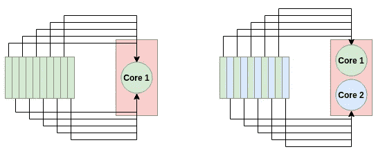
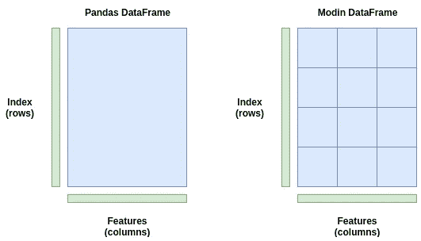

# 摩丁:通过改变一行代码来加速你的熊猫功能

> 原文：<https://towardsdatascience.com/modin-accelerating-your-pandas-functions-by-changing-one-line-of-code-504c39b5ddbc?source=collection_archive---------16----------------------->

> 想获得灵感？快来加入我的 [**超级行情快讯**](https://www.superquotes.co/?utm_source=mediumtech&utm_medium=web&utm_campaign=sharing) 。😎

[Pandas](https://pandas.pydata.org/) 是用 Python 处理数据的首选库。在处理不同类型和大小的数据时，它易于使用并且非常灵活。它有大量不同的功能，使得处理数据变得轻而易举。



Popularity of various Python packages over time. [Source](https://stackoverflow.blog/2017/09/14/python-growing-quickly/)

但是有一个缺点:Pandas 对于大型数据集来说速度很慢。

默认情况下，Pandas 使用单个 CPU 内核作为单个进程执行其功能。这对于较小的数据集来说很好，因为您可能不会注意到速度上的很大差异。但是，随着数据集越来越大，要进行的计算越来越多，当只使用单核时，速度开始受到严重影响。它一次只对一个可能有*百万*甚至*十亿*行的数据集进行一次计算。

然而，大多数为数据科学制造的现代机器至少有两个 CPU 内核。这意味着，以 2 个 CPU 内核为例，当使用 Pandas 时，默认情况下，50%或更多的计算机处理能力不会做任何事情。当您使用 4 核(现代英特尔 i5)或 6 核(现代英特尔 i7)时，情况会变得更糟。熊猫的设计根本就不能有效利用这种计算能力。

[Modin](https://github.com/modin-project/modin) 是一个新的库，旨在通过在**系统的所有可用 CPU 核心**之间自动分配计算来加速 Pandas。有了它，摩丁声称能够让任何大小的熊猫数据帧的系统上的 CPU 核心数接近线性加速。

让我们看看它是如何工作的，并浏览几个代码示例。

# 摩丁是如何与熊猫进行并行处理的

给定 Pandas 中的数据帧，我们的目标是以最快的方式对其执行某种计算或处理。这可能是用`.mean()`取每一列的平均值，用`groupby`分组数据，用`drop_duplicates()`删除所有重复项，或者任何其他内置的熊猫函数。

在上一节中，我们提到了 Pandas 如何只使用一个 CPU 内核进行处理。自然，这是一个很大的瓶颈，特别是对于较大的数据帧，资源的缺乏会真正显现出来。

理论上，并行化计算就像在每个可用 CPU 内核的不同数据点上应用该计算一样简单。对于 Pandas 数据帧，一个基本的想法是将数据帧分成几个部分，你有多少个 CPU 核就有多少个部分，让每个 CPU 核在它自己的部分上运行计算。最后，我们可以汇总结果，这是一个计算量很小的操作。



How a multi-core system can process data faster. For a single-core process (left), all 10 tasks go to a single node. For the dual-core process (right), each node takes on 5 tasks, thereby doubling the processing speed

这正是摩丁所做的。它将你的数据帧分割成不同的部分，这样每个部分都可以发送到不同的 CPU 内核。Modin 在*行*和*列*上划分数据帧。这使得摩丁的并行处理[可以扩展到任何形状的数据帧](https://modin.readthedocs.io/en/latest/architecture.html#dataframe-partitioning)。

想象一下，如果给你一个多列少行的数据帧。有些库只执行跨行的分区，在这种情况下效率会很低，因为我们的列比行多。但是对于 Modin，由于分区是在两个维度上完成的，所以并行处理对于所有形状的数据帧都是有效的，无论它们是更宽(许多列)、更长(许多行)，还是两者都是。



A Pandas DataFrame (left) is stored as one block and is only sent to one CPU core. A Modin DataFrame (right) is partitioned across rows and columns, and each partition can be sent to a different CPU core up to the max cores in the system

上图是一个简单的例子。Modin 实际上使用了一个*分区管理器*，它可以根据操作类型改变分区的大小和形状。例如，可能有一个操作需要整行或整列。在这种情况下，[分区管理器](https://modin.readthedocs.io/en/latest/architecture.html#partition-manager)将以它能找到的最佳方式执行分区并分配给 CPU 内核。它很灵活。

为了执行并行处理，摩丁可以使用 Dask 或者 Ray。它们都是带有 Python APIs 的并行计算库，你可以选择其中一个在运行时与 Modin 一起使用。Ray 将是目前最安全的，因为它更稳定 Dask 后端是实验性的。

但是，嘿，这是足够的理论。让我们来看看代码和速度基准！

# 基准测试摩丁速度

安装和运行 Modin 最简单的方法是通过 pip。以下命令安装 Modin、Ray 和所有相关的依赖项:

```
pip install modin[ray]
```

对于我们下面的例子和基准，我们将使用 Kaggle 的 [*CS:GO 竞争匹配数据*](https://www.kaggle.com/skihikingkevin/csgo-matchmaking-damage) 。CSV 的每一行都包含关于 CS:GO 比赛中一轮比赛的数据。

我们将坚持使用目前最大的 CSV 文件(有几个)进行实验，名为`esea_master_dmg_demos.part1.csv`，1.2GB。有了这样的大小，我们应该能够看到熊猫如何变慢，以及摩丁如何帮助我们。对于测试，我将使用一个[i7–8700k CPU](https://ark.intel.com/content/www/us/en/ark/products/126684/intel-core-i7-8700k-processor-12m-cache-up-to-4-70-ghz.html)，它有 6 个物理内核和 12 个线程。

我们要做的第一个测试就是用我们的好工具`read_csv()`简单地读取数据。熊猫和摩丁的密码完全一样。

为了测量速度，我导入了`time`模块，并在`read_csv()`前后放了一个`time.time()`。结果，熊猫从 CSV 加载数据到内存用了 8.38 秒，而摩丁用了 3.22 秒。这是 2.6 倍的加速。对于仅仅改变导入语句来说，这还不算太糟糕！

让我们在数据帧上做几个更复杂的处理。在 Pandas 中，连接多个数据帧是一个常见的操作——我们可能有几个或更多包含我们的数据的 CSV 文件，然后我们必须一次读取一个并进行连接。我们可以通过熊猫和摩丁中的`pd.concat()`函数轻松做到这一点。

我们希望 Modin 能很好地处理这种操作，因为它处理了大量的数据。代码如下所示。

在上面的代码中，我们将数据帧连接了 5 次。熊猫能够在 3.56 秒内完成拼接操作，而摩丁在 0.041 秒内完成，加速 86.83 倍！虽然我们只有 6 个 CPU 内核，但数据帧的分区对速度有很大帮助。

常用于数据帧清理的 Pandas 函数是`.fillna()`函数。此函数查找数据帧中的所有 NaN 值，并用您选择的值替换它们。那里有很多行动。Pandas 必须遍历每一行和每一列来找到 NaN 值并替换它们。这是一个应用摩丁的绝佳机会，因为我们正在多次重复一个非常简单的操作。

这一次，熊猫用了 1.8 秒跑完了`.fillna()`，而摩丁用了 0.21 秒，加速了 8.57 倍！

# 警告和最终基准

所以摩丁总是这么快吗？

嗯，不总是这样。

在某些情况下，Pandas 实际上比 Modin 更快，即使在这个具有 5，992，097(近 600 万)行的大数据集上。下表显示了我进行的一些实验中熊猫和摩丁的运行时间。

正如你所看到的，在一些操作中，Modin 的速度明显更快，通常是读入数据和查找值。熊猫的其他操作，如执行统计计算要快得多。

# 使用摩丁的实用技巧

摩丁仍然是一个相当年轻的图书馆，并在不断发展和扩大。因此，熊猫的所有功能还没有完全加速。如果你尝试使用一个尚未加速的函数，它将默认为 Pandas，这样就不会有任何代码错误。关于 Modin 支持的 Pandas 方法的完整列表，请参见本页。

默认情况下，Modin 将使用机器上所有可用的 CPU 内核。在某些情况下，您可能希望限制 Modin 可以使用的 CPU 内核的数量，特别是如果您希望在其他地方使用该计算能力。我们可以通过 Ray 中的初始化设置来限制 Modin 可以访问的 CPU 内核的数量，因为 Modin 在后端使用它。

```
import ray
ray.init(num_cpus=4)
import modin.pandas as pd
```

处理大数据时，数据集的大小超过系统内存(RAM)的情况并不少见。摩丁有一个特定的标志，我们可以设置为`true`，这将使其*脱离核心*模式。核心外基本上意味着 Modin 将使用您的磁盘作为内存的溢出存储，允许您处理远远大于 RAM 大小的数据集。我们可以设置以下环境变量来启用此功能:

```
export MODIN_OUT_OF_CORE=true
```

# 结论

所以你有它！使用摩丁加速熊猫功能指南。这很容易做到，只需修改导入语句。希望你发现摩丁至少在一些情况下对加速你的熊猫功能是有用的。

# 喜欢学习？

在推特[上关注我，我会在这里发布所有最新最棒的人工智能、技术和科学！也请在 LinkedIn](https://twitter.com/GeorgeSeif94)[上与我保持联系！](https://www.linkedin.com/in/georgeseif/)