# 分子性质:多元线性回归之旅

> 原文：<https://towardsdatascience.com/molecular-properties-a-journey-through-multiple-linear-regression-1a1043c7de25?source=collection_archive---------28----------------------->

## 这是我对分子性质的 [Kaggle 竞赛的版本。目标是使用各种可用的特征来预测标量耦合常数。](https://www.kaggle.com/c/champs-scalar-coupling)

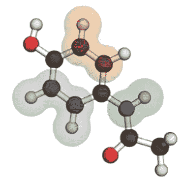

[Source](https://www.kaggle.com/c/champs-scalar-coupling)

自从完成我的数据科学训练营以来，我还没有做过包含我所学内容的个人项目。在看到 Kaggle 比赛和我对生物的热爱后，我决定尝试一下。不幸的是，当时我对自己在时限内完成比赛的能力没有信心，所以我只是下载并开始一点一点地工作，试图更好地理解这个过程。我在这里发表了多篇关于这些过程的文章。这些文章可以在下面找到:

> [机器学习前的步骤](https://medium.com/@imamun/steps-before-machine-learning-417a2812a1cc)
> 
> [LGBM 和特征提取](https://medium.com/@imamun/lgbm-and-feature-extraction-ae87fe83ea77)
> 
> [所选特征的线性回归](https://medium.com/@imamun/linear-regression-of-selected-features-132cc6c4b600)
> 
> [为线性回归选择合适的 MLA](/picking-the-proper-mla-for-linear-regression-4221ea5a8f2e)

以上四篇文章概括了我解决这个问题的每一种不同的方法。在上一篇文章之后，我决定休息一会儿，然后回来从一个新的角度看这个项目。我还使用了其他一些不同的方法，但我将只关注[最终笔记本](https://github.com/imamun93/Molecular_Properties/blob/master/KaggleSet.ipynb)并在此介绍整个过程。为了理解这个过程，我建议你通读上面的文章。它们都是短文，通读它们不应该超过半小时。

现在让我们开始加载我将使用的所有库:

```
**import** **pandas** **as** **pd**
**import** **numpy** **as** **np**
**import** **matplotlib.pyplot** **as** **plt**
%matplotlib inline
**import** **networkx** **as** **nx**
**import** **seaborn** **as** **sns**
**from** **sklearn** **import** preprocessing, tree
**from** **sklearn.ensemble** **import** RandomForestRegressor
**from** **sklearn.model_selection** **import** cross_validate, cross_val_score, GridSearchCV
**from** **sklearn.linear_model** **import** LinearRegression, Ridge, Lasso
**import** **lightgbm**
**from** **sklearn.model_selection** **import** KFold
**from** **sklearn** **import** linear_model
**from** **sklearn.model_selection** **import** train_test_split
**from** **keras.models** **import** Sequential
**from** **keras.layers** **import** Dense
**from** **keras** **import** optimizers
**import** **keras**
**import** **warnings**
warnings.filterwarnings('ignore')
```

然后让我们加载库，看看一些基本的统计数据:

```
df= pd.read_csv('molecule_complete.csv')

df.columns #the names of all the columnsIndex(['molecule_name', 'atom_index_0', 'atom_index_1', 'type',
       'scalar_coupling_constant', 'potential_energy', 'X', 'Y', 'Z',
       'XX_atom1', 'YX_atom1', 'ZX_atom1', 'XY_atom1', 'YY_atom1', 'ZY_atom1',
       'XZ_atom1', 'YZ_atom1', 'ZZ_atom1', 'XX', 'YX', 'ZX', 'XY', 'YY', 'ZY',
       'XZ', 'YZ', 'ZZ', 'mulliken_charge_atom1', 'mulliken_charge',
       'type_scc', 'fc', 'sd', 'pso', 'dso', 'atom_atom1_structure',
       'x_atom1_structure', 'y_atom1_structure', 'z_atom1_structure', 'atom',
       'x', 'y', 'z'],
      dtype='object')df.select_dtypes(include=[object]) #this shows the categorical variables
```

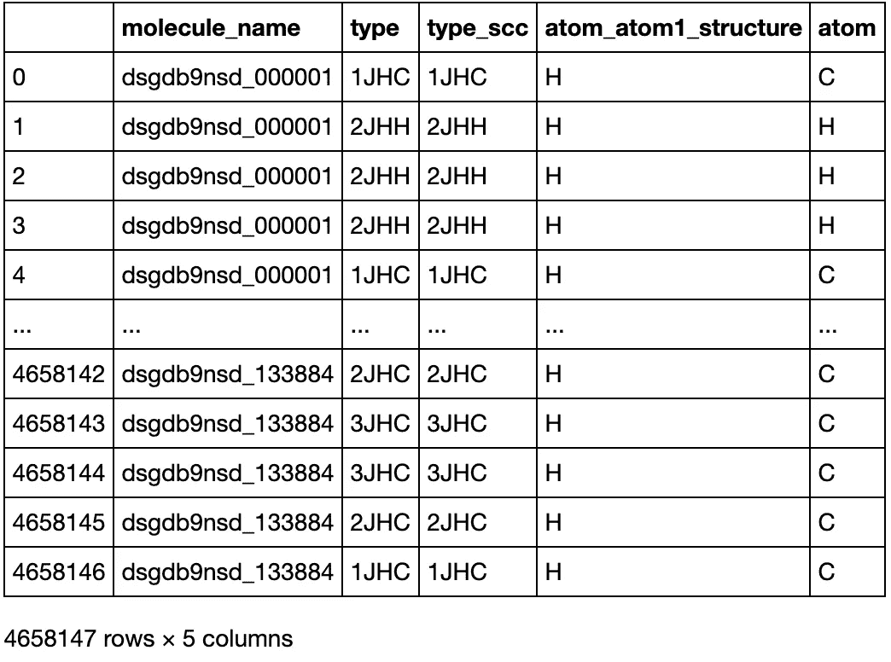

The categorical variables among the features

现在来看一些图片。这要感谢 Kaggle 的竞争对手安德鲁:

```
fig, ax = plt.subplots(figsize = (20, 12)) **for** i, t **in** enumerate(df[‘type’].unique()): df_type = df.loc[df[‘type’] == t] G = nx.from_pandas_edgelist(df_type, ‘atom_index_0’, ‘atom_index_1’, [‘scalar_coupling_constant’]) plt.subplot(2, 4, i + 1); nx.draw(G, with_labels=**True**); plt.title(f’Graph for type **{t}**’)
```

这有助于创建与标量耦合常数相关的所有分类变量的网络图。我还为 *fc、muliken_charge、pso、sd* 和 *dso* 创建了更多的关系图，因为它们也被确定为我之前工作中的重要特性。

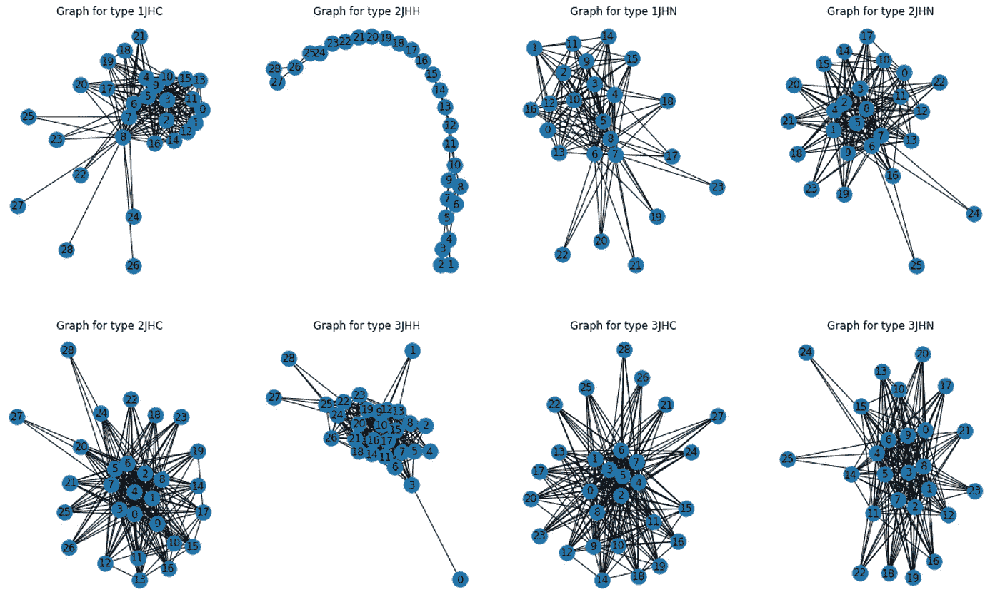

This is just for the Scalar Constant. The rest of the graph can be found in the final notebook linked above

这可能有点难以解释。然而，我们看到一些类型更多地聚集在一起，而其他类型如 2JHH 与标量形成了相当独特的关系。使用 Tableau Visual 有一个稍微好一点的方法来可视化每种类型对目标原子的影响:

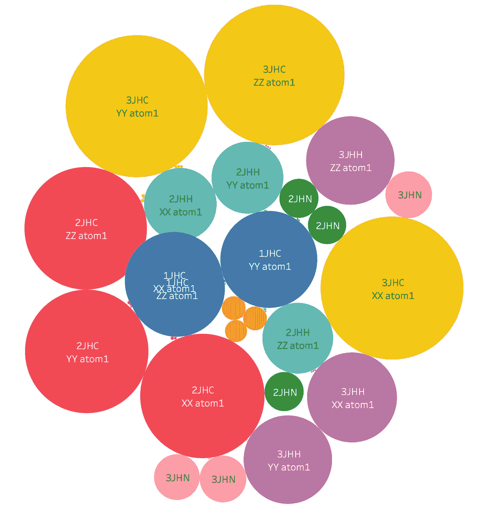

This shows how much weight each atom type has on different atoms.

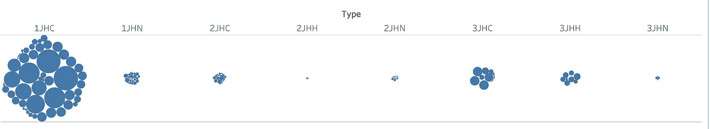

While this shows how many times each type shows up altogether.

结合上面两张图片，我们可以理解为什么 2JHH 具有如此独特的图式，而像 1JHC 和 3JHC 这样的原子是相似的，并且更加聚集在一起。现在让我们使用类型和标量常数创建一个标量常数库和一个 violin 图:

```
#this was done for all important features from the LGBM feature extraction model, but I will only show scalar here. 
fig, ax = plt.subplots(figsize = (18, 6))
plt.subplot(1, 2, 1);
plt.hist(df['scalar_coupling_constant'], bins=20);
plt.title('Basic scalar_coupling_constant histogram');
plt.subplot(1, 2, 2);
sns.violinplot(x='type', y='scalar_coupling_constant', data=df);
plt.title('Violinplot of scalar_coupling_constant by type');
```

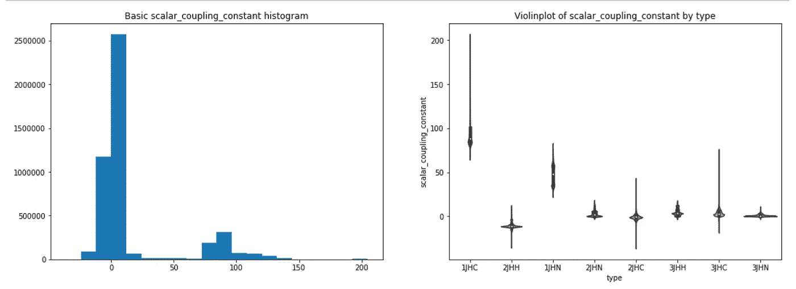

The bin shows most scalar numbers are rather small. The violin plot however shows another great visual on how each type plays a critical role on our target variables

在此之后，我使用 LabelEncoder 将所有分类变量转换为虚拟变量，创建一个训练和测试集，最后运行 sci-kit learn 的 train-test-split。

```
**for** f **in** ['type', 'type_scc', 'atom_atom1_structure', 'atom']:
    lbl = preprocessing.LabelEncoder()
    lbl.fit(list(df[f].values))
    df[f] = lbl.transform(list(df[f].values))train= df.drop(['molecule_name', 'scalar_coupling_constant'], axis=1)
test= df['scalar_coupling_constant']feature_train, feature_test, target_train, target_test= train_test_split(train, test, test_size=0.12)
```

这给了我以下信息:

```
total feature training features:  4099169
total feature testing features:  558978
total target training features:  4099169
total target testing features:  558978
```

在我以前的模型中，我没有使用任何分类变量。因此，我决定再次运行 LGBM 模型，但包括虚拟变量:

```
train_data = lightgbm.Dataset(feature_train, label=target_train)
test_data = lightgbm.Dataset(feature_test, label=target_test)#Create some parameters:

n_fold = 7 folds = KFold(n_splits=n_fold, shuffle=**True**, random_state=4) #The formatting below is a bit messy but please be aware of proper indentation. Copy paste into medium is messing up proper indentationparameters = {'num_leaves': 250,
'min_child_samples': 75,
'objective': 'regression',
'max_depth': 24,
'learning_rate': 0.001,
"boosting_type": "gbdt",
"subsample_freq": 3,
"subsample": 0.9,
"bagging_seed": 15,
"metric": 'mae',
"verbosity": -1,
'reg_alpha': 0.01,
'reg_lambda': 0.3,
'colsample_bytree': 1.0}#Now to run the model:

model = lightgbm.train(parameters,                        train_data, valid_sets=test_data,                        num_boost_round=5000,                        early_stopping_rounds=100)  #I should have used 10,000 but 5000 was still great#Time to visualize the new feature importance change:
ax = lightgbm.plot_importance(model, max_num_features=40, figsize=(15,15))
plt.show()
```

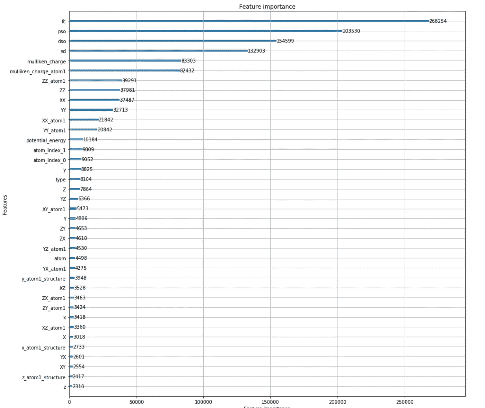

We see virtually no change compare to the previous LGBM model I made

我又做了一个视觉效果，它关注的是准确性而不是平均绝对误差，它给出了一个稍微不同的特征重要性，但它只影响了前 5 个特征的顺序。然后我意识到，由于目标变量包含的数字大多很小，但并不是所有的特性都是如此，这就对数字较大的特性产生了某种形式的偏差。然后我决定将数据标准化:

```
normal_feature=df.drop(['molecule_name', 'scalar_coupling_constant'], axis=1) target= df['scalar_coupling_constant']x= normal_feature.values
min_max_scaler = preprocessing.MinMaxScaler()x_scaled = min_max_scaler.fit_transform(x) #this gave an array instead of a dataframe. Now to convert this array into a dataframe and then properly change all column names back to the originalnf = pd.DataFrame(x_scaled)#This will reassign the names. It would have been easier to create a loop function but since I did it once already, I just copy pasted and added the additional dummy variables innormfeat= nf.rename(columns={0: 'atom_index_0', 1:'atom_index_1', 2: 'type', 3:'potential_energy', 4: 'X', 5: 'Y', 6: 'Z',                        7: 'XX_atom1', 8: 'YX_atom1', 9: 'ZX_atom1', 10: 'XY_atom1', 11: 'YY_atom1',                         12: 'ZY_atom1',13: 'XZ_atom1', 14: 'YZ_atom1', 15: 'ZZ_atom1',        16: 'XX', 17: 'YX', 18: 'ZX', 19: 'XY', 20: 'YY', 21:'ZY', 22:'XZ', 23:'YZ', 24:'ZZ',        25: 'mulliken_charge_atom1', 26: 'mulliken_charge', 27: 'type_scc',                               28: 'fc', 29: 'sd', 30:'pso',31: 'dso', 32: 'atom_atom1_structure',        33:'x_atom1_structure', 34:'y_atom1_structure', 35:'z_atom1_structure', 36: 'atom', 37:'x', 38:'y', 39:'z'                       })
```

现在创建一个新的训练-测试-分割，因为这些本质上是新的变量。

```
features= normfeat 
target= df[[‘scalar_coupling_constant’]] feature_train, feature_test, target_train, target_test= train_test_split(features, target, test_size=0.1)#Then to convert it all to numpy array for easier calculations:

feature_array= feature_train.to_numpy() 
target_array= target_train.to_numpy()
```

做完这些，我决定进入真正的机器建模。我没有做另一个 LGBM 模型，因为我不认为它会改变更多的功能，即使在正常化后，但你可以尝试一下，让我知道。我从基本的线性回归模型开始，使用负均方误差进行测量。这意味着数字越小，结果越好:

```
linear= LinearRegression()
mse= cross_val_score(linear, feature_array, target_array, scoring='neg_mean_squared_error', cv= 20)
mean_mse= np.mean(mse)mse= -6.683008610663098e-09
```

我专门为目标测试变量创建了一个新的数据框架，用于将来比较 ridge 和 lasso 模型:

```
target_test= target_test.reset_index()target_test=target_test.drop(['index'], axis=1)
#Only run the above codes once or it will give you errortarget_test=target_test.rename(columns={'scalar_coupling_constant': 'Actual Test Scalar'})
```

现在创建一个新的山脊模型，并根据标准化的特征阵列对其进行测试。我选择 GridSearchCV 用于山脊和套索，因为根据我的研究，它是最佳的。它使用交叉验证，而不是创建一个新的训练测试拆分案例。这最小化了数据泄漏的可能性，因为该算法不会看到实际的测试集。

```
ridge= Ridge()
ridgereg= GridSearchCV(ridge, param_grid=parameters, scoring='neg_mean_squared_error', cv= 15)
ridgereg.fit(feature_array, target_array)
print('ridge param: ', ridgereg.best_params_)
print('ridge score: ', ridgereg.best_score_)
ridgereg#The answers:
ridge param:  {'alpha': 1e-25}
ridge score:  -6.683015092064162e-09#Again, sorry about the formatting.GridSearchCV(cv=15, error_score='raise-deprecating',
             estimator=Ridge(alpha=1.0, copy_X=True, fit_intercept=True, max_iter=None, normalize=False, random_state=None, solver='auto', tol=0.001),
             iid='warn', n_jobs=None,
             param_grid={'alpha': [1e-25, 1e-20, 1e-15, 1e-10, 1e-05, 0.01, 1,
                                   10]},
             pre_dispatch='2*n_jobs', refit=True, return_train_score=False,
             scoring='neg_mean_squared_error', verbose=0) # Finally to fit the best ridge parameters to our training set:ridgereg= GridSearchCV(ridge, param_grid=parameters, scoring='neg_mean_squared_error', cv= 20) ridgereg.fit(feature_array, target_array)#To check the actual score:
ridgereg.score(feature_test, target_test)-6.836977895342504e-09 #this is a very small mean squared error.
```

现在对未知的测试用例进行一些预测:

```
ridgepredict=ridgereg.predict(feature_test)
actualtest=np.array(target_test)

plt.rcParams["figure.figsize"] = (8, 8) 
fig, ax = plt.subplots() 
ax.scatter(actualtest, ridgepredict) 
ax.set(title="Ridge Actual vs Predict") 
ax.set(xlabel="Actual", ylabel="Predict");
```

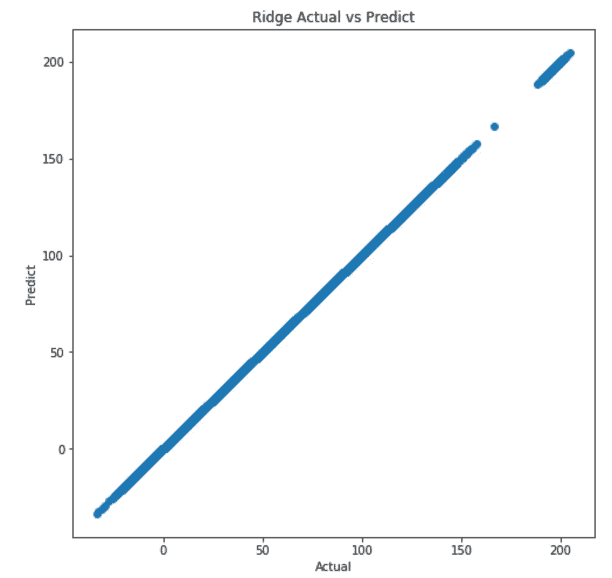

This shows how well my model is predicting against the actual test.

这让我担心过度拟合，我不明白为什么数据之间有差距。所以我把山脊线的分数保存到一个数据框中，然后转移到 lasso 上。

```
#To save the ridge data into a dataframe
ridgedata= pd.concat([target_test, pd.DataFrame(ridgepredict)], axis=1)
ridgecomparison= ridgedata.rename(columns={0:'Predicted Ridge Scalar'})
```

套索的计算方法与山脊相同:

```
lasso= Lasso()
lassoreg= GridSearchCV(lasso, param_grid=parameters, scoring='neg_mean_squared_error', cv= 20)
lassoreg.fit(feature_array, target_array)lassoreg.score(feature_test, target_test)-1.3148967532843286e-05 #the score is worse than Ridge. This showed that Ridge is better for this problem than Lasso#To create the Lasso graph:
lassopredict=lassoreg.predict(feature_test)
plt.rcParams["figure.figsize"] = (8, 8)
fig, ax = plt.subplots()
ax.scatter(actualtest, lassopredict)
ax.set(title="Lasso Actual vs Predict")
ax.set(xlabel="Actual", ylabel="Predict");
```

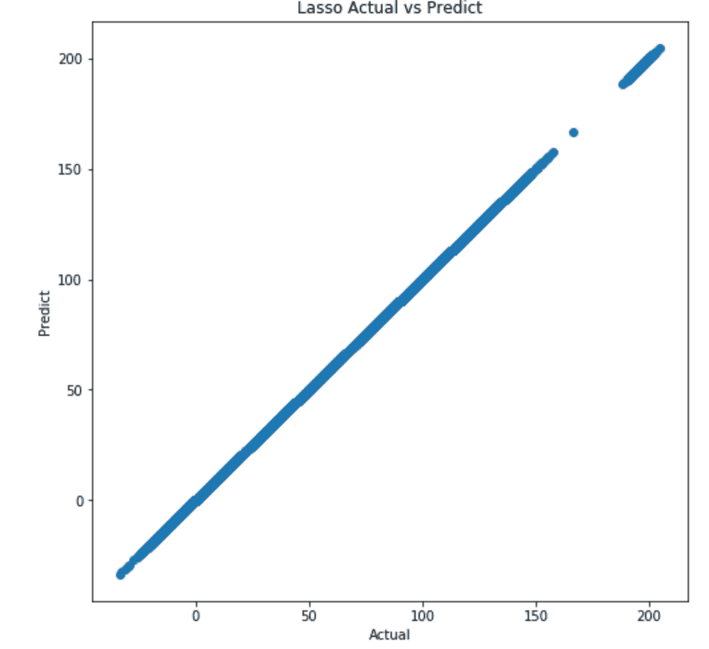

The same issue persist.

此时，我将 lasso 分数保存到一个数据帧中，并决定使用 Tableau 作为视觉媒介，直接将结果与实际测试分数进行比较:

```
lassodata= pd.concat([target_test, pd.DataFrame(lassopredict)], axis=1) 
lassocomparison= lassodata.rename(columns={0:'Predicted Lasso Scalar'})#Combining the test dataframe with the Ridge and Lasso and then saving it as a CSV to check with Tableauaccuracy_check= pd.concat([ridgecomparison, lassocomparison], axis=1)
accuracy_check= accuracy_check.loc[:,~accuracy_check.columns.duplicated()] #this drops any duplicated columnsaccuracy_check.to_csv('accuracy_check.csv', index=**False**)# You can run the following to see if it saved properly:
acc_chk= pd.read_csv('accuracy_check.csv')
acc_chk.head()
```

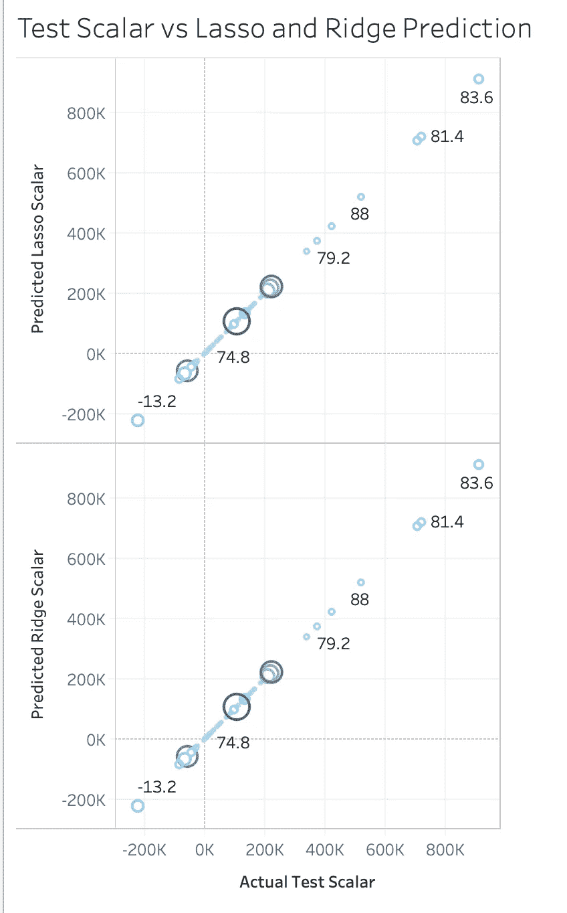

The Tableau visual (sorry, there is no codes for this)

这表明了我的山脊和套索模型的准确性。由于使用 tableau 检查三个连续列的准确性有点棘手，所以我对所有列使用 COUNT 函数作为一种过滤形式，然后创建一个 SUM 线性图，其中实际的测试标量是主要部分。大小显示了大多数数字的集中，它在更大的项目计划中并没有真正发挥任何作用。然而，很容易画出一条清晰的最佳拟合线，表明我使用的算法可以用来预测分子标量常数电荷。这也有助于解释一些差距。大多数标量一开始都是很小的数字，边界之外的几千个可能造成了线性图形中的缺口。然而，我们可以清楚地看到一条最佳拟合线。

我还想尝试一种算法。一个神经网络。在不同的笔记本上尝试了几个不同的版本后，我决定用 Relu 和 adadelta 作为优化器。我选择 adadelta 是因为来自 [Keras 文档](https://keras.io/optimizers/)的解释:

> 学习率基于梯度更新的移动窗口，而不是累积所有过去的梯度。这样，即使已经进行了多次更新，Adadelta 也能继续学习。

```
earlystop=keras.callbacks.callbacks.EarlyStopping(monitor='val_loss', min_delta=0, patience=0, verbose=0, mode='auto', baseline=**None**, restore_best_weights=**False**)terminate= keras.callbacks.callbacks.TerminateOnNaN()adadelta= optimizers.Adadelta(learning_rate=1.0, rho=0.95)
```

在设置了基本的边界之后，我创建了一个带有早停和早停的模型。它们的描述和用法可以在 keras 文档中找到。

```
m4 = Sequential() m4.add(Dense(64, input_dim=40, activation='relu')) 
m4.add(Dense(32, activation='relu')) 
m4.add(Dense(16, activation='relu')) 
m4.add(Dense(8, activation='relu')) 
m4.add(Dense(4, activation='relu')) 
m4.add(Dense(1, activation='linear')) 
m4.summary()Model: "sequential_4" _________________________________________________________________ Layer (type)                 Output Shape              Param #    ================================================================= dense_19 (Dense)             (None, 64)                2624       _________________________________________________________________ dense_20 (Dense)             (None, 32)                2080       _________________________________________________________________ dense_21 (Dense)             (None, 16)                528        _________________________________________________________________ dense_22 (Dense)             (None, 8)                 136        _________________________________________________________________ dense_23 (Dense)             (None, 4)                 36         _________________________________________________________________ dense_24 (Dense)             (None, 1)                 5          ================================================================= Total params: 5,409 
Trainable params: 5,409 
Non-trainable params: 0*#early callback*
m4.compile(optimizer=adadelta, loss='mean_squared_error', metrics=['mae', 'acc'])
his4=m4.fit(feature_array, target_array, validation_split=0.3, verbose=1, callbacks=[earlystop, terminate], 
            epochs=300, batch_size=5000)
```

由于提前回调和终止，模型结束得相当快。它显示出高 mae 和低精度，因为收敛发生得相对较早。但我知道这是一个错误，因为下图。

```
*#with early and termination callback established* 
acc = his4.history['acc'] 
val_acc = his4.history['val_acc'] 
loss = his4.history['loss'] 
val_loss = his4.history['val_loss'] 
epochs = range(len(acc)) 
plt.plot(epochs, acc, 'r', label='Training acc') 
plt.plot(epochs, val_acc, 'b', label='Validation acc') plt.title('Training and validation accuracy') 
plt.ylabel('accuracy')   
plt.xlabel('epoch') 
plt.legend() plt.figure() 
plt.plot(epochs, loss, 'r', label='Training loss') 
plt.plot(epochs, val_loss, 'b', label='Validation loss') plt.title('Training and validation loss') 
plt.ylabel('loss')   
plt.xlabel('epoch') 
plt.legend() 
plt.show()
```

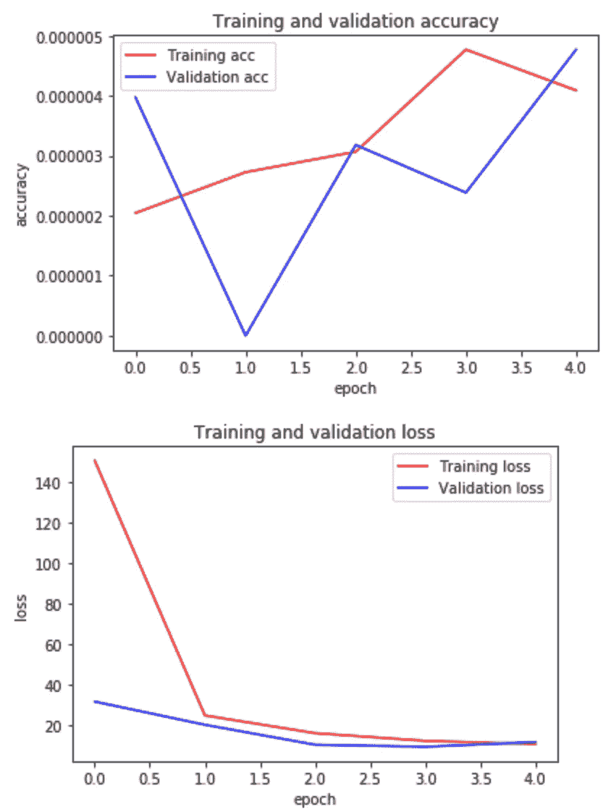

The convergence occurs due to the Loss but not accuracy. The accuracy is far too low to be valid.

然后我运行了一个新的模型，但是这次我没有使用提前回调或者终止。我想穿越所有的时代:

```
m4.compile(optimizer=adadelta, loss='mean_squared_error', metrics=['mae', 'acc'])his4=m4.fit(feature_array, target_array, validation_split=0.3, verbose=1,
            epochs=300, batch_size=5000)#The graphacc = his4.history['acc'] 
val_acc = his4.history['val_acc'] 
loss = his4.history['loss'] 
val_loss = his4.history['val_loss'] 
epochs = range(len(acc)) 
plt.plot(epochs, acc, 'r', label='Training acc') 
plt.plot(epochs, val_acc, 'b', label='Validation acc') plt.title('Training and validation accuracy') 
plt.ylabel('accuracy')   
plt.xlabel('epoch') 
plt.legend() plt.figure() 
plt.plot(epochs, loss, 'r', label='Training loss') 
plt.plot(epochs, val_loss, 'b', label='Validation loss') plt.title('Training and validation loss') 
plt.ylabel('loss')   
plt.xlabel('epoch') 
plt.legend() 
plt.show()
```

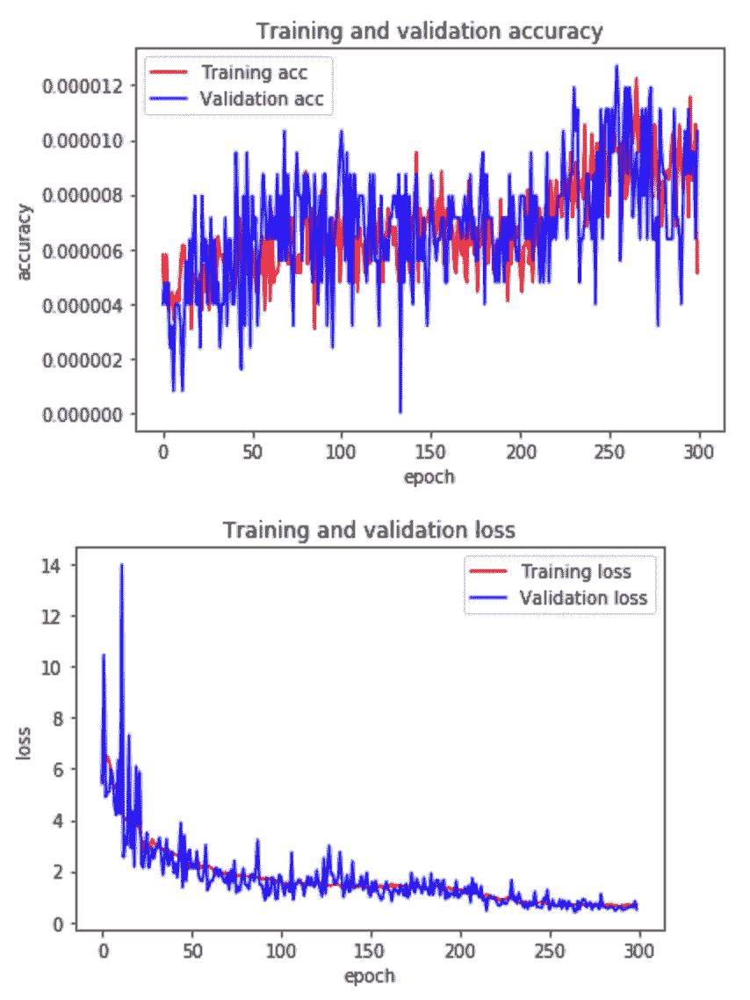

With no early callback

现在我看到精度和损耗都收敛了。然而，准确性似乎收敛在一个非常低的点，并不是这个模型的一个合适的度量。由于 adadelta 使用衰减作为均值点，我也决定研究平均绝对误差而不是精度。由于精度如此之小，并且没有适当的梯度，因此无法使用。

```
acc = his4.history['mae'] 
val_acc = his4.history['val_mae'] 
loss = his4.history['loss'] 
val_loss = his4.history['val_mae'] 
epochs = range(len(mae)) 
plt.plot(epochs, mae, 'r', label='Training mae') 
plt.plot(epochs, val_mae, 'b', label='Validation mae') plt.title('Training and validation mae') 
plt.ylabel('mae')   
plt.xlabel('epoch') 
plt.legend() plt.figure() 
plt.plot(epochs, loss, 'r', label='Training loss') 
plt.plot(epochs, val_loss, 'b', label='Validation loss') plt.title('Training and validation loss') 
plt.ylabel('loss')   
plt.xlabel('epoch') 
plt.legend() 
plt.show()
```

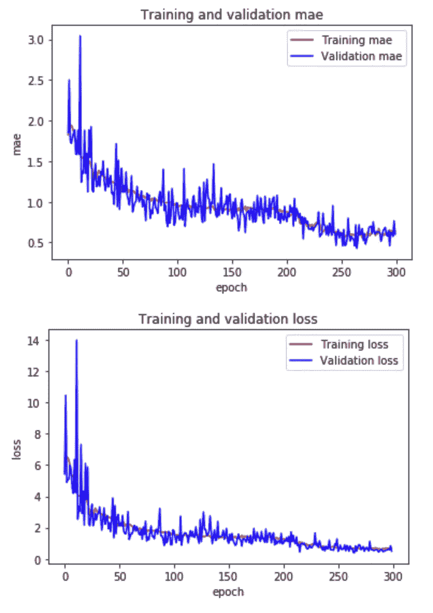

Mean Absolute Error

这显示了更好的收敛和梯度下降。如果我运行一个更高的纪元计数，mae 很可能会下降更多。但此时，mae 位于 0.6403，亏损位于 0.6871。虽然它没有山脊模型 mae 小，但它仍然是一个下降模型。但是，就定量分析而言，岭模型仍然是用于线性回归问题的最佳模型，该问题包含多个要素，每个要素都有数百万个数据集。此外，每个特性的值都很稀疏，有些特性甚至可能不起任何作用。也有可能一些特征对目标变量产生相同的影响，导致多重共线性和权重重要性的差异，从而导致模型中的偏差和过度拟合。考虑到所有这些因素，我认为使用岭模型来计算平均误差而不是精确度对于这个挑战来说是完美的。我这个项目的 github url 将在下面链接，所以你可以看看，也许可以改进我的模型。

[](https://github.com/imamun93/Molecular_Properties) [## imamun 93/分子特性

### 来自 Kaggle 竞争预测分子性质的数据。所有的数据都可以在那里找到。由于 git 大小的限制…

github.com](https://github.com/imamun93/Molecular_Properties) [](https://www.kaggle.com/c/champs-scalar-coupling) [## 预测分子性质

### 你能测量一对原子之间的磁相互作用吗？

www.kaggle.com](https://www.kaggle.com/c/champs-scalar-coupling)  [## 优化器- Keras 文档

### 优化器是编译 Keras 模型所需的两个参数之一:from Keras import optimizer model =…

keras.io](https://keras.io/optimizers/)