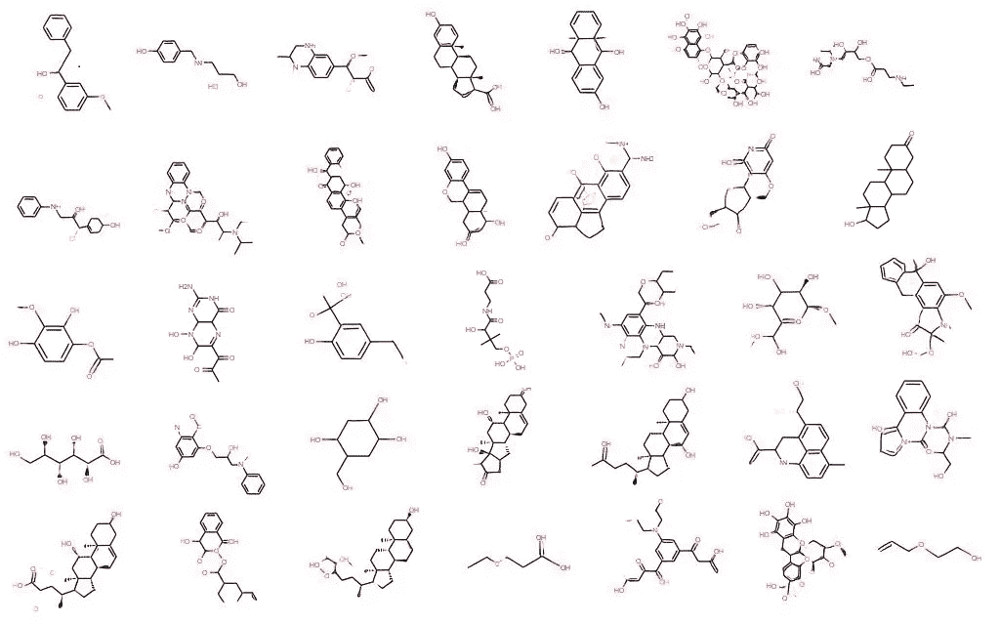
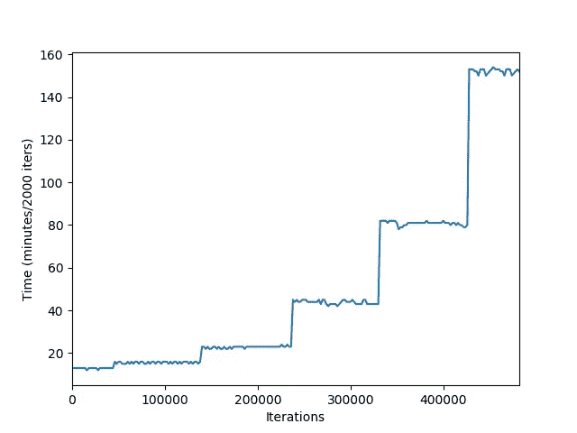
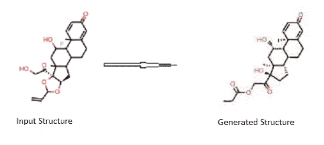

# 人工智能的分子合成

> 原文：<https://towardsdatascience.com/molecule-synthesis-using-ai-10e0e1f89568?source=collection_archive---------19----------------------->

## 一步一步指导使用氮化镓寻找新的药物和材料



Progressive GAN generated molecule structures (Three molecules are real)

分子合成是从简单的前体构建复杂化学分子的过程。这是开发下一代药物、智能材料、杀虫剂和电子产品的关键。迄今为止，分子合成是手工的、昂贵的、耗时的、多步骤的过程。它主要由化学直觉和化学反应的可靠知识指导。人工智能(AI)有潜力随意制造任何分子，成本低廉，时间跨度有意义，这将为未来的科学进步开启想象不到的机遇。

生成对抗网(GAN)是一个由“生成器”和“鉴别器”组成的人工智能模型。生成器捕获训练数据分布并从中生成样本。鉴别器估计样本来自生成器而不是训练数据的概率。这个两人游戏一直玩到鉴别器出错的概率最大化。

在本文中，我将演示如何训练 GAN 来生成分子结构。这是自动化分子合成的第一步。类似的工作正在由[药物发现和合成联盟](https://mlpds.mit.edu/) ( [人工智能能创造分子吗？](https://medium.com/@MITIBMLab/can-ai-create-molecules-324c140981e6)由[麻省理工学院-IBM 沃森人工智能实验室](https://medium.com/u/a0a8fdb128d4?source=post_page-----10e0e1f89568--------------------------------)。我举这个例子是为了强调任何人都可以轻松地使用人工智能进行尖端研究。唯一的限制因素是想象力。

# **数据**

任何人工智能(AI)项目的第一步都是数据。有多个网站包含各种格式的化学数据库。 [PubChem](https://pubchem.ncbi.nlm.nih.gov/) 包含大约 96M 的化合物列表，以 SMILES 符号表示。SMILES 符号可以分为功能组，并使用 python rdkit 库转换为分子结构图像。在 52 个官能团中，只有醇脂肪族官能团用于限制这项工作的范围。首先将来自醇脂肪族的 50，000 种化合物转换成 128×128 大小的图像。将 SMILES 条目分类并转换成图像的代码可以在 [github](https://github.com/neeraj-j/molecules) 获得。

# 培养

下一步是选择 GAN 型号。在几次失败的尝试后，我选择了进步的 GAN 的()py torch 实现，由 Facebook research([py torch _ GAN _ zoo](https://github.com/facebookresearch/pytorch_GAN_zoo))。渐进式 GAN 的新颖性在于，它从低分辨率的图像开始训练，并随着训练的进行添加新的层来引入更高分辨率的细节。据其作者称，PGAN 的这些特点使它更稳定，训练速度更快。

训练的第一步是克隆 pytorch_GAN_zoo:

```
git clone [https://github.com/facebookresearch/pytorch_GAN_zoo.git](https://github.com/facebookresearch/pytorch_GAN_zoo.git)
```

PGAN 的训练过程与其他甘斯略有不同。在开始训练之前，必须将数据调整为低分辨率图像。这可以通过发出以下命令来完成:

```
python datasets.py celeba $PATH_TO_IMAGES -o $OUTPUT_DIR -f
```

在该命令中，“celeba”是预训练数据集的名称。pytorch_GAN_zoo 在此模型上预先训练了多个数据集。“celeba”数据集对应于 128x128 像素的图像，这与本项目中使用的图像大小相同。除非用户是超参数向导，否则建议使数据适应预训练模型的超参数，而不是根据数据调整超参数。首次运行后，可以更改超参数来微调模型。下表包含预训练的型号名称和支持的图像大小。


Dataset name and image size

Datasets.py 还会生成一个配置文件。这个配置文件将包含 1)调整大小的图像和原始图像的路径。2)每个尺度的迭代次数。“规模”是 PGAN 独有的概念。每个比例都与模型中的层数、迭代次数和图像分辨率相关联。使用以下公式计算最大比例。

```
image_size = 2**(2+max_scale)
```

在该公式中，常数 2 被添加到最大比例，因为训练层从 4x4 的分辨率开始。Datasets.py 将以(64，128，512，1024)为步长调整图像大小，直到达到数据的图像大小。“$PATH_TO_IMAGES”是训练图像的位置。“OUTPUT_DIR”这是保存已调整大小的图像的位置。“-f”选项是在训练开始前生成调整大小的图像。创建了调整图像大小和配置文件后，下一步是通过发出以下命令开始训练:

```
python train.py PGAN -c $CONFIG_FILE -n $DATASET_NAME -d $WEIGHTS_DIR
```

在这个命令中，“PGAN”指的是进步的甘。pytorch_GAN_zoo 也支持 DCGAN。“配置文件”是 datasets.py 生成的配置文件的路径。“数据集名称”是自定义数据集的名称。“权重 _ 目录”是存储权重的位置。train.py 中定义了更多选项。我使用了“np _ vis”选项来使用基于 numpy 的可视化，而不是安装“visdom”包。我还将“-e”和“-s”选项设置为 2000。

# 培训分析

该培训在基于 Tesla K80 的服务器上进行了 9 天。在上一次规模的 62000 次迭代后，我停止了训练。可以使用此[链接](https://drive.google.com/drive/folders/16Fetqo9rbWu_vKy6Tqy-Zmxpb_AKYbTy?usp=sharing)下载训练模型的权重。GAN 训练时间长的一个主要原因是生成模型中缺乏迁移学习。迁移学习减少了判别模型中的数据需求和收敛时间。最近有一篇[论文](https://arxiv.org/abs/1906.11613v1)提出在 GANs 中解决这个问题。减少训练时间的一种方法是使用与数据相关的最小尺寸的图像。

在 PGAN，训练层从 4x4 分辨率开始，一直到数据集的图像大小。对于 128 的图像尺寸，以 4、8、16、32、64、128 的比例添加层。绘制训练时间与迭代的关系清楚地显示了新层的添加如何在每个尺度上指数地增加了训练时间。



Training time vs iterations

下面的视频显示了训练进度。生成的图像中的大部分改进发生在上次缩放期间。这个视频是通过拼接每 2000 次迭代后保存的评估图像创建的。

Training progress on Progressive GAN

pytorch_GAN_zoo 提供了在生成的图像上评估模型性能的工具。最流行的是盗梦空间评分。通过给出以下命令来计算生成的图像的初始分数。

```
python eval.py inception -c $CONFIGURATION_FILE -n $modelName -m $modelType -d $WEIGHTS_DIR
```

切片 Wasserstein 距离(SWD)是另一种用于评估高分辨率 GANs 的方法。拉普拉斯 SWD 分数通过给出以下命令来计算。关于评估 GAN 性能的更多信息，请参见[的论文](https://hal.inria.fr/hal-01850447/document)。

```
python eval.py laplacian_SWD -c $CONFIGURATION_FILE -n $modelName -m $modelType -d $WEIGHTS_DIR
```

pytorch_GAN_zoo 实现了另一个工具，“[励志 Adverserial Image generation](https://arxiv.org/abs/1906.11661) ”。该工具将图像作为输入，并使用梯度下降提取输入向量。该输入向量用于生成共享输入图像特征的新图像。鼓舞人心的一代是一个两步的过程。

```
python save_feature_extractor.py {vgg16, vgg19}\   $PATH_TO_THE_OUTPUT_FEATURE_EXTRACTOR --layers 3 4 5
```

在该命令中，vgg16/vgg19 指定用于输入矢量生成的模型。下载特征提取器后，使用以下命令根据以下内容生成分子结构

```
python eval.py inspirational_generation -n $modelName -m $modelType\ --inputImage $pathTotheInputImage -f \ $PATH_TO_THE_OUTPUT_FEATURE_EXTRACTOR -d $WEIGHTS_DIR
```

下图显示了输入和生成的分子结构。令人钦佩的是，ProGAN 已经很好地学习了输入向量和生成模式。



Inspiration Generation

# 未来的工作

上面训练的模型将产生随机的分子结构。这项工作可以通过使用 [LC GAN](https://arxiv.org/abs/1711.05772) 很容易地扩展，通过用在潜在空间中训练的单独 GAN 约束变分自动编码器(VAE)的潜在空间来产生具有某些属性的分子。这个模型也可以在 3D 分子结构上进行训练。该模型的输出可以被馈送到另一个模型，该模型可以验证和预测所生成的分子结构的特性。所有这些方法目前都在由[麻省理工学院-IBM 沃森人工智能实验室](https://medium.com/u/a0a8fdb128d4?source=post_page-----10e0e1f89568--------------------------------)进行。

由于信息、数据和资源的开放性，任何个人都可以从事新技术的研究。

# 确认

我非常感谢开源社区，这篇文章依赖于他们的工作和知识。我感谢化学教授 Preeti Gupta 给我上了官能团分类的速成课。