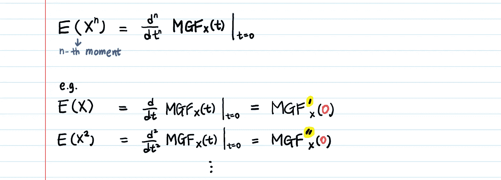

# 解释力矩生成函数

> 原文：<https://towardsdatascience.com/moment-generating-function-explained-27821a739035?source=collection_archive---------1----------------------->

## 它的示例和属性

如果你谷歌过“矩母函数”，第一、第二、第三个结果还没有让你点头，那就试试这篇文章吧。

# 1.首先，什么是概率/统计中的“时刻”?

假设我们感兴趣的随机变量是 **X** 。

**矩是 X 的期望值，如 E(X)，E(X)，E(X)，…等。**

第一个时刻是 **E(X)** ，

二阶矩是 **E(X )** ，

第三个时刻是**E(X)**

…

第 n 个时刻是 **E(X^n)** 。

我们非常熟悉前两个矩，均值 **μ =** **E(X)** 和方差**E(X)——μ**。它们是 **X** 的重要特征。均值是平均值，方差是分布是如何展开的。但是必须有**其他** **特征** **以及**也定义了分布。例如，三阶矩是关于分布的不对称性。第四个力矩是关于它的尾巴有多重。

The **moments** tell you about the **features** of the distribution.

# 2.那么什么是矩母函数(MGF)？

顾名思义，MGF 就是产生矩的函数——**E(X)，E(X)，e(x)，…，E(X^n).**

**The definition of Moment-generating function**

如果你看看 MGF 的定义，你可能会说…

> “我对了解 E(e^tx).不感兴趣我想要 E(X^n).”

**对 MGF 求导 n 次，将 t = 0 代入**。**然后，你会得到 E(X^n)** 。

This is **how you get the moments from the MGF.**

# 3.给我看看证据。为什么 n 阶矩是 MGF 的 n 阶导数？

我们将用[泰勒级数](https://en.wikipedia.org/wiki/Taylor_series)来证明这一点。

然后取期望值。

现在，对 **t** 求导。

如果你对 **③** 再求导(因此总共两次)，你会得到 **E(X )** 。
如果再求一次(三阶)导数，就会得到 **E(X )** ，以此类推…

当我第一次看到矩母函数的时候，我无法理解**t**在函数中的作用，因为 **t** 看起来像是一些我不感兴趣的任意变量。然而，如你所见， **t** 是一个辅助变量。我们引入 **t** 是为了能够使用微积分(导数)并使(我们不感兴趣的)项为零。

> 等等，但是我们可以用期望值的定义来计算矩。我们到底为什么需要 MGF？

**The definition of Expected Value** ([Are you confused with **𝐗** vs **𝒙** notation? Check it out here](https://medium.com/@aerinykim/sum-of-exponential-random-variables-b023b61f0c0f).)

# 4.我们为什么需要 MGF？

为了方便起见。

我们需要 MGF，以便容易地计算力矩。

## 但是为什么 MGF 比期望值的定义更容易呢？

在我的数学课本里，他们总是告诉我“**求二项式(n，p)、泊松(λ)、指数(λ)、正态(0，1)** 等的矩母函数。”然而，他们从来没有真正向我展示过为什么 mgf 会如此有用，以至于激发出快乐。

我想下面的例子会让你高兴起来——**MGF 更容易的最明显的例子:指数分布的 MGF**。(还不知道什么是指数分布？👉[指数分布的直觉](/what-is-exponential-distribution-7bdd08590e2a)

我们从 PDF 开始。

The PDF of exponential distribution

推导指数的 MGF。

对于存在的 MGF，期望值 **E(e^tx)** 应该存在。
这就是为什么 **`t - λ < 0`** 是要满足的重要条件，因为不然积分就不收敛。(这被称为**发散测试**并且是当试图确定一个积分是收敛还是发散时要检查的第一件事。)

一旦有了 MGF: **λ/(λ-t)** ，**计算力矩就变成了求导的问题**，这比积分直接计算期望值要容易。

> 使用 MGF，可以通过求导而不是积分来求矩！

需要注意一些事情:

1.  对于任何有效的 MGF， **M(0) = 1** 。每当你计算一个 MGF 时，插入 **t = 0** ，看看你是否得到 1。
2.  矩提供了一种指定分布的方法。例如，您可以通过前两个矩(均值和方差)来完全指定正态分布。当你知道分布的多个不同时刻时，你会对该分布有更多的了解。如果有一个人你没见过，你知道他的身高，体重，肤色，最喜欢的爱好等等。，你仍然不一定完全了解他们，但正在获得关于他们的越来越多的信息。
3.  MGF 的妙处在于，一旦有了 MGF(一旦期望值存在)，就可以得到任意 n 阶矩。MGF 将一个随机变量的所有矩编码成一个函数，以后可以从这个函数中再次提取它们。
4.  概率分布由其 MGF 唯一确定。如果两个随机变量有相同的 MGF，那么它们一定有相同的分布。([证明。](https://math.stackexchange.com/questions/458680/how-to-prove-moment-generating-function-uniqueness-theorem))
5.  对于对“瞬间”这个术语很好奇的人(比如我):[为什么一个瞬间被称为瞬间？](https://stats.stackexchange.com/questions/17595/whats-so-moment-about-moments-of-a-probability-distribution)
6.  [应用🔥分布的一个重要特征是它的尾部有多重，特别是在金融风险管理中。如果你还记得 2009 年的金融危机，那基本上就是未能解决罕见事件发生的可能性。风险经理低估了该基金交易头寸背后的许多金融证券的峰度(峰度在希腊语中是“膨胀”的意思)。有时，看似随机的假设平滑的风险曲线分布中可能隐藏着凸起。我们可以发现那些使用 MGF 的人！