# 金钱使世界运转，足球也是如此？

> 原文：<https://towardsdatascience.com/money-makes-the-world-go-round-and-thus-also-the-soccer-847bb5350535?source=collection_archive---------14----------------------->

## 欧洲和国家层面的统计分析

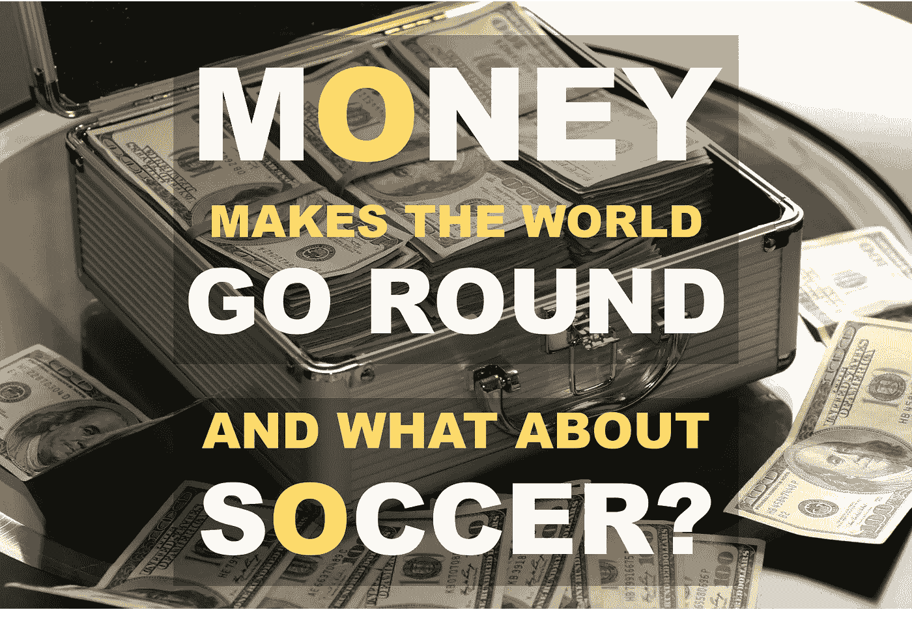

在这篇文章中，我们将关注欧洲足球的财务发展，并回答以下问题:一支球队的团队价值与他们的体育成就之间的相关性有多强？金融形势总体上是如何发展的？为了回答这些问题，我们主要使用 Numpy 和 Pandas 进行数据分析，使用 Plotly 进行可视化。该数据库是从 transfermarkt.com[1]自行搜集的，其中包括 2009 年至 2018 年的转让数据。在另一篇文章中，我将展示如何收集和处理数据。GitHub 上提供了数据集和完整的 Jupyter-Notebook。如有其他问题，请联系我。

## 介绍

英格兰超级联赛被认为是世界上最有吸引力的联赛之一。不仅是悠久的历史，还有联赛的资金量，都是他们不间断走红的原因。在 2017/2018 赛季，20 支英超球队能够在他们之间分配总计 24.2 亿英镑(约 27 亿€)的电视资金。仅曼联一家就获得了近 1.5 亿英镑(€1.67 亿英镑)，这还不包括门票销售、商品和促销活动的收入[2]。有了这笔钱，年轻的天才和世界明星可以进入英格兰联赛，这反过来也保证了体育的成功。欧足联在其网站上有一个显示欧洲足球协会的排名。计算依据是单个俱乐部在欧冠、欧联等欧洲顶级赛事中的表现。当前的前 10 名如图 1 所示:

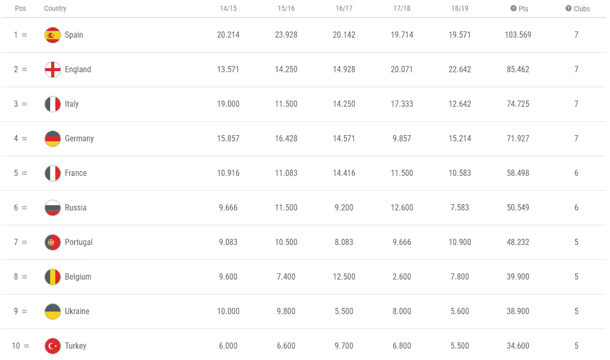

Figure 1: UEFA Country coefficients 2018/2019 [3]

西班牙在五年平均值中排名第一，因为在此期间总共可以赢得 4 个冠军和 3 个欧洲联赛冠军。然而，自 2017/2018 赛季以来，英格兰已经弥补了很多，这要归功于利物浦和切尔西的冠军。我们在团队价值观中也发现了这种模式吗？为了回答这个问题，我们可视化了每个国家的平均阵容值:

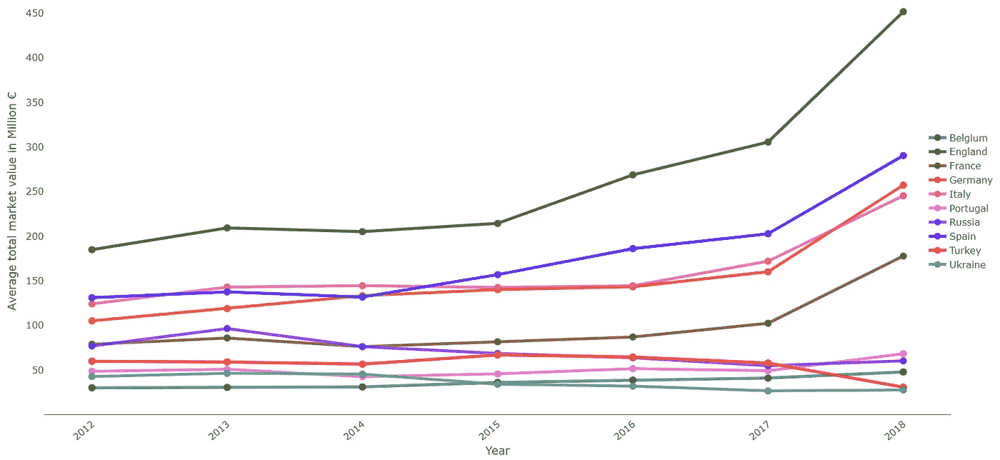

Figure 2: Development of the average total squad value from 2012 to 2018 in €

图 2 显示了排名前 10 的联赛的平均阵容值[2]。英格兰的金融霸主地位，一眼就能看出来。在 2018/2019 赛季，球队的平均现金价值约为€4.52 亿英镑，而在排名第二的西班牙联赛中，€仅为 2.91 亿英镑。紧随其后的是德国(€2.57 亿)和意大利(€2.45 亿)。法国排名第五，平均€为 1.78 亿。这些也是组成前 5 名的国家协会。从球队价值来看，这五家俱乐部自 2012 年以来都表现良好。如果你看看其他五个俱乐部，俄罗斯、葡萄牙、比利时、乌克兰和土耳其，你一眼就能看出，这支队伍的平均价值总体上是下降的。此外，绝对水平明显低于前 5 名五重奏。这里的领跑者是葡萄牙，平均每支球队价值 6800 万€，而乌克兰只有€的 2800 万。这种财政优势也反映在冠军联赛的体育优势上。图 3 显示了过去 15 年的冠军得主:

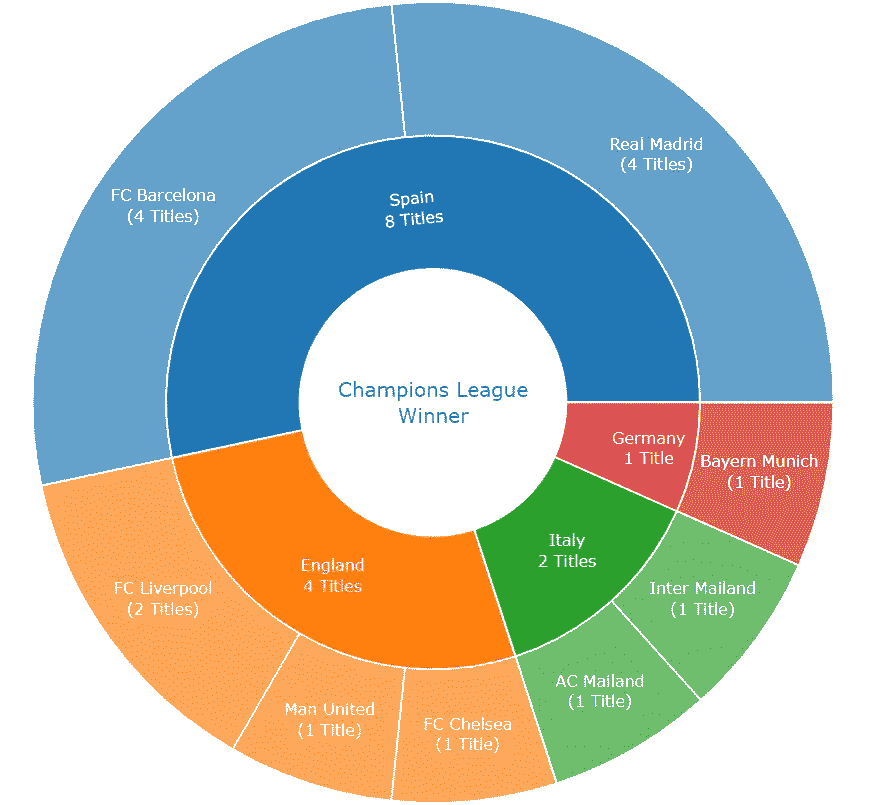

Figure 3: The champions league winner from 2005 to 2019 [4]

在过去的 15 年里，欧洲冠军联赛的冠军都是由德国、英国、意大利和西班牙球队夺得的。在此期间，巴塞罗那和马德里获得了 8 个冠军。在球队价值方面排名第四的四个国家在最近的过去也是欧洲足球最高级别的冠军。显然，经济上的优势也导致了体育上的优势，这种优势越来越明显。但是国家级的前 5 名联赛呢？我们能期待这里的变化吗？图 2 中的球杆在比赛中是不可及的吗？

## 2.欧洲五大联赛的金融发展

对于五个欧洲顶级联赛，我们有更长的时间序列，从 2009 年到 2018 年。因此，我们可以看看 10 年期间的发展情况:

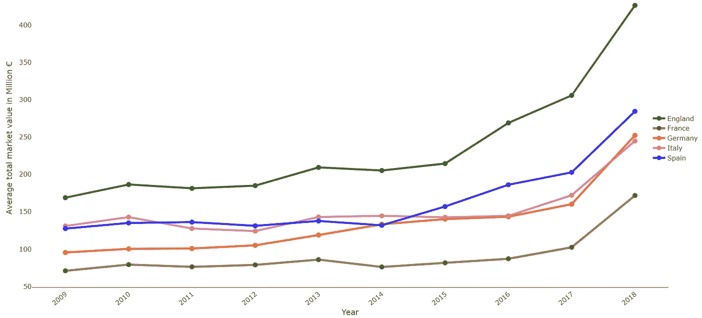

Figure 4: Development of the average squad value from 2009 to 2018 in €

图 4 也显示了所有联赛的平均小队值都有了明显的提升。顺序大体相同，只有意大利从第 2 位滑落到第 4 位。这里最有价值的球队是否会像欧洲水平一样占据统治地位？以下球队在过去十年中拥有最有价值的球队:

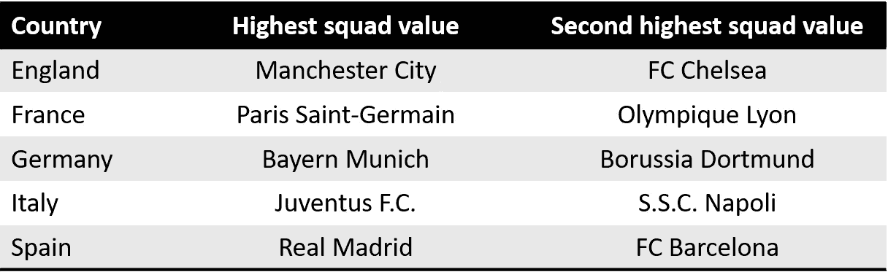

图 5 显示了上述球队的冠军头衔。里昂奥林匹克和那不勒斯 SSC 没有显示，因为他们自 2009 年以来没有赢得过国家冠军:

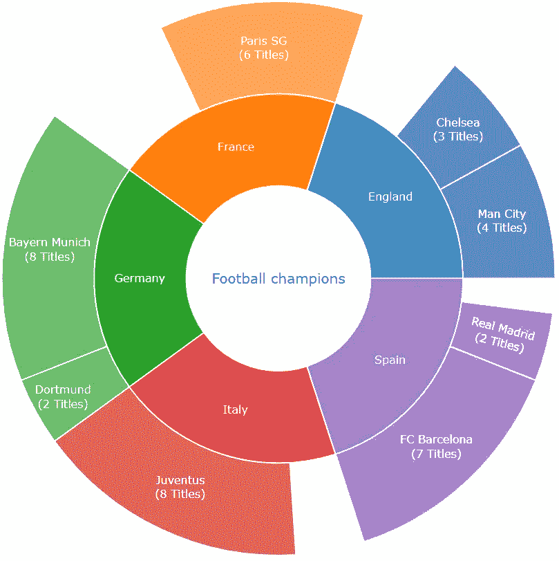

Figure 5: National championship winner from 2009 to 2018

总的来说，拥有最有价值阵容的两支球队赢得了超过 80%的冠军。尤其是在德国、意大利和西班牙，顶级球队占据主导地位。在国家层面也是如此，拥有最昂贵球队的俱乐部主导着联赛。

但是一般来说，金融发展如何呢？联盟中的财政不平等是否在继续增加，或者在国家层面是否有动态发展，以便我们可以期待未来的更多变化？为了回答这个问题，我们来看看所谓的 GINI 系数。这主要在经济学中用来反映平等或不平等。该系数通常用于收入分配，以检查社会中平等或不平等的资产是如何分配的。如果 GINI 系数为 0，所有人的财富将完全相同，但如果该值为 1，一个人将拥有一切，而其他人则一无所有。我们现在将把这个指标应用到队伍值中，以检查分布是如何发展的。在图 6 中，我们可以看到结果:

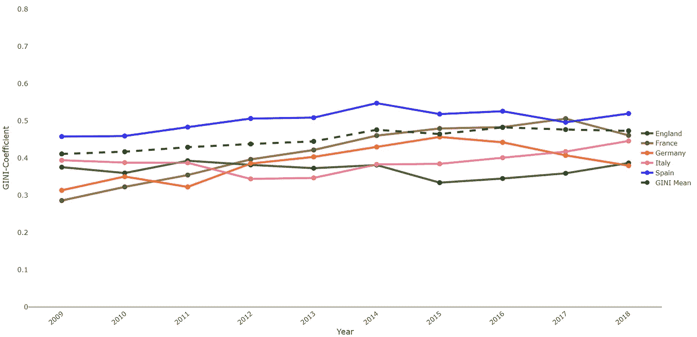

Figure 6: Development of the GINI-Coefficient from 2009 to 2018

在过去的十年里，所有五个联赛的不平等都有所增加。增长最快的是法国，法国的 GINI 系数从 0.29 上升到 0.46。西班牙的不平等程度最高。这里的系数从 0.46 上升到 0.52。德国的不平等程度相对最低，但这里的不平等程度也有所上升。在意大利，出现了 0.06 至 0.45 的急剧下降。增幅最低的是英格兰，该系数仅上升了 0.01 至 0.39。

黑色虚线代表所有五个联赛的平均值。2009 年，GINI 系数为 0.41，2018 年为 0.47。值得注意的是，直到 2014 年，这一比例持续上升至 0.48。自那以后，人民币汇率基本上停滞不前。其中一个原因可能是欧足联引入了金融公平竞赛，这意味着顶级俱乐部不能再扩大投资规模[5]。

## 3.球队平均价值和运动成绩之间的统计关系

我们已经注意到，经济实力更强的联赛在欧洲占据主导地位，在国家层面，拥有更有价值球队的俱乐部也更富裕。现在，我们根据一个赛季取得的积分来检查球队价值和体育成就之间的统计相关性:

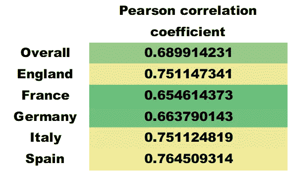

Figure 7: Correlation oefficients points and squad value

在图 7 中，我们看到所有联赛的皮尔逊相关系数大约为 0.69。这是一种非常积极的关系。相关系数首先表明有关系，但还没有说什么因果关系。这种相关性在所有联赛中都存在，在西班牙最强，而在法国相关性相对较低。尽管如此，在所有联赛中，得分和球队价值之间都有很强的正相关关系。

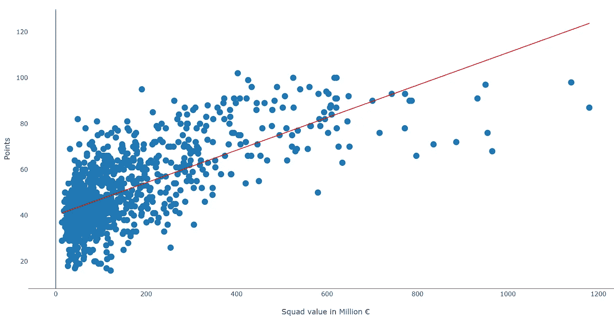

Figure 8: Relationship between squad value and number of points per season

在图 8 中，这种关系是可视化的。可以清楚地看到，随着平均小队值的增加，得分的点数也增加。可以假设这里存在偏相关。如果像莱斯特城这样的球队出人意料地争夺冠军，在球队没有投入新球员的情况下，球员的市场价值就会上升。在这个例子中，良好的表现将导致团队价值的增加。一般来说，俱乐部进行转会是为了扩大他们的体育潜力，我们认为更高的球队价值会带来更大的体育成就。我们可以用回归来检验这个假设:

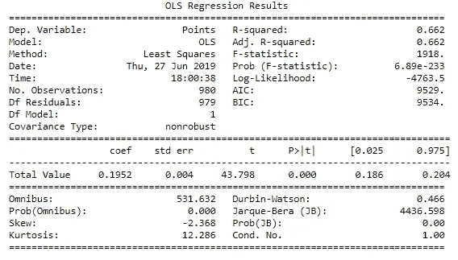

Figure 9: Regression with Points as dependent and squad value as independent variable

图 9 显示了回归的结果。分数是因变量，球队看重的是自变量。调整后的 R 平方为 0.662。这意味着，因变量的方差的大约 66%，也就是点，可以用我们的自变量来解释。此外，我们可以从 P 值中看出，该结果具有统计学意义。

## 结论

在引言中，我们已经看到，欧洲五大联赛在经济上和体育上都占据主导地位。此外，这一群体继续动态增长，而其余联赛则呈现小幅下降趋势。因此，可以假设体育优势继续显现。在对英格兰、法国、德国、意大利和西班牙的比较中，可以注意到英格兰拥有迄今为止最高的阵容价值，并且这种优势持续了十年。由于目前的发展，不太可能在不久的将来会有另一个联盟取得第一名。在国家联赛中，我们发现球队价值的分配越来越不平等。不平等的最大增长发生在法国，而绝对水平最高的是西班牙。
在最后一部分，我们从统计学角度检验了团队价值与运动成功的相关性。有很强的正相关性，由此可以得出两个结论。由于财政潜力，欧洲五大顶级联赛的运动优势在不久的将来将会增加而不是减少。再者，由于各国联赛的不平等日益加剧，顶级球队的霸主地位将继续存在。

## 来源

[1][www . transfer markt .](http://www.transfermarkt.de)com
【2】[https://www . UEFA . com/memberassociations/uefarankings/country/#/yr/2019](https://talksport.com/football/376346/how-much-money-each-premier-league-club-earned-tv-and-their-final-position-180518283150/)
【3】[https://www . UEFA . com/memberassociations/uefarankings/country/#/yr/2019](https://www.uefa.com/memberassociations/uefarankings/country/#/yr/2019)
【4】[https://en . Wikipedia . org/wiki/List _ of](https://en.wikipedia.org/wiki/List_of_European_Cup_and_UEFA_Champions_League_finals#List_of_finals)

## 链接

github:
https://github.com/bd317/soccer_analytics

笔记本:
https://Github . com/BD 317/Soccer _ Analytics/blob/master/Soccer _ Analytics _ Github _ upld . ipynb

数据集(可作为。pkl 或者。csv 文件):
[https://github . com/BD 317/soccer _ analytics/blob/master/df _ all _ top 10 _ analytics . CSV](https://github.com/bd317/soccer_analytics/blob/master/df_all_top10_analytics.csv)
[https://github . com/BD 317/soccer _ analytics/blob/master/df _ all _ top 10 _ analytics . pkl](https://github.com/bd317/soccer_analytics/blob/master/df_all_top10_analytics.pkl)

[https://github . com/BD 317/soccer _ analytics/blob/master/df _ all _ top 5 _ analytics . CSV](https://github.com/bd317/soccer_analytics/blob/master/df_all_top5_analytics.csv)
[https://github . com/BD 317/soccer _ analytics/blob/master/df _ all _ top 5 _ analytics . pkl](https://github.com/bd317/soccer_analytics/blob/master/df_all_top5_analytics.pkl)

[如果您喜欢中级数据科学，并且还没有注册，请随时使用我的推荐链接加入社区。](https://medium.com/@droste.benedikt/membership)