# 钱球—线性回归

> 原文：<https://towardsdatascience.com/moneyball-linear-regression-76034259af5e?source=collection_archive---------10----------------------->

## 使用 Python 中的线性回归预测棒球赛季表现。


Photo by [Joshua Peacock](https://unsplash.com/@jcpeacock?utm_source=medium&utm_medium=referral) on [Unsplash](https://unsplash.com?utm_source=medium&utm_medium=referral)

2011 年，电影**《金钱球》**上映。这部电影改编自 Micheal Lewis 的书，基于一个真实的故事，讲述了奥克兰运动家队总经理比利·比恩在失去明星球员后，必须在预算紧张的情况下找到进入季后赛的方法。保罗·德波斯塔(Paul DePodesta)毕业于常春藤联盟(Ivy League)，他能够利用[的 Sabermetrics](https://sabr.org/sabermetrics) 识别出“廉价”球员，以便建立一支球队，延续美国队臭名昭著的 [20 连胜](https://localwiki.org/oakland/A%27s_20_Game_Streak)，并看到他们在常规赛中获得第一名，将 Sabermetrics 的艺术置于聚光灯下。

在这篇文章中，我们将尝试重建 DePodestas 的统计分析，使用 python 中的线性回归来模拟 2002 年常规赛的结果。

**线性回归**

线性回归是监督机器学习的最简单形式之一，它基于独立变量(通常用 X 表示)对目标预测值(通常用 y 表示)进行建模。

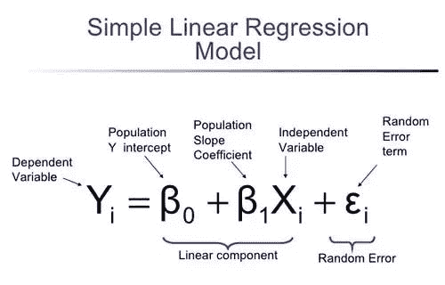

*   Y —因变量(目标预测值)
*   X —独立变量
*   β —回归系数:指 x 变量和因变量 y 之间的关系
*   ε——误差项:用于表示统计或数学模型产生的残差变量，当模型不能完全代表自变量和因变量之间的实际关系时，就会产生该残差变量。由于这种不完全的关系，误差项是在经验分析过程中方程可能不同的量。

线性回归模型的工作本质上是找到输入(X)和输出(y)之间的线性关系。

使用的数据集可以在 [Kaggle](https://www.kaggle.com/wduckett/moneyball-mlb-stats-19622012) 找到，最初是从[baseball-reference.com](https://www.baseball-reference.com/)收集的。

数据集包含许多属性(列)，在导入相关模块并使用 pandas 打开后可以看到(注意:完整的原始代码可以在 [My Github](https://github.com/HarryBitten/MoneyballPredictions) 中找到)

```
df = pd.read_csv('csvs/baseball.csv')
df.head()
```

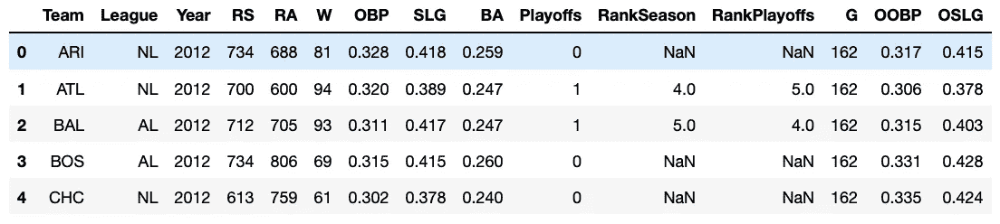

Be sure to import NumPy, Pandas, and CSV modules

我们需要关注的主要属性是:

1.  RS —得分运行
2.  RA —允许运行
3.  w-Wins
4.  OBP——基于百分比
5.  SLG——段塞百分比
6.  BA——击球率
7.  季后赛——一支球队是否能进入季后赛
8.  OOBP——对手的上垒率
9.  OSLG——对手击球百分比

其中一些是不言自明的，但是有几个属性需要一些解释:

1.  OBP——上垒百分比:这是一项统计，衡量击球手上垒的频率，它不考虑击球手跑了多远，即三垒。
2.  SLG-Slugging Percentage:一个衡量击球“生产力”的指标，简单来说，它衡量击球手击球时能打出多远。
3.  击球率:由击球次数除以击球次数定义，衡量击球手投球时击球的可能性。同样，没有考虑击球手跑了多远。

现在，所有这三个统计数据在这个分析中都非常重要。在“Moneyball”之前，球探主要使用击球率作为衡量一个好击球手的标准，通常一个球员的击球率会对他们的价值/工资产生巨大的影响。然而，DePodesta 认为这是一个错误，声称球探高估了 BA 的统计数据，而大大低估了 OBP 和 SLG 作为优秀击球手的衡量标准。比利·比恩和运动家队能够以低廉的价格获得高 OBP 和 SLG 的球员，因为球探忽略了这些属性。

**数据角力**

让我们增加一个新的栏目；RD，它显示了 RS(得分得分)和 RA(允许得分)之间的差异。`df['RD'] = df['RS'] - df['RA']`

让我们也确保我们只有'钱球'之前的数据，这可以通过只包括 2002 年常规赛之前的数据来实现。`df = df[df.Year < 2002]`

**探索性数据分析(EDA)**

根据 DePodesta 的说法，为了进入季后赛，湖人队需要在常规赛中取得 99 场胜利。我们可以使用 [Seaborn](https://seaborn.pydata.org/) 创建一个图形来可视化它，这是一个基于 [matplotlib](https://matplotlib.org/) 的数据可视化库。

让我们从为我们的绘图定义一个好的调色板开始。

```
flatui = ["#6cdae7", "#fd3a4a", "#ffaa1d", "#ff23e5", "#34495e", "#2ecc71"]
sns.set_palette(flatui)
sns.palplot(sns.color_palette())
```


Be sure to import Seaborn & Matplotlib

现在，我们可以绘制运行差异与成功的关系图，以形象化 DePodestas 理论。

```
sns.lmplot(x = "W", y = "RS", fit_reg = False, hue = "Playoffs", data=df,height=7, aspect=1.25)
plt.xlabel("Wins", fontsize = 20)
plt.ylabel("Runs Scored", fontsize = 20)
plt.axvline(99, 0, 1, color = "Black", ls = '--')
plt.show()
```

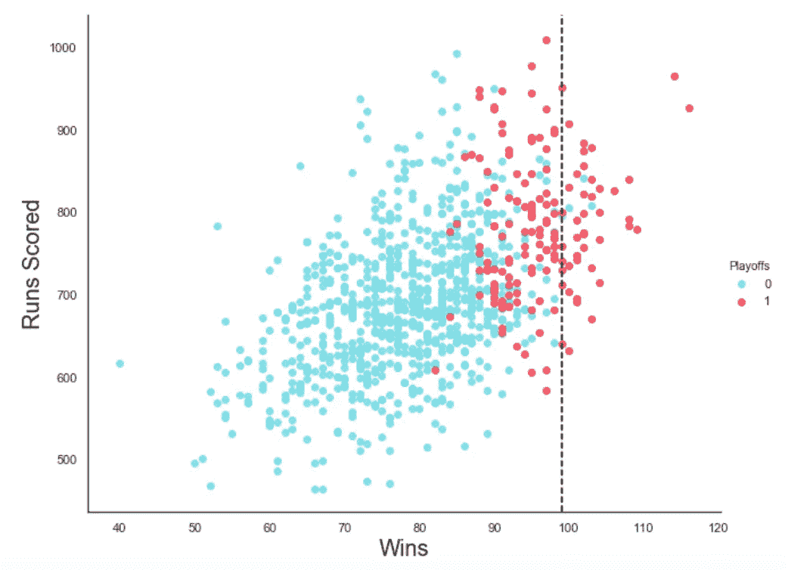

正如我们所看到的，DePodestas 的理论似乎是准确的，因为只有 3 次球队没有以≥ 99 胜进入季后赛(在黑色虚线 99 胜“阈值”线后的蓝点中可以看到)。

DePodesta 还计算出，为了赢得 99 场比赛并进入季后赛，A 队必须得 814 分，同时只允许 645 分，分差 169 分。我们可以使用许多不同的方法来可视化运行差异和成功之间的关系，我们将使用其中的两种方法。

首先，一个简单的散点图:

```
x = np.array(df.RD)
y = np.array(df.W)
slope, intercept = np.polyfit(x, y, 1)
abline_values = [slope * i + intercept for i in x]
plt.figure(figsize=(10,8))
plt.scatter(x, y)
plt.plot(x, abline_values, 'r')
plt.title("Slope = %s" % (slope), fontsize = 12)
plt.xlabel("Run Difference", fontsize =20)
plt.ylabel("Wins", fontsize = 20)
plt.axhline(99, 0, 1, color = "k", ls = '--')
plt.show()
```

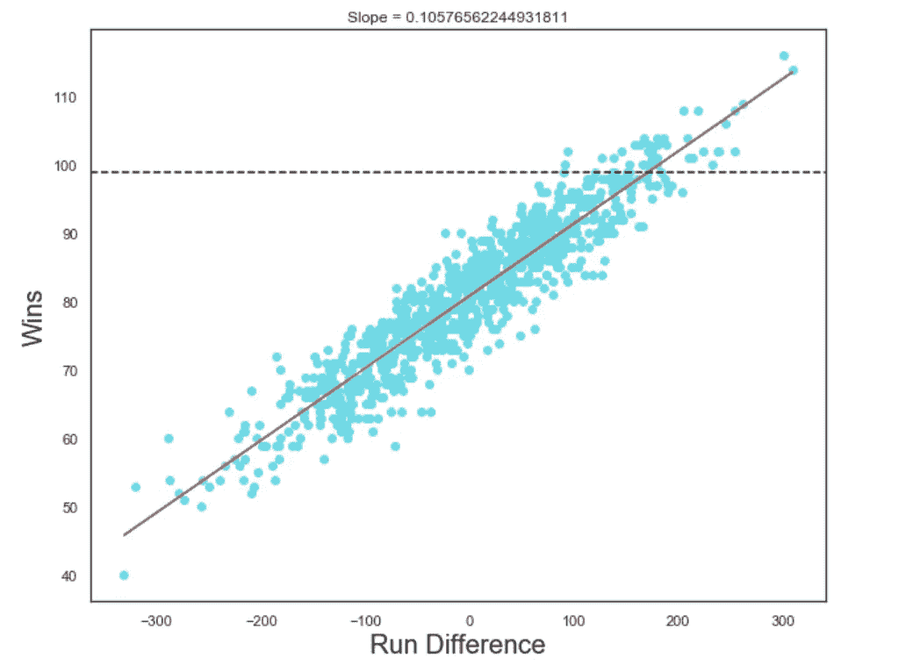

其次；我们可以使用 Seaborn pairplot:

```
corrcheck = df[['RD', 'W', 'Playoffs']].copy()
g = sns.pairplot(corrcheck, hue = 'Playoffs',vars=["RD", "W"])
g.fig.set_size_inches(14,10)
```

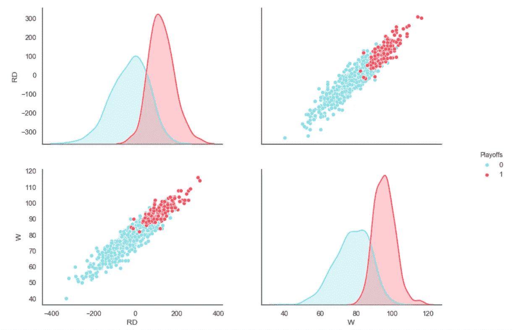

我们已经可以看到，两者之间存在明显的线性关系，然而，我们可以通过使用熊猫来进一步验证这一点。corr()，它计算列之间的成对相关性。

`corrcheck.corr(method='pearson')`

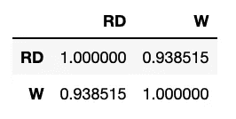

Correlation between Wins and Run Difference

我们可以看到胜率和跑差之间的相关性为 0.938515，这表明两者之间的关系非常密切。

现在我们知道运行差异与成功有很强的相关性，那么什么属性与运行差异有很强的相关性呢？正如我们之前提到的，当时的球探非常依赖平均打击率，根据 DePodesta 的说法，他们低估了基础率和击球率。同样，我们可以使用。corr() Pandas 函数，用于计算列之间的成对相关性。

`podesta = df[['OBP','SLG','BA','RS']]`

`podesta.corr(method='pearson')`


请注意右边一栏，显示了 RS 与 OBP、SLG 和 BA 的关系。我们可以看到，击球率实际上是关于得分得分的 ***最少*** 相关属性，相关度为 0.83。击发百分比和上垒百分比实际上相关性更高，分别为 0.93 和 0.90。这证实了 DePodestas 对 SLG 和 OBP 的低估和对 BA 的相对高估。

我们实际上可以应用一点机器学习来进一步验证这些说法。首先，通过使用单变量选择，来选择那些与输出变量(在这种情况下是 RD)具有最强关系的特征。scikit-learn 库提供了 SelectKBest 类，允许我们挑选特定数量的特性。我们将使用非负特征的卡方统计检验从数据集中选择最佳特征。首先，我们需要使用`moneyball = df.dropna()`从我们的数据集中删除任何会干扰机器学习方法的空值。

然后:

```
from sklearn.feature_selection import SelectKBest
from sklearn.feature_selection import chi2

#we use RD as the target column
X = moneyball.iloc[:,6:9]
y = moneyball.iloc[:,-1]
#apply SelectKBest class to get best features
bestfeatures = SelectKBest(score_func=chi2, k=3)
fit = bestfeatures.fit(X,y)
dfscores = pd.DataFrame(fit.scores_)
dfcolumns = pd.DataFrame(X.columns)
#concat two dataframes for better visualization
featureScores = pd.concat([dfcolumns,dfscores],axis=1)
featureScores.columns = ['Feature','Score']
print(featureScores.nlargest(3,'Score'))
```

另一种方法是使用基于树的分类器内置的特征重要性。特征重要性将为数据的每个特征给出一个分数，分数越高，该特征对于输出变量越重要或相关。

```
X = moneyball.iloc[:,6:9]  #independent columns
y = moneyball.iloc[:,-1]    #target column
from sklearn.ensemble import ExtraTreesClassifier

model = ExtraTreesClassifier()
model.fit(X,y)
print(model.feature_importances_)
feat_importances = pd.Series(model.feature_importances_, index=X.columns)
feat_importances.nlargest(3).plot(kind='barh', figsize = (12,8))
plt.xlabel("Importance", fontsize = 20)
plt.ylabel("Statistic", fontsize = 20)
```

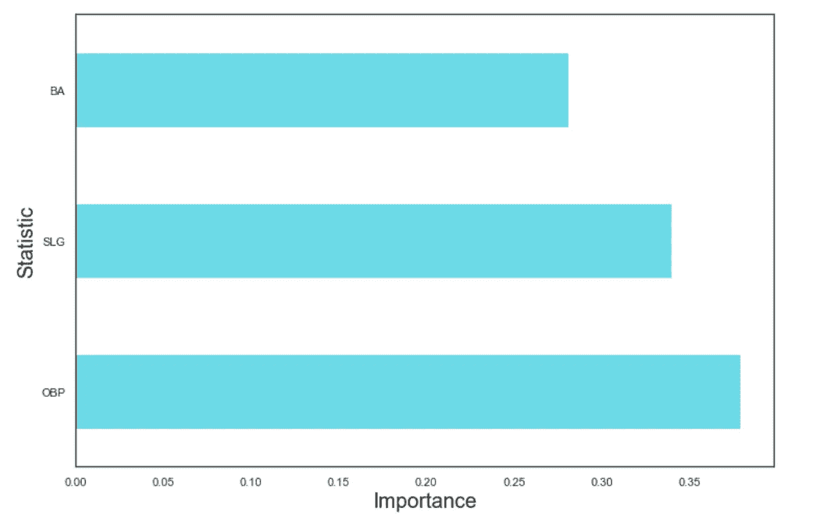

The importance of attributes on determining Run Difference

**模型构建**

Scikit-learn 为我们提供了构建线性回归模型的功能。首先，我们建立了一个得分的模型，使用基本百分比和击球百分比进行预测。

```
x = df[['OBP','SLG']].values
y = df[['RS']].values Runs = linear_model.LinearRegression() Runs.fit(x,y)print(Runs.intercept_) 
print(Runs.coef_)
```

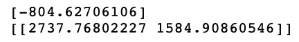

然后，我们可以说，我们的跑步得分模型采用以下形式:

*RS =-804.627+(2737.768×(OBP))+(1584.909×(SLG))*

接下来，我们做同样的事情，但是为了模拟允许的跑动，使用对手的基本百分比和对手的击球百分比。

```
x = moneyball[['OOBP','OSLG']].values
y = moneyball[['RA']].values
RunsAllowed = linear_model.LinearRegression()
RunsAllowed.fit(x,y)

print(RunsAllowed.intercept_)
print(RunsAllowed.coef_)
```

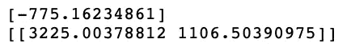

然后，我们可以说我们的允许运行模型采用以下形式:

RA =-775.162+(3225.004×(OOBP))+(1106.504×(OSLG))*

然后，我们需要建立一个模型来预测给定运行差异时的获胜次数。

```
x = moneyball[['RD']].values
y = moneyball[['W']].values
Wins = linear_model.LinearRegression()
Wins.fit(x,y)

print(Wins.intercept_)
print(Wins.coef_)
```

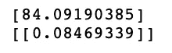

我们可以说，我们的 Wins 模型采用以下形式:

*W = 84.092 + (0.085 ×(RD))*

现在我们剩下要做的就是得到 OBP、SLG、OOBP、OSLG，并简单地将它们插入模型中！

我们知道哪些球员在 2001 赛季后被转入和转出，所以我们可以用 2001 年的球员数据来建立 2002 年的球队。

2002 年 NBA 球队季前统计数据取自 2001 年:

*OBP: 0.339*

*SLG: 0.430*

*OOBP: 0.307*

*OSLG: 0.373*

现在让我们创建我们的预测:

`Runs.predict([[0.339,0.430]])`

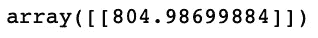

Our model predicts 805 runs

`RunsAllowed.predict([[0.307,0.373]])`

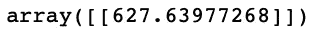

Our model predicts 628 runs allowed

这意味着我们得到了 RD 177(805–628)，然后我们可以将它插入到 Wins 模型中。

`Wins.predict([[177]])`

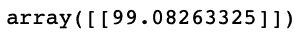

所以，最后，我们的模型预测得分 805 分，628 分，99 场比赛获胜，这意味着我们的模型预测，根据他们的球队数据，运动家队将进入季后赛，他们做到了！

让我们将我们的模型与 DePodestas 的预测进行比较:

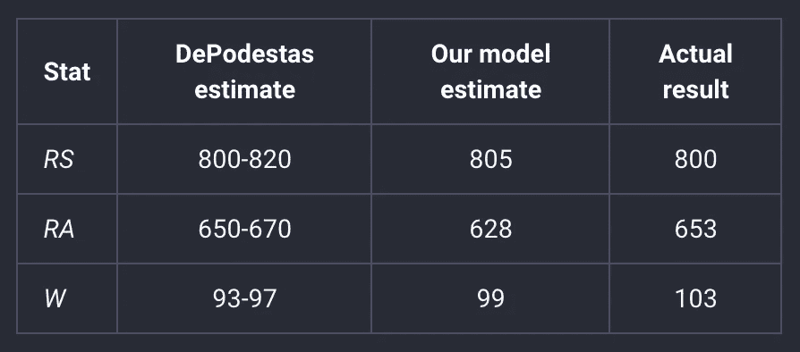

局限性:

当然，这个简短的项目有一些限制。举例来说:因为我们使用一个球员前几年的统计数据，所以不能保证他们会在同一水平。例如，老玩家的能力可能会退化，而年轻玩家可能会成长。同样重要的是要注意，我们假设没有人受伤。

除了局限性之外，模型的性能非常显著，确实支持了 DePodestas 的理论，并解释了为什么他使用的技术在奥克兰运动家队的“Moneyball”赛季结束后很快被整个棒球界大量采用。

非常感谢你阅读我的第一篇文章！我打算继续发这样的帖子，主要是利用数据分析和机器学习。欢迎任何反馈。