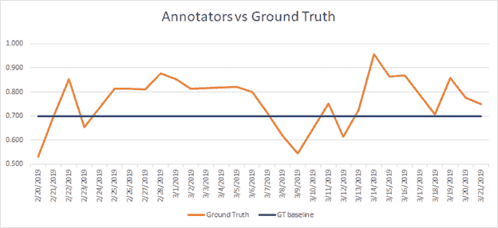
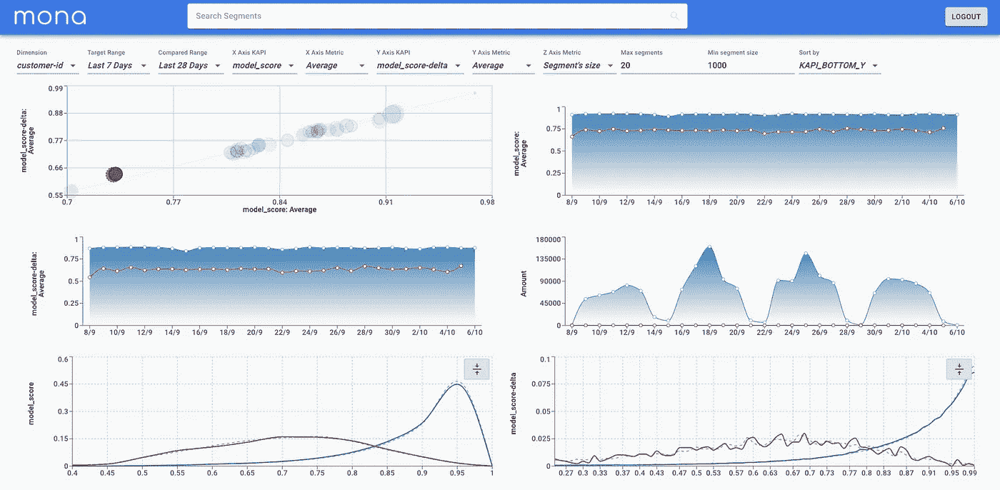
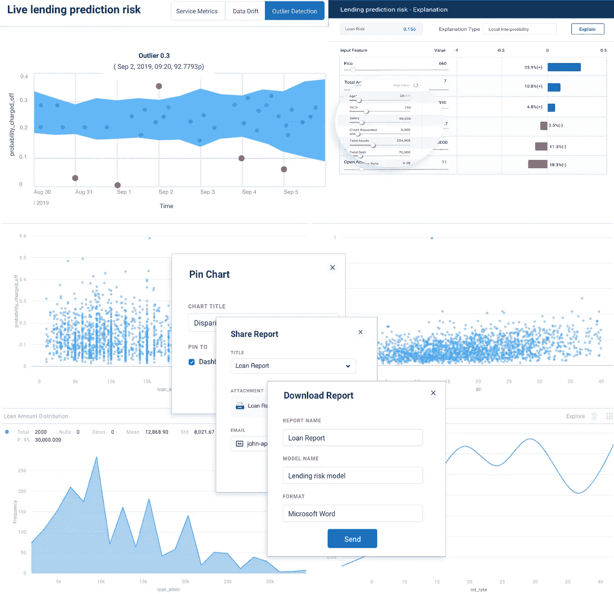
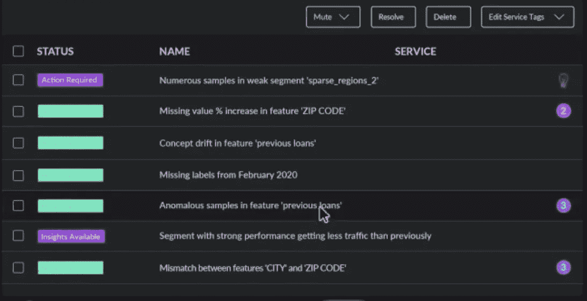
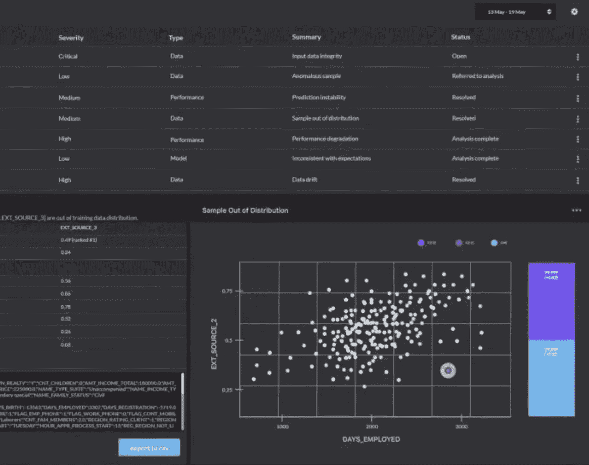
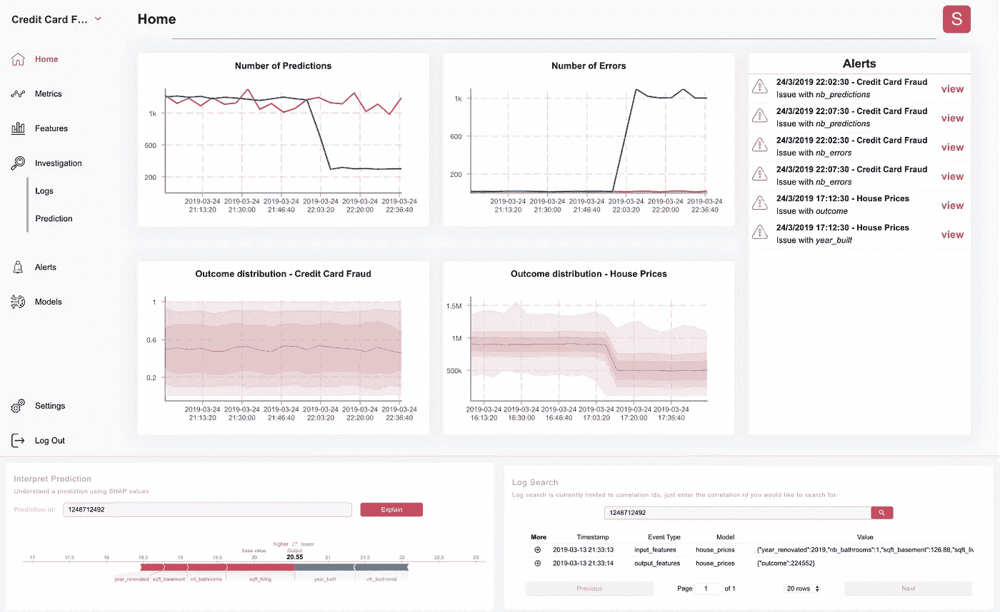
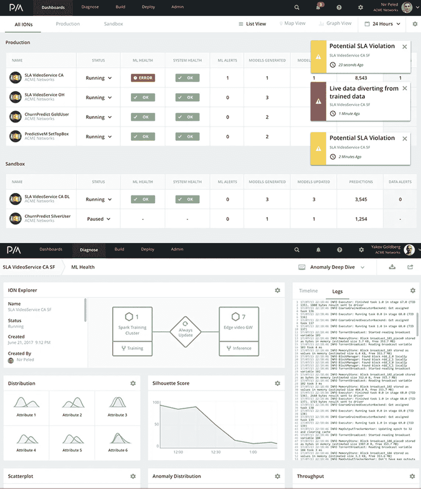

# 班长！不要再做一个盲目的数据科学家。

> 原文：<https://towardsdatascience.com/monitor-stop-being-a-blind-data-scientist-ac915286075f?source=collection_archive---------3----------------------->

The Shoemakers’ Children Go Barefoot, Alexander Mark Rossi.

## 监控和警报如何帮助您更好地控制您的数据，以及目前的实践情况如何。

下面的文章解释了许多用例以及监控和警报的巨大重要性，特别是从数据科学研究者的角度。我们将看看用例，并回顾几家试图为这个巨大的，但奇怪的是没有讨论过的，超越我们行业的问题提供解决方案的公司。

**2021 年 2 月更新:这篇文章似乎引起了一些关注，我会继续更新这篇文章的相关内容，如果有任何原因，请随时联系我。**

**2021 年 8 月更新:我添加了一个数据源用例
2022 年 12 月更新:我添加了成本/ci/cd 用例**

现代机器学习依赖于海量数据，我们在收集和保存这些数据方面已经相当成功，但我们还远远没有解决数据管理的最大难题之一。

我说的是每天了解你的数据，**我相信在我们的行业中，很少有科学家这样做。**简而言之，数据科学专业人士不知道他们的数据到底发生了什么。就注释而言，分发数据的每一段，分发缺失值和新值，分发标签，分发版本历史，包括包历史，等等。我们盲目地相信我们的数据，这是一种常见的做法，我亲眼目睹并亲身经历过。

由于环境的原因，许多创业公司从跑步开始，并随着时间的推移不断提高速度。可以理解的是，创建实现增长和为客户创造价值的模式非常重要，但从长远来看，我们忽略了一些非常重要的东西。事实是，了解我们的数据比一次又一次地更新你的模型更重要。

**扪心自问，你怎么知道你的数据可以信任？**没有信任，更新或创建新模型就没有意义，你可能会引入噪音并破坏你自己的工作。

另一方面，为我们投入生产的每个模型创建和维护多个仪表板视图是很麻烦的。观察统计指标的视图，如平均 Wasserstein-distance、零假设、F1、精度和召回或产品相关指标。我们不想创建额外的指标来观察我们的数据和模型，我们不想在我们的指标之上创建会发现异常和趋势的模型，我们真的不想每天照看我们的仪表板。

我们希望获得一个系统，它知道在事情发生变化时进行监控并向您发出警报，无缝、自动地进行监控，并根据机器学习算法获得预测性警报。可以检测故障或尝试提前预测未来故障的警报。在查看这些警报时，我们希望有一些解释，使用模型可解释性工具，如 [SHAP](https://github.com/slundberg/shap) 或[莱姆](https://github.com/marcotcr/lime)。

让我们看一些值得注意的用例。

## 用例

我遇到过几个数据监控和警报的用例，我肯定还有其他的，但是这些对作为数据科学家的你影响最大。名单是按时间顺序写的。

1.  注释者
2.  注释分布
3.  数据源
4.  数据完整性
5.  数据分布
6.  [依赖版本](/monitor-your-dependencies-stop-being-a-blind-data-scientist-a3150bd64594)，即包版本。
7.  型号版本
8.  模型参数
9.  模型度量
10.  业务产品指标
11.  模拟软件和硬件性能(基础架构和 CI/CD)
12.  成本监控

## 注释者

注释者通常是给你的数据贴标签的人，[你可以在这里阅读注释者度量标准](/the-definite-guide-for-creating-an-academic-level-dataset-with-industry-requirements-and-6db446a26cb2?source=friends_link&sk=a2590c2343b58ffa884d1c34722f55d2)。我们还可以使用算法来为我们做注释，无论是使用某种形式的启发式算法、系综、堆栈还是使用库，如[通气管](https://hazyresearch.github.io/snorkel/)。

Figure 1: [measuring Inter-agreement and Fleischer Kappa](/the-definite-guide-for-creating-an-academic-level-dataset-with-industry-requirements-and-6db446a26cb2), showing a signal correlation and a fixed threshold.

监控指标，如评分者之间的一致，自我一致性，地面真相的一致是必不可少的(图 1 和 2)，因为没有他们你不知道你的注释质量。

Figure 2: [measuring average annotators accuracy](/the-definite-guide-for-creating-an-academic-level-dataset-with-industry-requirements-and-6db446a26cb2) throughout time.

想象一下下面的情况，您有一个大多数投票决定标签的注释者群体，但是，出于某种原因，有几个注释者开始偏离最初的指令。在您不知道的情况下，您的注释最终会成为标签噪音，或者如果我们诚实的话，我们可以称之为注释错误。

> 如果你不能信任你的注释者，那么就不要使用注释

我们需要监控注释者度量，并在出现问题时得到警告，从而丢弃那些被标记为不好的数据，也就是说，我们不会将它放入最终的数据集中。

如果没有适当的监控和预测警报，您将无法及时捕捉到标签噪音，从而浪费大量资源，如时间和金钱，您会将噪音引入您的训练集，直接损害您的模型和您试图给予价值的客户。

如果您不监控由试探法或算法产生的注释，也会发生这种情况。对于这种基于算法的注释，请阅读下面关于数据分布、依赖版本、模型版本和模型度量的内容。

监控你的真实来源是数据链中最重要的事情。例如，如果你有一个被监督的问题，而你的标签是坏的，你将很难创建一个好的模型。这与监控数据或训练模型一样重要，有时甚至更重要。

## 注释分布

现在，我们相信可以信任我们的注释器，因为我们监控了它们的性能，并且丢弃了低于我们固定阈值的注释。虽然注释并不总是类标签(例如，命名实体)，但是让我们考虑一种情况，其中我们的注释是类标签，并且我们使用它们来解决监督问题。

Figure 3: a comparison of distributions (Mona labs)

当训练一个模型时，该模型是在某一类标签分布上训练的。监控生产中标签分布的概念漂移(图 3)可以通过使用 1。零假设或 2。平均[推土机距离(EMD)](https://en.wikipedia.org/wiki/Earth_mover%27s_distance) ，这是两个概率分布之间平均距离的度量，也称为[瓦瑟斯坦度量](https://en.wikipedia.org/wiki/Wasserstein_metric)。根据类的数量，零假设应该用于二元类或三元类，其中有[-1，0，1]，当有多个类时，应该使用平均 Wasserstein 距离。

> “如果你的实时标签分布与你的训练数据不同，那你就有问题了。立即采取行动！”

通常，您会实时比较训练集的标签分布和生产数据的标签分布。由于标签概念漂移，接收预测性警报可以挽救生命。(请注意，如果您的再培训策略基于主动学习，您可能会发现培训分布和实时数据之间的不规则性，这是由于从您的模型的最弱预测分布中选择样本的性质)。

例如，假设有这样一种情况，您训练了两个相似的模型，每个模型都训练了唯一的标签分布，但是它们密切相关，并且由于某种原因，发生了错误，并且部署了单个模型来服务所有数据流，而不是让适当的模型预测其自己的流。每个模型都有一个标签分布监视器，这将告诉您第一个模型的行为符合预期，而对于第二个模型，模型的训练数据分布与实时分布明显不同，这是一个关键问题。

监控标签分布也可用于触发事件，以便重新训练模型。当发行版自然发生变化或者添加了新的客户端时，标签发行版必然会发生变化。当您重新训练您的模型或调试各种问题时，拥有这些信息可以帮助您更好地控制，这也可以导致使用更少的资源。

## 数据源

您的数据源可能是管道中第一个最重要的东西。跟踪您的数据源是否已经更改、损坏或消失是非常必要的。监控系统应该保持跟踪，ping 健康状况，并确保您的数据源不会在一夜之间消失，并在发生时提醒所有相关的利益相关者。

> 如果你的数据源坏了，你就没有数据了！

## 数据完整性

您现在知道您的注释器和标签是完美的(希望如此)。或者，您可能正在处理一个无人监督的问题，并且不需要注释器或注释监控。是时候确保您的数据保持有序了。监控系统应该运行和管理您的数据，通过使用 [TDDA](https://github.com/tdda/tdda) 和[远大前程](https://github.com/great-expectations/great_expectations)等工具进行定制和自动测试驱动的数据分析，也就是说，系统应该审查您的数据并提出行动建议。

> "如果你的数据没有通过定期测试，你不能相信它！"

例如，系统应该在模式更改后提供警报，这可能是由自然或人工过程引起的。当列的类型可能由于新值而发生变化时，提供警报。处理无效、缺失或唯一的值等。在给定数据策略的情况下，应该使用数据治理将这些操作自动分配给负责人。监控服务应该观察数据趋势和异常，并在数据新鲜度(每日、每周)、数据结构、数据增长和统计概要文件出现问题时通知您。这可以确保您知道您正在利用多少基础架构，知道如何解决当前和不可预见的问题，并可以计算未来的支出。

## 数据分布

现在，您可以确信您的数据得到了妥善保管，并且具有高度的完整性。是时候确保您的数据分布不会发生剧烈变化，并且您的训练模型仍然可以提供看不见的数据。

Figure 4: a comparison of distributions over features, by parallemIM.

想象一下，你的数据有以下维度:时间、客户、类别和颜色。让我们数一数我们有多少个细分市场，时间是基于过去一年的一分钟分辨率，您有 2000 个客户，30 个类别和 3 个颜色类别。好吧，我们有太多的片段需要观察。最理想的情况是，我们希望使用一种服务来自动跟踪所有这些维度，而无需定义它们，并且该服务会在其中一个细分市场即将发生分布变化时提醒我们(图 4)。它将我们从使用 Datadog 或 Grafana 之类的服务构建专用仪表板中解放出来，并允许我们专注于研究。

> “如果您不能信任您的数据分布，那么就不要使用它来训练模型”

类似于注释分布，对于每个分段，我们需要使用相同的方法来确保没有概念漂移，并且我们必须调查特定变化的原因，或者重新训练模型以支持新的数据分布。请记住，我们希望这些警报是为我们自动定义的，不需要我们对每个警报进行微调，也不需要太多的误报。

## 依赖版本

大多数算法都基于几个依赖关系，并且每个算法都有自己的版本。版本在模型的生命周期中不断变化，如果您不跟踪您的版本，也就是说，您建模的正确算法的正确版本依赖将在您不知道的情况下以不同的方式执行。

**更新:我在下面的帖子** [**“监控你的依赖关系！不再做一个盲目的数据科学家”**](/monitor-your-dependencies-stop-being-a-blind-data-scientist-a3150bd64594)

Figure 5: black dots represent a dependency or model version checkpoint, this illustration is composed on top of an actual view by superwise.ai.

例如，想象一个表情符号到文本的包每天都在更新，你的 NLP 算法就是基于这种转换。新版本可能会支持新的表情符号，单词可能会映射到不同的表情符号。这是一个关键的变化，可能会导致模型以意想不到的概率预测错误的事情或预测正确的事情。

> 如果您不能跟踪您的依赖项版本，您就不能相信您的模型性能是确定的

为了保持确定性行为，我们必须记录我们投入生产的每个模型的所有依赖版本，如图 5 所示。当依赖关系改变时，监视器需要提醒我们。请注意，单元测试不会总是捕捉到这种行为。依赖项版本历史应该映射到您的预测中，这样您就可以快速、轻松地找出什么地方出错了。

## 型号版本

类似于依赖版本，知道正确的模型被插入到正确的数据是非常重要的。你不希望某天早上醒来，客户投诉，并指出工程没有正确部署模型。

> 如果您无法跟踪您的模型版本，就不能相信它部署正确

当您的 CI/CD 正在训练和部署新模型时，这种行为应该被自动报告，最好是基于实际的版本数字，但是也基于您部署的工件的差异。版本历史应该始终被连接并显示在您的模型预测视图上，这样当它出错时，您就可以找出哪里出错了，如图 5 所示。

## 模型参数

当模型版本变更时，它们会带来模型所用参数的变更。这些不仅仅是主学习算法的参数，这些可以是在我们的“元算法”中改变的各种参数。

> “如果你不能跟踪你的元模型参数，你就不能相信你的模型会像预期的那样运行”。

想象一个模型版本的变化，其中一个在研究阶段被测试的参数被意外地带入到产品中，并且这个参数导致了模型一致性的变化，与以前的版本相比。包括向我们的监控平台报告任何参数的方法将是有益的。

## 模型度量

我们喜欢看模型指标，它们告诉我们我们的模型有多好，我们可以对外传达这些数字。然而，这些数字依赖于上游事件，如标签、数据、成功部署等。

> “如果你不能观察你的模型性能，你就不能信任它。”

Figure 6: Model performance view by superwise.ai, showing accuracy, probability and F3.

精确度、召回率、F1 和 PRAUC 等指标描述了我们的成功或失败，因此我们非常积极地实时监控它们，如图 6 所示。对于无监督的算法，比如聚类，我们可以监控聚类同质性等指标。监控模型性能有助于我们理解什么时候事情开始出错，或者什么时候上游有变化。

## 业务产品指标

与模型性能类似，有一些度量标准被定义为项目的一部分，对业务和产品极其重要。这些指标不一定是我上面提到的经典指标。例如，您的模型被用作一个提示模型，您向您的客户展示基于前 3 个概率的前 3 个选择，类似于图 6 中发生的情况。您的产品 KPI 可能是基于前 3 个可能类别中的预测得分的准确性，当该数字低于 95%时，您将发出警报。观察这些指标对于您维护的健康产品或功能至关重要，并且监控它们是您所有权的一部分，尽管我认为业务和产品都需要能够查看它们。

> “如果你不能观察你的产品性能，你怎么知道你的 KPI 正在保持它的目标？”

理论上，有可能我们正在监控我到目前为止提到的一切，一切都很完美。然而，这些产品指标仍在直线下降。这可能意味着很多事情，但无法找到导致这些指标下降的原因是一个严重的问题。因此，当事情即将变坏时，获得预测性警报对于生产中的任何产品都至关重要。

## 模拟软件和硬件性能

通常是外部非数据科学服务的领域，比如 [New Relic](https://newrelic.com/) 。监控模型进程很重要，例如 CPU、GPU、RAM、网络、存储性能和警报，以便发现高负载或负载，如图 7 所示。这将确保您的模型可以在不中断生产的情况下继续在一个健康的系统上服务。

Figure 7: A typical dashboard by Graphana, showing Memory, CPU, Client Load, Network traffic.

## 监控功能

在研究提供 MLOps 或监控解决方案的公司时，您应该注意以下重要特性:

1.  黑盒集成—简单的单行回调，不会干扰您的研究或生产代码，并且可以无缝使用。
2.  持续监控—仪表板包括预测趋势或季节性的指标，以及叠加在监控信号之上的异常检测。
3.  现成的指标和警报—我们希望通过使用快速和预定义的 KPI 配置来立即进行跟踪。
4.  测试驱动的数据分析——我们希望使用数据测试，定期在数据基础架构级别发生不可预见的事件时自动获得通知。
5.  用户驱动的指标和警报—在 UI 中定义自定义 KPI 和维度的能力。这种方法能够监控一切，而不仅仅是“输入”/“输出”，并跟踪更复杂的测量(例如，两个分数之间的日平均差值)。
6.  预测警报—我们希望提前知道即将发生的事情。
7.  降噪—减少误报警报，同时仅在出现重大问题时发出警报，这可以通过使用规则、试探法、算法或预测模型来实现。
8.  自动基准测试—为每个新数据段(即数据的维度子集)识别和创建自动警报。想象一下，追踪数据集中的客户和类别要素，使用这些要素类型的每个组合都有自己的分布。知道某个类别何时开始表现不佳或对某个客户端漂移是一个游戏规则改变者，而不需要专门配置它。
9.  模型可解释性/可解释性——类似于 SHAP 和莱姆正在做的事情，这使我们能够理解为什么以某种方式预测某个输入，同时显示哪些特征有助于预测。此外，它应该允许我们利用特征值来理解它们对预测的影响。
10.  日志审计——谁不喜欢看日志？日志可以告诉我们许多关于正在发生的事情。
11.  偏差检测——不是我们都知道的机器学习*偏差*,而是一种偏差，例如偏向某个特定人群的模型。这种偏见检测可以帮助您符合 GDPR，并允许您处理对您的业务产生负面影响的问题。
12.  云或内部安装—通常，大多数公司都提供 SaaS 服务，但是，由于合同限制以及随之而来的内部安装，您可能需要将数据安全地存储在自己的基础架构中。

## 服务

幸运的是，一些公司已经明白我们需要工具和解决方案。我已经与三家公司进行了对话，他们正试图开发这些急需的工具。每个人都非常努力地尽快提供各种解决方案，他们通常由经验丰富的数据科学家或真正了解该领域的人领导，所以这已经是一个很大的承诺。我们确实需要为我们新出现的需求量身定制的解决方案。请注意，您应该始终包装源自第三方公司的代码，特别是在处理年轻的初创公司时，如果您使用开源解决方案，您应该记住，由于这一新兴领域的复杂性，客户或社区支持非常重要。

Figure 8: Superwise.ai diagnose, analytics and alert views.

1.  [超级](https://www.superwise.ai/)。ai——一家以色列初创公司，在我看来是目前功能最全的解决方案。它包括黑盒集成，可以连接到生产中的任何 ML 解决方案。它具有智能的&成熟功能，例如实时性能监控&分析，具有适合模型和数据统计的各种预定义 KPI，基于机器学习模型的预测智能，可学习和预测模型的性能，自动基准测试，自动处理&动作执行，开箱即用的解释和偏差检测，以及云或内部配置。(图 8)。
2.  [莫纳实验室](https://www.linkedin.com/company/mona-labs)——另一家非常有前途的以色列初创公司(不要与创造了个人购物者的其他莫纳实验室混淆)。莫娜实验室由三名前谷歌员工领导。Mona 能够从生产中的模型收集和分析数据，允许我们使用现成的指标评估生产中的模型质量，具有用户驱动的指标&警报、自动基准测试，能够检测数据漂移或模型偏差问题，允许您创建可操作的见解，降低数据完整性和云或本地配置的风险(图 9)。

Figure 9: Mona: top-shelf: data segmentation & KPI selection, top-left: a view based on the selection, others: KPI and KPI and distribution views.

3. [Fiddler.ai](http://fiddler.ai) —一家年轻的初创公司，提供模型可解释性，能够改变特征以了解它们的重要性，即查看哪些特征有助于模型预测。人在回路中的审计、仪表板、报告、属性比较、维度切片性能、偏差检测的特征跟踪、异常值的持续监控和数据漂移检测(图 10)。

Figure 10: Fiddler.ai views: top-right view show continuous model performance, the top-left view show model interpretability and playground, the bottom view shows dashboards and reports.

4.DeepChecks.com[，一家从隐形模式中崛起的新创公司。他们的网站谈论监督和控制我们的模型的健康、性能和稳定性。承诺一种端到端的方法来监控机器学习管道。跟踪原始数据，检查概念漂移和完整性问题。一个神秘的特性，承诺分析预处理代码，以实现数据转换的可见性，并提供额外的分析工具，以发现限制和薄弱环节。在图 10b 中，我们可以看到他们系统的未来版本将报告各种警报，如弱段、强段、流量减少的段(我假设流量也增加了)、缺失值、概念漂移、缺失标签、异常样本、流量和特征不匹配(看起来像是特征之间的负相关)。](https://www.deepchecks.com/)

Figure 10b: an automated alert window by DeepChecks.

在图 10c 和 10d 中，我们可以看到他们的警报摘要和分布外用户界面，以及基线基准与实际模型性能之间的比较，我怀疑这是基于用户的训练集或对其原始数据使用“auto-ml”方法的简单模型，不完全清楚它是否是 F1 等已知指标。

Figure 10c: alert summary and out of distribution UI by DeepChecks.

Figure 10c: a comparison between a baseline and the current model’s performance.

[5。Stakion.io](https://stakion.io/) —一家新的初创公司，承诺快速开箱即用的集成、持续实时监控、自动化警报、模型可解释性和日志审计功能(图 11)。

Figure 11: Stakion: The top-view shows continuous monitoring, The bottom-views shows alerts & log search.

5.Arthur.ai —另一家年轻的初创公司，他们专注于性能。可解释性，偏见。

6. [Arize](https://arize.com/) —一家从[monitor ml](https://monitorml.com)&[FairAI](https://www.thefairai.com/)创建的公司——提供模型和数据分布检查、概念漂移、特征分段分析、预测质量&可解释性(图 12)。

Figure 12: Arize’s model performance view.

7. [SodaData.io](http://sodadata.io) — Soda 的平台在这一领域非常独特，因为它是唯一一家以“数据完整性”相关用例为目标的初创公司。它们帮助数据工程师监控操作方面，如新数据分区的大小和新数据的预期到达时间。它们通过确保强制字段的 SLA 来帮助数据所有者监控业务方面。它们帮助分析团队监控使用需求，即确保分类值保持不变，并且数据分布不会随时间而改变。

[8。Seldon . io Deploy](https://deploy.seldon.io/docs/about/)——“Seldon Deploy 为机器学习部署提供监督和治理”，请[在 youtube 上看到](https://www.youtube.com/watch?v=QcevzK9ZuDg)。它们提供多臂-bandit、离群点检测、可解释性、偏差&概念漂移检测。他们正在使用 [Alibi Explain](https://github.com/SeldonIO/alibi) ，这是一个模型检查&解释库，用于分类和回归模型的黑盒、白盒、局部&全局解释方法的高质量实现。

9.[rescup . ai](https://www.snorkel.ai/platform/)—通过允许任何人以编程方式为端到端模型开发和部署流程标记、构建和扩充训练数据，利用分析和基本监控功能，利用流行的[rescup](https://www.snorkel.org/)库。

10.[Aporia.com](https://www.aporia.com/)—允许数据科学家快速配置高级生产显示器。他们专注于强大的 UX 和易用性，如图 12b 所示，显示了您可以多快地使用各种用例，如检测漂移、监控数据完整性问题、性能等。

Figure 12b: Aporia’s monitor builder UX.

## 面向部署的平台

这些公司将监控作为附件提供，所有这些公司都有一些基本的监控。他们主要关注模型开发、部署和服务。似乎您只能对那些只使用其服务部署的模型使用监控特性。

Figure 13: parallelmI views: deployment and model health, logs and distribution monitoring, etc.

1.  ParallelML —最近被 **DataRobot** 收购，专注于部署和生产规模。它集成了 Jupyter，Python 到 Docker，Spark，Git，Bitbucket，Cron。提供数据漂移检测、自动模型训练和预测，承诺轻量级占用空间和可伸缩性，具有 150 个监控属性和日志审计功能(图 13)。需要注意的是，在重新训练时，你不应该使用所有的新数据，在添加你不信任的数据时，你应该小心谨慎。因此，我建议 ParallelIM 应该描述他们的再培训政策(或规则？)进行自动模型训练。
2.  [hydro sphere . io](https://hydrosphere.io/)——“数据科学和机器学习管理自动化的开源平台。承诺生产中 ML 和 AI 应用的可靠性、可扩展性和可观察性。”。水圈具有基本的可观测性特征，如统计检查、异常检测等。
3.  ML flow—“ML flow 是一个管理 ML 生命周期的开源平台，包括实验、再现性和**部署**。它目前提供三个组件:1 .MLflow 跟踪—对记录和查询(如代码、数据、配置和结果)进行实验。2.MLflow 项目——可在任何平台上重复运行的打包格式，以及 3 .MLflow 模型——将模型发送到不同部署工具的通用格式。
4.  IBM Watson Open Scale——“是一种工具，可以在人工智能的整个生命周期中跟踪和测量人工智能的结果，并根据不断变化的业务情况调整和管理人工智能——用于在任何地方构建和运行的模型。”
5.  sel don . io——“是一个开源的面向 Kubernetes 的机器学习部署，管理、服务和扩展在任何框架中构建的模型。”

当监控的需求变得明显时，您应该列出对您来说重要或将重要的功能，并找到符合大多数条件的解决方案。始终与您的解决方案提供商进行对话，我强烈建议与以技术为导向的人交谈，特别是如果他们是初创公司的一部分，因为您的个人使用案例可能与他们提供的预期解决方案略有不同，对他们来说支持它可能很重要。

我真心希望这篇文章在您需要适应和实现以数据科学为中心的监控服务时发挥重要作用。如果您有更多的想法和信息，请随时在下面发表评论。

我要感谢我的同事们，[阿龙·尼塞尔](https://medium.com/@alonisser)、谢伊·耶海兹克尔、阿米特·艾纳夫、西蒙·索默-雅科夫、[纳塔内尔·达维多维茨](https://towardsdatascience.com/@ndor123)、[塞弗·凯勒](https://medium.com/@sefikeller)、[萨缪尔·杰弗罗金](https://medium.com/@samueljfk)和其他人，你们知道你们是谁，对这篇文章的评论。

Ori Cohen 博士拥有计算机科学博士学位，主要研究机器学习。他是 TLV 新遗迹公司的首席数据科学家，从事 AIOps 领域的机器和深度学习研究。