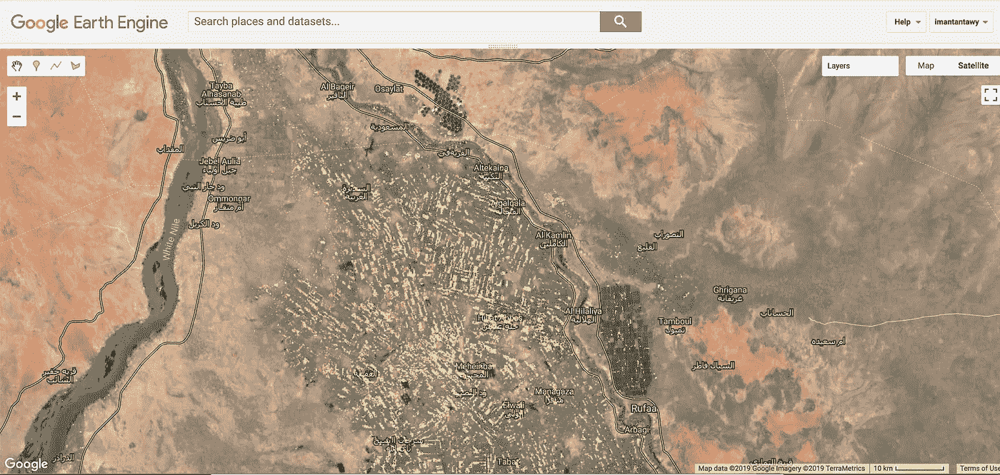
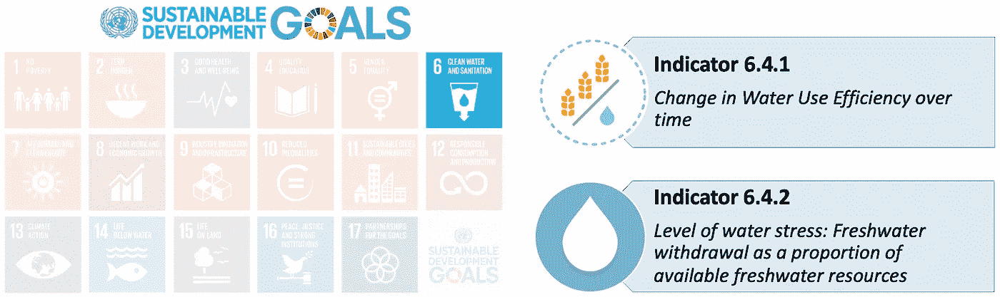
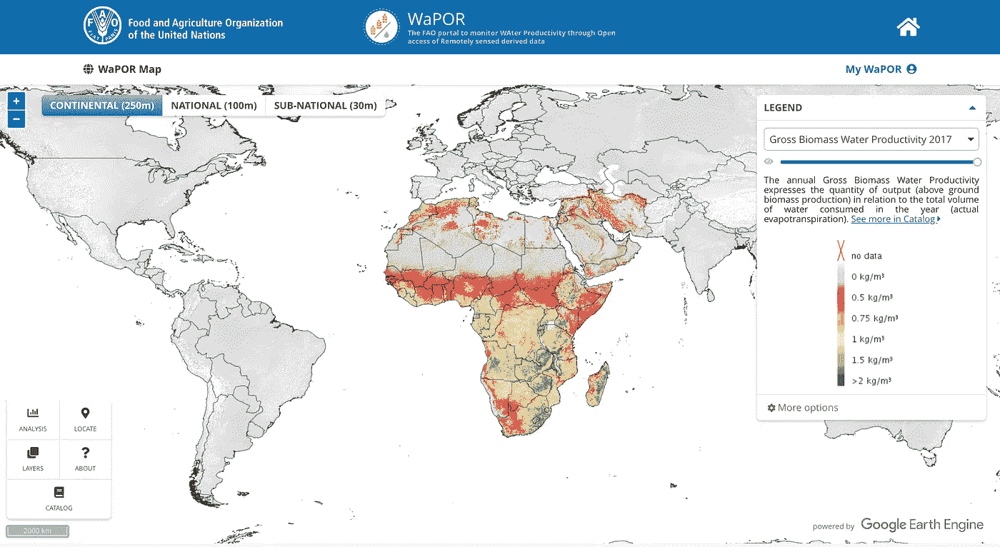
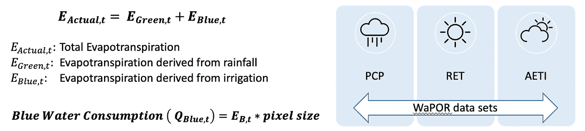
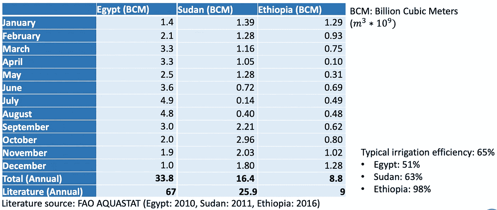
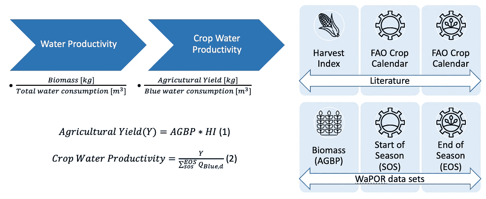

# 利用谷歌地球引擎和粮农组织 WaPOR 数据监测非洲缺水情况(可持续发展目标 6.4)

> 原文：<https://towardsdatascience.com/monitoring-water-scarcity-sdg-6-4-in-africa-with-fao-wapor-data-and-google-earth-engine-af59af531c1f?source=collection_archive---------15----------------------->

## 监测农业用水效率的重要性

Crop Water Productivity of Sorghum in the Gezira scheme, Sudan (2015) visualized in Google Earth Engine by Author

在二十世纪，随着水需求以两倍于人口增长率的速度增长，缺水正成为一个日益严峻的挑战。2015 年 9 月，世界大多数国家通过了 2030 年可持续发展议程，包括 17 个可持续发展目标和 169 个具体目标。**目标 6.4 涉及用水效率和水压力。为了跟踪进度，制定了******两个指标。****

> **到 2030 年，大幅度提高所有部门的用水效率，确保可持续抽取和供应淡水以解决缺水问题，并大幅度减少缺水人口数量
> —可持续发展目标 6.4**

****

**Sustainable Development Goal 6.4 and its indicators to address water scarcity**

**农业是非洲未来的关键。非洲大陆拥有世界上最大的可耕地，一半以上的人口在农业部门就业，是国内生产总值的最大贡献者。此外，撒哈拉以南非洲有最多的缺水国家，据估计，到 2025 年，该大陆将有超过 28 亿人面临缺水状况。**

**因此，政府应强调改善其水资源管理做法。为了实现这一点，**良好和充分的数据是必要的。****

**由于农业占全球淡水提取量的 70%,**灌溉被认为是世界上最大的耗水活动**,因此具有提高用水效率的巨大潜力。那么，如何具体说明指标 6.4.1 和 6.4.2，以便对当前灌溉农业做法进行深入评估呢？有鉴于此，联合国粮食及农业组织(粮农组织)制定了一项绩效指标，将粮食生产与水消费联系起来；所谓的**水分生产率定义为农业产量[kg]与其生产所用(或消耗)的水量[m3]之比**。**

**评估水分生产率差距是一项复杂的任务，包括监测各种作物生产系统的当前生产率水平，并将这种生产率水平与潜在生产率水平进行比较。地理空间数据可以提供工具来监测和可视化这些具有高度空间可变性的过程，从而改进决策。因此，粮农组织[推出了 WaPOR 数据门户网站](https://wapor.apps.fao.org/home/1)，该网站免费并**开放获取经过处理的地球观测(EO)数据，包括整个非洲和中东地区近实时的实际蒸散量(ET)和生物量产量。**随着粮农组织 WaPOR 数据门户网站的启动，对非洲大陆水文过程和生物量生产的了解显著增加。**

****

**[FAO WaPOR portal](https://wapor.apps.fao.org/home/WAPOR_2/1)**

# ****可持续发展目标指标 6.4.2:水分胁迫****

**淡水提取可通过蒸散量数据进行评估，将总蒸散量分为所谓的绿水和蓝水蒸散量。来自绿水的蒸散量是来自渗入土壤的降雨，而来自蓝水的蒸散量是由于使用了人工基础设施，如用于灌溉的水泵。**因此，所谓的蓝水消耗量可以与指标 6.4.2 联系起来:测量淡水提取量。****

****

**Deriving blue water consumption with WaPOR datasets — Author’s thesis content**

**蓝水消耗量可以通过基于[水核算+模型](http://wateraccounting.org/index.html)的公式框架得出，该模型由[IHE-代尔夫特](https://www.un-ihe.org/)开发。然而，使用标准编程方法(如 Python 的 GDAL 包)在单个设备上以高分辨率(100 m)计算国家级别(大空间尺度)的蓝水消耗量被证明是不够的。此外，数据在类型、分辨率和感兴趣区域方面的特征变化很难处理。有了 Google Earth Engine，可以在更高的时间和空间尺度上进行处理，从而可以在政策层面上提供可操作的信息。从 ET 中提取的淡水可在国家、地区和地方范围内以高分辨率按月计算。通过将该数据与现场和田间水平测量值进行比较，**灌溉效率的热点和异常可以很容易地定位。****

****

**Monthly water fresh water withdrawals for irrigation purposes in the Eastern Nile Basin Countries (2016) — Calculated with Google Earth Engine by author**

# **可持续发展目标指标 6.4.1:一段时间内的用水效率**

**灌溉作物水分生产率可通过将农业产量[kg]除以消耗的蓝水总量[m3]获得。使用 WaPOR 数据，可以在像素级别上推导和计算农业产量以及蓝水消耗量。**

****

**From Water Productivity to Crop Water Productivity with the available WaPOR datasets and literature**

**为了获得农业产量，将地上生物量产量(AGBP)乘以作物收获指数，该指数是根据物候学数据确定的作物得出的。为了确定像素的具体生长季节，将所谓的季节开始(SOS)和季节结束(EOS)物候数据结合起来。随后，SOS 和 EOS 之间的差异提供了作物生长季节期间的总蓝水 ET。这样**，就可以得到作物水分生产率，并与指标 6.4.1** 联系起来**

# ****弥合政策和技术之间的差距****

**使用 EO 数据是评估水利用效率的一种强大且具有成本效益的技术，因此在国际上被公认为支持可持续发展目标 6.4。由于政府有责任确保全国范围的水安全，农业用水生产率的提高应该来自政策制定者和决策者，而不是农民。**

**然而，事实证明，需要广泛的方法和基础设施来促进道德操守办公室的适当实施，以支持政策制定者和决策者。**通知并鼓励地方政治组织在各自国家实施地理空间工作至关重要。**没有他们的参与，许多衍生的数据和信息将留在科学和研究领域。**

**为了接触到最终用户，需要确定与可持续发展目标相关的行为者、竞技场和道德操守办公室的实际贡献。Google Earth Engine 和 FAO WaPOR 门户网站等工具和(预处理)数据源为弥合政策和技术之间的差距提供了能力和框架。然而，仍有一些挑战需要克服。**

**如有疑问或需要更多信息，欢迎给我发电子邮件:
伊曼坦塔维【at】gmail.com**