# 设置关于 AWS Lambda 数据管道的自动警报

> 原文：<https://towardsdatascience.com/monitoring-your-aws-lambda-pipeline-with-automatic-notifications-fe4e06fd3f58?source=collection_archive---------2----------------------->

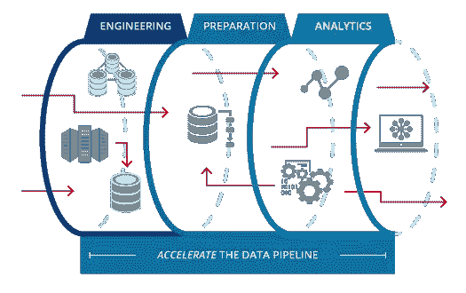

用 AWS Lambda 开始收集数据很容易——你实际上可以在几分钟内**自动化一条数据管道。但是接下来会发生什么呢？理想情况下，您的代码可以正常工作，但是我们都知道最终会出现某种类型的错误，并且因为您的数据管道非常自动化，所以很容易忽略它。输入 CloudWatch 及其警报！让我们回顾一下，相对于必须定期检查，我们如何才能尽可能地懒惰，在出现问题时被告知。**

**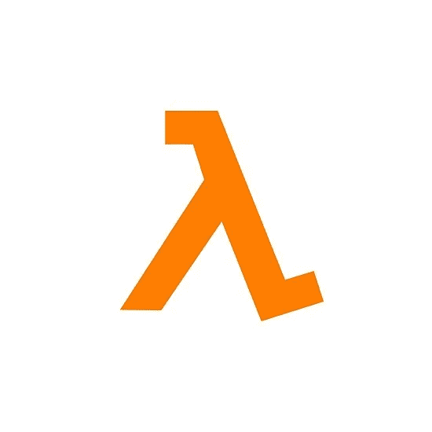**

****AWS Lambda is your serverless swiss army knife****

# ****什么是 AWS Lambda？****

**这是强制性的介绍，我需要用两段来解释一些复杂的东西！很快，让我们从 10，000 英尺的高度概述一下 AWS Lambda，以及为什么每个数据科学家都应该使用它:**

*   **AWS Lambda 是 AWS 上的无服务器计算服务。酷……那是什么意思？用普通人的话来说，它让你以最小的努力在云中运行你的代码。不需要设置 web 服务器、EC2 实例等——在 SublimeText 中编写代码，然后粘贴到 Lambda 中(稍作调整),就可以开始了！AWS 将在云中为你执行你的代码，你甚至可以使用你的外部库(尽你所能导入熊猫作为 pd！).**
*   **它支持多种语言。 Java，Go，PowerShell，Node.js，C#，Python，Ruby 都支持。**
*   ****可以通过多种方式触发。**想让你的 Lambda 每小时跑一次？一天一次？当一个物体被放入 S3。当数据流进入 Kinesis 时。当太阳位于正交 37.312 度时。Lambda 的一个很大的特点是你可以触发它以多种方式运行，当然这些触发器中至少有一个会满足你的用例。**
*   ****便宜的离谱。**对于 Lambda，你按请求(你的函数运行的次数)和计算时间付费。在免费层，你每月有一百万个请求和 400，000 GB 秒，这基本上意味着你每月可以免费做很多事情。即使你真的浏览了，那也是每一百万次请求 20 美分。根据我在餐巾纸背面的计算，你可以执行超过 2000 万个 Lambda 函数，只需要你早上喝一杯冷饮的钱——这是多么美好的时光啊！**

# **Lambda 数据管道——设置好就忘了？**

**在我的上一篇 [**中型文章**](/make-data-acquisition-easy-with-aws-lambda-python-in-12-steps-33fe201d1bb4) 中，我们介绍了如何用 Python 建立一个 Lambda 数据管道，该管道将每天从 Craigslist 上收集一次公寓列表数据。在一个完美的世界中，我们可以“设置它，忘记它”，并在我们的定期间隔获取数据。看过《权力的游戏》最后一季的人都知道我们并不是生活在一个完美的世界里。如果你编程的时间超过一分钟，你就知道会有错误发生:超时，Craigslist 可能不可用，你的解析器可能遇到一些被遗弃的表情字符，导致它崩溃，等等。因此，虽然我们不能完全设置它并忘记它，但我们可以设置它，只有在出现问题时才会联系它。这是通过警报完成的，但首先我们需要设置监控。**

# **设置监控**

**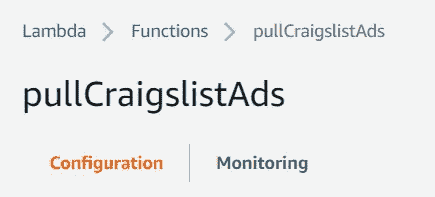**

**如果你已经创建了一个 Lambda 函数，你会注意到在顶部有两个主面板:**配置**和**监控**。**配置**是您实际更改 Lambda 函数的地方:更改触发器、更改实际代码、调整超时等。**监控**是你检查一切是否顺利的地方。在这里你可以看到诸如是否有错误，Lambda 函数运行的次数等等。**

**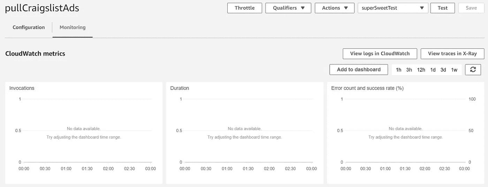**

**但是，如果您转到**监控**选项卡，您会注意到默认情况下有许多空图表。这是因为监视 AWS 服务的工具 CloudWatch 不会自动跟踪您的 Lambda 函数指标。**

# ****将 CloudWatch 指标添加到 Lambda 函数中****

**这里的实际问题是你的 Lambda 函数只需要发布到日志的许可。为什么这是默认设置？我不知道，但是让我们改变它。基本上你需要做的是附加一个策略，让 Lambda 发布到日志中。**

> ****快速说明:**AWS 中的权限可以是它自己的一系列文章，但是一个好的经验法则是假设字面上没有任何东西有做任何事情的权限。就像国会一样。在这个例子中，我们有我们的 Lambda 函数，它不能发布到我们的 CloudWatch 日志，除非我们说“嘿 Lambda，你可以发布到 CloudWatch！”。Lambda 是服务而不是人(duh)，所以服务获取权限的方式是通过角色。角色基本上是说“如果一个服务有这个角色，它可以做 X，Y 和 Z”。“X”、“Y”和“Z”是策略。政策规定你可以写信给 S3，查询红移或者发布到 CloudWatch。一个没有政策的角色什么都做不了，一个附加了政策的角色其实可以为我们做事。总而言之，服务有角色，角色有策略。策略实际上是给予做事情的许可，所以每个角色都有允许这些角色做酷事情的策略。一点都不困惑，对吧？你最终会找到窍门的。**

**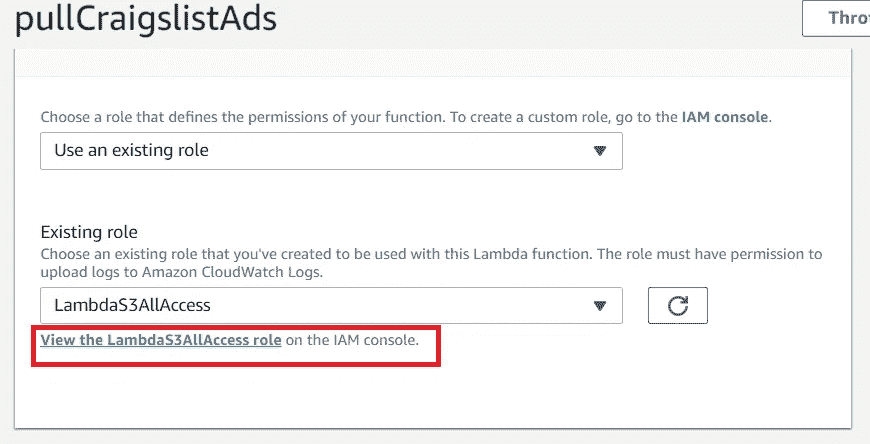**

*   ****第一步:**在配置页面上，转到 Lambda 函数正在使用的角色，然后单击查看角色。你的名字和我的会有所不同。**

**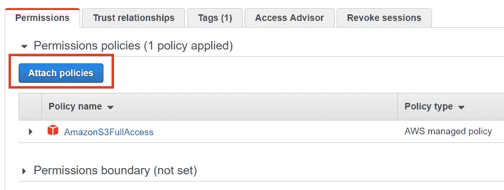**

*   ****第二步:**点击“附加策略”按钮，附加新策略。这将为我们的 Lambda 函数添加更多权限，这将允许它访问 CloudWatch 指标。**

**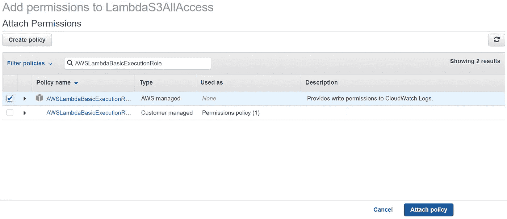**

*   ****第三步:**你需要的 CloudWatch 指标的角色叫做“AWSLambdaBasicExecutionRole”。如果您在搜索栏中搜索该角色，请单击名称左侧的复选标记(以应用它)，然后单击“Attach Policy ”(附加策略),您将把该策略添加到您的 Lambda 函数中。**

**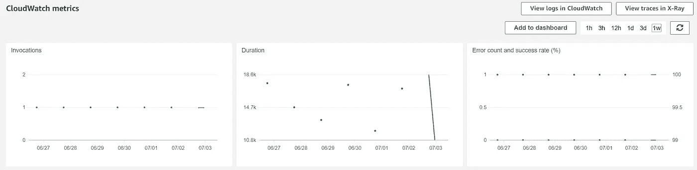**

*   ****第四步:**现在，Lambda 函数的 **Monitoring** 选项卡中已经有了指标！默认情况下，这会显示关于 Lambda 的重要指标，比如调用(函数运行的次数)、持续时间和错误计数。万岁。**

# **设置出错时自动发送电子邮件**

**现在，我们有了进入 Lambda 函数的**监控**页面的指标。这与没有度量相比是一个进步，但是这仍然让我们处于这样一种情况，即我们的功能可能会失败，而我们不会注意到，除非我们定期检查这个图表(这很烦人)。理想情况下，我们只在 Lambda 函数失败时得到通知，然后我们可以去调查发生了什么。为此，我们可以再次依赖 CloudWatch。最后一列步骤太有趣了，让我们再做一次吧！请注意，这看起来像很多步骤，但第一次应该花不到 10 分钟，以后每次大约 2 分钟。**

**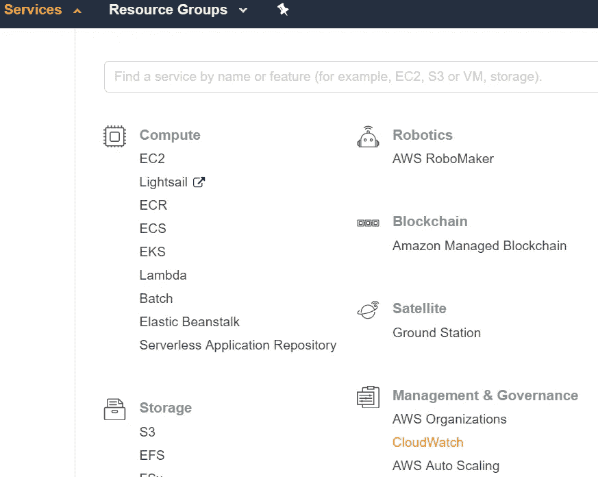**

*   ****第一步:**上 CloudWatch。你可以从顶部导航进入**服务- >管理&治理- >云观察****

**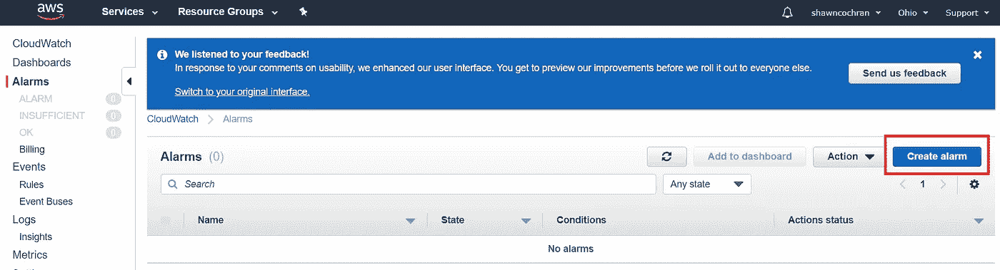**

*   ****第二步:**点击左侧面板上的报警，然后点击右侧的“创建报警”按钮。**

**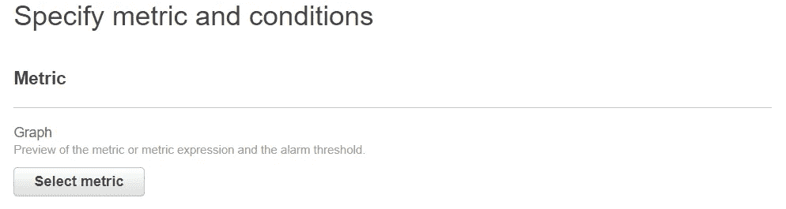**

*   ****第三步:**单击“选择指标”选择将触发我们的警报的指标**
*   ****第四步:**选择“λ”**
*   ****第五步:**选择“按函数名”**

**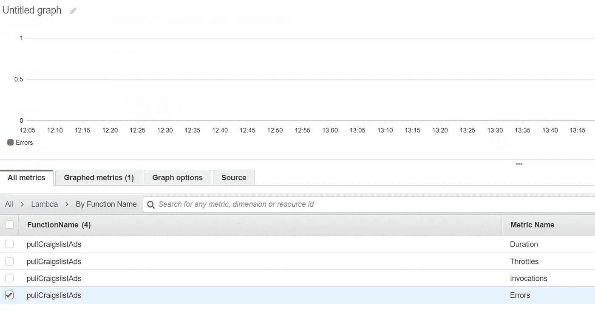**

*   ****第六步:**找到你的 Lambda 的函数名。如果你只有一个 Lambda，这将很容易，但一旦你开始建立你的庞大的无服务器计算帝国，这将变得非常拥挤。您将看到每个函数名称的几个条目，因为在 Metric Name 下有几个选项。您可以使用多个指标来触发警报，但我们想要的是错误触发。因此，您想要的度量名称是 Errors (duh)。选择它，然后选择左下方的“选择指标”。**

**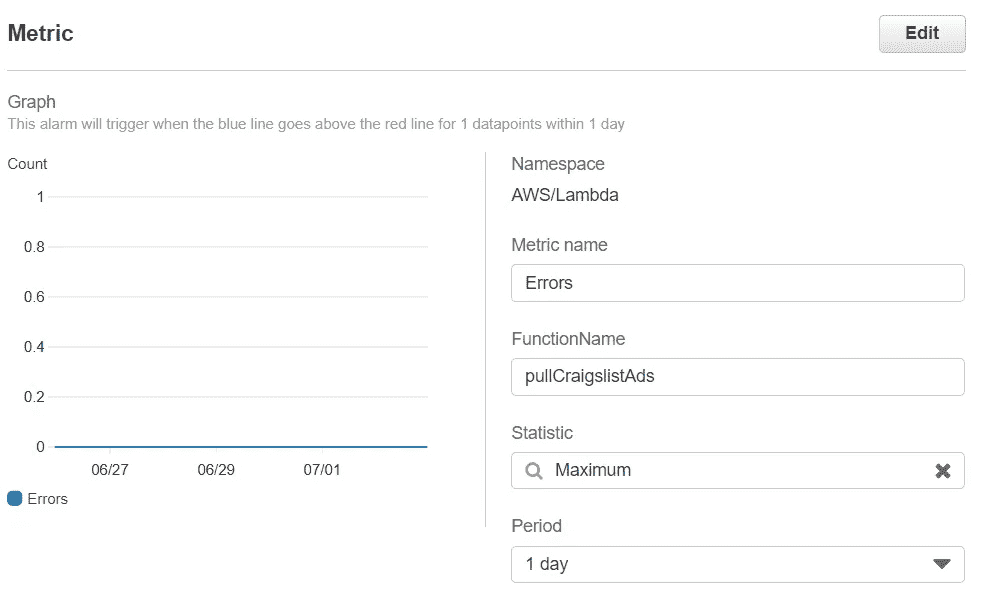****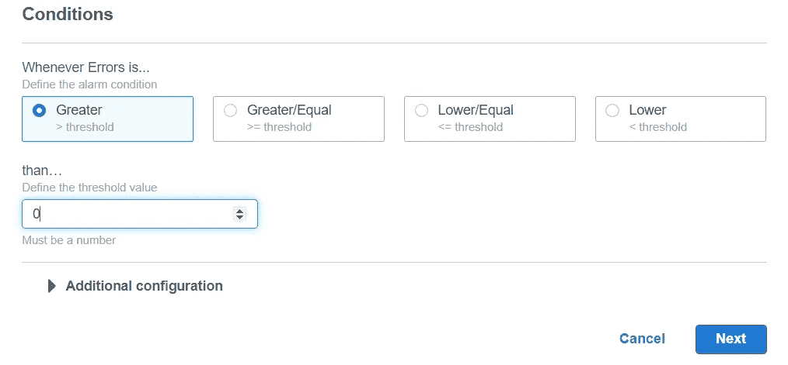**

*   **第七步:这一步太激烈了，拍了两张照片！是时候配置什么会真正触发我们的警报了。有很多方法可以触发警报，这只是我使用的方法。请注意，在这个屏幕上，左侧是用来触发警报的图表。在我们的例子中，这是我们的误差图，为 0，因为我们没有任何误差(万岁！).无论如何，对于这个例子，我们需要设置三样东西:**条件**、**统计数据**和**周期**，所有这些都与那个图表相关。先说**条件**。这是图表上我们想要触发警报的条件。这里我们将它设置为“大于 0”。基本上，如果我们的图表有一个大于 0 的值(大于 0 个错误)，我想知道它。转到**统计**:在这种情况下，由于我们的条件，这真的无关紧要。如果我们有 0 个以上的错误，平均错误计数将大于 0，最大值和总和也将大于 0，因此您可以选择任何一个。如果您关心的是执行时间之类的东西，您可能想知道平均时间是否超过某个值，那么这就更重要了。**周期**是测量警报的频率。这里我们选择每日，因为我们的 Lambda 是每日触发。也就是说，如果一天中的最大值大于 0，那么我们需要知道它。如果你还不明白的话，这是一个很好的解释。结合这些功能，我们有一个警报，每天跟踪数据点，如果错误图表上的最大值大于 0。用人类的话来说，如果一天中有一个数据点超过 0，那么就要敲响警钟了。输入后，单击“下一步”。**

**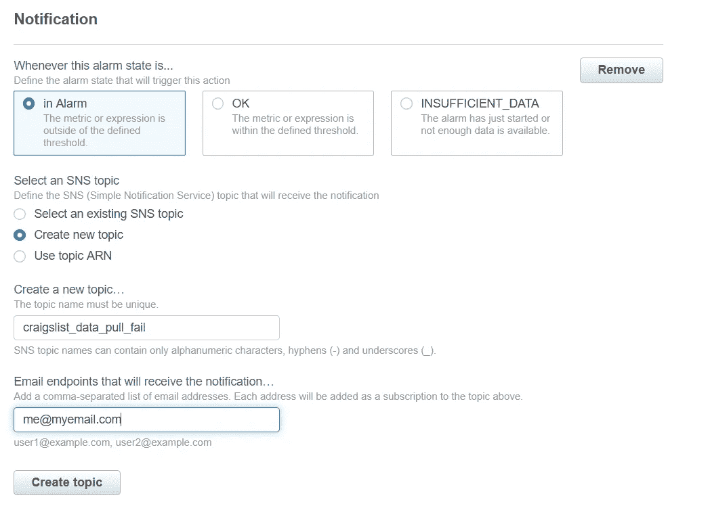**

> ****什么是 SNS？被称为 AWS 的庞然大物有许多很酷的功能，其中之一就是简单通知服务，或 SNS。基本上，如果你想就 AWS 上发生的事情联系一个人，你可以使用 SNS。想想我们当前的例子，如果有东西坏了，我们想给人发电子邮件。这是社交网络的众多用途之一。它的工作方式是你创建“话题”，比如“我的 Lambda 着火了！！!"人们可以订阅这个话题。因此，每当有内容发布到该主题时，订阅者都会收到通知。可以把它想象成一份 AWS 时事通讯。****

*   ****第八步:**创建 SNS 话题的时间。基本上，这就是当闹钟响起时，你可以收到电子邮件、短信或其他形式的交流方式。给你的闹钟起一个名字，表明这个闹钟的用途。如果你只有一个或两个警报，它的用途可能很明显，但是当你扩展到几十个或几百个警报时，可能就不那么清楚了，所以给它一个描述性的名字。然后只需添加您的电子邮件并点击“创建主题”按钮。**

> ****注意:**您将收到一封确认电子邮件，告知您想要订阅 SNS 主题。在你确认之前，你不会收到提醒邮件。这是为了防止像我这样的坏人为我的 AWS 警报注册可怜的陌生人。只是开玩笑，但你真的需要确认，否则你不会得到你的闹钟，然后你只是浪费了一堆时间阅读这个漫长的教程没有意义！**

**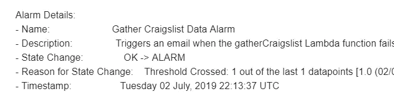**

*   ****第九步:**为你的闹钟添加名称和描述。这包括在电子邮件的正文中(上面的例子)，所以一定要描述清楚，这样你就知道你的警报到底在说什么了。**
*   ****第十步:**确认一切设置妥当，点击“创建警报”。现在你应该都准备好了！**

# **测试您的警报**

**可能有一个更复杂的方法来做这件事，但通常我会去我的 Lambda 函数，告诉它在第一行打印一些未定义的变量。进行更改，保存 Lambda 函数，然后单击“测试”。这将调用您的 Lambda，当它失败时，您应该会收到警报(可能需要几分钟)。当你看到警报正常工作后，一定要消除这个有意的错误。如果您没有收到警报，请确保您确认了 SNS 主题订阅，并且正确设置了阈值(步骤 7)。**

# **我的闹钟看起来像什么？**

**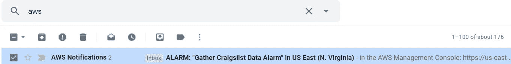**

**假设我的说明并不糟糕，并且你正确地设置了闹钟，那么每当出现错误时，你都会收到来自 AWS 的电子邮件。它看起来与上面的类似，唯一的区别是报告的区域和名字被替换为你调用的函数。在电子邮件中，你会得到更多的细节，比如错误发生的时间，错误与哪个 Lambda 函数有关，等等。**

# **摘要**

**我们不能期望我们的代码总是正确执行。我们也不能总是检查它，尤其是如果它每小时甚至每分钟都在运行。Lambda 配备了 CloudWatch 警报，可以很容易地知道什么时候出现了问题，这样我们就可以进入那里进行调试。我强烈建议您利用 CloudWatch 警报来维护快乐健康的数据管道。和往常一样，如果你觉得这篇文章有用或者有任何问题，请随时在 LinkedIn 上联系我。流水线作业快乐！**