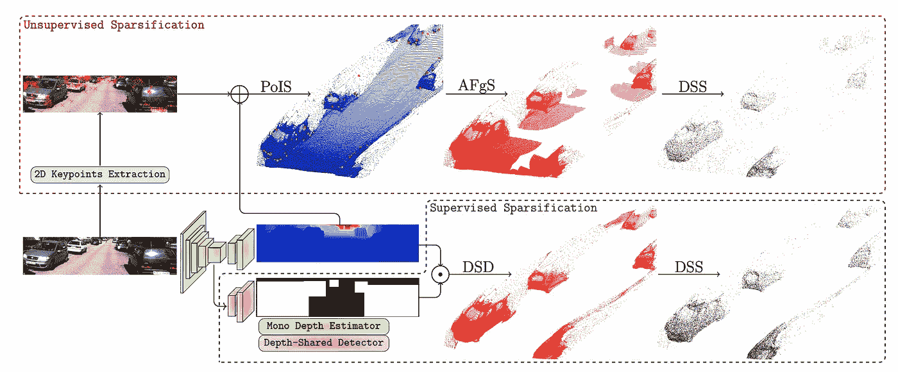
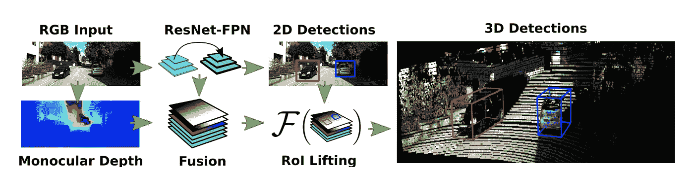
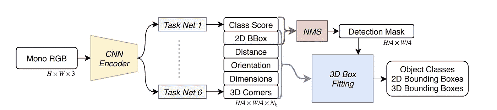

# 自动驾驶中的单目三维物体检测——综述

> 原文：<https://towardsdatascience.com/monocular-3d-object-detection-in-autonomous-driving-2476a3c7f57e?source=collection_archive---------3----------------------->

这篇博文是实时的，随着更多论文的发表，我会更新它。

更新:

*   添加 RTM3D(2020 年 1 月 15 日)
*   从 mapi pile 添加虚拟摄像机(2020 年 2 月 16 日)
*   添加分离的结构化多边形(2020 年 3 月 21 日)
*   添加改进的 MPL(2020 年 3 月 22 日)
*   添加买方公寓(2020 年 6 月 4 日)
*   添加烟雾(2020 年 6 月 5 日)
*   补充地球不是平的(06/28/2020)
*   添加 D4LCN(2020 年 8 月 22 日)
*   TODO:添加(伪 LidarV3、ZoomNet、ApolloCar3D、6D-VNet 和 PartParse)

三维物体检测是自动驾驶的一项重要任务。自动驾驶中的许多重要领域，如预测、规划和运动控制，通常需要对自我车辆周围的 3D 空间进行忠实的表示。

Monocular 3D Object Detection draws 3D bounding boxes on RGB images (source: [M3D-RPN](http://cvlab.cse.msu.edu/project-m3d-rpn.html))

近年来，研究人员一直在利用高精度**激光雷达点云**进行精确的 3D 物体检测(特别是在 [PointNet](https://arxiv.org/abs/1612.00593) 的开创性工作展示了如何用神经网络直接操纵点云之后)。然而，激光雷达也有其缺点，如高成本和对不利天气条件的敏感性。利用 RGB 摄像头执行单目 3D 物体检测的能力也增加了模块冗余，以防其他更昂贵的模块出现故障。因此，如何仅用一幅或多幅 **RGB 图像**进行可靠和准确的 3D 感知仍然是自动驾驶中感知的圣杯。

单目 3D 物体检测( **mono3DOD** )并不是一个新的想法，但最近人们对这个话题的兴趣激增。我希望在 2020 年看到更多的论文问世，因为基于激光雷达的方法和基于图像的方法之间的性能差距仍然很大。

Increasing amount of efforts in literature on monocular 3D object detection in Autonomous Driving

## (相对)详尽的调查

这篇文章回顾了单目 3D 物体检测这一关键任务的最新进展。在这篇文章中，我回顾了截至 2019 年 11 月的 32 篇关于这一主题的论文(编辑:这篇博客文章是实时的，随着更多论文的发表，我将更新它)。这是文献中关于 mono3DOD 的所有论文的一个比较完整的综述。论文大致分为四类:**表示转换、关键点和形状、基于 2D/3D 约束的几何推理、**和**3D bbox 的直接生成。**注意，一篇论文通常跨越多个类别，因此分组标准不严格。

A relatively comprehensive list of papers on Mono 3DOD as of 2019/11

对于论文摘要的表格视图，请参考我的 github 页面或这个 [google doc 电子表格](https://docs.google.com/spreadsheets/d/1X_ViM-W4QbHPbJ2dHouRgkRAyzEnBS6J_9VxPEXvDM4/edit?usp=sharing)。

 [## 帕特里克-llgc/学习-深度学习

### 深度学习和机器学习的论文阅读笔记—Patrick-llgc/Learning-Deep-Learning

github.com](https://github.com/patrick-llgc/Learning-Deep-Learning/blob/master/paper_notes/review_mono_3dod.md) 

# 将 2D 提升到 3D？艰难但易驾驭

从 2D 图像中检测三维目标是一项具有挑战性的任务。这从根本上来说是不适定的，因为深度维度的关键信息在 2D 图像的形成过程中被折叠了(更多背景信息请参见我之前的帖子[将 2D bbox 提升到 3D](/geometric-reasoning-based-cuboid-generation-in-monocular-3d-object-detection-5ee2996270d1) )。然而，在特定的条件下，并且具有强有力的先验信息，这个任务仍然是易处理的。特别是在自动驾驶中，大多数感兴趣的物体，例如车辆是具有公知几何形状的刚性物体，因此可以使用单目图像来恢复 3D 车辆信息。

# 1.表示变换(BEV，伪激光雷达)

摄像头通常安装在一些原型自动驾驶汽车的车顶上，或者像普通仪表板摄像头一样安装在后视镜后面。因此，相机图像通常具有世界的**透视图**。这个视图对于人类驾驶员来说很容易理解，因为它类似于我们在驾驶过程中看到的，但对计算机视觉提出了两个挑战:遮挡和由于距离造成的比例变化。

缓解这种情况的一种方法是将透视图像转换为**鸟瞰图(BEV)** 。在 BEV 中，汽车具有相同的尺寸，与自我车辆的距离不变，并且不同的车辆不重叠(给定合理的假设，即在正常驾驶条件下，在 3D 世界中没有汽车在其他汽车之上)。逆透视映射(IPM)是一种常用的生成 BEV 图像的技术，但它假设所有像素都在地面上，并且摄像机的准确在线外部(和内部)信息是已知的。然而，外部参数需要在线校准，以便对 IPM 足够精确。

Convert perspective image to BEV (from [BEV-IPM](http://IVS.2019.8814050))

这就是 [**BEV IPM OD (IV 2019)**](https://ieeexplore.ieee.org/abstract/document/8814050) 所做的事情。它使用 IMU 数据对 extrinsics 信息进行在线校准，以获得更精确的 IPM 图像，然后在其上执行目标检测。他们的 Youtube 演示可以在[这里](https://www.youtube.com/watch?v=2zvS87d1png&feature=youtu.be)看到。

[**【正交特征变换(OFT) (BMVC 2019)**](https://arxiv.org/abs/1811.08188) 是将透视图像提升到 BEV 的另一种方式，但通过深度学习框架。其思想是使用正交特征变换(OFT)将基于透视图像的特征映射到正交鸟瞰图中。ResNet-18 用于提取透视图像特征。然后通过在投影的体素区域上累积基于图像的特征来生成基于体素的特征。(这个过程让我想起了 CT 图像重建中的[反投影](https://www.dspguide.com/graphics/F_25_16.gif)。)然后，沿着垂直维度折叠体素特征，以产生正交地平面特征。最后，使用另一个类似 ResNet 的自顶向下网络对 BEV 图进行推理和提炼。

Architecture of Orthographic Feature Transform ([source](https://arxiv.org/abs/1811.08188))

OFT 的思路真的很简单很有趣，也比较好用。虽然反投影步骤可以通过使用一些启发法来改进，以便更好地初始化基于体素的特征，而不是天真地进行反投影。例如，真正大的 bbox 中的图像特征不能对应非常远的物体。我对这种方法的另一个问题是对精确的外在因素的假设，这可能在网上找不到。

另一种将透视图像转换为 BEV 的方法是[**bird GAN(IROS 2019)**](https://arxiv.org/abs/1904.08494)，它使用 GAN 来执行图像到图像的转换。该论文取得了很大的成果，但是正如该论文所承认的，到 BEV 空间的转换只能在正面距离只有 10 到 15 米的情况下才能很好地执行，因此用途有限。

BirdGAN translates perspective images to BEV ([source](https://arxiv.org/abs/1904.08494))

然后进入一行关于**伪激光雷达的思路工作。**这个想法是基于从图像中估计的深度来生成点云，这要归功于最近在*单目深度估计*方面的进展(这本身是自动驾驶中的一个热门话题，我将在未来进行回顾)。以前使用 RGBD 图像的努力主要是将深度视为第四通道，并在此输入上应用正常网络，对第一层进行最小的更改。 [**多级融合(MLF，CVPR 2018)**](http://openaccess.thecvf.com/content_cvpr_2018/papers/Xu_Multi-Level_Fusion_Based_CVPR_2018_paper.pdf) 率先提出将估计深度信息提升到 3D。它使用估计的深度信息(具有由 [MonoDepth](https://github.com/mrharicot/monodepth) 预先训练的固定权重)将 RGB 图像中的每个像素投影到 3D 空间，然后将该生成的点云与图像特征融合以回归 3D 边界框。

Architecture of Multi-level fusion (MLF), with pseudo-lidar generation circled in red ([source](http://openaccess.thecvf.com/content_cvpr_2018/papers/Xu_Multi-Level_Fusion_Based_CVPR_2018_paper.pdf))

[**《伪激光雷达》(CVPR 2019)**](https://arxiv.org/pdf/1812.07179.pdf) 或许是这一行作品中最知名的。它受 [MLF](http://openaccess.thecvf.com/content_cvpr_2018/papers/Xu_Multi-Level_Fusion_Based_CVPR_2018_paper.pdf) 的启发，通过直接应用最先进的基于激光雷达的 3D 物体探测器，以更暴力的方式使用生成的伪激光雷达。作者认为，表示很重要，深度图上的卷积没有意义，因为深度图像上的相邻像素可能在 3D 空间中物理上很远。

The general pipeline of the pseudo-lidar approach ([source](https://arxiv.org/pdf/1812.07179.pdf))

> 然而，伪激光雷达的 SOTA 结果背后有一个警告。 *作者指出，现成的深度估计器 DORN 的训练数据和伪激光雷达 3DOD 的验证数据存在一定的重叠。因此，在培训和验证之间存在潜在的信息泄漏。这由* [***预见***](https://arxiv.org/abs/1909.07701) *部分证实，当深度估计器仅用训练数据适当训练时，其报告了低得多的数字。(详见* [*我的预见笔记*](https://github.com/patrick-llgc/Learning-Deep-Learning/blob/master/paper_notes/foresee_mono3dod.md) *)。*

伪激光雷达的作者们又跟进了 [**伪激光雷达++**](https://arxiv.org/pdf/1906.06310.pdf) 。主要的改进是，生成的伪激光雷达点云现在可以通过来自低成本激光雷达的稀疏但精确的测量来增强(尽管它们模拟了激光雷达数据)。利用相机图像和稀疏深度测量生成密集 3D 表示的想法在自动驾驶中非常实用，我希望在未来几年看到更多这方面的工作。

[Pseudo-lidar++](https://arxiv.org/pdf/1906.06310.pdf) augmented pseudo-lidar with sparse but accurate depth measurements

还有一些人跟进并改进了最初的伪激光雷达方法。 [**伪激光雷达颜色(CVPR 2019)**](https://arxiv.org/abs/1903.11444) 通过与颜色信息融合来增强伪激光雷达的想法，通过普通拼接(x，y，z) → (x，y，z，r，g，b)或基于注意力的门控方法来选择性地传递 rgb 信息。本文还使用了一种简单而有效的点云分割方法，该方法基于[平截体点网(CVPR 2018)](https://arxiv.org/abs/1711.08488) 和平截体内平均深度的概念。 [**伪激光雷达 end 2 end(ICCV 2019)**](https://arxiv.org/abs/1903.09847)**强调了伪激光雷达方法的瓶颈是双重的:**由深度估计的不准确性引起的局部失准**和由物体外围的深度伪影引起的**长尾**(边缘出血)。他们通过使用实例分割掩模而不是平截头体点网中的 bbox 来扩展伪激光雷达的工作，并引入了 2D/3D 包围盒一致性损失的思想。 [**预见**](https://arxiv.org/abs/1909.07701) 也注意到了这些缺点，并强调**在深度估计中并不是所有像素都同等重要**。他们没有像以前的大多数方法那样使用现成的深度估计器，而是训练新的深度估计器，一个用于前景，一个用于背景，并在推理过程中自适应地融合深度图。**

****

**bottlenecks of the pseudo-lidar approach: depth estimation and edge bleeding ([source](https://arxiv.org/abs/1903.09847))**

**[**RefinedMPL** :用于自动驾驶中 3D 物体探测的精细单目伪激光雷达](https://arxiv.org/abs/1911.09712)深入研究伪激光雷达中的点密度问题。它指出，点密度比用 64 线激光雷达获得的点云高一个数量级。背景中过多的点导致虚假的*误报*并导致*更多的计算*。提出了一种两步结构化稀疏化方法，首先识别前景点，然后进行稀疏化。首先，使用两种方法识别前景点，一种是有监督的，另一种是无监督的。**监督**方法训练 2D 对象检测器，并使用 2D bbox 遮罩的联合作为前景遮罩来移除背景点。**非监督**方法使用高斯拉普拉斯算子(LoG)来执行关键点检测，并使用二阶最近邻作为前景点。然后，这些前景点在每个深度箱内被均匀地稀疏化。RefinedMPL 发现，即使使用 10%的点，3D 对象检测的性能也不会下降，并且实际上优于基线。该论文还将伪激光雷达与真实激光雷达点云之间的性能差距归因于**不准确的深度估计**。**

****

**Unsupervised and supervised sparsification based on pseudo-lidar point cloud in Refined MPL**

**总的来说，我对这种方法寄予厚望。我们需要的是前景的精确深度估计，这可以通过稀疏深度测量来增强，例如，来自低成本 4 线激光雷达的测量。**

# **2.关键点和形状**

**车辆是具有独特共同部件的刚体，可用作检测、分类和重新识别的标志/关键点。此外，感兴趣对象(车辆、行人等)的尺寸是具有很大程度上已知尺寸的对象，包括整体尺寸和关键点间尺寸。可以有效地利用尺寸信息来估计到本车的距离。**

**沿着这条路线的大多数研究扩展了 2D 对象检测框架(一阶段，如 Yolo 或 RetinaNet，或两阶段，如更快的 RCNN)来预测关键点。**

**[**《深蝠鲼》(CVPR 2017)**](https://arxiv.org/abs/1703.07570) 就是这方面的一个创举。在用于训练和推理的阶段 1 中，它使用级联的更快 RCNN 架构来回归 2d bbox、分类、2d 关键点、可见性和模板相似性。模板仅仅意味着一个三元组的 3d bbox。在仅用于推理的阶段 2 中，利用模板相似性，选择最佳匹配的 3D CAD 模型，并执行 2D/3D 匹配(利用 [Epnp 算法](https://en.wikipedia.org/wiki/Perspective-n-Point#EPnP))以恢复 3D 位置和方向。**

****

**Deep MANTA has a 2D/3D matching postprocessing step in inference ([source](https://arxiv.org/abs/1703.07570))**

**[**地球不是平的(IROS 2018)**](https://arxiv.org/abs/1803.02057) 目标在陡峭和坡度的道路上执行车辆的单目重建。在这个框架中，一个关键要素是从单目图像中估计三维形状和六自由度姿态。它还使用了深 MANTA 的 36 关键点公式。然而，它不是从所有可能的 3D 形状模板中选择最好的一个，而是使用一个基本向量和变形系数来捕捉车辆的形状。使用一组基本形状及其组合系数来表示特定形状的想法类似于 3D-RCNN 和 RoI-10D 中的想法。关键点检测模型在 ShapeNet 中用 900 个 3D CAD 模型生成/渲染的 240 万个合成数据集上进行训练，作者发现它可以很好地推广到真实数据。这种 mono3DOD 方法在 [**多物体单目 SLAM (IV 2020)**](https://arxiv.org/abs/2002.03528) 等其他作品中也有使用。**

****

**The bottom pathway is the keypoint-based mono 3DOD pipeline used in [**The Earth ain’t Flat (IROS 2018)**](https://arxiv.org/abs/1803.02057)**

**[**3D-RCNN(CVPR 2018)**](http://openaccess.thecvf.com/content_cvpr_2018/papers/Kundu_3D-RCNN_Instance-Level_3D_CVPR_2018_paper.pdf)估算汽车的形状、姿态和尺寸参数，渲染(合成)场景。然后，将遮罩和深度图与地面真实进行比较，以生成“渲染和比较”损失。主成分分析(PCA)用于估计形状空间的**低维(10-d)表示。姿态(方向)和形状参数是通过基于分类的回归**从感兴趣的特征中估计出来的**(参见[我之前关于多模态回归的帖子](/anchors-and-multi-bin-loss-for-multi-modal-target-regression-647ea1974617))。这项工作需要大量输入:2D bbox、3D bbox、3D CAD 模型、2D 实例分割和内部函数。此外，基于 OpenGL 的“渲染和比较”的损失似乎也相当大。****

****

**3D RCNN predicts pose (orientation) and reduced shape space ([source](http://openaccess.thecvf.com/content_cvpr_2018/papers/Kundu_3D-RCNN_Instance-Level_3D_CVPR_2018_paper.pdf))**

**[**RoI-10D**(CVPR 2019)](https://arxiv.org/abs/1812.02781)得名于一个 3D 边界框的 6DoF 姿态+ 3DoF 大小。额外的 1D 指的是形状空间。像 3D RCNN 一样，RoI-10D 学习形状空间的**低维(6-d)表示，但是具有 3D 自动编码器。来自 RGB 的特征通过估计的深度信息被增强，然后被滚动以回归旋转 q(四元数)、RoI 相对 2D 质心(x，y)、深度 z 和度量范围(w，h，l)。根据这些参数，可以估计 3D 边界框的 8 个顶点。拐角损失可以在所有八个预测顶点和地面真实顶点之间公式化。通过最小化重投影损失，基于 KITTI3D 离线标记形状 groundtruth。形状的使用也是相当工程化的。****

****

**RoI10D concats depth directly to RGB: this may not be the best practice ([source](https://arxiv.org/abs/1812.02781))**

**[**mono 3d++(AAAI 2019)**](https://arxiv.org/abs/1901.03446)基于 3D 和 2D 一致性执行 3DOD，特别是地标和形状重建。它回归到具有 14 个标志的可变形线框模型。它在 [Pascal3D](https://www-cs.stanford.edu/~roozbeh/papers/wacv14.pdf) 上接受训练。该模型还**使用 EM-Gaussian 方法通过 2D 标志**学习形状的低维表示。这与 3D RCNN 和 RoI 10D 类似，但 Mono3D++没有指定它学习的基的数量。该论文还估计深度和地平面，以形成多个预测分支之间的一致性损失。不幸的是，这篇论文遗漏了许多关键信息。**

****

**Architecture of Mono3D++ ([source](https://arxiv.org/abs/1901.03446))**

**[**【MonoGRNet(AAAI 2019)**](https://arxiv.org/abs/1811.10247)**回归 3D 中心的投影和粗略的实例深度并用这两者估计粗略的 3D 位置。它强调了 2D bbox 中心和 3D bbox 中心在 2D 图像中的投影之间的**差异。投影的 3D 中心可以被视为**一个人工关键点**，类似于 [GPP](https://arxiv.org/abs/1811.06666) 。与许多其他方法不同，它不回归相对容易的观察角度，而是直接回归 8 个顶点相对于 3D 中心的偏移。******

****

**Architecture of MonoGRNet ([source](https://arxiv.org/abs/1811.10247))**

****

**Note the difference between the 2D bbox center b and 3D bbox center c ([source](https://arxiv.org/abs/1811.10247))**

**[**MonoGRNet V2**](https://arxiv.org/abs/1905.05618) 回归 2D 图像中的关键点，使用 3D CAD 模型推断深度。训练基于具有最小关键点注释的 3D CAD 模型，并且 2D 关键点被半自动地注释，具有 3D 边界框模板匹配，如在 Deep MANTA 中。它基于 Mask RCNN 架构，增加了两个头。一个头回归 2D 关键点、可见性和局部方向，另一个 CAD 和尺寸头选择 CAD 并回归 3D 公制尺寸偏移。**实例距离由挡风板高度**推断。(注意，原始掩码 RCNN 对象检测分支在训练期间打开，因为它稳定训练，但在推断期间不使用。关键点回归头通过全连接层直接回归关键点坐标，而不是如 Mask RCNN 论文所建议的热图。)**

****

**The architecture of MonoGRNet v2 ([source](https://arxiv.org/abs/1905.05618))**

**关于 **3D CAD 模型，** Deep MANTA 通过将 CAD 模型放置在 3D bbox groundtruth 中，使用半自动方式来标记 3D 关键点。Deep MANTA 在 103 个 CAD 模型中的每个模型上标记了 36 个关键点。MonoGRNet V2 在 5 个 CAD 模型上标记了 14 个关键点。Mono3D++也标注了同样的 14 个关键点。**

****

**Different ways of keypoint annotation (with number of annotated keypoints in the bracket)**

**通常大规模密集注释汽车关键点是非常复杂和耗时的。百度的 ApolloScape，具体来说就是从主数据集派生出来的 [ApolloCar3D](http://apolloscape.auto/car_instance.html) 子数据集，是唯一一个以网格形式提供关键点和形状密集标注的。**

**[**地平面轮询(GPP)**](https://arxiv.org/abs/1811.06666) 生成**带有 3D bbox 标注的虚拟 2D 关键点**。它有目的地预测比估计 3D bbox(超定)所需更多的属性，并使用这些预测以类似于 RANSAC 的方式形成最大共识属性集，使其对异常值更鲁棒。这类似于解决 2D/3D 紧约束中的超定方程，正如我在[之前的博客中提到的如何将 2D 边界框提升到 3D](/geometric-reasoning-based-cuboid-generation-in-monocular-3d-object-detection-5ee2996270d1) 。**

****

**GPP predicts the footprint of 3 tires and the vertical backplane/frontplane edge closest to the ego car ([source](https://arxiv.org/abs/1811.06666))**

**[**RTM3D**](https://arxiv.org/abs/2001.03343) **(实时 mono-3D)** 也使用**虚拟关键点**并使用类 CenterNet 结构直接检测所有 8 个长方体顶点+长方体中心的 2d 投影。本文还直接回归了距离、方向、大小。不是使用这些值直接形成长方体，而是使用这些值作为初始值(先验)来初始化离线优化器以生成 3D 长方体。号称是**第一个实时**单目 3D 物体检测算法(0.055 秒/帧)。**

****

**RTM3D detects 9 virtual keypoints of 3d cuboid, and adjust them to be consistent with a real cuboid**

**[它不仅像 CenterNet 一样直接检测 3D bbox，而且还预测虚拟成对约束关键点。**成对关键点**被定义为任意两个物体的中间点，如果它们是最近的邻居。“关系关键点”的定义类似于](https://arxiv.org/abs/2003.00504) [**像素到图形**](https://arxiv.org/abs/1706.07365) **(NIPS 2017)** 。3D 全局优化 Monopair 的想法最大的性能提升是在深度估计过程中引入了不确定性。MonoPair 还执行对象之间绝对距离的旋转变换，以确保局部坐标中的视点不变性(参见[我之前关于局部和全局坐标的帖子](/orientation-estimation-in-monocular-3d-object-detection-f850ace91411))。MonoPair 还以每帧 57 毫秒的速度实现了接近**的实时**性能。**

****

**Pairwise matching strategy for training and inference in MonoPair**

**[**(通过关键点估计的单级单目 3D 物体检测， **CVPRW 2020** )**](https://arxiv.org/abs/2002.10111) **也是受 CenterNet 的启发，它完全消除了 2D bbox 的回归，直接预测 3D bbox。它将 3D 边界框编码为 3D 长方体中心投影上的一个点，其他参数(大小、距离、偏航)作为其附加属性。该损失是 3D 角损失优化使用解开 L1 损失，灵感来自 [**MonoDIS**](https://arxiv.org/abs/1905.12365) 。与通过多个损失函数的加权和来预测 7DoF 参数相反，这种类型的损失公式是根据其对 3D 边界框预测的贡献来一起加权不同损失项的隐含方式。还实现了 60 米以内小于 **5%的距离预测误差，据我所知这是单目深度估计的 SOTA。作者开源他们的代码[值得称赞。](https://github.com/lzccccc/SMOKE)******

********

****Average depth estimation error by SMOKE****

****[具有**解耦的结构化多边形**估计和高度引导的深度估计的单目 3D 物体检测( **AAAI 2020** )](https://arxiv.org/abs/2002.01619) 是第一个明确陈述 3D 顶点(在本文中称为结构化多边形)的 2D 投影的估计与深度估计完全*解耦*的工作。它使用类似于 RTM3D 的方法来回归长方体的八个投影点，然后使用垂直边缘高度作为强先验来指导距离估计。这会生成一个粗糙的 3D 长方体。然后，该 3D 立方体被用作 BEV 图像中的种子位置(使用与[伪激光雷达](https://arxiv.org/pdf/1812.07179.pdf)类似的方法生成)用于微调。这导致比单目伪激光雷达更好的结果。****

********

****Decoupled Structure Polygon uses cuboid keypoint regression and pseudo-lidar for finetune.****

****[**【ICCV 2019】**](https://arxiv.org/abs/1906.06059)**mono loco 与上述略有不同，因为它专注于回归行人的位置，这可以说比车辆的 3D 检测更具挑战性，因为行人不是刚体，具有各种姿势和变形。它使用关键点检测器(自顶向下的，如 Mask RCNN 或自底向上的，如 Pif-Paf)来提取人类关键点的关键点。作为基线，它利用行人相对固定的高度，特别是肩到臀的部分(~50 厘米)来推断深度，这与 **MonoGRNet V2** 和 **GS3D** 所做的非常相似。该论文使用多层感知器(全连接神经网络)来回归具有所有关键点片段长度的深度，并展示了相对于简单基线的改进。该论文还通过随机/认知不确定性建模对不确定性进行了现实预测，这在自动驾驶等安全关键应用中至关重要。******

********

****Monoloco predicts distance with uncertainty from keypoint segment length ([source](https://arxiv.org/abs/1906.06059))****

****总之，2D 图像中关键点的提取是实用的，并且具有在没有直接监督的情况下从基于激光雷达数据的 3D 注释推断 3D 信息的潜力。然而，这种方法需要对每个对象的多个关键点进行非常繁琐的注释，并且涉及繁重的 3D 模型操作。****

# ****3.通过 2D/3D 约束的距离估计****

****该方向的研究利用 2D/3D 一致性将 2D 提升到 3D。开创性的工作是[**deep 3d box(CVPR 2016)**](https://arxiv.org/abs/1612.00496)。像上面利用关键点和形状的方法一样，它还通过添加回归[局部偏航(或观察角度)](https://medium.com/@patrickllgc/orientation-estimation-in-monocular-3d-object-detection-f850ace91411)和从子类型平均值的维度偏移的分支来扩展 2D 对象检测框架。使用这些几何提示，它解决了一个过约束优化问题以获得 3D 位置，将 2D 包围盒提升到 3D。关于 deep3DBox 中优化问题的详细表述和其他人的后续工作，请参考我对[将自动驾驶中的 2D 物体检测提升到 3D 的不短的评论](/geometric-reasoning-based-cuboid-generation-in-monocular-3d-object-detection-5ee2996270d1)。****

********

****The architecture of deep3DBox, representative of many other similar works ([source](/geometric-reasoning-based-cuboid-generation-in-monocular-3d-object-detection-5ee2996270d1))****

****尽管 Deep3DBox 取得了成功，但它有两个缺点(尽管第二个缺点由于其简单性实际上可能是部署中的一个优势):****

> ****1)它**依赖于 2D bbox** 的精确检测——如果在 2D bbox 检测中存在中等误差，则在估计的 3D 边界框中可能存在大误差。2) **优化纯粹基于包围盒的大小和位置，不使用图像外观提示**。因此，它不能从训练集中的大量标记数据中受益。****

****[**FQNet(CVPR 2019)**](https://arxiv.org/abs/1904.12681)**延伸了 [deep3dbox](https://github.com/patrick-llgc/Learning-Deep-Learning/blob/master/paper_notes/deep3dbox.md) 超越紧身的思路。它通过在 3D 种子位置周围进行密集采样(通过严格的 2D/3D 约束获得)，向 deep3dbox 添加细化阶段，然后用渲染的 3D 线框对 2D 面片进行评分。然而，密集采样，如后面将要讨论的 Mono3D，需要很长时间，并且计算效率不高。******

************

******FQNet scores image patches with back-projected wireframes ([source](https://arxiv.org/abs/1904.12681))******

******[**Shift R-CNN(ICIP 2019)**](https://arxiv.org/abs/1905.09970)**通过从 Deep3DBox 建议“主动”回归偏移来避免密集建议采样。他们将所有已知的 2D 和 3D bbox 信息输入到一个名为 ShiftNet 的快速简单的全连接网络中，并精确定位 3D 位置。********

************

******Architecture of Shift RCNN ([source](https://arxiv.org/abs/1905.09970))******

******[**级联几何约束**](https://arxiv.org/abs/1909.01867) 预测 3D bbox 底面(CBF)中心的投影和视点分类。它还消除了基于推断的 3D 信息的 2D 检测中的假阳性，例如基于边界框底部边缘的深度排序，以及近距离 2D 边界框的类似深度。******

****[**【MVRA(多视图重投影架构，ICCV 2019)**](http://openaccess.thecvf.com/content_ICCVW_2019/papers/ADW/Choi_Multi-View_Reprojection_Architecture_for_Orientation_Estimation_ICCVW_2019_paper.pdf) 将 2D/3D 约束优化构建到神经网络中，并使用迭代方法细化裁剪案例。它引入了 3D 重建层来将 2D 提升到 3D，而不是求解过约束方程，在两个不同的空间中有两个损耗:1)透视视图中的 IoU 损耗，在重新投影的 3D bbox 和 IoU 中的 2d bbox 之间，以及 2)估计距离和 gt 距离之间的 BEV 损耗中的 L2 损耗。它认识到 **deep3DBox 不能很好地处理截断的框**，因为边界框的四个边现在不对应于车辆的真实物理范围。这促使通过仅使用 3 个约束而不是 4 个约束，排除 xmin(对于左截断)或 xmax(对于右截断)cars，对截断 bbox 使用**迭代方向细化。全局偏航是通过以π/8 和π/32 间隔的两次迭代中的试错来估计的。******

********

****MVRA architecture ([source](http://openaccess.thecvf.com/content_ICCVW_2019/papers/ADW/Choi_Multi-View_Reprojection_Architecture_for_Orientation_Estimation_ICCVW_2019_paper.pdf))****

****[**【monosr(CVPR 2019)**](https://arxiv.org/abs/1904.01690)来自同一个作者为流行的传感器融合框架 AVOD。该方法首先生成三维草图，然后重构动态物体的局部点云。质心提议阶段使用 2D 盒高度和回归的 3D 对象高度来推断深度，并将 2D 边界盒中心重新投影到 3D 空间的估计深度。**建议 sage 实用性强，相当准确**(平均绝对误差~1.5 m)。重建分支回归**物体的局部点云**并与点云和相机(投影后)中的 GT 进行比较。它与 MonoGRNet 和 [TLNet](https://arxiv.org/abs/1906.01193) 的观点相呼应，即整个场景的**深度对于 3D 对象检测**来说是过度的。以实例为中心的焦点通过避免回归大的深度范围使任务变得更容易。****

********

****MonoPSR lifts 2D box to local point cloud ([source](https://arxiv.org/abs/1904.01690))****

****[**GS3D(CVPR 2019)**](https://arxiv.org/abs/1903.10955)**很大程度上是基于更快的 RCNN 框架，增加了一个方向回归头。它使用从 2D 边界框高度估计的局部方向和距离来生成粗略的 3D 边界框位置。深度估计使用有趣且实用的统计数据，即投影在 2D 图像中的 3D 边界框高度的投影大约是从训练数据集的分析中获得的 2D bbox 高度的 0.93 倍。它还使用表面特征提取模块(RoIAlign 的仿射扩展)来改进 3D 检测。******

************

******GS3D refines 3D box with surface feature extraction ([source](https://arxiv.org/abs/1903.10955))******

******总之，这种方法很容易扩展 2D 物体检测，并且在我看来是最实用的。Deep3DBox 在该领域的开创性工作影响深远。******

# ******4.直接生成 3D 建议书******

******单目 3D 物体检测的开创性工作之一是 CVPR16 中优步·ATG 的 [**Mono3D**](https://www.cs.toronto.edu/~urtasun/publications/chen_etal_cvpr16.pdf) 。它侧重于直接的 3D 建议生成，并基于汽车应该在地平面上的事实生成密集的建议。然后，它通过许多手工制作的特征对每个建议进行评分，并执行 NMS 以获得最终的检测结果。在某种程度上，它类似于 [FQNet](https://arxiv.org/abs/1904.12681) 通过检查反向投影的线框来对 3D bbox 提议进行评分，尽管 FQNet 将 3D 提议放置在 Deep3DBox 的初始猜测周围。******

********

****Mono3D places dense 3D proposals on the ground and scores them by manually crafted features ([source](https://www.cs.toronto.edu/~urtasun/publications/chen_etal_cvpr16.pdf))****

****[**mono dis(ICCV 2019)**](https://arxiv.org/abs/1905.12365)**基于扩展的 RetinaNet 架构直接回归 2D bbox 和 3D bbox。它不是直接监控 2D 和 3D bbox 输出的每一个组成部分，而是对 bbox 回归进行整体观察，并使用 2D(带符号)IoU 损耗和 3D 角损耗。这些损失通常很难训练，因此它提出了一种**解缠结技术**，通过固定除一个组(包括一个或多个元素)之外的所有元素来接地真相并计算损失，本质上仅训练该组中的参数。这种选择性的训练过程循环进行，直到它覆盖了预测中的所有元素，并且总损失在一次正向传递中累积。这种解开训练过程能够实现 2D/3D bbox 的端到端训练，并且可以扩展到许多其他应用。******

********

****Architecture and losses for MonoDIS ([source](https://arxiv.org/abs/1905.12365))****

****MonoDIS 的作者通过采用 [**虚拟摄像机**](https://arxiv.org/abs/1912.08035) 的思想进一步改进了算法。主要思想是该模型必须学习不同距离的汽车的不同表示，并且该模型在训练时对于超出距离范围的汽车缺乏通用性。为了处理更大的距离范围，我们必须增加模型的容量和附带的训练数据。虚拟相机提出将整个图像分解成多个图像块，每个图像块包含至少一辆完整的汽车，并且具有有限的深度变化。在推理过程中，生成金字塔状的图像块用于推理。图像的每个区块或条带对应于特定的范围限制，并且具有不同的宽度和相同的高度。****

********

****Virtual Camera uses GT guided sampling of virtual windows during training ([source](https://arxiv.org/pdf/1912.08035.pdf))****

********

****Virtual Camera generates an “image pyramid”-like tiling of images****

****[**CenterNet**](https://arxiv.org/pdf/1904.07850.pdf) 是一个通用的对象检测框架，可以扩展到许多与检测相关的任务，如关键点检测、深度估计、方向估计等。它首先回归指示物体中心位置的置信度的热图，并回归其它物体属性。扩展 CenterNet 以包括 2D 和 3D 对象检测作为中心点的属性是很简单的。****

****而 [**SS3D**](https://arxiv.org/abs/1906.08070) 正是这么做的。它使用类似中心网的结构，首先找到潜在对象的中心，然后同时回归 2D 和 3D 边界框。回归任务会回归关于 2D 和 3D 边界框信息的足够信息，以进行优化。在 2D 和 3D 边界框元组的参数化中总共有 26 个代理元素。总损失是 26 个数字的加权损失，其中权重是动态学习的(参见[我对自定进度多任务学习的综述](/self-paced-multitask-learning-76c26e9532d0))。损失函数具有虚假的局部最小值，并且训练可以受益于基于启发式的良好的初始猜测。****

********

****SS3D has many parallel task heads regressing multiple hints for 2D bbox ([source](https://arxiv.org/abs/1906.08070))****

****[**【M3D-RPN(ICCV 2019)**](https://arxiv.org/abs/1907.06038)通过预计算每个 2D 锚的 3D 均值统计，同时回归 2D 和 3D bbox 参数。它直接回归 2D 和 3D 包围盒(11 + num_class)，类似于 [SS3D](https://github.com/patrick-llgc/Learning-Deep-Learning/blob/master/paper_notes/ss3d.md) 直接回归 26 个数字。论文提出了 **2D/3D 主播**的有趣想法。本质上，它们仍然是平铺在整个图像上的 2D 锚点，但是具有 3D 边界框属性。取决于 2D 锚位置，锚可能具有不同的 3D 锚的先验统计。M3D RPN 建议对不同的行仓使用单独的卷积滤波器(**深度感知卷积**)，因为深度在很大程度上与自动驾驶场景中的行相关。****

********

****2D/3D anchor are 2D sliding windows with associated 3D properties from M3D-RPN ([source](https://arxiv.org/abs/1907.06038))****

****[**D4LCN(CVPR 2020)**](https://arxiv.org/abs/1912.04799)通过引入**动态滤波器**预测分支，进一步从 M3D-RPN 中汲取了深度感知卷积的思想。该附加分支将深度预测作为输入，并生成滤波器特征体，该滤波器特征体根据权重和膨胀率为每个特定位置生成不同的滤波器。D4LCN 还借鉴了 M3D-RPN 的 **2D/3D 主播**思想，同时回归 2D 和 3D 盒子(每个主播 35 + 4 个班)。****

********

****Depth guided dynamic local ConvNet from D4LCN ([source](https://arxiv.org/abs/1912.04799))****

****[**【TLNet(CVPR 2019)**](https://arxiv.org/abs/1906.01193)主要关注立体图像对，但它们也有坚实的单目基线。它将 3D 锚点放置在 2D 对象检测所对着的视锥内，作为单声道基线。重申了 **MonoGRNet** 的观点，像素级深度图对于 3DOD 来说太贵了，物体级深度应该足够好了。它模仿 [Mono3D](https://www.cs.toronto.edu/~urtasun/publications/chen_etal_cvpr16.pdf) ，在[0，70 米]范围内密集放置 3D 锚点(0.25 米间隔)，每个对象类有两个方向(0 和 90 度)，对象类的平均大小。3D 方案被投影到 2D 以获得 RoI，并且 RoIpooled 特征被用于回归位置偏移和尺寸偏移。****

********

****TLNet places dense candidates in the frustum, reminiscent of [Mono3D](https://www.cs.toronto.edu/~urtasun/publications/chen_etal_cvpr16.pdf) ([source](https://arxiv.org/abs/1906.01193))****

****总之，由于巨大的可能位置，在 3D 空间中直接放置 3D 锚是困难的。[锚点本质上是滑动窗口](/anchors-and-multi-bin-loss-for-multi-modal-target-regression-647ea1974617)，对 3D 空间的穷举扫描是棘手的。因此，3D 边界框的直接生成通常使用试探法或 2D 对象检测，例如，汽车通常在地面上，并且汽车的 3D 边界框在其对应的 2D 边界框对着的截锥内，等等。****

# ****外卖食品****

*   ****单目三维物体检测是一个不适定问题。然而，我们可以识别多个**几何提示，包括与 2D 边界框相关联的 2D 图像中的局部方向和关键点**，以帮助在 3D 或 BEV 空间中推理。注意，关键点包括真实的点，如车头灯或挡风玻璃角，或由 3D 包围盒生成的人工点，如 3D 包围盒中心的投影或 2D 图像中的顶部/底部表面。****
*   ******2D 和 3D 一致性**可以帮助调整联合 2D 和 3D 训练，并且可以帮助 3D 推理作为 2D 边界框和几何提示预测之后的后处理步骤。****
*   ******单目深度估计**在过去几年有了重大进展。密集深度估计有助于将 RGB 图像转换为伪激光雷达点云，以供最先进的 3D 对象检测算法使用。****
*   ******透视**表示难以直接进行 3D 检测。提升到**鸟瞰图(BEV)** 空间使得车辆的检测成为在不同距离下简单得多的任务尺度不变性。****
*   ****所有上述方法都假设已知的**摄像机固有特性**。如果相机的内在特性未知，许多算法仍然可以工作，但只能达到一个比例因子。****

# ****参考****

## ****表示变换(伪激光雷达，BEV)****

*   ******MLF** : [基于多级融合的单目图像三维目标检测](http://openaccess.thecvf.com/content_cvpr_2018/papers/Xu_Multi-Level_Fusion_Based_CVPR_2018_paper.pdf)，CVPR 2019****
*   ****[**来自视觉深度估计的伪激光雷达**:填补自动驾驶 3D 物体检测的空白](https://arxiv.org/pdf/1812.07179.pdf)，CVPR 2019****
*   ****[**伪激光雷达++** :自动驾驶中 3D 物体检测的精确深度](https://arxiv.org/pdf/1906.06310.pdf)****
*   ******伪激光雷达-e2e** : [伪激光雷达点云单目三维物体探测](https://arxiv.org/abs/1903.09847)，ICCV 2019****
*   ******伪激光雷达颜色** : [通过用于自动驾驶的彩色嵌入式 3D 重建进行精确的单目 3D 物体检测](https://arxiv.org/abs/1903.11444)，ICCV 2019****
*   ******预见** : [用于 3D 物体检测的任务感知单目深度估计](https://arxiv.org/abs/1909.07701)****
*   ******BEV-IPM** : [基于深度学习的反向透视映射图像车辆位置和方向估计](https://ieeexplore.ieee.org/abstract/document/8814050)，IV 2019****
*   ******OFT** : [单目三维物体检测的正交特征变换](https://arxiv.org/abs/1811.08188)，BMVC 2019****
*   ******伯德冈** : [学习 2D 到 3D 提升，用于自动驾驶车辆的 3D 物体检测](https://arxiv.org/abs/1904.08494)，IROS 2019****
*   ****[**RefinedMPL** :用于自动驾驶中 3D 物体探测的精细单目伪激光雷达](https://arxiv.org/abs/1911.09712)****

## ****关键点和形状****

*   ****[**动态环境下的多物体单目 SLAM**](https://arxiv.org/abs/2002.03528)，IV 2020****
*   ****[**3D-RCNN** :通过渲染和比较实现实例级 3D 物体重建](http://openaccess.thecvf.com/content_cvpr_2018/papers/Kundu_3D-RCNN_Instance-Level_3D_CVPR_2018_paper.pdf)，CVPR 2018****
*   ****[**【mono 3d++**:具有双尺度 3D 假设和任务先验的单目 3D 车辆检测](https://arxiv.org/abs/1901.03446)，AAAI 2019****
*   ****[**ROI-10D** :单目提升 2D 检测到 6D 姿态和度量形状](https://arxiv.org/abs/1812.02781)，CVPR 2019****
*   ****[**MonoGRNet** :单目 3D 物体定位的几何推理网络](https://arxiv.org/abs/1811.10247)，AAAI 2019****
*   ******MonoGRNet v2** : [通过关键点上的几何推理进行单目 3D 物体检测](https://arxiv.org/abs/1905.05618)****
*   ****[**ApolloCar3D** :自动驾驶大型 3D 汽车实例理解基准](https://arxiv.org/abs/1811.12222)****
*   ******零件解析** : [单幅街景零件级汽车解析与重建](https://arxiv.org/abs/1811.10837)****
*   ****[**6D-VNet** :基于单目 RGB 图像的端到端六自由度车辆姿态估计](http://openaccess.thecvf.com/content_CVPRW_2019/papers/Autonomous%20Driving/Wu_6D-VNet_End-to-End_6-DoF_Vehicle_Pose_Estimation_From_Monocular_RGB_Images_CVPRW_2019_paper.pdf)****
*   ******GPP** : [用于道路上物体的 6 自由度姿态估计的地平面轮询](https://arxiv.org/abs/1811.06666)****
*   ****[**RTM3D** :用于自动驾驶的物体关键点的实时单目 3D 检测](https://arxiv.org/abs/2001.03343)****
*   ****[**单对**:利用成对空间关系的单目 3D 物体检测](https://arxiv.org/abs/2003.00504)，CVPR 2020****
*   ****[**烟雾**:基于关键点估计的单级单目三维目标检测](https://arxiv.org/abs/2002.10111)，CVPRW 2020****
*   ****[具有**解耦结构化多边形**估计和高度引导深度估计](https://arxiv.org/abs/2002.01619)的单目 3D 物体检测，AAAI 2020****
*   ****[**:单目三维行人定位与不确定性估计**](https://arxiv.org/abs/1906.06059)**，ICCV 2019******

## ******通过 2D/3D 约束的距离******

*   ********Deep3dBox** : [利用深度学习和几何的 3D 包围盒估计](https://arxiv.org/abs/1612.00496)，CVPR 2017******
*   ****[**Shift R-CNN** :封闭形式几何约束的深度单目 3D 物体检测](https://arxiv.org/abs/1905.09970)，IEEE ICIP 2019****
*   ******FQNet** : [单目三维物体检测深度拟合度评分网络](https://arxiv.org/abs/1904.12681)，CVPR 2019****
*   ****[**GS3D** :一种高效的自动驾驶 3D 物体检测框架](https://arxiv.org/abs/1903.10955)，CVPR 2019****
*   ****[**monosr**:单目 3D 物体检测利用精确的提议和形状重建](https://arxiv.org/abs/1904.01690)，CVPR 2019****
*   ******CasGeo** : [通过级联几何约束和使用 3D 结果的净化 2D 检测对自主车辆进行 3D 包围盒估计](https://arxiv.org/abs/1909.01867)，Arxiv 04/2019****
*   ******MVRA** : [用于方位估计的多视角重投影架构](http://openaccess.thecvf.com/content_ICCVW_2019/papers/ADW/Choi_Multi-View_Reprojection_Architecture_for_Orientation_Estimation_ICCVW_2019_paper.pdf)，ICCV 2019****

## ****直接生成 3D 提案****

*   ****[**Mono3D** :用于自动驾驶的单目 3D 物体检测](https://www.cs.toronto.edu/~urtasun/publications/chen_etal_cvpr16.pdf)，CVPR2016****
*   ******TLNet** : [三角剖分学习网络:从单目到立体的 3D 物体检测](https://arxiv.org/abs/1906.01193)，CVPR 2019****

*   ****[**M3D-RPN** :用于物体检测的单目 3D 区域提议网络](https://arxiv.org/abs/1907.06038)，ICCV 2019****
*   ****[**【D4LCN】**:用于单目 3D 物体检测的学习深度引导卷积](https://arxiv.org/abs/1912.04799)，CVPR 2020****
*   ****[**MonoDIS** :解开单目 3D 物体检测](https://arxiv.org/abs/1905.12365)，ICCV 2019****
*   ****[**虚拟摄像机**:单级单目虚拟摄像机 3D 物体检测](https://arxiv.org/abs/1912.08035)，Arxiv，12/2019****
*   ****[联合单目三维车辆检测与跟踪](https://arxiv.org/abs/1811.10742)，ICCV 2019****
*   ****[**CenterNet** :物体为点](https://arxiv.org/pdf/1904.07850.pdf)，Arxiv 04/2019****