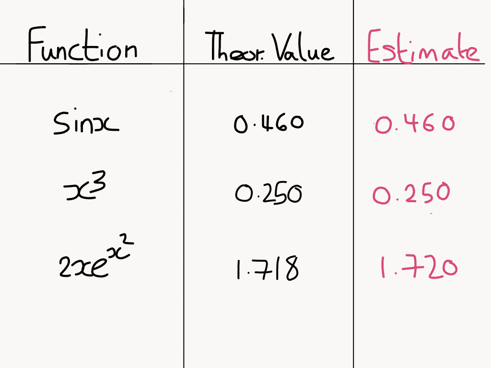
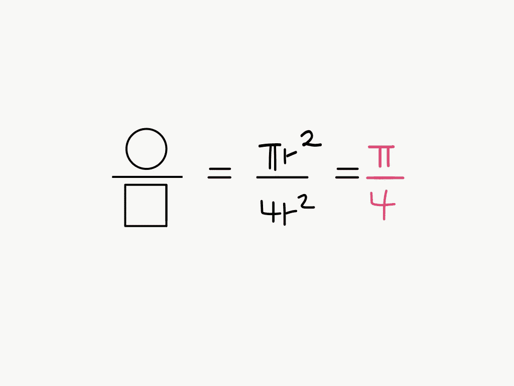
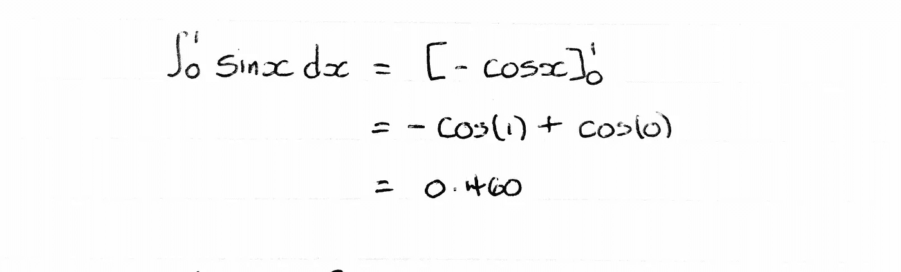
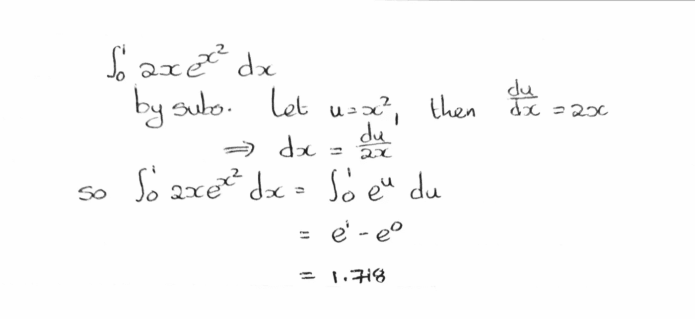
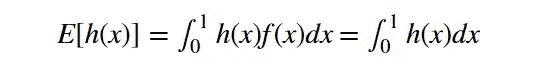

# 蒙特卡洛积分是神奇的

> 原文：<https://towardsdatascience.com/monte-carlo-integration-is-magic-c7f817d89610?source=collection_archive---------9----------------------->

蒙特卡洛方法非常受欢迎，这主要是因为“蒙特卡洛”这个名字很吸引人，其次是因为它们在包括金融、工程和医学在内的大量行业中有无数的应用。

根据 Investopedia 的说法,“蒙特卡洛”这个名字来源于摩纳哥的赌博中心。这是因为这些方法植根于赌场游戏中同样的机会和随机性元素。

然而，由于它们的广泛应用，它们更经常被描述为许多用途。然而，如果要我想出一个最能体现这种技术精神的定义，那就是:

> 蒙特卡洛模拟使用随机变量生成来模拟系统中的不确定性。

我们要看的具体应用是，如何使用蒙特卡罗模拟来计算函数的积分。

蒙特卡洛积分是神奇的，因为它将积分这样复杂的事情简化为几行代码。

以下是我们的一些结果:

Integral over [0,1]

注意到什么了吗？

是的，在这三个例子中，我们几乎可以精确到小数点后三位。

考虑到每次计算只花了**大约 3 行代码**，这是非常惊人的。

首先，我们要看一下圆周率的蒙特卡罗估计，然后是计算这些估计值的实际编码示例。

魔术的确在题为“到底发生了什么？”

# 圆周率估算——我们的第一个魔术

考虑内接于边长为 2 的正方形的单位圆。

然后，我们从正方形和圆形的面积得到以下结果:

这意味着圆周率是正方形和圆形面积比的 4 倍。

蒙特卡罗积分表明，为了近似这个比例，我们应该在我们的内接图上生成一组随机点，并使用落在里面的点的比例。

你可以把它想象成一个飞镖盘，飞镖落在圆圈内的概率会给出面积比。

我们估计我们的比率是 16/20 = 0.8

所以乘以 4，我们得到的圆周率估计值约为 **3.2！**

# 对于我们的第二个魔术——使用原始的蒙特卡洛来整合实际函数

下面是我们将在 R 中使用的过程:

*   首先，我们将使用 R 的 runif 函数从均匀(0，1)分布中生成大量样本。
*   然后我们将包含这些随机变量的向量插入到我们的函数中
*   最后，我们将取这些值的平均值。

## 第一个例子:

理论上的解决方案:

上面的代码给出了大约 **0.4597276 的估算！**

令人惊讶的是，在短短几秒钟内，我们计算了一个函数的积分，我们真正做的是找到一个样本均值。

## **最后一个例子:**

理论上的解决方案:

编码解决方案:

在这种情况下，我们粗略的蒙特卡罗估计大约是 1.72058！

更令人印象深刻。这一次我们解决了一个函数，我们通常通过首先进行 u-替换来计算，所有仍然是通过找到一个样本均值。

但是怎么做呢？！

# 究竟发生了什么事？

均匀(0，1)随机变量是特殊的，因为它们的边界(0，1)范围的积分实际上是 1。

所以如果 X~U(0，1)

那么对于任何函数 h(x):

所以我们看到，对于 X ~U(0，1)，理论平均值等于该函数在 X 上对[0，1]的积分。

因此，由于样本均值趋向于大样本的理论均值，我们能够通过找到样本均值来计算积分。

> **弱大数定律:**对于大样本量 n，随着 n 变得更大，样本均值趋向于理论均值。

# 最后的笔记

为了得出编码示例的估计值，使用了 100000 的样本大小，这在某些情况下可能是一个非常大的数字。因此，有一大堆被称为方差缩减技术的方法，它们允许我们或者以与当前方法相同的大小误差来计算估计值，但是样本大小要小得多，或者以相同数量的样本来提供小得多的误差。