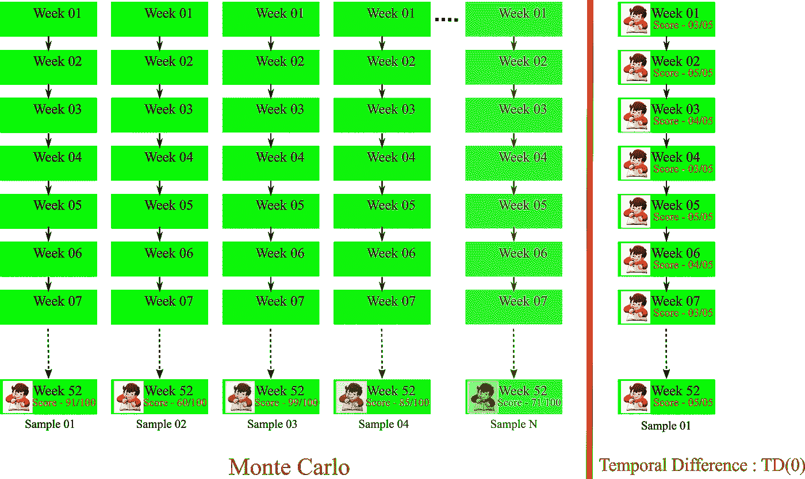
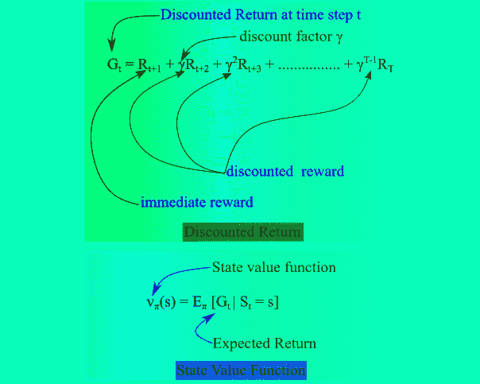
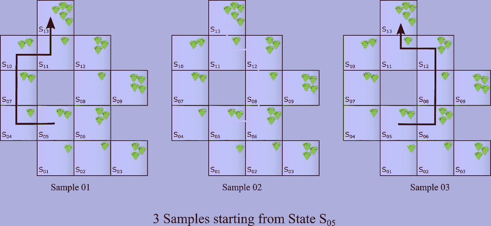
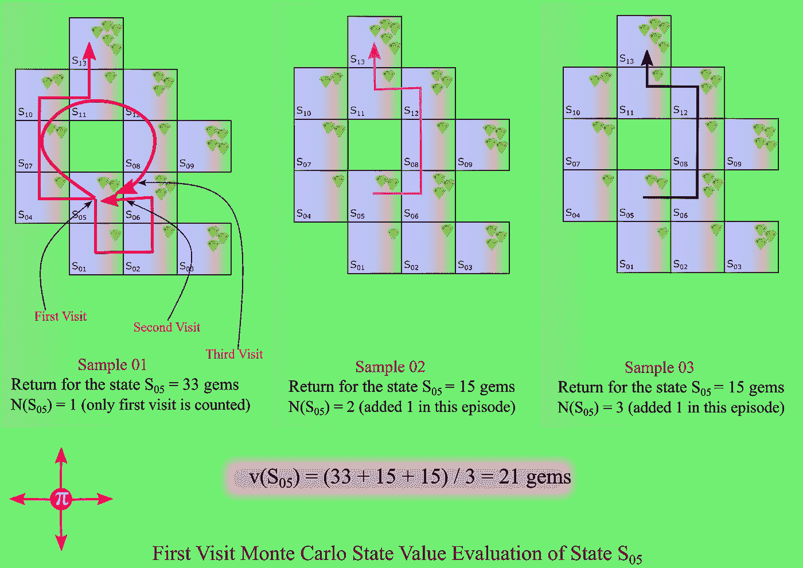
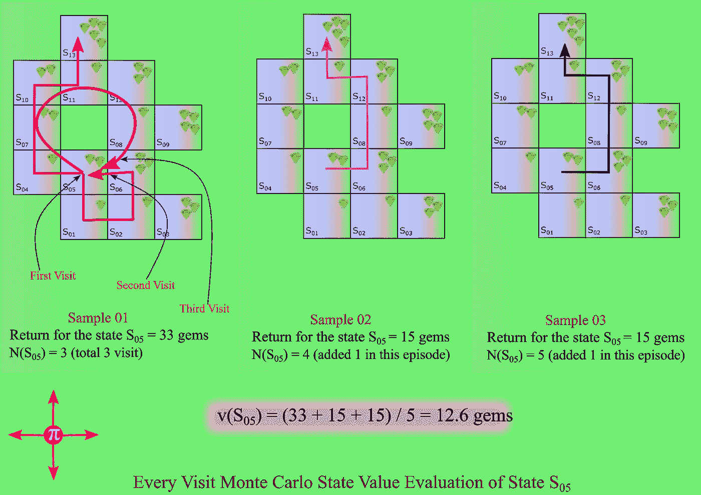

# 蒙特卡洛学习

> 原文：<https://towardsdatascience.com/monte-carlo-learning-b83f75233f92?source=collection_archive---------5----------------------->

## 使用蒙特卡罗方法的强化学习

在这篇文章中，我将介绍强化学习的蒙特卡罗方法。我在之前的文章中简要介绍了动态编程(值迭代和策略迭代)方法。在动态编程中，我们需要一个模型(代理知道 MDP 转换和奖励)，代理做**计划**(一旦模型可用，代理需要计划它在每个状态中的动作)。在动态规划方法中，主体没有真正的学习。

另一方面，蒙特卡罗方法是一个非常简单的概念，当代理与环境交互时，代理学习状态和奖励。在这种方法中，代理生成经验样本，然后基于平均回报，为状态或状态-动作计算值。下面是蒙特卡罗(MC)方法的主要特征:

1.  没有模型(代理不知道状态 MDP 转换)
2.  经纪人**从**那里学到**被取样的**经验
3.  通过体验来自所有采样剧集的**平均**回报，学习策略π下的状态值 vπ(s )(值=平均回报)
4.  仅在**完成一集**之后，值才被更新(因为该算法收敛缓慢，并且更新发生在一集完成之后)
5.  没有自举
6.  仅可用于**偶发性问题**

考虑一个真实生活的类比；蒙特卡洛学习就像年度考试，学生在年底完成它的一集。在这里，年度考试的结果就像是学生获得的回报。现在，如果问题的目标是找出学生在一个日历年(这是一个插曲)内对一个班级的分数，我们可以从一些学生的样本结果中提取，然后计算平均结果来找出一个班级的分数(不要逐点进行类比，但在整体水平上，我认为你可以获得 MC 学习的本质)。类似地，我们有 TD 学习或时间差异学习(TD 学习就像在每个时间步骤中更新值，不需要等到一集结束时更新值)，我们将在未来的博客中介绍，可以认为就像每周或每月的考试(学生可以在每个小间隔后根据这个分数(收到的奖励)调整他们的表现，最终分数是所有每周测试(总奖励)的累积)。

价值函数=预期**返回**

预期回报等于所有奖励的贴现总额。

在蒙特卡罗方法中，我们使用代理人根据政策抽样的经验回报，而不是预期回报。

如果我们回到我们收集宝石的第一个例子，代理遵循政策并完成一集，在每一步中它收集宝石形式的奖励。为了获得状态值，代理从该状态开始，在每一集后汇总收集的所有宝石。参考下图，其中从状态 S 05 开始收集了 3 个样本。每集收集的总奖励(为简单起见，折扣系数被视为 1)如下:

Return(样本 01) = 2 + 1 + 2 + 2 + 1 + 5 = 13 颗宝石

Return(样本 02) = 2 + 3 + 1 + 3 + 1 + 5 = 15 颗宝石

Return(样本 03) = 2 + 3 + 1 + 3 + 1 + 5 = 15 颗宝石

观察到的平均回报(基于 3 个样本)= (13 + 15 + 15)/3 = 14.33 宝石

因此，按照蒙特卡罗方法，v π(S 05)的值是 14.33 宝石，基于遵循政策π的 3 个样本。

# 蒙特卡洛备份图

蒙特卡洛备份图如下所示(参考[第三篇博客](https://baijayantaroy.github.io/baijayantaroy.github.io/Reinforcement_Learning_Series_03_backup_diagram/)帖子了解更多备份图)。

有两种类型的 MC 学习策略评估(预测)方法:

# 首次访问蒙特卡罗方法

在这种情况下，在一个事件中，对该状态的首次访问进行计数(即使代理在该事件中多次回到同一状态，也只对首次访问进行计数)。详细步骤如下:

1.  为了评估状态 s，首先我们设置访问次数，N(s) = 0，总回报 TR(s) = 0(这些值在每集中更新)
2.  状态 s 在一集内被访问的第一个**时间步长 t，递增计数器 N(s) = N(s) + 1**
3.  增量总回报 TR(s) = TR(s) + Gt
4.  价值通过平均回报 V(s) = TR(s)/N(s)来估算
5.  根据大数定律，当 N(s)接近无穷大时，V(s) -> vπ(s)(这在策略π下称为真值)

请参考下图，以便更好地理解计数器增量。

# 每次访问蒙特卡罗方法

在这种情况下，在一个事件中，国家的每次访问都被计算在内。详细步骤如下:

1.  为了评估状态 s，首先我们设置访问次数，N(s) = 0，总回报 TR(s) = 0(这些值在每集中更新)
2.  **每个**时间步长 t，状态 s 在一个情节中被访问，递增计数器 N(s) = N(s) + 1
3.  增量总回报 TR(s) = TR(s) + Gt
4.  价值通过平均回报 V(s) = TR(s)/N(s)来估算
5.  根据大数定律，当 N(s)接近无穷大时，V(s) -> vπ(s)(这在策略π下称为真值)

请参考下图，以便更好地理解计数器增量。

通常 MC 在每次发作后递增更新(不需要存储旧的发作值，它可以是每次发作后更新的状态的运行平均值)。

在第一集，第二集，第三集，…，S t 为每个状态 S T，返回 G t

通常用一个恒定的学习速率(α)来代替 1/N(S t ),上述等式变为:

对于策略改进，使用广义策略改进概念，通过蒙特卡罗方法的动作值函数来更新策略。

蒙特卡罗方法有以下**个优点**:

*   零偏差
*   良好的收敛特性(即使是函数逼近)
*   对初始值不太敏感
*   非常容易理解和使用

但是它也有下面的**限制**:

*   MC 必须等到剧集结束后才知道回归
*   MC 具有高方差
*   MC 只能从完整的序列中学习
*   MC 仅适用于偶发(终止)环境

尽管 MC 方法需要时间，但对于任何强化学习实践者来说，它都是一个重要的工具。

## 感谢阅读。可以联系我@ [LinkedIn](http://www.linkedin.com/in/baijayantaroy) 。

只需每月 5 美元，就可以无限制地获取最鼓舞人心的内容…点击下面的链接，成为媒体会员，支持我的写作。谢谢大家！
[***https://baijayanta.medium.com/membership***](https://baijayanta.medium.com/membership)