# R 中的蒙特卡罗模拟，重点是期权定价

> 原文：<https://towardsdatascience.com/monte-carlo-simulation-in-r-with-focus-on-financial-data-ad43e2a4aedf?source=collection_archive---------0----------------------->

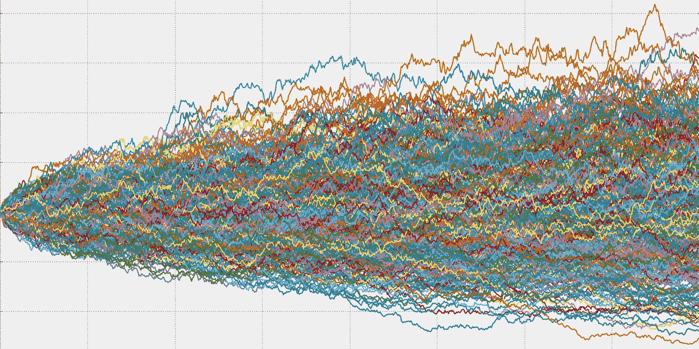

> 在这篇博客中，我将介绍蒙特卡罗模拟的基础知识，随机数分布和生成它们的算法。最后，我还将介绍蒙特卡罗模拟在期权定价领域的应用。整个博客的重点是用 **R** 编写代码，这样你也可以用 R 实现自己的蒙特卡罗模拟应用。

## 蒙特卡洛方法是什么？

蒙特卡罗方法基本上是指一类利用随机性进行估计的算法。让我们举一个例子来说明这一点

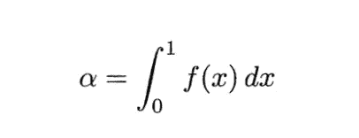

为了使用蒙特卡罗方法给出函数的该积分的**数值估计**，可以将该积分建模为***E[f(U)】***，其中 ***U*** 是**【0，1】**中的均匀随机数。生成***n******【0，1】**之间的均匀随机变量。让那些分别是函数值**f(u₁**u₁,u₂,…uₙ**、f(U₂),…f(Uₙ)** 。*

*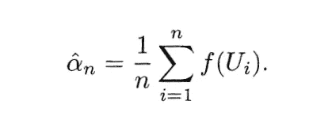*

*Numerical Estimate of Integral*

*这样我们就用 ***n*** 在**【0，1】**之间的均匀随机样本得到了积分的估计。这个估计值将**收敛**到【实际】**α*n******收敛**到*。现在我们已经看了如何得到一个估计值，让我们看看如何产生不同的随机数分布。***

***让我们再来看一个涉及**衍生产品定价**的例子。首先，我将定义一些重要的金融术语。股票价格*将是时间 *t 的函数*我们将考虑一个**欧式期权**并对其定价。****

****欧式期权:**它是一种金融工具，它赋予你权利，但并不强制你以某一价格(**执行价格** ( ***K*** ))买入/卖出资产，该价格在之前某一时间点固定，比如说时间 0。因此，如果我们继续执行合同，并同意在时间*以固定价格 ***K*** 购买/出售一项资产。我们的利润将是***

*****利润*=*S(T)-K/K-S(T)*****

**从现在开始，我们只关注购买一种资产，这种资产也被称为**欧式期权****

**所以，如果 ***(S(T)-K)*** <为 0，那么推进这份合同不符合我们的利益。因此，我们不**行使**我们的期权*，即*我们不购买资产*。***

**因此，你的收益是-**

**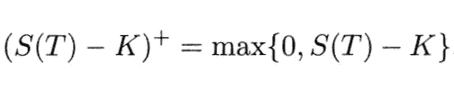**

**The value of Payoff**

**但是，问题是，合同中的另一方有什么好处，因为你可能会也可能不会购买该资产，所以目前持有该资产的另一方实际上履行了合同，因为你最初也支付了一些溢价/费用。因此现在最重要的是**这个溢价应该是多少？****

**你在开始时支付一笔额外费用，也就是说。从这个收益我们计算利润为， ***利润=收益-C*****

**因此，当我们谈论衍生产品定价时，我们试图估计这个 ***C*** 。我现在不会深入细节，稍后在讨论几何布朗运动时会涉及到它，但是股票价格变化是使用**随机微分方程**计算的，求解后我们得到:**

**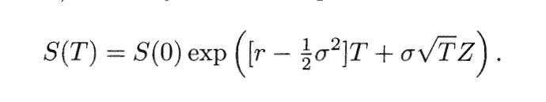**

**S(T) Equation as a function of T**

**这里 ***Z*** 是另一个随机数，称为标准正态随机变量。我们将来会考虑如何生成这些随机数，但现在让我们假设它们可以由我们自己生成。**

**现在我们知道了在某一时刻 ***T*** 的利润，以及在某一时刻 ***T*** 的股票价格。对于时间 t=0 我们怎么计算。再次不去赘述细节，将时刻 0 的保费 ***C*** 表示为***e【e⁻ʳᵗ(max(s(t)—k)，0)】***。**

**因此，这类似于我们之前看到的***E[f(U)】***。因此，我们再次借助蒙特卡罗模拟来估计 t=0 时的收益。**

**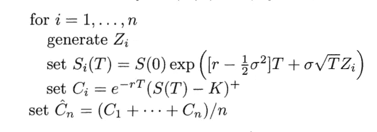**

**Algorithm to Estimate European Option Payoff**

**于是我们反复采样 *Z* 来寻找股票价格值，最后计算欧式期权溢价**C**。**

## **生成随机分布**

**在以前的案例中，唯一缺少的是如何生成均匀随机的，正态随机分布。因此，我们着眼于涵盖生成这种均匀随机分布的算法，以及将这些算法转换成其他分布(如正态分布)的方法。**

**我们将在***【R】***中为这些模拟生成的数字实际上被称为 [***伪随机***](https://en.wikipedia.org/wiki/Pseudorandom_number_generator) 数字，它们不是真正随机的，但非常善于模仿真正的随机性。我们使用确定性算法生成它们，使得它们近似于随机数序列的性质。**

****均匀分布****

**均匀分布是一种连续分布，缩写为 ***U(a，b)。*** 其中**概率密度函数**为**

**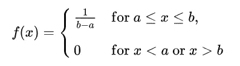**

**P.D.F of Uniform Distribution**

**产生这种数字的最流行的方法是**线性同余发生器**。LCG 是用以下方法生成的**

**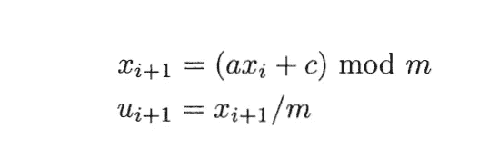**

**Linear Congruential Generator Algorithm**

**因此，如果我们选择一个 x₀也称为**种子**。我们可以在**【0，1】**之间生成 **m-1** 唯一的均匀随机数。尽管一个好的估计器必须遵循非零 c 的某些条件。**

**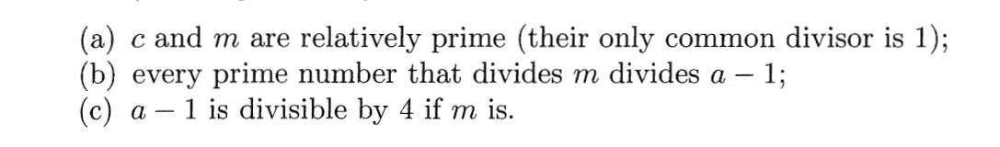**

**上面的代码产生均匀的随机数。**

**现在让我们看看指数分布、正态分布，以及如果我们假设已经有了一个均匀的随机数**，我们如何生成它们。****

****指数分布****

**指数分布可以用**概率密度函数**来表示**

**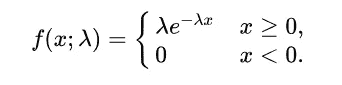**

**P.D.F of Exponential Distribution**

**为了使用均匀分布生成它，我们来看一个**逆变换方法****

**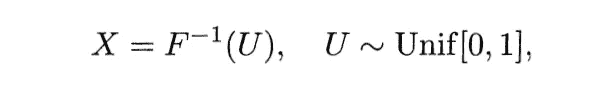**

**Inverse Transform Equation**

**因此，使用均匀随机数*并取指数分布的分布函数的反函数，我们可以生成指数随机数 ***X*** 。***

**逆变换方法的正确性证明如下**

****

**Proof of Inverse Transform Method**

**因此，我们使用这种方法来生成指数分布，其中***【f⁻(u)***给出如下**

**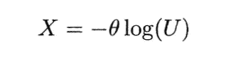**

**Exponential Distribution using Inverse Transform Method**

**这里θ是指数参数 1/α。**

****正态分布****

**正态分布，也称为**高斯分布**，是一种关于均值对称的概率分布，表明接近均值的数据比远离均值的数据出现的频率更高。取决于两个参数——均值和方差的**概率密度函数**为**

**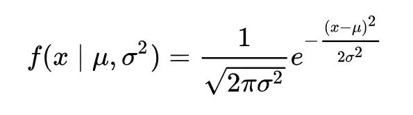**

**P.D.F of Normal Distribution**

**我们将看到一种非常流行的生成标准正态分布的方法，称为 **Box Muller 方法**。**

**该方法基于以下事实:如果我们取一个二元标准正态分布 ***Z₁，*** ~ ***N* (0，1)** ，那么它们遵循两个性质**

**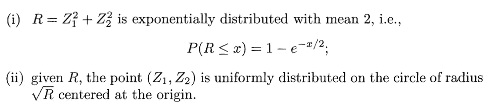**

**使用事实(ii)我们生成圆的半径为***r = sqrt(-2 log(u₁))***并且点(***【z₁】、*、**)位于圆中的角度为**、 *V=2 π ( U₂ )* 、**使用一对均匀随机数**、 *U₁、U₂.*****

**因此这对 ***Z₁，***z₂将生成为**

**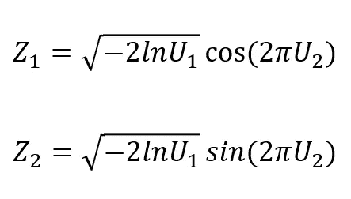**

**现在让我们看看代码和情节**

**在上面的代码**中，R 中的 runif(5000)** 用于生成范围***【0，1】中的 5000 个均匀随机数。*** 这些然后被用来产生最后 10000 个**标准正态随机变量**。**

**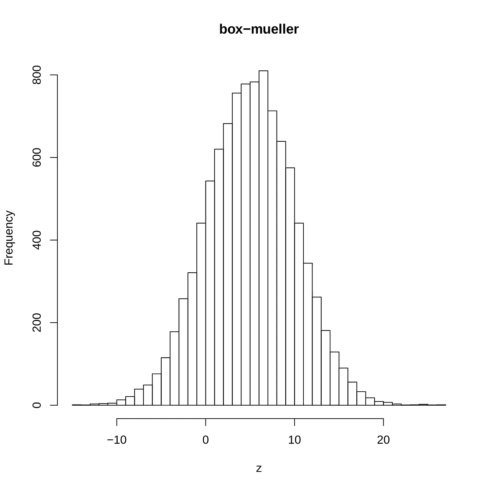**

**我们可以使用[**marsag lia-Bray**](https://en.wikipedia.org/wiki/Marsaglia_polar_method)算法进一步改进这一点，我不会在本系列中讨论它。你可以在附件的链接上看看。我也鼓励你编写 **Marsaglia-Bray** 算法，并检查它与 **Box-Muller** 算法相比有多快。**

## **布朗运动**

**既然已经介绍了蒙特卡罗模拟和各种随机分布的基础概念，让我们集中使用**蒙特卡罗方法**来模拟各种 [**随机过程**](https://en.wikipedia.org/wiki/Stochastic_process) 的路径。**

**【T50[0，T] 上的标准布朗运动是一个随机过程{ ***W(t)，0***≤***T***≤***T }***它满足如下一些性质**

**i) ***W(0)=0*****

**ii)对于任何 ***k*** 和任何 ***0≤ t₁ ≤ t₂ ≤ …。≤ tₖ ≤ T*** ，任意两个连续的***【w(tᵢ)-w(tᵢ-₁】***之间的增量是独立的。**

**iii)对于任意 0≤ s < t ≤ T，差值 ***W(t)- W(s) ~ N(0，t-s)*****

**作为 I)和 iii) ***的结果 W(t) ~ N(0，t)。*****

**另一方面，非标准的布朗运动会像正态分布一样有两个参数，称为**漂移**和**扩散**。利用 ***W(t)*** 我们因此给出了任意布朗运动的**随机微分方程****

**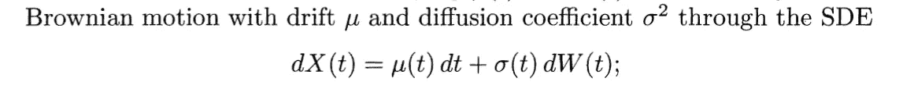**

## **样本路径生成**

**求解上面给出的 SDE，我们可以用 X(tᵢ、μ(s)、σ(s)来写方程**

**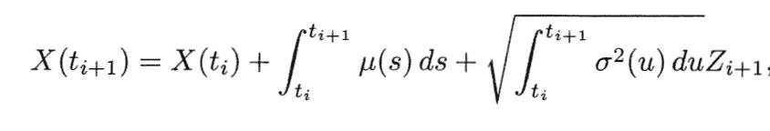**

**Solution of Stochastic Differential Equation for Brownian Motion**

**因此，让我们看看生成路径的代码，这里我假设μ和σ是常数**

**上述代码使用为布朗运动定义的公式为其生成 10 条路径，并使用 **rnorm(1)** 一个在 ***R*** 中定义的函数来生成标准正态随机变量。**

**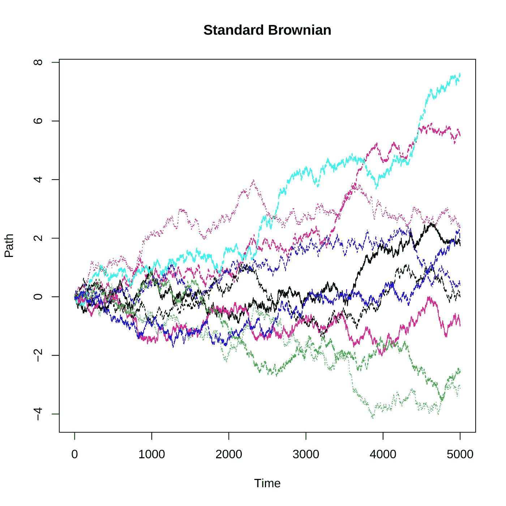**

**上图代表了为标准布朗运动生成的代码的 10 条路径。**

## ****几何布朗运动****

**一个随机过程 ***S(t)*** 如果差
***log(S(t))-log(S(0))***是一个布朗运动，那么这个随机过程就是一个几何布朗运动。基本上，与布朗运动中讨论的性质 ii)相比，这意味着现在，**

**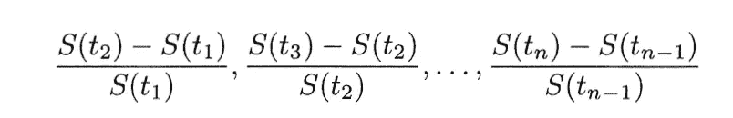**

**是相互独立的，而不仅仅是布朗运动中的连续差。**

**因此，我们现在用来表示 **GBM** 的**随机微分方程**为**

**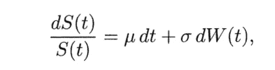**

**S.D.E for Geometric Brownian Motion**

**该问题的解决方案与之前用于估计股票价格的等式相同，我在该等式中展示了使用**蒙特卡洛模拟的示例。****

**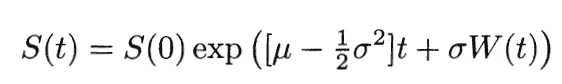**

**Solution of S.D.E for Geometric Brownian Motion**

**其中 W(t)替换为**

**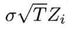**

**这就是如何通过使用蒙特卡罗模拟，我们也可以模拟一个**股票价格**或**几何布朗运动的路径。** 对于这样的模拟，我们再次需要**将时间线离散化为一些*点，以生成所有这些点的股票价格。让我们假设初始股票价格为 100*****

***剧情看起来***

***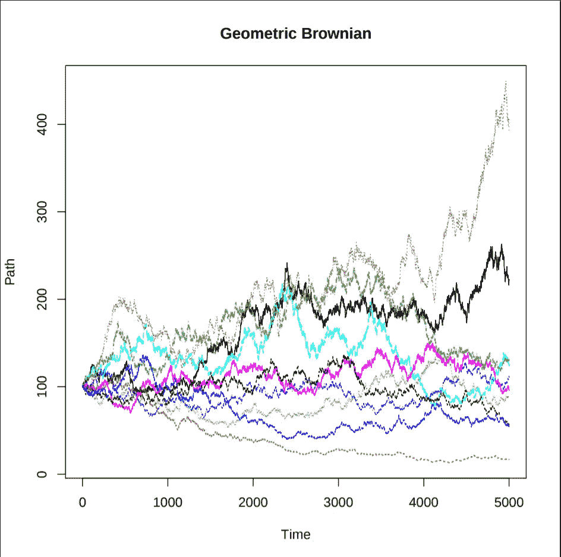***

***因此我们可以使用所有这样的路径最终得到一个***【T】***并计算欧式期权的溢价，最后给出欧式期权价格的平均估计。接下来，我们将看看另一个期权，称为**亚式期权**，它也需要中间股票价格来计算期权价格。***

## ****亚式期权定价****

**在亚式期权中，收益取决于标的资产在一定时期内的**平均价格**，而标准期权只取决于到期价格。**

**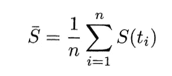**

**Average Price Calculation for Asian Option**

**现在的收益是**

**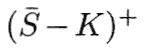**

**Payoff of Asian Option**

**我们对模拟**股票价格**路径的兴趣实际上是在为这些期权定价，特别是因为收益取决于基础资产 s 的路径。**

**让我们看看**亚式期权定价**的代码**

## **结论**

**我希望你们不仅能公平地了解蒙特卡罗方法，还能了解金融工程领域(期权定价)。现在你应该熟悉蒙特卡罗方法，衍生品定价(欧式和亚式期权)，随机数分布(均匀，指数和正态分布)，R 中编程基础，几何布朗运动及其路径生成。**