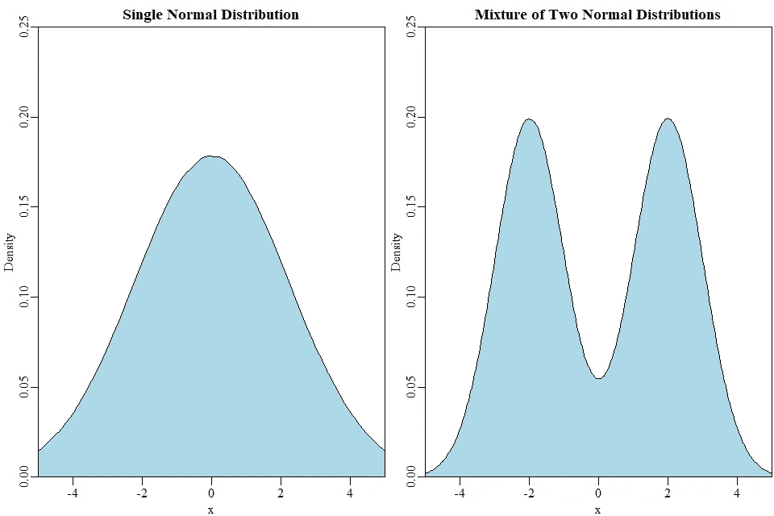
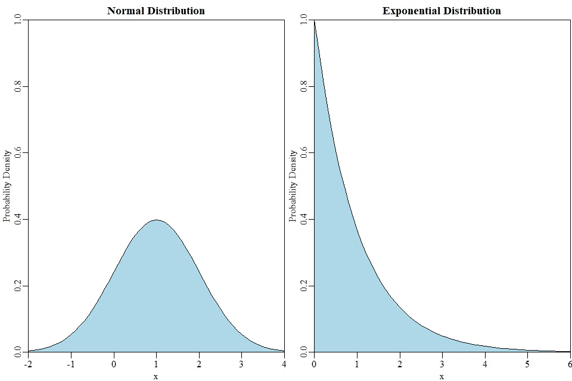
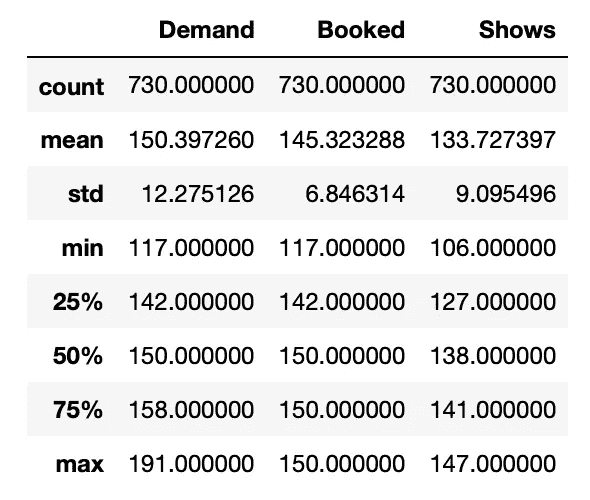
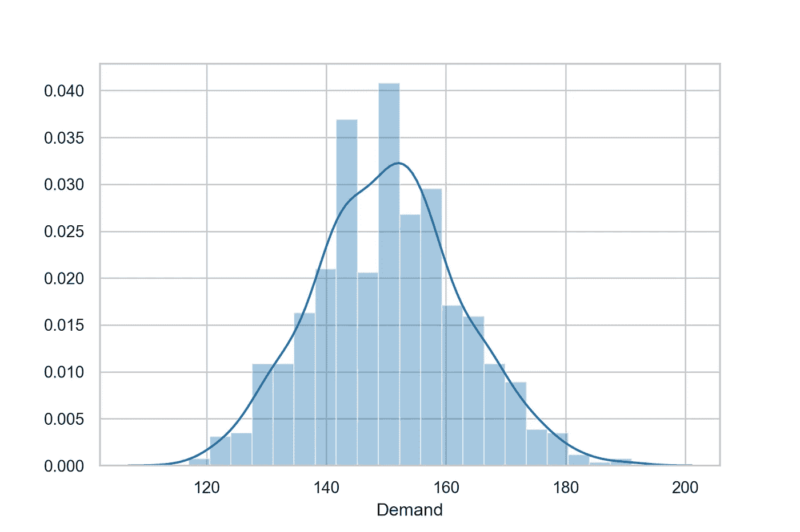
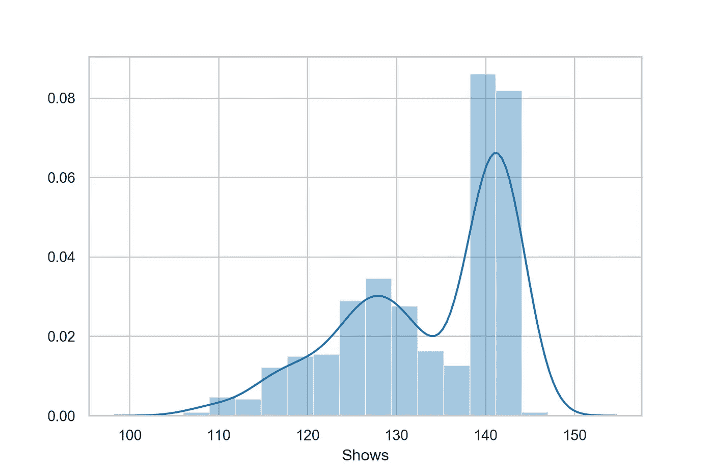
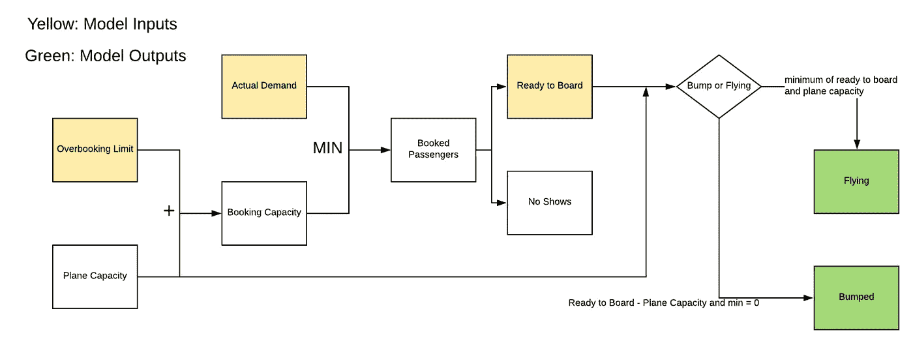
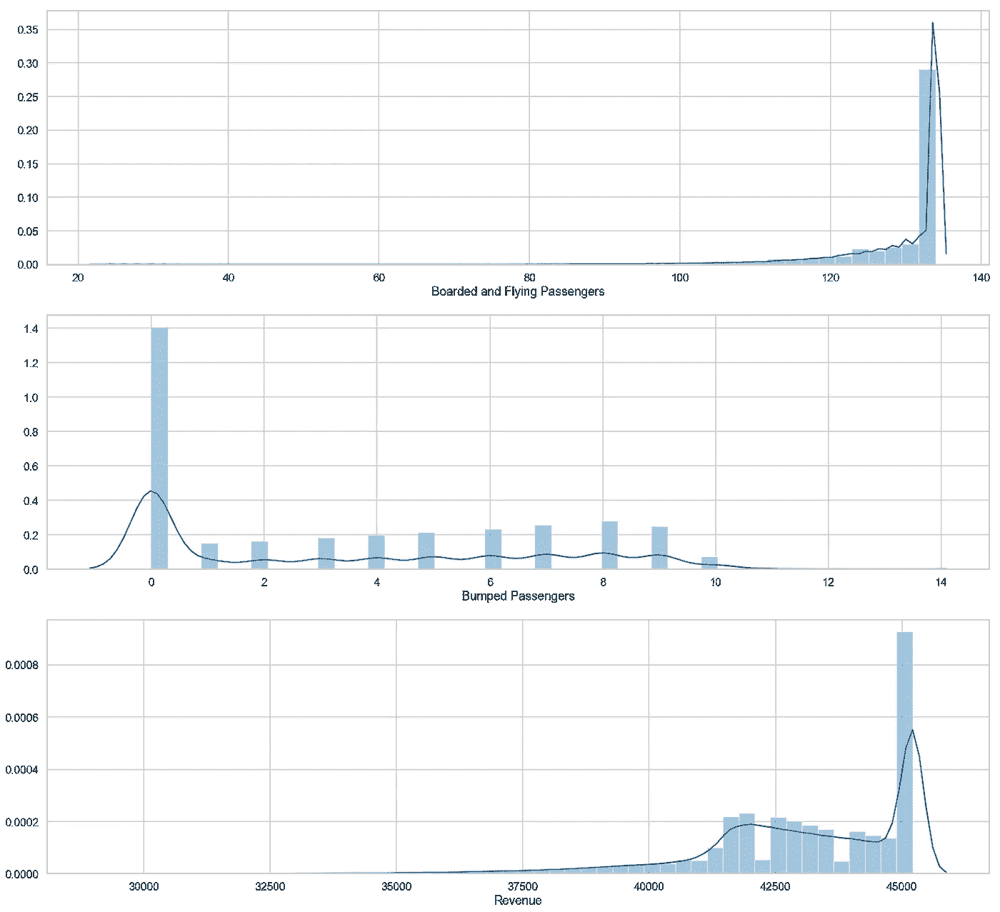
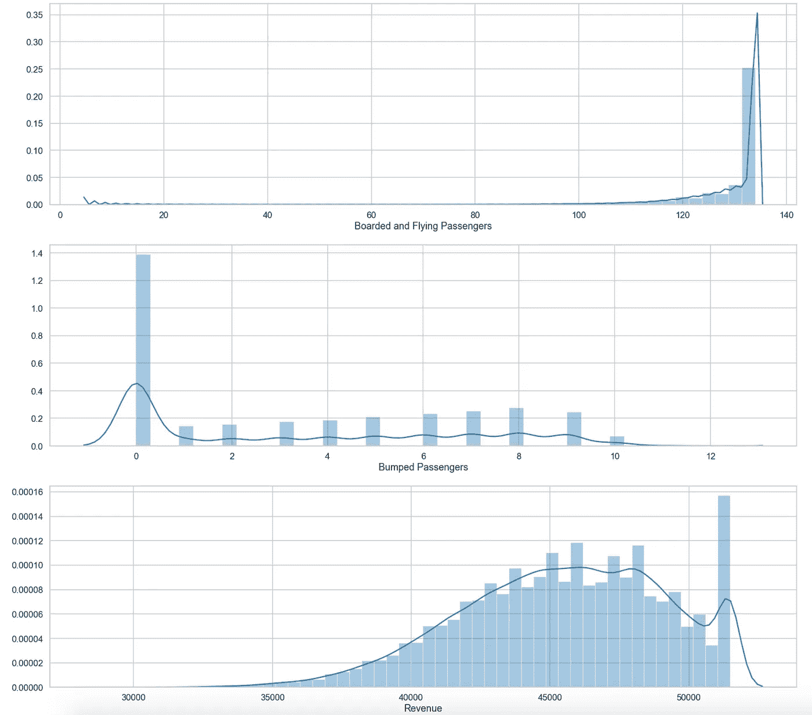
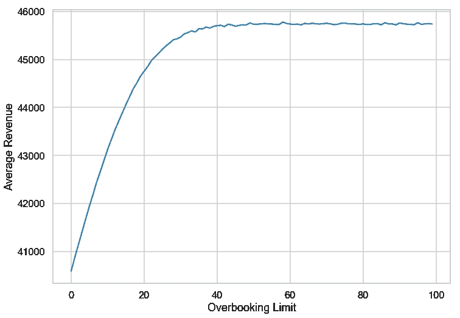

# 蒙特卡罗模拟:概率性和确定性的交叉

> 原文：<https://towardsdatascience.com/monte-carlo-simulations-the-intersection-of-probabilistic-and-deterministic-2720a0b541b1?source=collection_archive---------12----------------------->

你好，欢迎来到我的博客，我希望你能发现这对于蒙特卡洛模拟的介绍是有帮助的。这是一个简单的蒙特卡罗模拟的数学方法，用简单的图形来说明我的观点。这不是什么，深入到蒙特卡罗模拟非常具体和明确定义的行业问题。

这个蒙特卡洛模拟的数据和前提来自科罗拉多大学教授的 Coursera 的高级商业分析课程。最初，计算是在解析解算器上执行的，但是我决定将这个过程放到一个我(希望你也是)更习惯的环境中，Python。

首先，我使用了概率性和确定性这两个词，我应该在本文的上下文中定义它们。

概率性的:可以用概率分布来量化的事物。有多少人会出现在他们的航班上？

确定性的:可以从参数中计算出来的东西。例如，如果 150 人乘坐了一个有 134 个座位的航班，有多少人被挤到下一个航班？

蒙特卡洛模拟可以说明确定性模型参数的不确定性(概率性质),产生可能结果的概率分布。


# 问题是

在任何给定的航班上，并不是所有的乘客都完成了利用他们购买的座位的过程。作为回应，航空公司通常会超额预订航班，以最大限度地提高座位利用率和收入。然而，如果超售率过高，乘客将不得不重新安排航班，航空公司的整体声誉将受到损害。

## 目标:

*   使用颠簸的乘客和收入成本，确定适当的超额预订率
*   确定任何给定航班的收入

## 吉文斯:

*   此特定的历史数据
*   飞机定员:134 人
*   票价:314 美元
*   冲撞乘客的费用:400 美元

此时，您可能会尝试使用历史数据的期望值或最大/最小值来计算超售率、颠簸乘客和收入的期望值。然而，有可能出现期望值不是分布的良好近似值的分布。例如多模态的东西或者具有严重偏斜的东西。



Both distributions have a mean of zero and a variance of 5



Both distributions have a mean of 1 and variance of 1

# 解决方案

为了解决这个问题，我们需要把它分成以下几个步骤。

1.  拟合所提供的历史数据的分布(概率输入)
2.  建立航班超售过程的数学模型(确定性)
3.  从历史分布中随机选择，计算结果，然后重复(概率输出)

## 历史数据的分布拟合

```
#############
###IMPORTS###
#############import numpy as np
import pandas as pd
import matplotlib.pyplot as plt
import seaborn as sns
import fitterfrom scipy.stats import exponnorm , genlogistic
```

使用 pandas 将历史数据导入 python 并查看快速摘要

```
hData = pd.read_csv('data/historicalData.csv')
hData.describe()
hData.shape
```

3 个特征的 730 次观察，零缺失数据。



Flight Demand, Historical



Number of People that are Ready to Board, Historical

让我们使用 Fitter 包来模拟分布。Fitter 使用 scipy 中的 80 个分布来拟合分布，并允许您绘制结果以进行直观检查。

```
f_demand = fitter.Fitter(hData.Demand, timeout= 100)
f_demand.fit()
f_demand.get_best()demand_params = list(f_demand.get_best().values())[0]f_shows = fitter.Fitter(hData.Shows, timeout =100)
f_shows.fit()
f_shows.get_best()shows_params = list(f_shows.get_best().values())[0]
```

来自 f_demand.get_best()和 f_shows.get_best()的 demand fitter 输出以 python 字典的形式呈现如下。最佳的 scipy 分布是键，参数存储在值元组中。

```
{'exponnorm': (0.4319945610366508, 145.53002093494484, 11.26683008052343)}{‘genlogistic’: (0.03148397254846405, 144.0118676463261, 0.3243429345277982)}
```

## 数学模型



Graphical Representation of the Deterministic Model

上述模型中的黄色方框是输入。如果输入存在历史数据，将随机独立地对概率分布进行采样。

```
def Planesim(OverbookingLimit =20):
    PlaneCap = 134
    TicketCost = 314
    BumpCost = 400 BookingCap = OverbookingLimit + PlaneCap
    AcutalDemand =int(exponnorm.rvs(*demand_params))
    Booked = min(BookingCap,AcutalDemand) ReadytoBoard = int(genlogistic.rvs(*shows_params))
    NoShows = Booked - ReadytoBoard Flying = min(ReadytoBoard,Booked,PlaneCap)
    Bumped = max(ReadytoBoard - PlaneCap , 0) Sold = Booked * TicketCost
    Costs = Bumped * BumpCost
    Revenue = Sold - Costs return Flying, Bumped, Revenue
```

## 模拟 10 万次飞行

既然我们已经有了模型化的分布和数学公式，我们可以开始模拟飞机飞行来确定结果的分布。

```
flyingPassengers = []
bumpedPassengers = []
revenue = []for i in range(100000):
 output = Planesim(10)
 flyingPassengers.append(output[0])
 bumpedPassengers.append(output[1])
 revenue.append(output[2])
```



上图是 10 名乘客超售限额的结果。该航班的平均收入为 43，121 美元。



上图是 30 名乘客超售限额的结果。该航班的平均收入为 45，487 美元。

## 寻找最大收益的超额预订限制

让我们通过迭代 1 到 100 的超额预订限制来找到最大收入。我们可以通过在 for 循环中运行超额预订模拟来实现这一点。

```
expected_rev = []
overbooking_rate = []
for j in range(100):
    flyingPassengers = []
    bumpedPassengers = []
    revenue = []for i in range(100000):
        output = Planesim(j)
        flyingPassengers.append(output[0])
        bumpedPassengers.append(output[1])
        revenue.append(output[2])
    overbooking_rate.append(j)
    expected_rev.append(np.mean(revenue))
```



嗯，看起来没有收入作为超额预订限制的函数的最大解。最有可能的决定将取决于航空公司对重新预订航班的容忍程度。

# 结论

我们演练了如何基于确定性情况建立数学模型，然后在必要的地方添加概率参数。历史数据被拟合在各种 scipy 分布上，以便于随机选择。最后，我们模拟了不同级别的超额预订，以在这种特定情况下实现收入最大化。

要查看这个项目的代码，请查看我的 github。