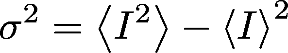
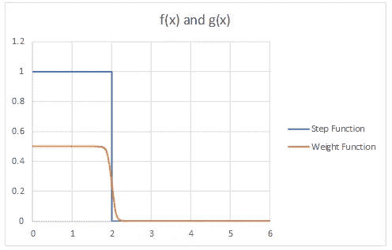
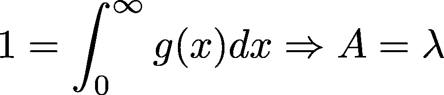

# 用 Python 进行蒙特卡罗模拟(第 1 部分)

> 原文：<https://towardsdatascience.com/monte-carlo-simulations-with-python-part-1-f5627b7d60b0?source=collection_archive---------1----------------------->

Monte Carlo’s can be used to simulate games at a casino (Pic courtesy of Pawel Biernacki)

这是学习用 Python 做蒙特卡洛模拟的三部分系列的第一部分。这第一个教程将教你如何做一个基本的“原始”蒙特卡罗，它将教你如何使用重要性抽样来提高精度。第 2 部分将介绍臭名昭著的 metropolis 算法，第 3 部分将是初露头角的物理学家的专业文章(我们将学习如何使用蒙特卡罗模拟来解决量子力学中的问题！)

蒙特卡罗方法是广泛使用的启发式技术，可以解决各种常见的问题，包括优化和数值积分问题。这些算法通过巧妙地从分布中取样来模拟系统的工作。应用范围从解决理论物理问题到预测金融投资趋势。

# 任务

在本简介中，我们将开发蒙特卡罗近似的 Python 实现，以找到该积分的解:

Integral we will approximate using Monte Carlo methods

我从孙坎塔·德布的 [*变分蒙特卡罗技术*](https://www.ias.ac.in/article/fulltext/reso/019/08/0713-0739) 文章中借用了这个例子和它的解决方案。如果你想了解更多关于使用 Monte Carlos 模拟量子力学系统的知识，一定要看看那篇文章。

你会注意到这个积分无法解析求解，因此我们需要用数值来近似它。让我们从一个简单的方法开始:粗糙的蒙特卡罗。

# 原始的蒙特卡洛:直觉

粗略的蒙特卡罗是最容易理解的技术，所以我们从这里开始。但顾名思义，它也是最不准确的。不过，我们稍后会解决这个问题。:)

你可能还记得高中微积分中的以下等式，它显示了如何计算函数的平均值(为了证明，请查看此[链接](http://tutorial.math.lamar.edu/Classes/CalcI/ProofIntProp.aspx#Extras_IntPf_AvgVal)):

This theorem is used to find the average value of a function

就像我们可以通过积分求函数的平均值一样，我们也可以通过确定被积函数的平均值来求积分的值， *f(x)* 。蒙特卡罗技术是建立在这一原则之上的:与其计算不定积分(这有时是不可能的)，不如估计被积函数的平均值，并用它来近似积分。

这正是我们要做的！那么我们该怎么做呢？

最简单的方法是从所有可能的输入值中随机抽取输入值 *x* 。假设我们有一个简单的线性函数，比如 *y = 2x* ，我们想求出 *y* 在[0，2]范围内的平均值。

Approximating the average of y = 2x using 10 randomly selected values

为了计算平均值，我们将在所有随机确定的 *x* 处对 *y* 求值，并对结果取平均值。

这个过程正是粗糙的蒙特卡洛。现在让我们看看如何在 Python 中使用这种技术来解决前面的问题。

# 原始蒙特卡罗:实现

你可以在我的 Github [这里](https://github.com/pat-hanbury/MonteCarloTutorial/blob/master/MonteCarloExample.ipynb)找到本教程的所有代码。下面是我们代码的开头:

Imports for our Monte Carlo script

我们真的不需要太多。`numpy`将被用于查找一个列表的最小自变量。我们将使用`math`来定义我们的函数，而`random`将用于采样。`matplotlib`将有助于我们将结果可视化。

# 一些有用的功能

首先让我们定义一个函数来生成一个特定范围内的随机数。

让我们也定义我们的被积函数， *f(x)* :

# 执行简单的蒙特卡罗

实现简单的蒙特卡罗应该相当简单。我们的算法是这样的:

1.  从积分范围中获取一个随机输入值
2.  评估被积函数
3.  重复步骤 1 和 2，想重复多久就重复多久
4.  确定所有这些样本的平均值并乘以范围

让我们看看它在代码中是什么样子的:

Function to execute the Crude Monte Carlo

用`N=10000`样本进行这种近似给了我一个`0.6994`的估计值。与`0.696092` 的 [Wolfram 的](https://www.wolframalpha.com/input/?i=integral+of+0+to+inf+of+e%5E(-x)%2F(1%2B(x-1)%5E2))近似不太远(我们将把它视为神圣的真理)。

# 确定我们估计的方差

但是我们对自己的答案有多大的把握呢？我怎么知道 10，000 个样本足够得到一个好的近似值。我们可以通过找到估计值的方差来量化我们的准确性。方差被定义为*“距平均值平方距离的平均值”。可以证明它等于这个方程:*

General Variance Equation

方差让我们知道 *f(x)* 在*x。*的范围内变化有多大。它应该与所用样本数保持恒定，但我们可以通过用方差的平方根除以样本数来计算积分误差。关于方差的更多信息，请查阅阿德里安·费金教授的[蒙特卡罗积分](https://github.com/afeiguin/comp-phys/blob/master/10_01_montecarlo_integration.ipynb)笔记本，或者[沃尔夫拉姆关于方差的文章](http://mathworld.wolfram.com/Variance.html)。

Equation for calculating the variance in our Crude Monte Carlo simulation

这是我们将在模拟中使用的方差方程。让我们看看如何在 Python 中实现这一点。

这个简单的蒙特卡罗实现给了我一个方差`0.266`，它对应于一个误差`0.005`。简单地说，这并不坏，但是如果我们需要更高的精度呢？我们总是可以增加样本的数量，但是这样我们的计算时间也会增加。如果我们聪明地从正确的点分布中取样，而不是使用随机取样，会怎么样...我们可以称之为*重要抽样*。

# 重要抽样:直觉

重要抽样是一种在不增加样本数量的情况下减少蒙特卡罗模拟方差的方法。这个想法是，不要从整个函数中随机取样，让我们从与函数形状相似的点的分布中取样。

假设您有一个如下所示的阶跃函数:

Graph of a step function and it’s “weight function” g(x)

如上所示，我们有一个阶跃函数，在范围[0，2]内有效，在[2，6]内无效。采样 10 次可能会产生如下估计值:

10 sample estimation of f(x)

这些样本(我发誓是随机的)对应于最可能的样本分布，并且产生 1.8 的整体估计。但是，如果相反，我们估计我们的函数 *f(x)* 和某个特殊权函数 *g(x)* 之间的*比率*呢，对于任何给定的 x，其值几乎总是大约为 *f(x)* 值的 1/2。如果我们也偏置样本，使其出现在函数最活跃的范围内(我们会发现这样可以最小化误差)，会怎么样呢？你会发现这些比率的平均值，更接近我们积分的真实值，也就是 *2* 。

Estimation of step function area using importance sampling

使用重要性抽样方法来确定这个最优函数 *g(x)* 。

# 数学

我将提供一个重要性抽样数学的快速概述，但这篇文章的主要目的是实现，所以如果你渴望更多的数学严谨性，请查看我前面提到的 Deb 的文章。

让我们看看是否能找到一个 *g(x)* 使得:

For some constant k

基本上，我们希望 g(x)看起来像 f(x)的缩放版本。

我们还需要 *g(x)* 来满足一些标准:

1.  *g(x)* 是可积的
2.  *g(x)* 在[a，b]上是非负的
3.  *g(x)* 的不定积分，我们称之为*G(x)*有一个实逆
4.  *g(x)* 在[a，b]范围内的积分必须等于 1

理想情况下， *f(x)* = *k * g(x)* ，其中 k 为常数。然而，如果 *f(x)* = *k * g(x)* ，那么 *f(x)* 将是可积的，并且我们将不需要执行蒙特卡罗模拟；我们可以通过分析来解决这个问题！

所以，我们就满足于*f(x)***≈***k * g(x)*。当然，我们不会得到一个完美的估计，但是你会发现它比我们之前粗略的估计要好。

我们将如下定义 *G(x)* ，并且我们还将对 *r* 执行一次变量更改。

Definition of G(x)

Change of variables to r (where r will be random samples between 0 and 1)

*r* 将被限制在范围[0，1]内。由于 *g(x)* 的积分被定义为 1， *G(x)* 永远不会大于 1，因此 *r* 永远不会大于 1。这一点很重要，因为稍后在执行模拟时，我们将从范围[0，1]内的 *r* 中随机采样。

使用这些定义，我们可以得出以下估计值:

这个总和就是我们在执行蒙特卡罗时要计算的。我们将从 *r* 中随机抽样，以得出我们的估计值。

简单吧？如果乍一看这没有意义，不要被暗示。我有意把注意力集中在直觉上，轻松地通过了数学考试。如果你感到困惑，或者你只是想要更精确的数学，看看我之前提到的[资源](https://www.ias.ac.in/article/fulltext/reso/019/08/0713-0739)，直到你相信最终的等式。

# 重要性采样:Python 实现

好了，现在我们理解了重要性抽样背后的数学原理，让我们回到之前的问题。记住，我们试图尽可能精确地估计下面的积分:

Integral we’re trying to approximate

# 可视化我们的问题

让我们首先为我们的 *g(x)* 权重函数生成一个模板。我想可视化我的函数 *f(x)* ，所以我们将使用`matplotlib`来实现:

Plotting this function will help us determine an optimal structure of g(x)

好了，我们可以看到，我们的函数*在[0，3- *ish* 的大致范围内主要是*活跃，而*在[3- *ish* ，inf]的范围内主要是*不活跃。所以，让我们看看能否找到一个可以参数化的函数模板来复制这种品质。Deb 提出了这个函数:

Proposed weight function template [1]

找到 *A* 和*λ*的理想值后，我们将能够构建 *f(x)* 和我们的最优权函数 *g(x)* 的曲线图:

你可以看到在很多方面 *g(x)* 并没有完美地复制 *f(x)* 的形状。这是可以的。一个粗糙的 *g(x)* 仍然可以奇迹般地降低你的估计方差。随意试验其他权重函数 *g(x)* ，看看是否能找到更好的解决方案。

# 参数化 g(x)

在我们进行模拟之前，我们需要找到最佳参数 *λ* 和 *A* 。使用对 *g(x)* 的归一化限制，我们可以找到 *A(* *λ)* :

The normalization condition on g(x) can be used to prove that A(*λ)* = *λ*

现在，我们需要做的就是找到理想的 *λ* ，我们就有了我们理想的 *g(x)* 。

为此，让我们在范围[0.05，3.0]上以 0.5 为增量计算不同 *λ* 的方差，并使用方差最小的*λ**。*使用重要抽样时，我们计算 f (x)与 g(x)之比的方差。

General equation for variance when using importance sampling

我们想用这个方程来近似积分:

我们将重新计算不同 *λ* 的方差，每次相应地改变权函数。之后，我们将使用我们的最优 *λ* 来计算具有最小方差的积分。

该算法将如下所示:

1.  从 *λ = 0.05* 开始
2.  计算方差
3.  增量 *λ*
4.  重复步骤 *2* 和 *3* 直到到达最后一个 *λ*
5.  挑选方差最小的*λ*——这是你的最佳 *λ*
6.  使用重要性抽样蒙特卡罗和这个 *λ* 来计算积分

在代码中，寻找最优的 *λ* 看起来像这样:

您将看到，使用 10，000 个样本运行这个优化代码会产生一个 *λ* 值`1.65`，和一个`0.0465`方差，它对应于一个`0.022`误差。哇！使用重要性抽样允许我们在相同样本数的情况下将误差减少 2 倍。

# 运行模拟

现在，我们所要做的就是用我们优化的 *g(x)* 函数运行模拟，我们就可以开始了。下面是它在代码中的样子:

运行这段代码给了我一个`0.6983`的近似值，它更接近 Wolfram 提供的`0.696`的大真相。

# 包装东西

在本教程中，我们学习了如何执行蒙特卡罗模拟来估计定积分。我们同时使用了粗略方法和重要抽样方法，发现重要抽样可以显著降低误差。

请稍后回来查看本教程的第 2 部分，我们将讨论如何在蒙特卡洛模拟中使用 metropolis 算法！

祝你好运，并一如既往地随时提出问题和评论:)

# 参考资料和进一步阅读

[1] [苏坎塔·德布的变分蒙特卡罗技术](https://www.ias.ac.in/article/fulltext/reso/019/08/0713-0739)

[2] [阿德里安·费金的计算物理学实例](https://github.com/afeiguin/comp-phys/blob/master/10_01_montecarlo_integration.ipynb)

[3] [方差由埃里克·魏斯斯坦(Wolfram)](http://mathworld.wolfram.com/Variance.html)