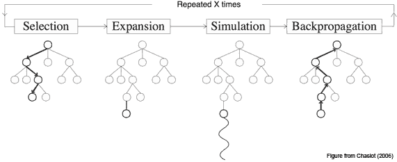
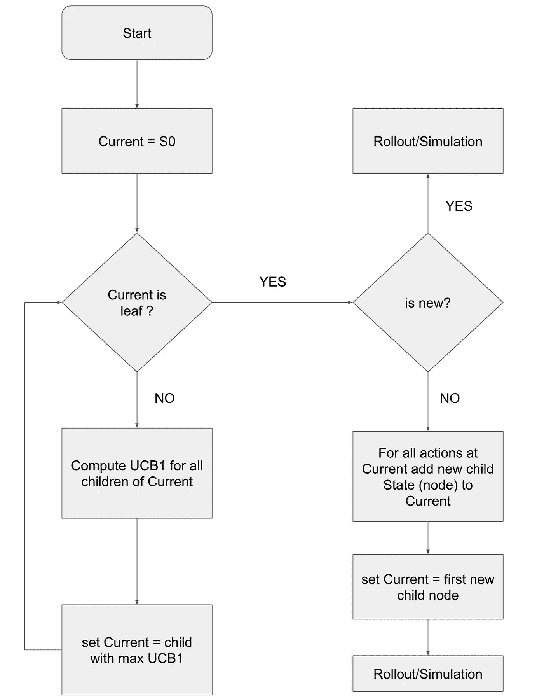
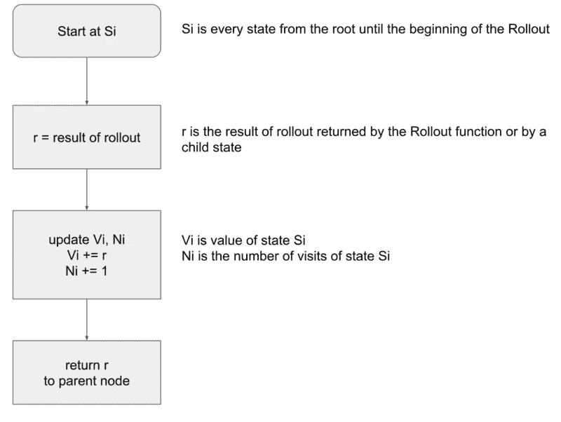
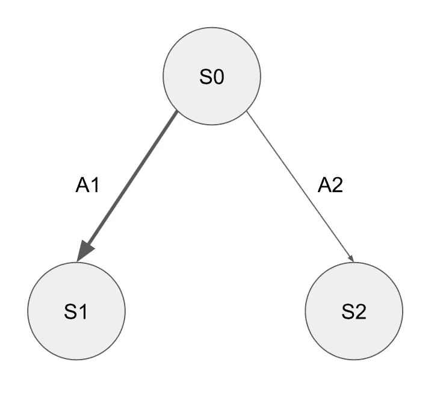
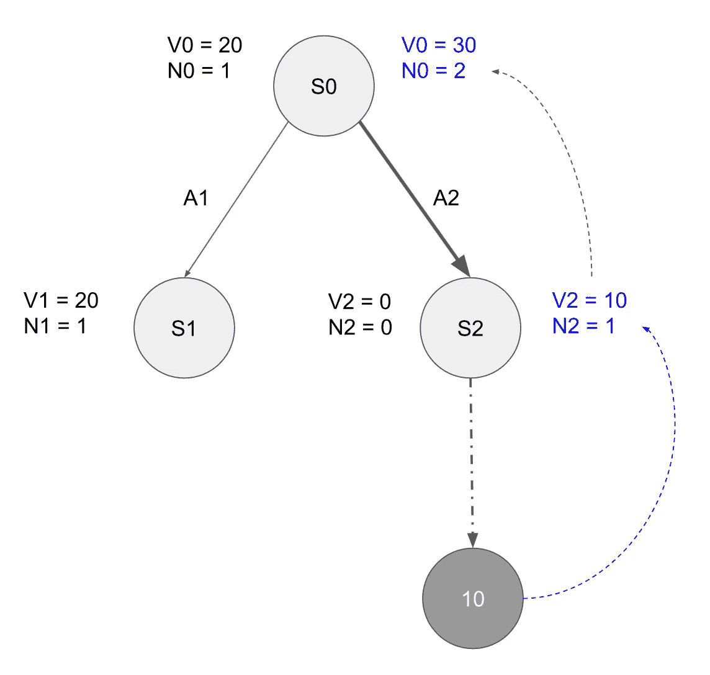

# 强化学习中的蒙特卡罗树搜索

> 原文：<https://towardsdatascience.com/monte-carlo-tree-search-in-reinforcement-learning-b97d3e743d0f?source=collection_archive---------7----------------------->

## Deep Mind 的 Alpha Zero AI 的核心搜索算法的配方。

[https://unsplash.com/photos/waAAaeC9hns](https://unsplash.com/photos/waAAaeC9hns)

**更新**:学习和练习强化学习的最好方式是去 http://rl-lab.com

> AlphaZero 使用通用的蒙特卡罗树搜索(MCTS)算法，而不是具有特定领域增强功能的 alpha-beta 搜索。每个搜索由一系列模拟的自我游戏组成，这些游戏从根状态根遍历树，直到到达叶子状态。([查看来源](https://deepmind.com/research/publications/general-reinforcement-learning-algorithm-masters-chess-shogi-and-go-through-self-play/))

# 概观

蒙特卡罗树搜索(MCTS)算法包括四个阶段:选择、扩展、展示/模拟、反向传播。

**1。选择** 算法从根节点 *R* 开始，然后通过选择最佳子节点沿着树向下移动，直到到达叶节点 *L* (到目前为止没有已知的子节点)。

**2。扩展** 如果 *L* 不是一个终端节点(它不会终止游戏)那么根据当前状态(节点)的可用动作创建一个或多个子节点，然后选择这些新节点中的第一个 *M* 。

**3。模拟** 从 *M* 开始运行模拟卷展栏，直到找到终端状态。终端状态包含一个结果(值),该结果将在反向传播阶段向上返回。
NB。卷展栏经过的状态或节点不被视为已访问。

**4。在模拟阶段之后，返回一个结果。从 M 到 R 的所有节点将通过将结果加到它们的值上来更新，并增加每个节点的访问计数。**

# 选择和扩展

该算法从被认为是根的节点或状态开始，然后选择要移动到的子节点。
选择基于置信上限(UCB1)公式:

其中***【vᵢ】***是状态 Si 的值，***【nᵢ】***是状态 Si 的访问次数，n 是同级节点的总访问次数(或者换句话说是 Si 的父节点的访问次数)，c 是用于微调的常数。
在为当前节点的每个子节点计算 UCB1 后，选择具有最高值的一个。

如果选定的节点是新的，这意味着它还没有被访问过，则调用 Rollout 来查找具有值的终端状态。否则，如果它被访问，则为当前节点上可用的所有动作创建子节点，移动到第一个子节点并开始卷展栏。

# 展示或模拟

展示或模拟是采取随机动作的阶段，检索着陆状态，然后采取另一个随机动作，以便在新状态着陆。重复这个过程，直到到达一个终端状态，此时返回终端状态的值。

# 反向传播

反向传播获取卷展栏的值，并更新从卷展栏开始直到根节点的节点。更新包括将卷展结果添加到每个节点的当前值，并将每个节点的访问计数增加 1。

# 例子

下面的例子展示了 MCTS 算法的所有不同阶段。

让我们从根节点 S0 开始。我们假设它以前被访问过，所以它不是新的。所以我们需要扩大它。我们假设在这个状态下有 2 个动作(A1，A2)。
我们通过添加由动作 A1、A2 产生的两个状态 S1 和 S2 来扩展该树。
因为 S1 和 S2 的 UCB1 都是无穷大(因为 N1=0，N2=0)，所以我们选择先用 A1。

.

现在 S1 是新的，因为它还没有被访问过(N1 = 0)。该算法说，在这种情况下，我们应该推出，直到我们达到一个终端状态。
让我们假设我们这样做了，并且找到了一个值为 20 的终端节点。我们将此值从 S1 向上传播到 S0(蓝色文本)。因此，S1 和 S0 的值都等于 20，访问次数等于 1。

.

.

.

现在在第二次迭代中，UCB1(S1) = 20，UCB1(S2) =无穷大，所以我们采取行动 A2。
我们还注意到，S2 是新的(N2=0)，所以我们推出，直到我们找到一个终端状态。
我们假设终端状态的值为 10。我们将其从 S2 反向传播到 S0(蓝色文本)。最后我们得到 S2 (V2=10，N2=1)和 S0(V0 = 30，N0=2)

.

.

在第三次迭代中，UCB1(S1) = 20，UCB1(S2) = 10，所以我们选择去 S1。因为现在它不再是新的了(N1 > 0)，我们通过添加可用的动作和它们的登陆状态来扩展它。我们假设有两个动作 A3、A4，分别对应于 S3 和 S4。
由于 S3 和 S4 都有 UCB1 infinity，我们通过跟随 actin A3 选择 S3。S3 是新的，所以我们推出，直到我们找到值为 15 的终端状态。我们将这个值反向传播到节点 S3，S1，S0。可以在蓝色文本中看到更新后的值。

# 优势

*   MCTS 不需要任何关于给定领域的知识。除了游戏规则和条件，不需要知道任何战略或战术，这使得它可以在其他游戏中重复使用。
*   **不对称**
    MCTS 更频繁地访问更有趣的节点，并将其搜索时间集中在树的更相关的部分。
*   **随时**
    可以随时停止算法，返回当前最佳估计值。
*   **优雅**优雅
    算法不复杂，易于实现。

# 不足之处

*   **游戏实力**
    MCTS，就其基本形态而言，即使是中等复杂程度的游戏，也无法在合理的时间内找到合理的走法。
*   **速度**

# 丰富

*   特定于当前游戏的领域知识可以帮助过滤掉不太可能的移动或者产生更类似于人类对手之间发生的*滚动*。这有利于展示比随机模拟更真实的结果，并且节点需要更少的迭代来产生真实的奖励值。
*   **与领域无关** 与领域无关的增强并不将实现绑定到特定的领域，保持了通用性，因此是该领域大多数当前工作的焦点。