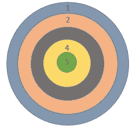
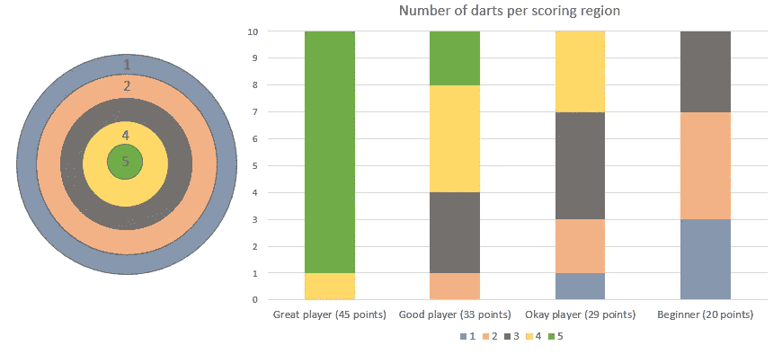
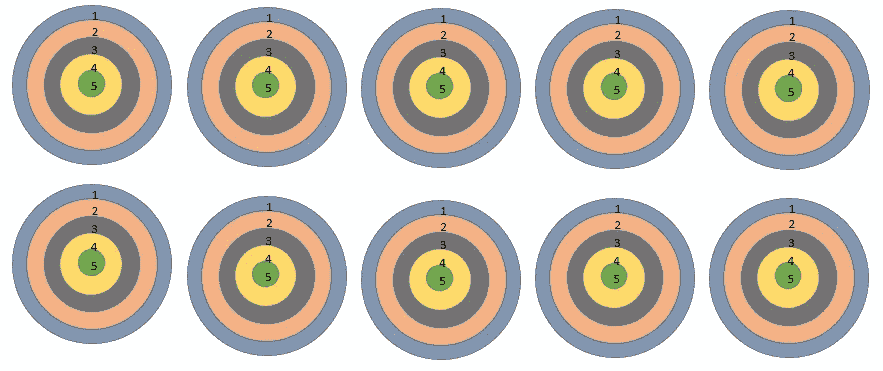
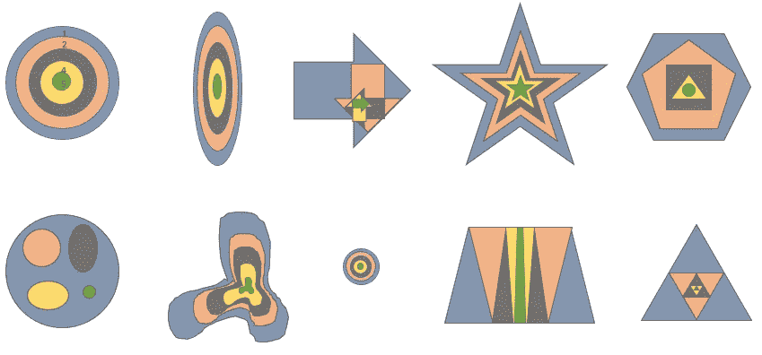
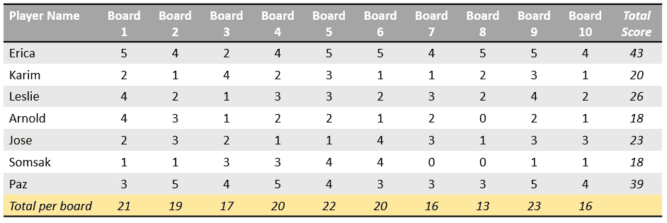

# 没有数学的蒙特卡洛

> 原文：<https://towardsdatascience.com/monte-carlo-without-the-math-90630344ff7b?source=collection_archive---------20----------------------->

好吧，也许会一点数学

Monte Carlo Casino and Garden, Monaco

蒙特卡洛模拟是数据科学和分析领域中极其常见的方法。它们可以用于从业务流程优化到物理模拟的任何事情。不幸的是，蒙特卡罗模拟的数学通常很难操作，对于没有很强数学背景的人来说可能会很吓人。更重要的是，蒙特卡罗方法的实际实施很难简明扼要地解释，尤其是在与高层领导的会议中。本文的目标是使用非技术读者可以理解的类比来解释蒙特卡罗模拟，而不需要求助于非数学家难以理解的密集数学或编码。

在我们讨论蒙特卡罗方法本身之前，我们需要做一点背景工作来建立一个基本的统计框架，最好的方法是用一个飞镖板。飞镖是一种技巧游戏(如果你真的不擅长的话，也可能是运气)。如果你有一个数值从 1 到 5 的镖盘，你向它投掷一个飞镖，根据飞镖落在镖盘上的位置，你将获得一定数量的点数。

Circular dart board with labeled point values

如果你在飞镖靶上扔 10 个飞镖，然后把所有的分数加起来，你会得到 0 到 50 之间的分数。对于一个不常玩飞镖的休闲玩家来说，这个分数总计可能会达到 25 分左右。如果你真的不擅长飞镖，总分可能在 10 分左右，如果你擅长飞镖，你的总分可能会更高。假设是 40。

Dart board and chart showing example number of darts landing in each region by player skill level

现在让我们假设你很富有，想买下整个酒吧，这样你就可以独享所有的飞镖靶了。向一块木板投掷 10 个飞镖可能与向 10 块相同的飞镖板上各投掷 1 个飞镖非常相似，这种说法可能并不夸张。如果你在一块木板上投掷 10 个飞镖得到 25 分，那么你在 10 块相同的木板上各投掷 1 个飞镖也可能得到 25 分。

Ten identical dart boards

如果你在数据科学方面做了很多工作，你可能会明白这是怎么回事。既然你很富有，而且买下了整个酒吧，这样你就可以开派对了，你觉得拥有 10 个相同的飞镖靶有点无聊。你决定把每个镖靶做成不同的形状和不同的点。因为你现在有不同的形状和不同的点，所以不太可能每个摊位都有相同的平均分。如果一个镖盘只有原来的四分之一大，总点数会更低。有一个巨大靶心的棋盘会有更高的总分。

Ten different boards of various shapes, layouts, and sizes

现在你的飞镖派对真的成形了。老手将面临更难的板的额外挑战，初学者将有一些更容易帮助他们学习的板，一些板非常奇怪，你不知道分数的分布会是什么。为了增加一点激励，你将有一个锦标赛。每个参加的人都会得到 10 个飞镖，并且可以向你的每个奇怪的棋盘扔一个飞镖。他们会把每个板块的分数加起来，然后把总分提交给你。

Score sheets for 7 players including points per board, total score, and total per board

现在预测平均分难多了。每块板都是不同的，每个人都有很多变量影响他们击中任何给定板的能力。你不能真的说某人的总分会是多少。根据你对这个人的了解，你可能会有一种直觉，但这是你能拥有的全部。

如果没有蒙特卡洛模拟，这就是许多决策者的处境。他们面临着一个非常复杂的系统，他们可能对潜在的可能结果有一些直觉(例如，更好的玩家将在更小的飞镖板上获得更高的分数)，但他们不知道如何将他们对个体变量的直觉整合到一个复杂的系统中。因此，他们凭直觉行事，也许对有些类似的情况只有很少的经验，这可能会奏效，或者他们可能会感到意外。

回到飞镖游戏的比喻，说你的飞镖派对是一个巨大的成功。每个人都喜欢它。那里有一个派对策划人。某个新体育电视台的代表在那里。他们都喜欢它。他们希望这个游戏概念变大，真的变大。现在你的多板飞镖比赛走向国际。蒙特卡洛飞镖比赛有上百场。数百万人玩，你有他们所有的总得分。

现在你有了一些真实的数据。基于数百万人在相同的 10 块板上投掷飞镖的得分，你对每块板的“好成绩”有一个很好的概念。你知道每块板的平均分数是多少。你知道总分的平均值和标准差。你可以预测游戏的基本统计数据。

这就是蒙特卡洛模拟的威力。每个镖盘代表一个变量，这些变量的值组合成一个聚合结果。如果您知道每个变量可能得分的一般分布，您可以使用蒙特卡罗模拟来预测多个变量的总得分。