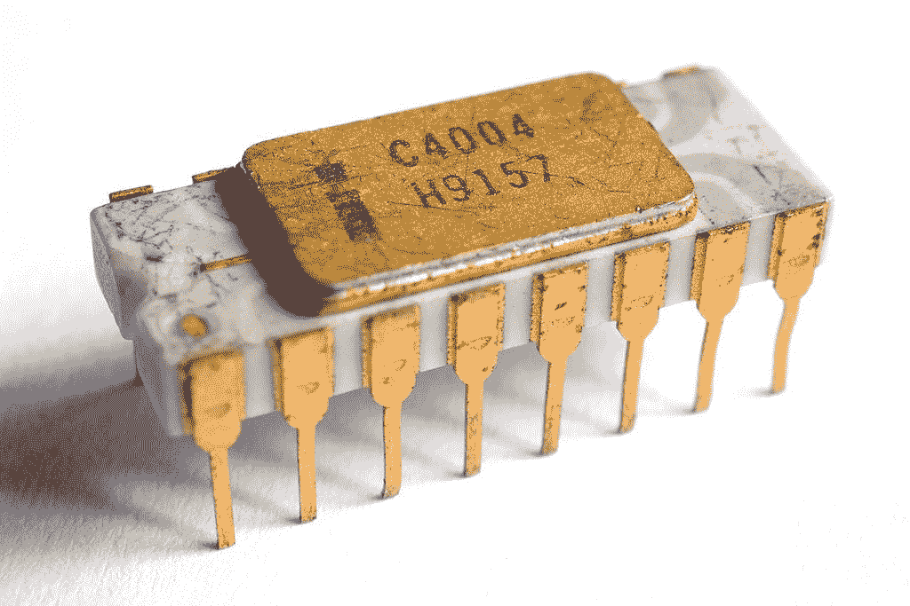

# 摩尔定律已死

> 原文：<https://towardsdatascience.com/moores-law-is-dead-678119754571?source=collection_archive---------6----------------------->

我们习惯于认为计算机速度每 18 个月翻一番，正如摩尔定律所预言的那样。事实上，过去 50 年就是如此。然而，由于技术障碍，摩尔定律正在走向终结。我们有什么选择？

[*这段文字以修订后的形式发表在《建成》中。*](https://builtin.com/hardware/moores-law) *去那里寻找规范版本。*

Intel 4004

# 1.小型化

戈登·摩尔在 1965 年预测，晶体管的数量将每 18 个月翻一番，后来他修正为两年。他的定律存在了 50 多年的事实让摩尔感到惊讶，在最近的一次采访中，他描述了与进一步小型化相关的几个潜在障碍:光速、材料的原子性质和不断增长的成本。

从上往下看，CPU 执行基本的算术运算。一个微处理器在一个由晶体管组成的集成电路上集成了 CPU 的功能。如今，CPU 是一个拥有数十亿个晶体管的微处理器(由单个电路组成)(例如，Xbox One 拥有[50 亿个](https://www.theregister.co.uk/2013/08/28/xbox_one_system_on_chip/))。

第一个英特尔微处理器，英特尔 4004，有 2300 个晶体管，每个晶体管的大小为 10𝜇m。截至 2019 年，大众市场上单个晶体管平均为 14 纳米，许多 10 纳米的[型号进入市场。](https://interestingengineering.com/intel-finally-unveils-10nm-cannon-lake-processors)[英特尔设法在每平方毫米上封装了超过 1 亿个晶体管。最小的晶体管](https://spectrum.ieee.org/nanoclast/semiconductors/processors/intel-now-packs-100-million-transistors-in-each-square-millimeter)[达到 1nm](https://www.theverge.com/circuitbreaker/2016/10/6/13187820/one-nanometer-transistor-berkeley-lab-moores-law) 。

# 2.原子规模和飞涨的成本

光速是有限的和恒定的，并且对通过单个晶体管在一秒钟内可以处理的计算数量提供了自然的限制，因为信息不能比光速更快地传递。目前，比特是由穿过晶体管的电子模拟的，因此计算速度受到电子穿过物质的速度的限制。导线和晶体管由电容 C(存储电子的能力)和电阻 R(它们对电流的阻力)来表征。随着小型化，R 上升，C 下降，进行正确的计算变得更加困难。

随着小型化的进一步发展，我们将会遇到海森堡的不确定性原理，它将精度限制在量子水平，从而限制了我们的计算能力。[据计算](https://ieeexplore.ieee.org/document/4567410)仅基于测不准原理的摩尔定律将在 2036 年走到尽头。

T4 国防高级研究计划局微系统技术办公室主任 Robert Colwell 说，他将 2020 年和 7 纳米作为最后一个工艺技术节点。“事实上，我预计行业将尽一切努力推进 5 纳米，即使 5 纳米并没有比 7 纳米提供更多优势，这将最早的目标推迟到 2022 年。我认为终点就在这些节点附近。”

另一个慢慢扼杀摩尔定律的因素是与能源、冷却和制造相关的成本不断增长。构建新的 CPU 或 GPU 会花费很多。制造一个新的 10 纳米芯片大约需要 1 . 7 亿美元，7 纳米芯片大约需要 3 亿美元，5 纳米芯片需要 5 亿多美元。这些数字只能通过一些专门的芯片来增长，例如，NVidia 在研发上花费了超过 20 亿美元来生产一种旨在加速人工智能的 GPU。

# 3.计算的未来

考虑到所有这些事实，有必要在硅制成的电子和晶体管之外寻找替代的计算方式。

最近一个势头越来越大的替代方案是量子计算。量子计算机基于量子位，量子位，并使用量子效应，如叠加和纠缠，从而克服了经典计算的小型化问题。现在预测它们何时会被广泛采用还为时过早，但是已经有一些有趣的例子说明了它们在商业中的应用[。量子领域最紧迫的问题是将量子计算机从几十个量子位扩展到几千甚至几百万个量子位。](https://medium.com/@pchojecki/quantum-computing-for-business-347b95d400f9)

另一种方法是针对特定算法调整的专用架构。由于机器学习的巨大需求，这个领域发展非常迅速。GPU 已经被用于人工智能训练超过十年了。近年来，谷歌推出了旨在促进人工智能的 TPU，目前有超过 50 家[公司](https://www.eetimes.com/document.asp?doc_id=1333413)生产人工智能芯片，仅举几例: [Graphcore](https://www.zdnet.com/article/the-ai-chip-unicorn-that-is-about-to-revolutionize-everything-has-computational-graph-at-its-core/) 、 [Habana](https://habana.ai/) 或 [Horizon Robotics](https://www.horizon.ai/?lang=en-US) 以及[大多数领先的科技公司](https://www.ft.com/content/1c2aab18-3337-11e9-bd3a-8b2a211d90d5)。

FPGA 代表现场可编程门阵列，这意味着这种硬件可以在制造过程后进行编程。精工于 1985 年[生产了第一批 FPGAs，但不同的可再编程硬件可以追溯到 20 世纪 60 年代。FPGAs 最近开始流行，特别是在数据中心的使用，就像 T2 的英特尔和 T4 的微软所做的那样。微软还用 FPGAs 加速了](https://www.semiwiki.com/forum/content/1596-brief-history-fpgas.html)[必应搜索](https://www.wired.com/2014/06/microsoft-fpga/)。与 FPGA 类似的概念是 ASIC，专用集成电路。最近他们非常受欢迎[加密货币挖掘](https://en.bitcoinwiki.org/wiki/ASIC_mining)。

经典计算的另一种替代方法是用其他东西代替硅或电子。用电子的自旋代替电荷产生了[自旋电子学](https://en.wikipedia.org/wiki/Spintronics)，一种基于自旋的电子学。它仍在研究中，没有面向大众市场的车型。目前正在研究的还有[光学计算](https://phys.org/news/2018-03-optical-horizon.html)的想法——利用光来执行计算。然而，建造一台工业光学计算机仍然有许多障碍。

也有很多非硅材料的实验。化合物半导体将元素周期表中的两种或两种以上元素结合在一起，如镓和氮。[不同的研究实验室正在测试由硅锗或石墨烯制成的晶体管](https://www.economist.com/technology-quarterly/2016-03-12/after-moores-law)。最后但并非最不重要的是，有一种用细胞或 DNA 作为集成电路的[生物计算](https://www.scientificamerican.com/article/a-circuit-in-every-cell/)的想法。但这离[任何工业用途](https://motherboard.vice.com/en_us/article/jpgdgd/engineers-develop-key-building-block-for-sophisticated-bio-computers)都更远。

总而言之，为了超越摩尔定律，我们需要超越电子/硅的经典计算，进入非硅计算机时代。好消息是有很多选择:从量子计算、石墨烯等神奇材料，到光学计算和专用芯片。计算的未来绝对令人兴奋！

 [## 加入我的技术简讯

### 让我们保持联系，每周或每两周发送一次关于技术的电子邮件。](https://creative-producer-9423.ck.page/c3b56f080d)