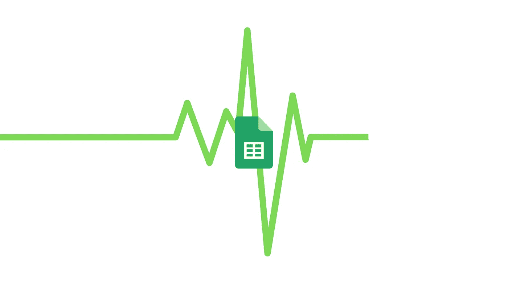
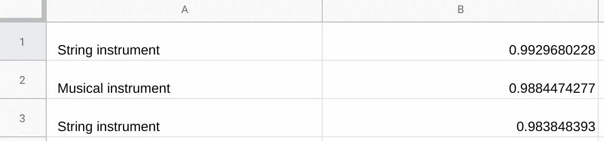
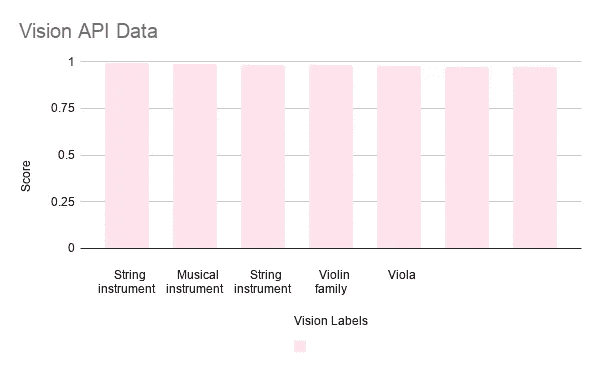

# 更多数据，更多工作表 API

> 原文：<https://towardsdatascience.com/more-data-more-sheets-api-b1e3ddfa0d1?source=collection_archive---------38----------------------->



## Google Sheets API 如何使用魔法(和代码)用可视数据填充您的表单。

作为马友友的超级粉丝，我一直在用谷歌视觉应用编程接口(API)处理大提琴的图像。获得 API 的[标签检测](https://cloud.google.com/vision/docs/detecting-labels)结果后，当屏幕上输出“弦乐器”这样的字眼时，我欣喜若狂。计算机能像我一样识别和欣赏大提琴的图像，这多棒啊。

然而，通过 Vision API 发送图像的*点*到底是什么？我已经可以看到里面有什么了，那么为什么我还需要一台电脑来重申我已经知道的东西呢？

就像大多数生活中的问题一样，答案是 Google Sheets。

电子表格是组织和可视化数据的好工具。)机器学习是获取这类数据的绝佳方式。当机器学习返回的数据被收集、组织并通过表格可视化呈现时，机器学习(特别是 Vision API)变得非常有用。

## "但是使用床单既费时又令人困惑！"

你是对的，它肯定是可以的，这就是为什么我一直在使用 [Google Sheets API](https://developers.google.com/sheets/api/) 和[云函数](https://cloud.google.com/functions/?utm_source=google&utm_medium=cpc&utm_campaign=na-CA-all-en-dr-bkws-all-all-trial-p-dr-1007179&utm_content=text-ad-none-any-DEV_c-CRE_339544383307-ADGP_Hybrid%20%7C%20AW%20SEM%20%7C%20BKWS%20%7C%20RLSA%20%7C%20CA%20%7C%20en%20%7C%20PHR%20~%20Compute%20~%20Functions%20~%20google%20cloud%20functions-KWID_43700042239777659-aud-664745643345:kwd-298528048746&utm_term=KW_google%20cloud%20functions-ST_google%20cloud%20functions&gclid=CPyEv4bYy-MCFQ6mswodgCkAqA)来为我做所有的脏活累活。

# 获取数据。

调用 Google Vision API 就像几行代码一样简单。

```
const client = new vision.ImageAnnotatorClient();
const [result] = await client.labelDetection({image: 
    {content: fileBytes}
  });
```

具体来说，我正在对一个图像执行标签检测，[由 Vision API 定义为一种“检测和提取图像中实体的信息，跨越一个广泛的类别组”的方式因为我的大提琴图像是本地的，所以我通过 API 将它的图像字节作为一个](https://cloud.google.com/vision/docs/detecting-labels) [base64 编码的](https://cloud.google.com/vision/docs/base64)字符串发送。

你可以仔细看看标签检测返回的[响应](https://cloud.google.com/vision/docs/reference/rest/v1/AnnotateImageResponse)，但是在这里，我只对标签的描述和它的分数感兴趣。

```
var labelsResult = result.labelAnnotations;
var labels = labelsResult.map(label => label.description);
var labelScores = labelsResult.map(label => label.score);
```

在这两个变量**标签**和**标签分数**中，我保存了 Vision API 返回的每个标签及其对应的分数。然而，光有这些惊人的数据是不够的。事实上，如果你不知道如何处理数据，或者不知道如何理解数据，那么数据实际上毫无用处。

如果你不确定如何继续，这里有一个可行的选择:把它全部发送到工作表。

## 准备我们的数据。

标签检测规范解释了我们的**标签**和**标签核心**变量将只是 [JSON 映射](https://cloud.google.com/vision/docs/detecting-labels#label_detection_response)。如果在我的工作表中，我希望每一行都包含一个标签及其相应的分数，该怎么办？这里最好的选择是将这个 JSON 映射分割成一个 2D 数组，它反映了我们希望数据在工作表中的显示方式。

首先，我们使用 JSON.stringify 将我们的 JSON 数据转换成一个大字符串。接下来，我们删除任何不需要的字符，最后，我们通过在每次到达逗号时指示一个新的索引，将这个大字符串转换成一个数组。(这是因为[我们返回的 JSON 映射](https://cloud.google.com/vision/docs/detecting-labels#label_detection_response)中的标签都用逗号隔开)。

```
var labelData = JSON.stringify(labels, null, 2);
labelData = labelData.replace(/[\[\]'\"]+/g,'');
labelData = labelData.split(',');
```

我可以对我的 **labelScores** JSON 响应执行这些完全相同的代码行，以获得包含所有分数的另一个数组。我选择将这个数组命名为 **scoreData** 。

## 写在纸上。

为了将我的两个数组发送到一个表中，我需要确保它们遵守表 API 的调用参数。如前所述，我希望发送到工作表的值数组需要反映我希望在工作表中格式化数据的方式。

我知道我的两个数组有相同的长度，因为每个标签都有相应的分数，反之亦然。

```
var dataLength = labelData.length;
```

我还知道，对于每一行，我希望在列 A 中有一个标签，在列 b 中有相应的分数。因此，这正是我的**值**数组需要的样子。

```
var values = []
  for (var i = 0; i < dataLength; i++) {
    var dataToPush = [labelData[i], scoreData[i]];
    values.push(dataToPush);
  }
```

为了将这些**值**推送到我的工作表中，我需要调用的方法是…

```
sheet.spreadsheets.values.update(request, {
```

…其中我的**请求**变量如下:

```
var body = {
 values: values
}var request = {
    spreadsheetId: 'YOUR_SHEET_ID',
    valueInputOption: 'USER_ENTERED',
    range: 'A1:B',
    resource: body,
    auth: // YOUR OAUTH CLIENT
};
```

无论何时进行 Sheets API 调用，指定`spreadsheetId`都是至关重要的，这是为了确保您所更改的正是您想要的工作表。以下是你如何找到自己的。

撇开凭证和数据不谈，也许这个请求变量中最重要的值是 **valueInputOption** ，在这里您可以指定*如何将值输入到工作表中。`'USER_ENTERED’`是您的最佳选择，确保数据会出现在您的工作表*中，就像您自己花时间输入数据一样*。*

此外，**范围**值(在 [A1 符号](https://developers.google.com/sheets/api/guides/concepts#a1_notation)中给出)对于确保您的数据按照指定格式编排到您的工作表中至关重要。A1 符号“A1:B”表示*从单元格 A1* 开始写入，*移动到 B 列*，然后*继续向下移动行并从 A 列切换到 B 列，直到所有数据都被写入*。因此，即使你已经将你的**值**数组设置为你希望数据显示的方式*，你也需要正确地将**范围**变量设置为*你希望它显示的位置*。*

**

*Fragment of what your inputted labels and label scores should look like in your Sheet. I hope you like cellos!*

## *生成可视数据。*

*如果您现在查看一下您的电子表格，您将看到从 Vision API 的标签检测中获得的所有数据。还是那句话——如果你不知道如何理解数据，那数据是什么？*

*你的下一步是记住每个人都喜欢图表！我们用 GCF 做一个吧。*

*从现有数据创建柱形图的 Sheets API 调用是一个 [batchUpdate](https://developers.google.com/sheets/api/reference/rest/v4/spreadsheets.values/batchUpdate) 请求，它非常类似于我们之前进行的 values.update 调用。这里的关键区别是我们发送给 batchUpdate 的[请求](https://developers.google.com/sheets/api/samples/charts#add_a_column_chart)参数:一个冗长的 JSON 主体，其中指定了域、系列、轴标题和位置。*

*让我们来看看 JSON 主体的一些细节，我们将把它存储在一个名为 **chartRequest** 的变量中:*

```
 *chartType: "COLUMN",
              legendPosition: "BOTTOM_LEGEND",
              axis: [
                {
                  position: "BOTTOM_AXIS",
                  title: "Vision Labels"
                },
                {
                  position: "LEFT_AXIS",
                  title: "Score" 
                }
              ],*
```

*上面的内容对于我们所拥有的数据来说是不言自明的:我们将创建一个柱形图，其中每一列都是一个标签，其高度由分数决定。同样，这只是我们的 **chartRequest** 需要的一小部分，但是理解请求体的这些细节将允许您为将来可能有的任何数据布局创建一个图表。*

*撇开长长的 JSON 正文不谈，batchUpdate 请求本身相当简单…*

```
*sheet.spreadsheets.batchUpdate({
      spreadsheetId,
      resource: chartRequest,
});*
```

*这就是你所需要的:你的电子表格的 ID(在哪里找到数据)和你的 chartRequest(如何从数据创建图表)。看到了吗？Sheets API 就像魔术一样。*

**

*The column chart you just generated from the Vision API data. Personally, I like to set all my columns to #ffe3ee.*

## ***化解生存危机。***

*好了，我们明白了，您可以使用 Sheets API 对数据和图表做一些很酷的事情——但是这有什么意义呢？*

*问得好。*要点*是我们生活在大数据时代，这意味着计算机和软件允许我们访问比以往任何时候都多的数据。你好更好的消费者分析，销售报告和市场研究！然而，技术的快速和持续进步使得公司很难跟上[,数据经常以丢失、被误解或未被分析而告终。](https://www.forbes.com/sites/bernardmarr/2016/06/16/spreadsheet-reporting-5-reasons-why-it-is-bad-for-business/#7c6e00f065e3)*

*通过这些简单的 Sheets API 调用，数据可以很容易地被存储、分析和可视化，而不必实际浏览 Google Sheet 本身。通过在后端处理这些实现，生成数据可视化不再令人困惑、乏味或耗时。此外，Google Sheets 使您的数据易于访问和分享。*

*大数据，小问题。*

***你可以在我的**[**GitHub**](https://github.com/madamCS/DataToSheets)**上找到我完整的 GCF 代码。***

*特别感谢我的实习主持人 Anu。*

*让我知道你是如何使用 GCF 和 Sheets API 来处理数据的，我很想听听你的意见！*