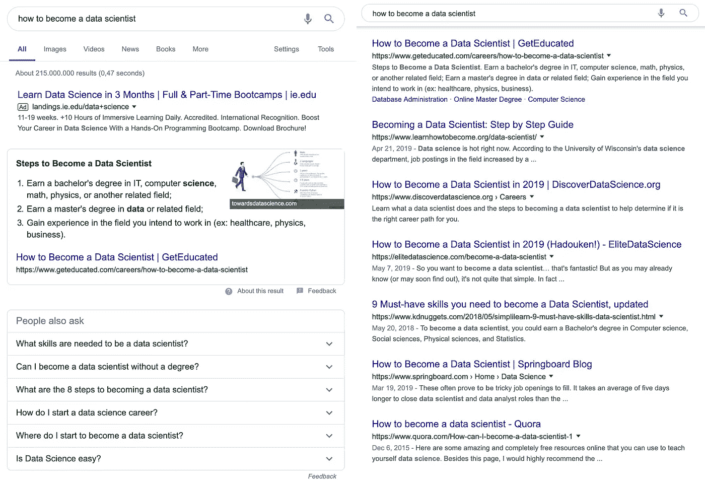

# 更多的关注和寻找答案的渴望，更少的炒作

> 原文：<https://towardsdatascience.com/more-focus-and-desire-to-finding-answers-and-less-hype-a05eb0ab1225?source=collection_archive---------26----------------------->

## 我认为为什么新人应该关注基础知识和数据工作的真正意义

如果你问我业内最常见的问题是什么，我会说是“*如何成为一名数据科学家。*“有点道理吧？有了对该领域的大肆宣传、新闻和赞美，有许多潜在客户对沐浴在数据的光辉中感兴趣是合理的。

去谷歌，输入这个时髦的查询，点击输入，你肯定会收到一个有数千个链接的页面，指向很多很多的指南、资源、教程等等。

No. Data Science is not easy.

这对新来者来说可能是个问题。

诸如“你应该学习这个库”、“掌握这个框架”、“成为一个 SQL 大神”、“成为一个 Kaggle 大师”、“背诵所有不同的激活函数”、“与 Yann LeCun 共进晚餐”等评论和说明，以及你可能找到的一些台词(可能不是最后一句)。

外面的信息量可能是巨大的！如此势不可挡，以至于新感兴趣的人会放弃。想要进一步的证据吗？这篇名为“ [*的 Reddit 帖子，有没有人看到有这么多东西需要学习而感到不知所措？*](https://www.reddit.com/r/learnmachinelearning/comments/bm7cet/does_anybody_else_feel_overwhelmed_looking_at_how/) ”提出了一些这样的例子。

When data was a bit simpler. Photo by [Vincent Botta](https://unsplash.com/@0asa?utm_source=medium&utm_medium=referral) on [Unsplash](https://unsplash.com?utm_source=medium&utm_medium=referral)

然而，如果不是把这些蹒跚学步的孩子扔到野外，让他们自己生存，而是我们，社区，导师，导师，朋友和领导者，可以缓和这种下降，并改变我们将这些新手引入数据领域的方式，会怎么样？

如果我今天开始学习数据科学的基础知识，并询问谷歌如何成为一名数据科学家，我可能会关闭浏览器，趴在桌子下哭。首先，“数据科学”这个术语很宽泛，它包含了我不知道它们存在的东西。让我们来看看这个。

[http://nirvacana.com/thoughts/wp-content/uploads/2018/01/RoadToDataScientist1.png](http://nirvacana.com/thoughts/wp-content/uploads/2018/01/RoadToDataScientist1.png)

看到这个了吗？太多了！这怎么能激励人呢？此外，我在这里看到的——这是我的观点——是某种路线图和带有任意完成百分比的清单，它们应该表明你是一个多么优秀的数据科学家。

旁注:这张图片来自 2013 年，这里展示的一些技术已经过时了。还有，我不是说图片是错的；它提供了关于如何开始的非常有价值的信息。我想说明的是，这可能会让那些想染指数据的人感到沮丧。

事实上，这是我在职业生涯中学到的，如果某人的头衔是“数据科学家”，我敢肯定他们的日常任务或日常业务是关于一个特定的主题，例如，风险评估、流失分析、数据可视化、成为 SQL 神等等。

这就引出了我的第一点。

如果我们不是向新人建议所有这些大量的信息、网站和“如何成为数据科学家”指南，而是试图指出或至少近似地指出，到底是什么促使和激励他们加入我们这个奇妙的数据世界，会怎么样？是数据可视化吗？或者是机器学习？对统计的热爱？–如果这个问题的答案要么是钱，要么是炒作，祝你好运。

通过这样做，通过问这个简单的问题，我们可以引导他们，让他们朝着正确的方向前进。一旦这个人走上了这条道路，并且对基础知识有了清晰的理解，那么就由他们来决定如何补充这些新获得的知识。

现在你可能会问:“这一切都很好，胡安，但是怎么做呢？”好问题，是的，这不是一件容易的事。但是，你注意到我是如何使用代词“我们”的吗？我指的是我们、社区和导师，我在上面提到过几段。因此，我在这里的信息是，如果你，某个目前在这个行业中的人，曾经处于帮助、指导、导师、某人的位置，请考虑这样做。我相信他们会很感激的。

我想提出的第二点是，不管选择的工作领域是什么，我们都应该清楚，数据人员的最终目标是找到问题的答案。我相信，再一次，这是我的观点，在大肆宣传、图书馆、花哨的方法和诸如此类的混乱中，我们已经迷失了这个领域的本质。这种注意力不集中是可以理解的，有时我也会这样。我们不断看到所有这些新的玩具被释放，我们想实现他们的权利，并得到最好的准确性评分。尽管如此，还是要明确一点，在一天结束的时候，你的老板和企业想知道，公司今天会赚或亏多少钱，哪种绿色的基调更好，或者用户是否是垃圾邮件发送者。

所以，下次有人问你成为数据科学家的关键是什么时，请尝试在你的回答中包含“问题”和“答案”这两个词。

对于初学者来说，一步一步来，记住没有人知道所有的事情。

感谢阅读。