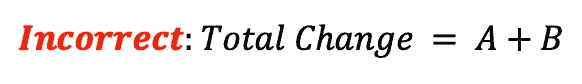
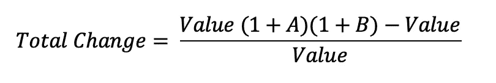
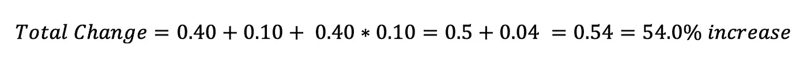
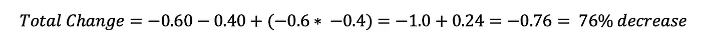
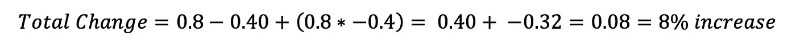
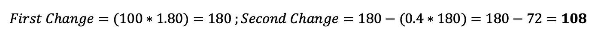
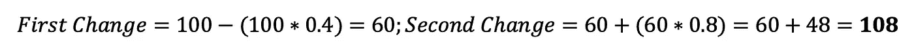
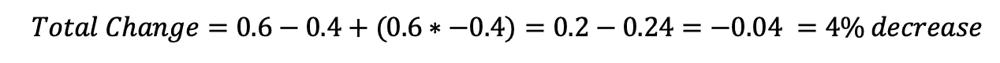
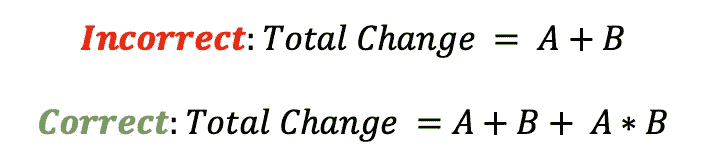

# 大多数人搞砸了百分之几的变化。以下是如何得到他们的权利。

> 原文：<https://towardsdatascience.com/most-people-screw-up-multiple-percent-changes-heres-how-to-do-get-them-right-b86bd6ef4b72?source=collection_archive---------1----------------------->

[(Source)](https://www.pexels.com/photo/photo-of-rocky-shore-during-dawn-1631664/)

## 用日常应用解决一个常见的数学问题

令人难以置信的是，经过 16 年的学校教育，大多数美国大学生都弄错了这个问题:

> 在下列情况下，总的百分比变化是多少？
> 
> 先减少 40%，然后增加 60%。
> 
> A.增长 10%
> 
> B.增加 20%
> 
> C.下降了 4%
> 
> D.以上都不是。

答案当然是 C，一个*整体下降 4%* 。大多数大学生不仅答错了这个问题，他们甚至没有得到正确的*方向*，超过一半的人猜测这是*增加。*常见的错误是将*面值的百分比*相加，得到总的百分比变化。因此，我们在[人们](https://youarenotsosmart.com/)不太擅长的事情的长长列表中又多了一个条目，*结合多个百分比变化*。

从一系列百分比变动中找出一个总的变化，远不是一个抽象的理论概念，它对我们的日常生活有影响，从消费品价格到国家预算，到我们的退休账户价值，再到我们最新的笔记本电脑的电池寿命。然而，尽管错误无处不在，对我们个人和整个国家都有影响，但我们无法教会人们如何正确地计算百分比。在本文中，我们将讨论错误是什么，如何避免它，为什么这件事，以及为什么人们会犯这种错误。我们的主要资源是论文:“当二加二不等于四:处理多个百分比变化的错误”([链接](https://academic.oup.com/jcr/article-abstract/34/3/327/1798868?redirectedFrom=PDF))。

## 有什么问题？

错误在于，当我们看到两个连续的百分比变化时，我们本能地认为它们是表面值，并将它们相加得到总变化。因此，50%的折扣加上 25%的折扣被解释为 75%。在等式形式中，对于两个百分比 A 和 B，错误是:

The common error of adding two percentage changes at face value.

问题是[百分比](https://www2.le.ac.uk/offices/ld/resources/numerical-data/percentages)是从**特定基值**计算出来的。在第一个[百分比变化](https://www.skillsyouneed.com/num/percent-change.html)之后，基数发生变化，第二个百分比没有相同的基数。**两个基数不同的百分比不能直接相加！**相反，我们必须分别计算出百分比变化。

## 合并百分比变化时如何避免错误

首先，从第一个百分比变化计算新的基数，然后，使用新的基数，从第二个百分比变化计算百分比。然后，可以根据新值和原始基值计算总百分比变化。在方程式中，总百分比变化为:

The correct method for calculating total changes from two individual percentage changes.

从两个连续的百分比变化 A 和 B 中消去该值，得到更简单的总百分比变化公式:

Total Percentage Change from Two Sequential Percentage Changes

错误出现在末尾的额外项 A * B 中。幸运的是，错误总是发生在系统化的方向上:

*   对于 2 次增长，我们低估了总体增长百分比
*   对于 2 次下降，我们高估了总下降百分比
*   对于导致总体增加的 1 次增加和 1 次减少，我们高估了总的百分比增加
*   对于导致总体下降的 1 次增加和 1 次减少，我们低估了总的下降百分比

让我们看看代表这 4 种情况的例子:

1.  2 增加:假设智能手机的电池寿命在一年内增加 40%，在下一年增加 10%。总共变化是多少？

2.2 减少:假设城镇税率先减少 60%，再减少 40%(我们只能愿望)。如果我们把两者加在一起，我们付 0%的税，但是肯定不对！的确不是:

[There’s no such thing as a free lunch.](https://en.wikipedia.org/wiki/There_ain%27t_no_such_thing_as_a_free_lunch)

3.1 增 1 减导致整体上升。假设国家支出在某一年增加了 80%,然后在下一年减少了 40%。总共变化是多少？

请注意，更改的顺序并不重要。我们可以先减少再增加，但变化的总体幅度是一样的。如果你不相信我，就从花 100 美元开始。第一阶算出:

先减少后增加给出了相同的答案:

4.1 增 1 减导致整体下降。假设一篇博文的长度在第一次编辑时增加了 60%，在第二次编辑时减少了 40%(这与最初提问的情况相同)。帖子变长了吗？

在最后一种情况下，将两个百分比相加得到 20% **的增长**，而实际上是 4% **的下降**。如果你犯了常见的错误，你将会站在 0 的错误一边！类似的错误发生在加州[的标准化考试分数](https://archive.org/details/200ofnothing00akde)一年下降了 60%，第二年上升了 72%，导致学生分数从基线上升而受到表扬。我不想扫兴，但是总的变化——等等，你自己解决这个问题——是考试成绩下降了 31%。学生比两年前更差，而不是更好，他们的父母仍然是数学盲(但不是你了！).

## 为什么这很重要？

以上都是非常真实情况的假设例子。不管是不是故意的，我们一直在处理多种百分比的变化，当我们没有意识到这一点时，通常会对我们不利。就像大多数其他人类错误一样，已经有人为了他们的利益利用它了。(这是一个很好的经验法则，人类逻辑中的错误首先在营销中被发现，然后才在学术期刊上发表。关于这方面的更多内容，请阅读罗伯特·恰尔迪尼的 [*影响力*。)](https://www.goodreads.com/book/show/28815.Influence)

比如看“双倍折扣”。这种情况经常发生在零售业，你可以在一件商品打五折的基础上再打八五折。销售人员希望您将百分比相加，得出折扣为 75%，而不是实际价值的 62.5%。或者考虑一台计算机，它的显示屏比上一款多 20%的像素，比上一款多 30%。卖家最好不要分别列出这些涨幅——相加就是 50%——而是用一个数字 56%来表示，这是实际的涨幅。

在这种情况下，销售人员会做的是[框定](https://en.wikipedia.org/wiki/Framing_effect_(psychology)):在一个环境中呈现信息，让我们做出对她有利的决定。任何数据都可以以多种方式呈现，例如，一种药物可以被描述为有 10%的机会引起副作用，或者有 90%的机会不引起副作用(这里的框架是积极的对消极的)。多重百分比变化只是框架的一个例子，它对我们的选择有着深远的影响(阅读 Tversky 和 Kahnemann 的[“决策框架”中的框架)。](https://www.uzh.ch/cmsssl/suz/dam/jcr:ffffffff-fad3-547b-ffff-ffffe54d58af/10.18_kahneman_tversky_81.pdf)

“当二加二”论文中的一项研究着眼于在零售环境中，将折扣呈现为单次降低或两个百分比折扣的效果。毫不奇怪，双重折扣比同等的单一折扣产生了更多的购买、更多的收入和更多的利润。虽然这只是一项单独的研究，但商店中双重折扣的盛行有力地证明了营销人员已经发现并利用了这一认知缺陷。

> 一个基本原则是，当我们拒绝自己做算术时，我们会被做过算术的人愚弄。

## 为什么会这样？

有一种理论解释了为什么我们不擅长百分数，以及分数和小数，那就是人类进化出的数学技能只能处理整数。[“整数优势”](https://www2.merga.net.au/publications/counter.php?pub=pub_conf&id=1410)从进化的角度来看是有道理的:自然界中的事物实际上只有整数。我们从来没有被 1.7 头美洲狮追赶过，或者必须有 2.5 个孩子来延续这个物种。几百万年来，我们非常擅长将整数相加。在更复杂的情况下——计算你退休账户的复合百分比回报——我们进化的能力并不能很好地维持。

我认为计算百分比变化的错误是我们对整数的偏好和保持系统一思维的结合。如果你读过像[《思考，快与慢》](https://en.wikipedia.org/wiki/Thinking,_Fast_and_Slow)这样的作品，那么你对思维的两个系统的概念就很熟悉了。第一种是使用一套[试探法和偏见](https://science.sciencemag.org/content/185/4157/1124)(思维捷径)做出的快速本能判断。第二种模式是通过对多条信息进行推理而做出的长期、理性的决策。第一个系统适用于我们祖先遇到的情况，但在信息丰富、不断变化的环境中就失效了，这正是我们现在所处的环境。

计算多个百分比变化的总影响需要从 1 切换到 2，这很费力，也是我们试图避免的。不幸的是，系统 1 似乎不会乘法，而是采取了一种捷径——加法——来计算 50%和 25%的增长是 75%，而不是 87.5%。

《当二加二》中的另一项研究着眼于我们何时能正确地计算出倍数百分比。有趣的是，他们发现我们无意识地做出了*努力和回报的权衡*，只有在回报值得的时候才停下来计算正确的答案(在这项研究中，正确的解决方案需要几美元)。我们应该小心从单个研究中推断，但是外部奖励(有时)会激励我们更加努力。

类似地，当百分比变化很容易计算时，比如减少 20%和减少 10%(总共减少 18%)，错误率就下降了。因此，降低努力或增加回报似乎会导致更精确的计算。错误率下降的第三种情况是当百分比相加得出的总数明显不可能时，如 80%和 40%的折扣。人们知道产品的价格不能下降 120%,否则他们将不得不支付购买它！

总之，我们错误地计算了多个百分比变化，因为需要努力通过正确的答案进行推理。我们擅长加法和使用整数，但不擅长乘法和百分比。解决方法和问题一样简单:花时间为自己进行计算，而不是假设答案。世界上最重要的决定需要招聘系统 2，所以你最好抓住每一个机会训练它！

# 结论

当我们按面值取百分比并把它们加在一起时，就会出现多百分比变化误差。正确的方法是单独进行计算或使用正确的公式:

It’s the details — in this case the A * B — that make the difference.

> 运用正确的等式会让你看到双倍折扣并不像看起来那么大，双倍上涨比看起来要大，要弥补 60%的下跌需要的不是 60%的上涨，而是 150%的上涨！

是的，这可能需要更多一点的努力，但是当你不愿意自己做数学计算时，这意味着你将输给那些做的人。我希望，即使你的自信在本文开始时遭受了 40%的打击，它也已经增加了 90%，达到了 14%的积极。

一如既往，我欢迎反馈和建设性的批评。联系我的最好方式是在 Twitter 上。