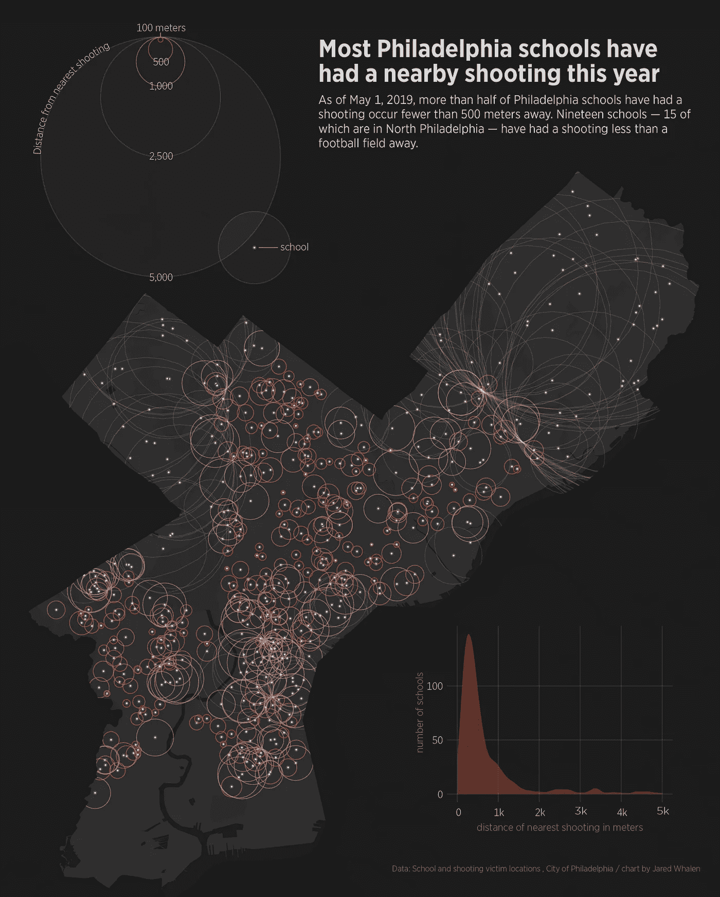

# 今年，大多数费城学校都在附近发生过枪击事件

> 原文：<https://towardsdatascience.com/most-philadelphia-schools-have-had-a-nearby-shooting-this-year-a57b22e45558?source=collection_archive---------23----------------------->

截至 2019 年 5 月 1 日，超过一半的费城学校在不到 500 米的地方发生了枪击事件。19 所学校——其中 15 所在费城北部——在不到一个足球场的地方发生了枪击事件。

费城一所学校和最近的枪击案之间的中间距离是 421 米——大约四分之一英里。这一数据包括地区学校、特许学校和私立学校。

```
| distance (meters) | schools |
|-------------------|---------|
| 0 - 500           |     316 |
| 501 - 1,000       |     114 |
| 1,001 - 1,500     |      39 |
|  > 1,500          |      78 |
```

绝大多数学生就读的学校距离枪击事件发生地不到 500 米(不到一英里)。

```
| distance (meters) | students |
|-------------------|----------|
| 0 - 500           |   90,896 |
| 501 - 1,000       |   33,715 |
| 1,001 - 1,500     |   12,695 |
|  > 1,500          |   31,264 |
```



**Data**: [Shooting victims](https://www.opendataphilly.org/dataset/shooting-victims) and [school locations](https://www.opendataphilly.org/dataset/schools), by provided by the City of Philadelphia. Chart by Jared Whalen.

这是离枪击案最近的五所学校。

```
|   |               school               | distance (meters) |
|---|------------------------------------|-------------------|
| 1 | Tarbiyatul Ilm Academy Inc.        |             26.74 |
| 2 | Mckinley, William School           |             31.23 |
| 3 | White Dove Performing Arts Academy |             31.97 |
| 4 | One Bright Ray-Simpson Campus      |             36.25 |
| 5 | Independence Charter West          |             48.07 |
```

## **方法论**

费城每所学校都计算了最近的射击次数。拍摄数据仅限于费城和 2019 年发生的事件。每个学校都添加了相应的缓冲区来可视化距离。

**数据** : [枪击事件受害者](https://www.opendataphilly.org/dataset/shooting-victims)和[学校地点](https://www.opendataphilly.org/dataset/schools)，由费城市政府提供。

**工具:** QGIS，R (dplyr，ggplot2)，Illustrator