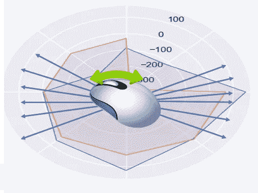
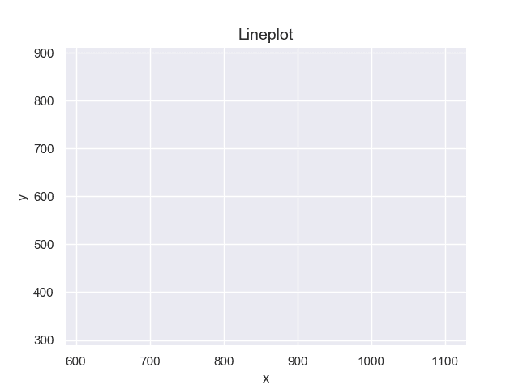
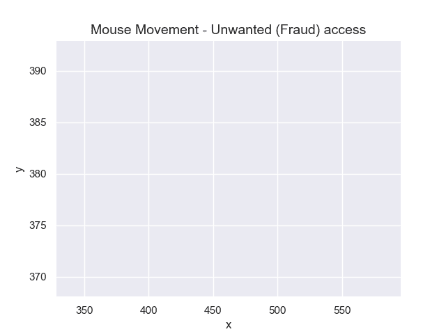
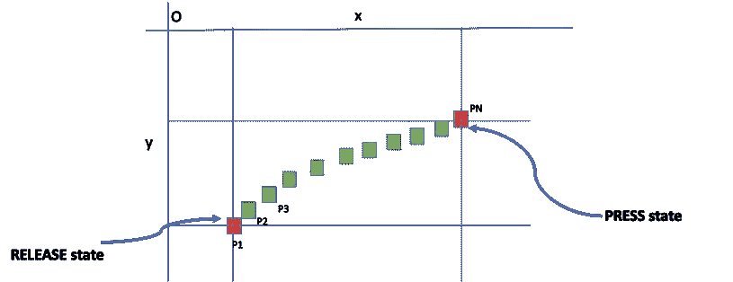
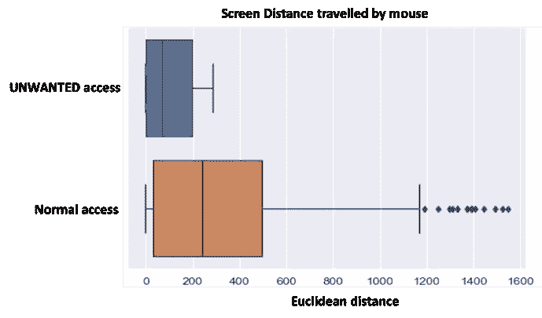
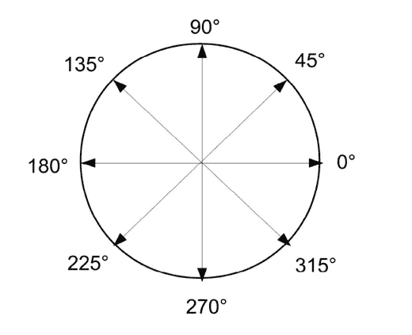
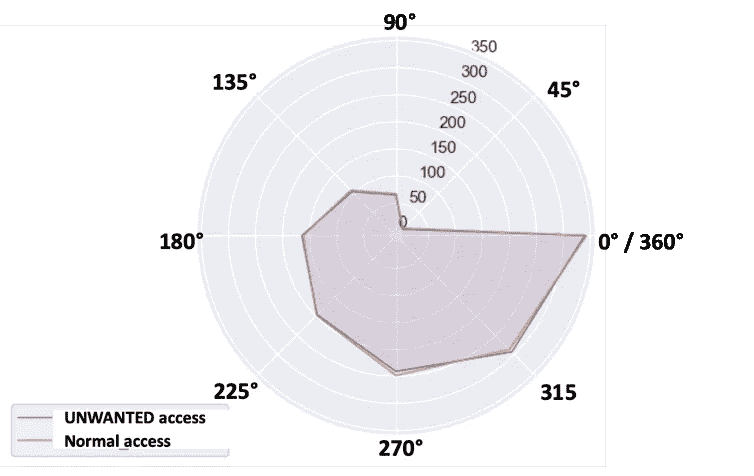
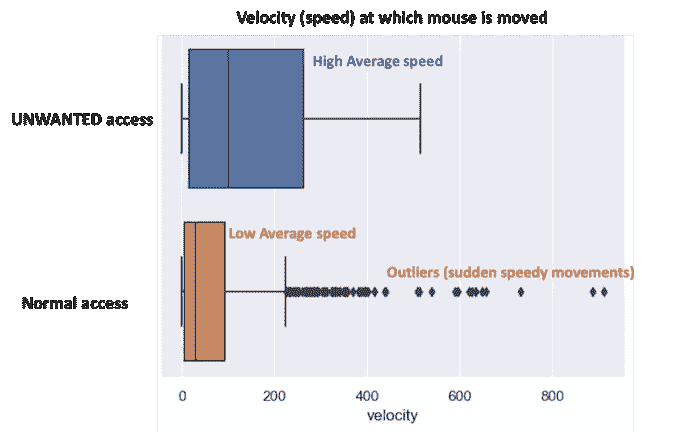
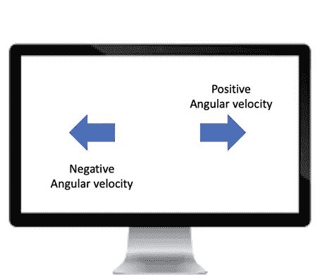
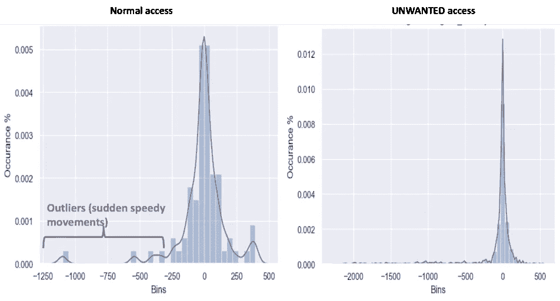

# 预测在线欺诈的鼠标移动模型

> 原文：<https://towardsdatascience.com/mouse-movement-modelling-to-predict-online-fraud-873d90b201e2?source=collection_archive---------20----------------------->

## 创造性地将鼠标移动数据和基本物理概念结合起来用于在线欺诈检测模型

数字化步伐的加快也增加了在线盗窃和欺诈的风险。所有行业，无论是银行、零售还是教育，都会受到这些威胁的影响。企业总是在寻找保护客户的方法。已经使用了不同方式的保护机制，例如数字自动生成密码、指纹或高级技术，例如语音或面部识别。不幸的是，一方面它们是侵入性的，另一方面它们不能提供持续的保护。

最近使用了行为方法，如分析鼠标移动来检测欺诈性或不必要的访问。这涉及到对用户鼠标移动方式的建模，这是本文的重点。这个故事的灵感来自 Margit Antal 和 Elod *Egyed-Zsigmond* [1]的优秀白皮书《IET 日报使用鼠标动力学进行入侵检测》和 Balabit 鼠标挑战数据集[2]。

一般来说，每个人都有自己的鼠标使用风格。有些人可能很快，有些人很慢。有些人比其他人更喜欢导航。仅仅通过观察鼠标的移动数据，你就可以了解一个人的很多行为

为了说明如何模拟鼠标移动，一个样本数据集[2]如下所示

Sample mouse movement data

鼠标移动数据具有诸如用户、会话、client_timestamp 之类的字段，这些字段给出了关于用户和活动时间的信息。字段 x 和 y 表示屏幕上指示鼠标位置的坐标。鼠标的状态，如移动、拖动、按下也被捕获。“欺诈”字段是基于访问是不想要的还是正常的这一事实的标记字段

模拟鼠标运动是创造性地使用这些领域，以确定哪些行为是正常的，哪些是不必要的。

首先，让我们想象鼠标移动的样子。下面显示的是正常使用时鼠标移动的动画形式

Mouse movement animation for normal access

这里也显示了不需要的访问的类似可视化

Mouse movement for unwanted (fraud) access

为了提取特征，对鼠标运动建模需要关于基本物理学的知识，例如距离、角速度、加速度等。

在这里，我解释了这些特性的含义，以及它们如何有助于识别不需要的访问

# 屏幕移动距离

屏幕移动距离是鼠标移动到的两个屏幕位置之间的距离。这两个屏幕位置对应于鼠标的释放状态和按下状态

Mouse movement between RELEASE and PRESS

鼠标移动的屏幕距离是点 P1 和点 PN 之间的欧几里德距离

我们可以使用箱线图分析正常访问和欺诈访问的屏幕距离

Screen Distance travelled Box Plot

您将会发现，不需要的访问所经过的屏幕距离范围小于正常访问。这意味着不需要的访问往往集中在屏幕的一小部分。正常的访问倾向于探索屏幕的不同部分

对于热心的读者来说，你一定从上面的动画中注意到了这种行为。如您所见，正常访问的 x 和 y 轴范围比不需要的访问大得多。

# 运动角度

运动角度表示运动的方向。范围从 0 到 360。角度可以用来了解运动的本质。例如，0°或 180°的移动表示直线移动，而 90°或 270°的移动表示垂直移动。

我们还可以将角度分为 8 个方向，如下所示

我们可以借助雷达图分析运动的角度。此处显示了正常和非正常进入的运动角度雷达图。每个方向上的直线长度是该特定方向运动的平均角度

Radar Chart for Angle of Movement

我们可以观察到，在雷达图中，不需要的访问和正常访问几乎完全重叠。这意味着这两种访问之间的移动角度没有太大差异

# 速度

一般来说，当我们想到像汽车抢劫或银行抢劫这样的事件时，我们倾向于认为它是快速和迅速完成的。那么，任何在线欺诈或不必要的访问也是高速进行的吗？让我们找出答案

速度是速度的指标。它以一秒钟内鼠标移动的像素距离来度量。我们可以用这个概念来分析鼠标移动的速度。两种访问的速度用方框图表示

Velocity (speed) box plot

你会发现不必要访问的鼠标速度通常比正常访问的速度要快。在不想要的访问中，鼠标在 0 到 250 像素/秒的范围内移动。在不需要的访问中没有观察到异常值。在正常访问中，鼠标在 0 到 100 像素/秒的范围内移动，但是有一些异常值显示为超出范围的黑点。这些异常值代表突然的高速运动。

该分析证实了我们对在线欺诈行为的想法。与汽车抢劫或网上盗窃相比，这是非常相似的行为。欺诈者往往很快完成他或她的活动，但没有任何突然的动作

# 角速度

我们已经看到，不需要的访问的速度通常高于正常访问，而正常访问确实有一些突然的快速移动。了解这些运动的方向将会很有意思，以便了解它是否揭示了一些额外的见解

我们可以把上面提到的角运动和速度的概念结合成角速度的概念。它表示特定方向的速度。

测量角速度时需要注意的重要一点是，角速度可以是正的，也可以是负的。所有从左到右(任何角度)的运动都有正的角速度。而从右向左的那些将具有负的角速度

Angular velocity can be positive or negative

这里显示了两种访问的角速度直方图

Angular Velocity Histogram

你会观察到，在正常的接近中，大多数突然的快速移动都有负的角速度，这意味着向后移动。这可能意味着要在一些已经填写的字段中进行一些更正，或者单击左侧菜单

除此之外，其他一些可以用角度和速度计算的有趣特征是直线度和曲率。直线度是非常接近 0 的运动。曲率是代表圆或曲线的运动

我们可以使用上述有趣的特征来建立一个可以预测不希望的访问的模型。普遍认为有用的一些特征是

*   屏幕距离
*   运动角度
*   速度
*   角速度
*   直线运动
*   弯曲
*   运动开始时间
*   上述值的最小、最大、标准偏差

有了这个功能，一般都能达到很好的精度。模型预测和准确性可能因每个情况、行业而异。

总之，我们看到了分析鼠标移动行为数据如何有助于预测不必要的或欺诈性的访问。

距离、速度、角度等数据与基础物理知识相结合，可用于创造性的特征工程，以开发预测模型来打击在线欺诈

参考

[1]—《IET 日报》使用鼠标动力学进行入侵检测([https://arxiv.org/pdf/1810.04668v1.pdf](https://arxiv.org/pdf/1810.04668v1.pdf))

[2] —巴拉比特老鼠挑战数据集(【https://github.com/balabit/Mouse-Dynamics-Challenge】T2

## 网站(全球资讯网的主机站)

你可以访问我的网站了解数据科学。你也可以用零编码进行分析。参见下面的链接

 [## 体验数据科学

### 激活您的数据科学思维

experiencedatascience.com](https://experiencedatascience.com) 

请**订阅**每当我发布一个新故事时，请随时关注。

 [## 每当 Pranay Dave 发表文章时，您都会收到电子邮件。

### 每当 Pranay Dave 发表文章时，您都会收到电子邮件。通过注册，您将创建一个中型帐户，如果您还没有…

pranay-dave9.medium.com](https://pranay-dave9.medium.com/subscribe) 

你也可以通过我的推荐链接加入 Medium。

 [## 通过我的推荐链接加入 Medium—Pranay Dave

### 作为一个媒体会员，你的会员费的一部分会给你阅读的作家，你可以完全接触到每一个故事…

pranay-dave9.medium.com](https://pranay-dave9.medium.com/membership) 

**Youtube 频道**
这里是我的 Youtube 频道的链接
【https://www.youtube.com/c/DataScienceDemonstrated 