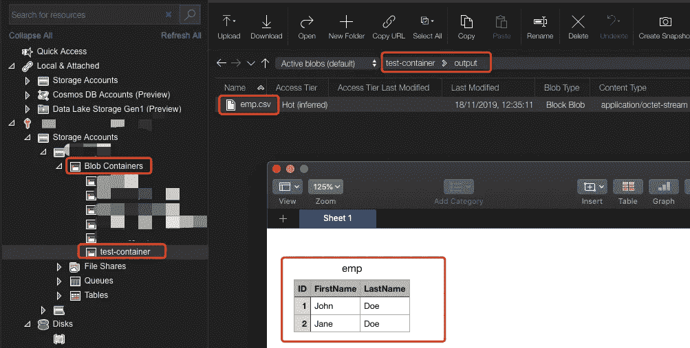

# 使用 Azure 数据工厂将数据从本地 SQL Server 移动到 Azure Blob 存储

> 原文：<https://towardsdatascience.com/move-data-from-on-premise-sql-server-to-azure-blob-storage-using-azure-data-factory-bbf67e4e5fde?source=collection_archive---------12----------------------->


虽然有一个将数据从本地 SQL Server 复制到 Azure Blob 存储的官方教程([https://docs . Microsoft . com/en-us/Azure/data-factory/tutorial-hybrid-copy-portal](https://docs.microsoft.com/en-us/azure/data-factory/tutorial-hybrid-copy-portal))，但本文将重点讨论该教程中没有涉及的一些细节。举个例子，

*   如何手动设置自托管集成运行时(SIR)？
*   SQL Server 安全配置提示
*   安全气囊系统连接绳配置提示
*   将 Azure Blob 存储添加为接收器的提示

本教程不会从创建 Azure 数据工厂(ADF)实例开始。如果你还没有，并希望从那里开始，使用上面的官方教程就足够了。

现在，我假设您已经准备好了本地 SQL Server 和 ADF 实例。现在我们应该开始了。

# 准备数据源

让我们创建一个测试数据库，将本地 SQL Server 中的测试应用表作为数据源。因此，首先转到您的 SQL Server Management Studio (SSMS)来创建数据库和表。


Right-click “Databases” and select “New Database…”


Input a database name


Right-click the database select “New Query”

复制粘贴下面的 SQL 脚本来创建表并插入一些测试条目。这段代码来自上面的官方教程

```
CREATE TABLE dbo.emp
(
     ID int IDENTITY(1,1) NOT NULL,
     FirstName varchar(50),
     LastName varchar(50)
)
GOINSERT INTO emp (FirstName, LastName) VALUES ('John', 'Doe')
INSERT INTO emp (FirstName, LastName) VALUES ('Jane', 'Doe')
GO
```

# 创建 SQL Server 用户

在实践中，我们应该让 SIR 使用 root 用户或任何具有 admin 权限的用户。相反，出于安全原因，我们希望为目标数据库创建一个只读用户。让我们创建这个用户。


Right-click “Security” -> “Logins” under the SQL Server and select “New Login”


Create the user called “adfuser”, input password

请注意，我们不想为此用户选中“用户必须在下次登录时更改密码”，因为它不应该提供给任何“用户”，而只能由 ADF 服务使用。

然后，让我们将这个用户添加到我们刚刚创建的数据库中。


Right-click “Security” -> “Users” under the new database and select “New User”


Input user name and default schema


In the “Membership” tab, enable “db_datareader”

之后，很重要的一步就是检查你的 SQL Server 是否已经启用了“SQL Server 身份验证模式”。否则，您创建的用户将永远无法访问。


Right-click the SQL Server Instance and go to “Properties”


Go to the “Security” tab and make sure “SQL Server and Windows Authentication mode” is enabled

# 创建 ADF 管道

转到 ADF Author 选项卡，单击`Pipelines`旁边的“…”按钮，并在下拉列表中选择`New pipeline`。


然后，在右窗格的主视图中，为管道命名。姑且称之为`OnPremSQLEmpToBlob_Pipeline`。


展开`Move & transform`部分，将`Copy data`拖动到右侧主区域，重命名为`SQLEmpToBlobEmp_Activity`。


之后，转到`Source`选项卡，点击`New`创建一个新的数据集作为源。


搜索“sql server”以获取 SQL Server 连接。选择它并点按“继续”。


让我们称这个数据集为`OnPremSQLServerEmp`，然后我们需要为这个数据集创建一个新的链接服务。


让我们将新的链接服务命名为`OnPremSQLServer_LinkedService`，然后为这个本地资源创建一个集成时间。


# 手动设置自承载集成运行时

在上一步之后，我们为集成运行时选择“New”。然后，我们选择“自托管”并单击继续。


输入 SIR 的名称。我想将其命名为`DevVmIntegrationRuntime`,因为我将在我的开发虚拟机上设置它。


在这里，我们来到了重要的一步。在官方教程中，建议使用快速设置，这样肯定简单很多。然而，这在某些情况下可能是不可行的，例如，系统安全策略不允许这个自动脚本在这台机器上运行，当您想要使用快速设置时，经常会看到这个错误。


因此，我们需要使用选项 2:手动设置。因此，请下载 SIR 安装程序，并在您想要托管 SIR 的机器上运行它。


只需等待 SIR 安装完成，然后复制密钥并粘贴到已安装的 SIR 中，将它们连接在一起。


它应该会自动相互连接，并且运行 SIR 的机器名称会自动填充为节点名称。你可以重命名它，但对我来说，这没关系。

单击“完成”并等待它自己注册，然后单击“启动配置管理器”，您应该能够看到如下屏幕。


然后，我们可以在`Diagnostics`选项卡中测试 SQL Server 连接，如下所示。请注意，我在本地 SQL Server 的同一台机器上运行 SIR，因此我使用`localhost`作为服务器名称。然而，出于安全考虑，在实践中不建议这样做。如果您将一台独立的机器与 SQL Server 实例连接，只需用机器名和实例名替换`localhost`。

另一个重要的提示是，在这个连接测试中，我们需要使用双斜杠`\\`来分隔服务器名和实例名。


然后，我们回到 ADF。应用并关闭安全气囊系统配置面板。现在，我们也想测试这里的连接。请看下面的截图。


另一个非常重要的提示是，我在其他地方没有找到任何详细说明。也就是说，这里的服务器名不应该是双斜杠。这将导致您测试连接时出错。相反，您应该使用单斜线`\`来分割服务器名和实例名。我相信这是因为 SIR 依靠反斜杠来转义斜杠字符，但 ADF 不需要转义，但它会将双斜杠转换为实际上与服务器名和实例名不匹配的两个斜杠符号。因此，您可能会得到以下错误:

> 连接失败
> 
> 无法连接到 SQL Server:“localhost \ \ SQLEXPRESS”，数据库:“testdb”，用户:“adfuser”。实例失败。活动 ID: xxxxxx-xxxxx-xxxxx。

现在，我们已经有了一个到本地 SQL Server 的有效链接服务器。让我们选择要从中提取数据的表，即`dbo.emp`，然后单击 OK。


# 在 Azure Blob 存储中创建接收器数据集

转到管道配置面板上的接收器选项卡，单击“新建”以添加新数据集。


然后，选择 Azure Blob 存储并单击继续。


在这里，我将使用`DelimitedText`作为一个例子，因为它是最可读的。


然后，按照说明创建新的链接服务。这次我们将使用`AutoResolveIntegrationRuntime`，它将是 Azure Integration Runtime (AIR)，因为 Azure Blob 存储是 Azure Cloud 中的原生服务。


在下一步中，将自动选择创建的链接服务。我们需要输入接收器数据集的文件路径。这里我已经创建了一个名为`test-container`的 blob 容器，但是文件夹`output`和文件`emp.csv`目前并不存在。ADF 会自动为我们创建它们。


提示 1:如果您想在 CSV 文件中包含字段标题，请选择“首行作为标题”。

提示 2:我们需要为`Import schema`选择“None ”,否则，由于模式导入失败错误，您将无法进入下一步:

> 架构导入失败:缺少所需的 Blob。container name:[https://xxxxx.blob.core.windows.net/test-container,](https://ctstoragetest.blob.core.windows.net/test-container,)container exist:True，BlobPrefix: emp.csv，BlobCount: 0。\r\n .活动 ID: xxxxx-xxxxx-xxxxx

# 执行管道

现在，我们应该准备好运行这个数据移动管道了。让发布一切，然后到管道面板顶部工具栏，点击“添加触发器”->“立即触发”。


# 核实结果

等到通知说管道成功，然后转到 Blob 存储检查输出文件。我更喜欢使用 Azure Storage Explorer，因为我可以直接下载并轻松打开 CSV 文件，但如果你更喜欢 Azure Portal 中的 web 视图，这也没问题。

[](https://medium.com/@qiuyujx/membership) [## 通过我的推荐链接加入灵媒-陶

### 作为一个媒体会员，你的会员费的一部分会给你阅读的作家，你可以完全接触到每一个故事…

medium.com](https://medium.com/@qiuyujx/membership) 

如果你觉得我的文章有帮助，请考虑加入 Medium 会员来支持我和成千上万的其他作者！(点击上面的链接)

# 资源:

Azure 文档，将数据从本地 SQL Server 数据库复制到 Azure Blob 存储:[https://docs . Microsoft . com/en-us/Azure/data-factory/tutorial-hybrid-Copy-portal](https://docs.microsoft.com/en-us/azure/data-factory/tutorial-hybrid-copy-portal)

SQL Server 2017:[https://www . Microsoft . com/en-in/SQL-Server/SQL-Server-downloads](https://www.microsoft.com/en-in/sql-server/sql-server-downloads)

Azure 存储浏览器:[https://azure . Microsoft . com/en-GB/features/Storage-Explorer/](https://azure.microsoft.com/en-gb/features/storage-explorer/)