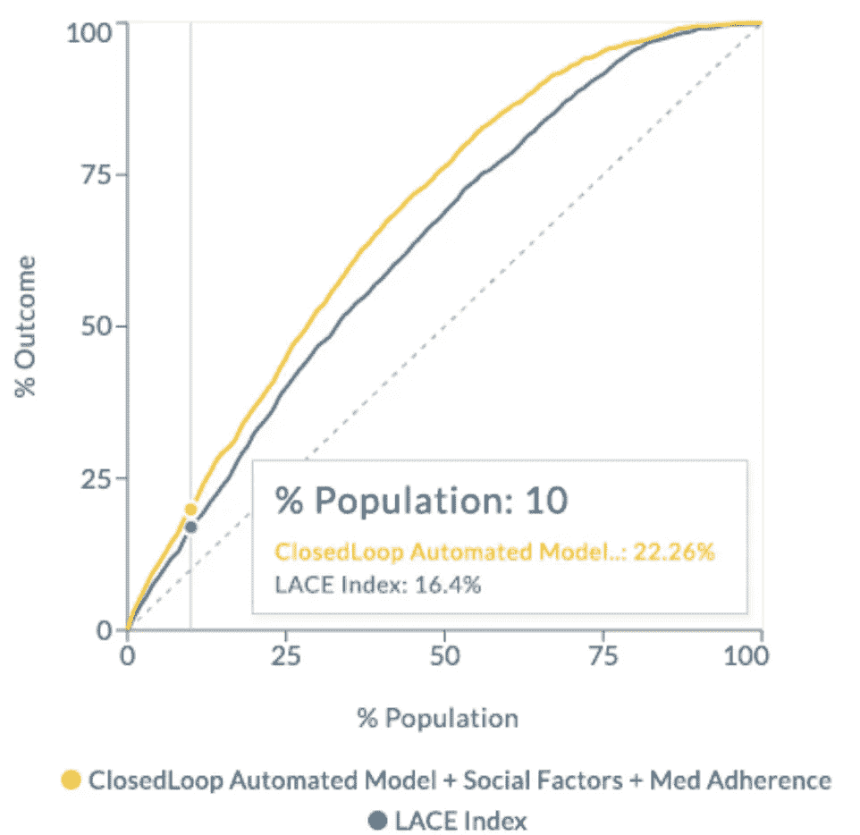
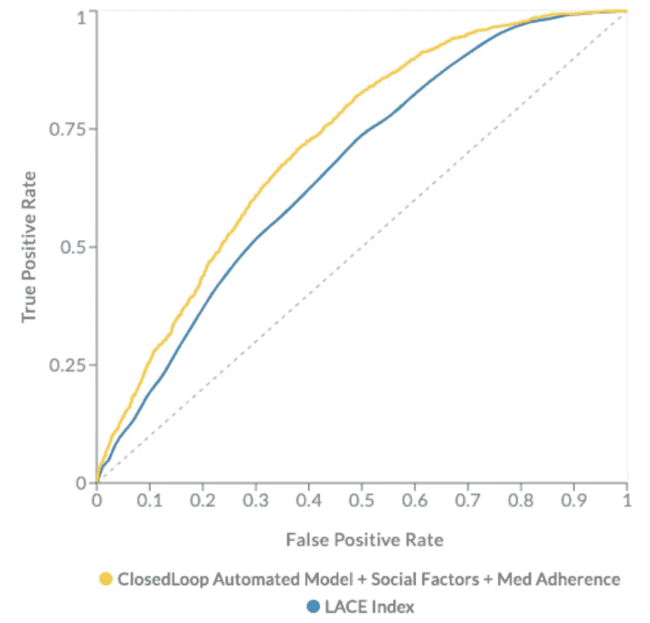

# 越过 ROC 曲线，有一个更好的人口健康图

> 原文：<https://towardsdatascience.com/move-over-roc-curve-theres-a-better-graph-for-population-health-c9bac01264a8?source=collection_archive---------25----------------------->

## 传达模型准确性的新图表

传达预测模型准确性的最佳方式是什么？

在过去的 15 年里，我一直在为医疗保健构建预测模型，这也是我经常回想起的一个问题。测量预测模型的准确性是很简单的，因为大多数建模框架使得计算大量准确性统计数据变得很容易。问题是统计数据本身并不能以一种帮助利益相关者理解如何有效使用模型的方式传达模型的准确性。

这个问题表现在诸如“0.82 好吗？”以及“0.85 比 0.82 好吗，或者这两者非常接近？”当医生、经理或企业用户问这些问题时，他们试图从与他们需要做出的决策相关的角度理解模型的准确性。这并不是说他们不理解统计数据的含义，而是准确性统计数据不足以回答诸如“与我们当前的方法相比，这种模式将为我们节省多少钱？”以及“我们应该在提高准确性方面投入更多，还是这个模型已经足够好了？”

我们发现两个简单的图表在医疗保健环境中交流模型准确性方面非常有效。第一张图，结果捕获曲线，类似于传统的[接收器操作特性(ROC)曲线](https://en.wikipedia.org/wiki/Receiver_operating_characteristic)，但是有一些简单但重要的差异，这使得它在向利益相关者传达模型准确性方面非常有效。我们在闭环平台中使用的图表是投资回报(ROI)图表。在这篇文章中，我将描述第一个图表。

# 成果捕获曲线

我们使用的第一张图是结果捕捉曲线。在任何情况下，当你使用预测来选择一群人来采取行动时，这都是非常有用的。例如，医疗保健提供商使用再入院风险的预测来确定手术后家庭健康访视的目标患者，保险公司使用会员流失的预测来确定再登记激励计划的目标会员。在这两种情况下，预测模型识别出极有可能产生负面结果的人，并针对风险最高的人采取一些干预措施。

对于这些情况，最相关的准确性度量是模型在针对干预方面有多好。在再入院的例子中，如果你有能力干预 5%的患者，那么比较两个预测指标准确性的最佳方法是看哪一个能识别出前 5%人群中更多的再入院。在大多数情况下，这个 5%的门槛并不是固定的。你可能只干预 3%的人，或者最多 10%的人。结果捕获曲线显示了所有不同阈值水平的准确性。再入院模型的图表如下所示:

Image from ClosedLoop Platform

我们使用历史测试集(不是用于建立模型的测试集)来绘制此图，我们可以将模型的预测与实际发生的情况进行比较。横轴表示所选人群的不同百分比，纵轴表示该组中发生的总再入院百分比。图表上的黄线穿过水平轴上的点 10 和垂直轴上的点 22。这意味着具有最高预测风险的 10%的患者占全部再入院的 22%。

使用预测模型进行干预时，最重要的权衡是要做多少干预。进行更多的干预需要更多的资源，但可以避免更多的负面结果。结果捕获曲线直接证明了这种权衡。它不是将模型的准确性作为抽象的统计数据来呈现，而是呈现在关于模型实现的关键决策的上下文中。

在图上画多条线可以让我们比较不同模型的精度。更精确的模型将从相同比例的人群中捕获更高百分比的结果(在图中更高)。在该图中，黄线显示来自机器学习模型的预测，而黑线来自 LACE 指数，这是一种基于规则的再入院风险方法。对于任何级别的干预，机器学习模型都优于 LACE 指数。在 10%的人口中，LACE 指数捕获了 16%的再入院率，而机器学习模型捕获了 22% —提高了 30%。

# 结果捕获与 ROC

ROC 曲线传统上用于显示模型的准确性。下面的 ROC 曲线比较了与上面的结果捕获曲线相同的两个再入院模型。

Image from ClosedLoop Platform

你可以看到这些图表有很多相似之处。在这两种情况下，黄线在黑线之上，总体形状相似。事实上，两个图中的纵轴是相同的。ROC 曲线中使用的真阳性率(TPR)的定义与二元预测的结果捕获相同。我们更喜欢术语“结果捕获”,因为它更容易被非统计人员理解，并且容易扩展到连续预测，我们将在下面讨论。在这两个图表中，随机预测表示为从图表的左下方到右上方的对角线。

图表之间的关键差异是水平轴。在 ROC 曲线中，横轴是假阳性率(FPR)，而在结果捕获曲线中，它是人群的百分比。这很重要，因为结果捕获曲线显示了通过干预不同比例的人群可以达到什么样的准确度。确定要进行的干预的数量，以及执行干预所需的资源，是实现模型时需要做出的关键权衡。

横轴的变化改变了曲线下面积(AUC)指标的含义。对于 ROC 曲线，完美的预测值将具有 1.0 的 AUC。它将有一个 TPR 为 1.0 和 FPR 为 0.0 的点。成果捕获曲线没有这个属性，因为总要包含一些非零百分比的人口，以确定所有的积极成果。可以计算结果捕获曲线的 AUC，但当需要单个准确性统计时，我们更喜欢使用 ROC AUC，因为许多人都熟悉它，它具有 1.0 的良好特性，是一个完美的预测器。

# 连续结果

与 ROC 曲线不同，可以为预测连续结果的模型绘制结果捕获曲线。同样，如果模型的预期用途是针对那些对某些干预具有最高预测的人，则此图最为相关。在医疗保健领域，一个常见的使用案例是确定可能会产生高额费用的患者，以便为他们提供额外的护理协调。下面我们展示一个医疗费用预测的图表。

Image from ClosedLoop Platform

该图将医疗成本的机器学习预测与现有方法进行了比较，现有方法只是根据患者的历史成本对患者进行排名。如果我们看看机器学习模型预测成本最高的 5%的人口，这些患者占总总成本的 38%。如果我们使用以前的成本作为我们唯一的指南，前 5%只代表总成本的 33%。机器学习模型在相同规模的人群中识别出 15%以上的成本。

ROC 曲线已经存在了 70 多年，并被证明在广泛的应用中非常有用，但没有一个完美的图表适用于所有情况。根据模型的使用方式，不同的决策将是重要的，因此不同的图表将是最相关的。

我们发现，在预测将用于选择高风险人群进行干预的情况下，结果捕捉曲线非常有效。它类似于 ROC 曲线，但以一种有助于直接回答应该进行多少干预的格式呈现信息。它还具有可用于二元和连续预测的优点。

在 [ClosedLoop.ai](http://www.closedloop.ai) 时，我们的医疗保健预测分析平台将结果捕捉曲线作为模型准确性标准报告的一部分，包括在我们的用户界面和 Python 分析包中。对于二元分类模型，我们也显示 ROC 曲线，但我们一再发现，数据科学家和企业主都发现结果捕获曲线在回答关于准确性的问题时更有用。

**作者:**[**Dave DeCaprio**](https://www.linkedin.com/in/davedecaprio/)**，CTO 闭环**
Dave 拥有 20 多年将学术研究实验室的先进技术转化为成功业务的经验。他的经验包括基因组研究、药物开发、医疗保险、计算机视觉、体育分析、语音识别、运输物流、运筹学、实时协作、机器人和金融市场。

*原载于 2019 年 5 月 21 日*[*https://closed loop . ai*](https://closedloop.ai/move-over-roc-curve-theres-a-better-graph-for-population-health/)*。*