# 电影数学:计算机如何理解文本

> 原文：<https://towardsdatascience.com/movie-maths-how-computers-understand-text-5aeee693bd7a?source=collection_archive---------8----------------------->

## 计算机如何思考:第四部分

令人欣慰的是，尽管人工智能取得了所有的进步，尽管机器无情地进入了曾经是人类专属的工作领域，但总会有一些人类经验的基本方面无法复制。我们喜欢认为，虽然计算机可能擅长机械的、重复的任务，但它总是需要人类的思维来完成任何类型的创造性、艺术性的工作。计算机在数字领域运行。1 和 0，数学运算。算法可以对大量数据进行非常复杂的计算，速度非常快。但是人们在思想、感情和语言的领域里活动。这些概念对计算机来说是难以理解的，就像计算机的内部工作原理对我们来说一样。那么我们能让计算机理解思想和感情吗？我们能把单词的意思翻译成计算机能理解的格式吗？计算机真的能理解我们吗？嗯，也许吧。

在前一章中，我展示了两种非常简单的方法来教计算机理解人类意义:“一键”编码将单词变成一列一列的 1 和 0——单词存在或不存在——机器学习将某些单词的存在或不存在与其他有意义的值相关联。“协同过滤”使用关于人们如何与事物互动的信息，来推断他们与其他事物的相似性。如果同样的人喜欢两件事，那两件事就是相似的。但是这些都是粗糙的方法，效果非常有限。我们可以做得更好。

互联网电影数据库(IMDb)是一个巨大的电影和电视信息资源。我特别感兴趣的是与每部电影相关的用户生成的标签。数百名用户合作将每部电影与单词相关联，为成千上万部电影创建了一个不拘一格、全面但绝不是全面的主题、情节点、图像、人物比喻和电影设备目录。用户兴趣的多样性和特殊性意味着广泛的主题和背景元素，如“枪支暴力”、“父子关系”和“纽约州”，很可能被标记为情节的细节，如“胸口被打一拳”、“噩梦后坐直”和“背景中挥舞美国国旗”。人类奇妙的多样性也是令人不安的特定标签的原因，比如“脚的特写”、“晒黑的裤袜”和“不死的性欲”。

以下是一些随机选择的电影的标签:

*Table 1\. Movies and their keywords*

我们将使用这些标签来构建一个算法，试图*理解*一些关于电影的东西。我们希望看到的是一种算法，它可以做一些比仅仅找到两部相似的电影更复杂的事情——我们希望它能够真正产生一些关于电影内容的新颖见解。那是一个雄心勃勃的计划！

首先，我们需要将这些信息转化为计算机可以理解的东西。和上一篇文章一样，我们可以通过为每个标签制作一列来以数字格式对这些进行编码，根据电影是否有特定的标签，在列中使用 1 或 0。例如:

*Table 2: Encoded keywords*

你可以看到 2009 年全球文化的污点，“宿醉”有“老虎”和“好色之徒”的标签。“好色之徒”的标签也出现在 1993 年的《辛德勒的名单》中，尽管我想这两部电影的粉丝都不会欣赏对方对这个主题的处理。相比之下，《辛德勒的名单》是十部电影中唯一一部带有“会计”标签的。可悲的是，关于会计的电影似乎没有关于女权主义者的电影那么常见。

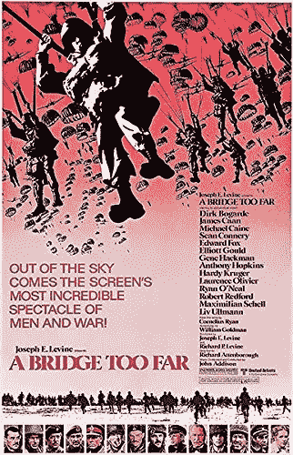

Not enough accountants

标签本身是一部电影情节和主题的不太完美的总结，依靠它们来确定电影的*含义*这样宽泛的东西似乎是愚蠢的。但是我们可以使用一个技巧来大大增加这些标签的实用性。它们可能是独特的和不完整的，但我们可以有把握地假设，在一定范围内，很可能在任何选择的电影中，它们至少是*一贯*独特的。换句话说，它们可能很奇怪，但每部电影都一样奇怪。如果我们看看电影之间有什么共同的标签，我们应该会发现相似的电影有相似的标签。看起来是这样的:

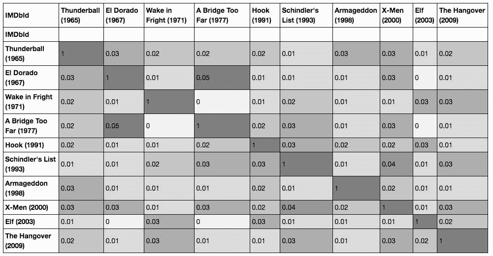

*Table 3: Selected movies by proportion of all keywords in common*

每部电影显然都与自己有 100%的相似性，但电影与其他电影的相似之处更有趣。1967 年的西部片《黄金国》与 1977 年的二战史诗片《一座太远的桥》有许多相同的关键词。暴力冲突的主题，粗犷的男性主角，也许还有其他因素让这些电影有些相似。相比之下，《黄金国》与 2003 年的合家欢假日喜剧《精灵》完全没有关键词。这两部电影一点也不相似。与《精灵》更相似的是 1991 年的《钩子》对彼得潘故事的复述。这些电影有几个共同的主题和人物比喻，用“孤儿”、“家庭关系”、“男孩”和“圣诞节”等关键词来表示。

现在我们有了电影相似性的矩阵，我们可以用它做一些有趣的事情。例如，我们可以根据电影与其他电影共有的关键词数量在图表上绘制电影。以下是所有迪士尼公主系列电影，根据它们与凯文·科斯特纳 1991 年的《英国口音谋杀案》、《罗宾汉:小偷王子》和 1941 年的经典电影《公民凯恩》(坦白地说，被高估了)的相似性进行排序:

*Disney Princess films by similarity to Prince of Thieves and Citizen Kane*

让他们受益匪浅的是，迪士尼公主系列电影与《公民凯恩》没有太多相似之处。《美女与野兽》与《公民凯恩》的相似之处很容易让人理解，因为它们都有一个富裕而隐居的男性主角，以及看到一个怪物般的人的人性的主题。但 IMDb 标签的特质意味着实际的共同关键词要平淡得多——它们大多与两部电影都有场景在一座古老的大宅邸有关，有壁炉、仆人、图书馆等等。与《小美人鱼》的相似之处同样微不足道，包括两部电影都包含章鱼的简短镜头。

大多数电影与罗宾汉有更多的相似之处。或许并不令人意外的是，2012 年的《勇敢》与其他电影相比，与罗宾汉有更多的共同之处——中世纪的背景和主要是射箭，尽管 IMDb 爱好者的勤奋工作也揭示了这两部电影都有一个裸露臀部的短暂一瞥。与《勇敢》相比，迪士尼 1973 年的关于罗宾汉的麻烦电影类型中，与凯文·科斯特纳版本相同的关键词几乎是两倍，尽管标题角色中有一只狐狸。

有趣的是，《美女与野兽》和《小美人鱼》在这张图表上看起来非常接近，这意味着，至少在与《罗宾汉》和《公民凯恩》的相似性方面，它们有很多共同点。但总的来说，这张图表对这些电影的本质可能不是很有洞察力。

这里有一个非常有用的图表:

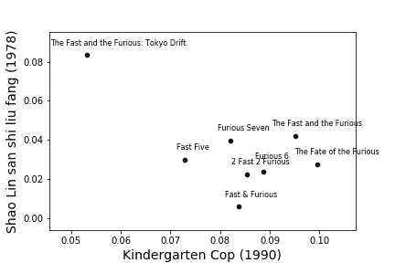

*Fast and the Furious films by similarity to “The 36th Chamber of Shaolin” and “Kindergarten Cop”*

截至发稿时，这是所有的“速度与激情”电影，其情节与阿诺德·施瓦辛格 1990 年涉足喜剧表演的《幼儿园警察》和 1978 年的功夫经典《邵琳·石三·流芳》(更为人所知的是《少林三十六房》)相似。正如我们所料，这些电影都非常接近——它们是非常相似的电影。《东京漂移》是个例外，它是系列电影中被低估了犯罪价值的第三部。有趣的是，就情节、人物和主题而言,《东京漂移》实际上是一部与其他系列完全不同的电影。虽然制作这张图表的许多数据都是琐碎的或虚假的，但它设法捕捉到了这部电影的一些真相及其与兄弟姐妹的关系。

This but his fists are cars

这些图表只在两个相当随意的轴上绘制电影，或多或少是随机选择的，但它们设法传达了一些关于电影内容的少量真实信息。想象一下，通过增加我们检查的轴的数量，可以获得多少信息。

为了有效地做到这一点，我们必须做一些数学技巧。在上一章中，我提到了一些提高我们推荐质量的数学技巧。当时我没有详细介绍它们，但我们将再次使用这些相同的技术，这次我将对它们进行更多的解释。这将会变得有点复杂，但是你不需要理解基本的数学就能知道它是如何工作的。

如果你看上面的表 3，它显示了每部电影与其他电影的相似性。但是你会发现很多电影根本没有共同的关键词。其他电影有很多共同点，但它们的相似性是由它们碰巧有几个非常不寻常的关键词这一事实驱动的。我们的数据集所基于的标签是独特的——单独来看，它们通常没有传达太多的意义，但总体来看，它们更有用。我们需要的是某种方式来消除粗糙的边缘，过滤掉噪音，把数据浓缩成核心信息。我们将使用的技术称为“降维”。我们将获取包含数千部电影的数据集，每部电影都与其他电影进行比较，并将列数从数千列(每部电影一列)减少到仅一百列。当我们这样做的时候，我们会尽可能多地保留列中包含的信息。

当我第一次听说这个技术时，听起来不像是可能的。我们如何减少列的数量，但保留它们包含的信息？这似乎是一个矛盾，从某种意义上说，的确如此。我们确实会丢失信息，但是如果我们聪明的话，我们可以将这种情况最小化。为了理解我们如何能做到这一点，只在二维空间中想象它是有帮助的。

想象你在二维图表上有一系列的点，就像这样:

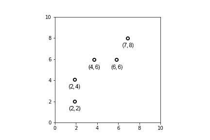

每个点的位置可以写成两个坐标——两列数据。现在想象我们在这些点旁边画一条直线，并将它们的位置“投影”到这条直线上，就像这样:

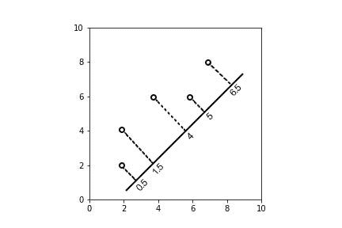

线上每个点的位置可以写成一个坐标，即它沿线的位置。我们已经丢失了一些关于原始点的信息，但是，只要我们与这些点成直角画线，我们就保留了一些关于它们彼此相对位置的信息。“降维”是一套为那条线选择正确角度的数学技术，这样我们就能保存尽可能多的信息。这在二维空间很容易想象，但在多维空间也同样适用。在我们的例子中，我们将维度(数据列)的数量从几千减少到一百。

选择 100 列有点武断。减少列数可以减少数据中的“噪音”，即任意和无用的信息。但是如果我们过多地减少列数，我们也会丢失有用的信息。这是我们的电影，只包含两列信息:

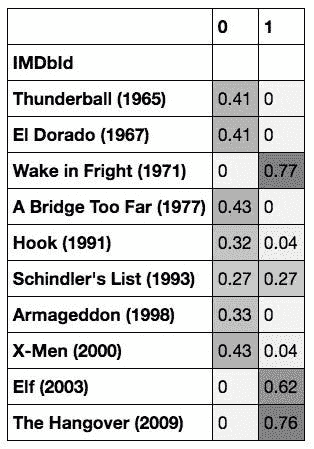

Table 4: Films reduced to two dimensions

剩下的两列是不可能解释的——丢失了太多信息，剩下的两列实际上毫无意义。我们需要找到一个平衡点，事实证明，在这种情况下，对于这个数据集，100 列是合适的。下面是一个小例子:

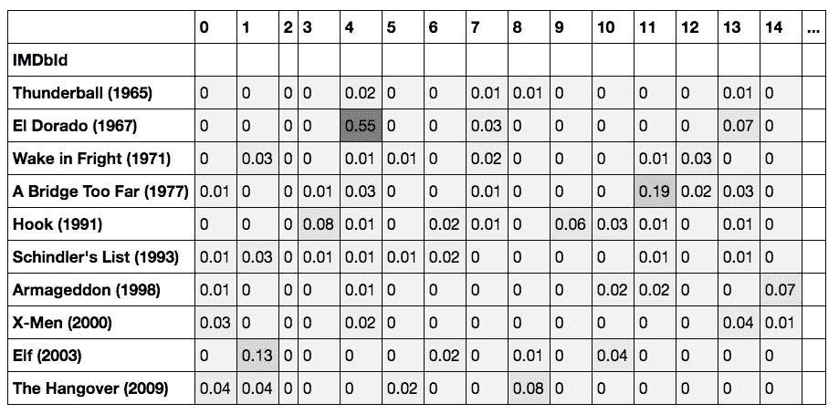

Table Five: Films as “vectors”

每一列的含义甚至比我们之前的单个列更难解释，但总的来说，它们编码了关于我们数据集中的电影的一些非常复杂的信息。根据下表中的数据，我们可以通过查看哪些电影看起来相似来测试这一点。如果我们做得很好，我们表中的类似电影应该是现实生活中非常相似的电影。例如，根据这一数据，与《宿醉》类似的电影包括同样可怕的《40 岁的处女》、《宿醉第二部》和《怀孕》。看起来我们做得很好——所有这些电影都来自类似的愤世嫉俗、厌恶女性的喜剧。他们分享相似的题材和相似的喜剧风格。最接近本·阿弗莱克职业生涯巅峰的电影，1998 年的《世界末日》，是《深度撞击》，这是有意义的，因为它基本上是完全相同的电影，只是(悲惨地)少了《史密斯飞船》。

我们可以用这个数据集做一些其他有趣的事情，但是为了解释它们，我将不得不离题进入一些关于相似性度量的细节。大家深呼吸。

在上一章中，我展示了如何使用“欧几里德距离”来度量两行数字数据的相似性。通过将它们绘制为多维空间中的点，并在两点之间画一条线，可以测量两行的相似性。这种方法也适用于这个数据集。但是还有另一种方法。我们可以测量两点之间的*角*，而不是测量两点之间的*距离*。对于那些比我更懂数学的人来说，这被称为“余弦相似性”。例如，这里有两部经典的航海主题电影，《海底总动员》和《大白鲨》，它们的情节与 1990 年的独立电影《忍者神龟》和约翰·卡彭特的低成本动作经典《逃离纽约》相似。

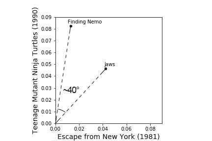

这两个点之间的角度大约为 40 度，表明这两部电影非常不同，至少在这两个轴提供的“泡沫海龟/蛇皮”尺度上是如此。在大多数情况下，余弦相似性和欧几里德距离给出非常相似的结果。但是余弦相似性有一个非常不同的性质。不管两条线的大小如何，余弦相似度保持不变。换句话说，每个值的总量并不重要，重要的是一个值与另一个值的比率。这很有用，因为这意味着我们可以将两部电影的值相加，并且仍然可以有效地测量相似性。这听起来有点深奥，所以让我们进一步研究一下。

约翰·卡彭特的另一部经典电影《神探夏洛克》比《大白鲨》离《海底总动员》更远。如果我们把这个东西和《海底总动员》的价值观加在一起，我们可以创造一部假想的新电影《海底总动员》(出于显而易见的原因，我们将避免称之为《海底总动员的东西》)。《尼莫的事情》，因为它结合了另外两部电影的价值观，比其他任何一部电影都更靠近这两个轴。这实际上是两部电影的总和——《海底总动员》和《忍者神龟》有大约 8%的关键词是相同的，而《神探夏洛克》有大约 3%。这使得《尼莫的事情》在这个轴上的得分约为 11%——8+3 = 11。这意味着我们的新电影与图表上的其他电影相距甚远——它在两个轴上都有更高的值。但是因为我们使用余弦相似度，并测量角度，而不是距离，我们发现“尼莫的事情”，我们两部电影的组合，实际上非常类似于“大白鲨”。

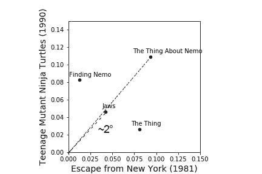

让我们回顾一下这里发生了什么。我们把一部关于水生冒险的电影和一部关于被外星怪物跟踪的电影结合起来，结果和《大白鲨》非常相似，一部关于被水生怪物跟踪的电影。这是巧合吗？这仅仅是数学上的意外，还是我们得到的数值实际上编码了电影的一些有用的意义片段？在上面，我承诺我们会建立一些真正理解电影的东西。我们成功做到了吗？

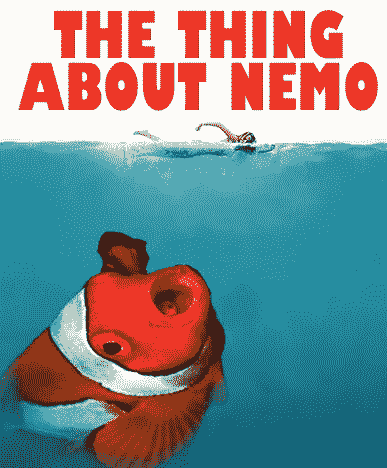

Never stop swimming

当只使用两个轴时，正如我们上面提到的，这种方法通常会返回无意义的结果。但是当我们使用我们之前创建的完整的 100 列数据集时，结果变得异常深刻。正如当我们使用两个轴时，我们取两个电影的总和，将 100 列中每一列的值相加。然后，使用余弦相似性，我们找到与总计行具有最小角度(最小差异)的电影。使用这种方法，凯瑟琳·毕格罗最好的电影，1991 年的“突破点”，加上迪斯尼的“汽车”，产生了一部电影，根据余弦相似性，最类似于 2001 年的“速度与激情”。这是惊人的准确。《突破点》和《速度与激情》都是关于特立独行的警察，为了逮捕一个与他有着强烈同性恋关系的犯罪大师，他们被卷入了一个诱人的亚文化中。他们之间唯一的区别是斯威兹闪闪发光的眼睛，而点突破侧重于冲浪文化，速度与激情迷恋汽车。

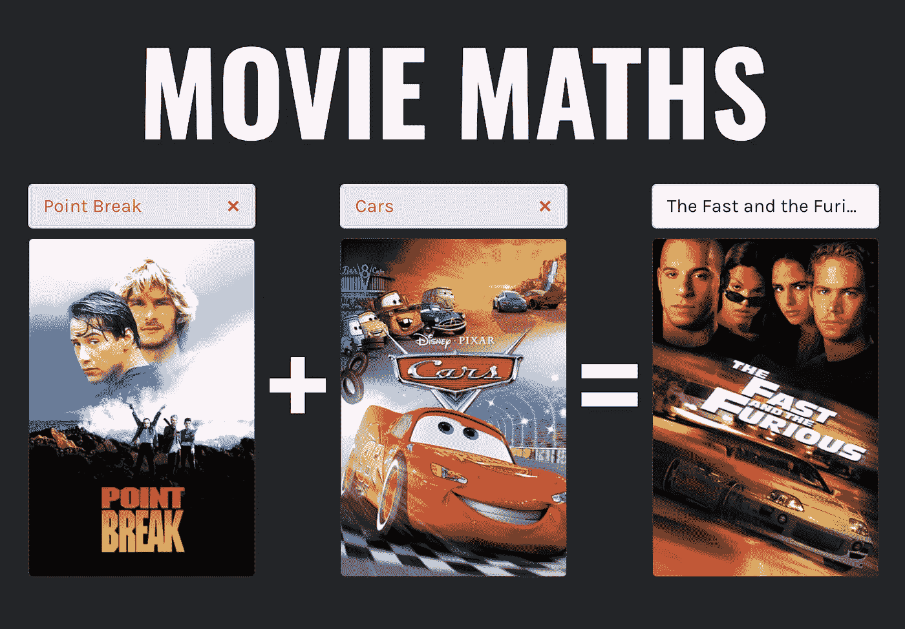

Try this for yourself, at [moviemaths.com](http://moviemaths.com)

通过同样的过程，我们可以尝试将 1979 年的革命恐怖电影《异形》加入到 2004 年的高中喜剧《贱女孩》中。根据我们的余弦相似性计算，得到的值非常类似于斯蒂芬·金改编的“嘉莉”，这是一部关于高中刻薄女孩的恐怖电影。也许为了调和不同朋友群体的利益，我们可以试着找一部结合了《辛德勒的名单》和《宿醉》的电影。该算法告诉我们，我们最好的赌注是明显被遗忘的二战动作片“兵临城下”(2001)。

这种方法也适用于减法。如果我们拿令人不安的种族主义的“印第安纳·琼斯和毁灭之庙”来说，减去它稍微不那么种族主义的前身“夺宝奇兵”，最终的电影最类似于 1941 年的“泰山和豹女”，委婉地说，这部电影对积极的种族关系没有什么贡献。

这里发生了什么事？这些组合并不总是完全有意义，但在它们背后有一些有意义的暗示。在这个过程的最后，我们得到的是一个关于电影的数据编码，它似乎包含了电影的*的含义*。算法仍然只是数字和数学，但结果，如我们的电影组合技巧，感觉像是真正了解电影的东西的产物。我们所看到的感觉非常接近真正理解我们的计算机的愿景。我们转换数据的方式允许计算机生成关于我们数据集中电影的独特见解。它可以给我们一个新的视角来看待它们。

我们是否成功地制作出了真正理解电影的东西？很容易让人觉得，算法已经对它得到的信息产生了某种理解。像我们上面使用的那些技术越来越多地用于各种领域来解析和过滤大量的信息。能够扫描数百万份文件以找到相关案例法的算法正在彻底改变律师事务所。医生可以调用自动程序来查找最近的相关文献，以帮助治疗患者的疾病。我们甚至可以制作这些文件的连贯和有用的摘要，只需按一下按钮。至少在某些领域，计算机可以阅读和理解文本。

但是在这个有点不可思议的技巧和真正的人类洞察力之间似乎还有很大的差距。计算机可能会得到一个有意义的答案，但它真的知道这个答案意味着什么吗？感觉我们构造了一个精心制作的魔术师的幻像——兔子从帽子里出来，如果我们忘记了帽子的假底和魔术师的灵巧，我们几乎可以相信这是魔术。真实的智能和模拟的智能有区别吗？当我们深入研究更复杂的算法时，我们会再次回到这个问题。目前，感觉我们已经创造了一个有趣的玩具，但它离“真正的”智能还差得很远。在未来的文章中，这条线将变得越来越模糊。我们需要一艘更大的船。

*本系列的上一篇文章中，* [*编织与建议*](/knitting-and-recommendations-b9d178a86c97) *在这里可以找到***。下一篇短文，《游戏中的* [*大脑:电子游戏 AI*](https://medium.com/@simoncarryer/the-brains-in-games-video-game-ai-d0f601ccdf46) *》这里的**。****

**要自己尝试电影数学，去*[*moviemaths.com*](http://moviemaths.com)*。这篇短文的所有代码都可以在我的 github、* [*这里*](https://github.com/SimonCarryer/HannibalVector) *找到。**