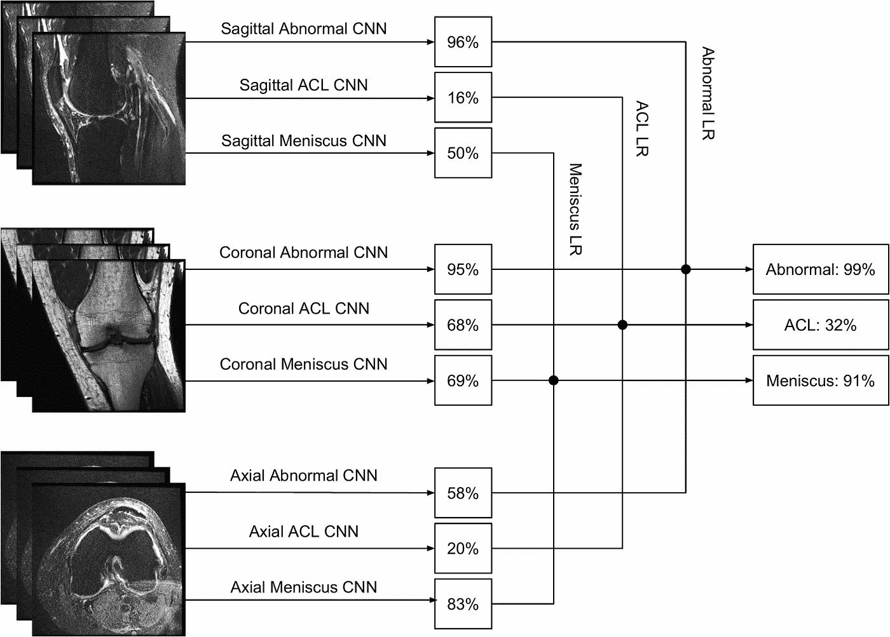

# MRNet:用于膝盖 MRI 扫描的深度学习辅助诊断

> 原文：<https://towardsdatascience.com/mrnet-competition-part-1-65fcfb1cfa5f?source=collection_archive---------21----------------------->

## 还有斯坦福 ML 集团主办的类似 kaggle 的比赛

上周，我去了西班牙南部的小镇埃斯特波纳，参加了为期一周的编码务虚会。作为参加 [MRNet 竞赛](https://stanfordmlgroup.github.io/competitions/mrnet/)的一部分，我用 PyTorch *从头开始*复制了 [MRNet 论文](https://journals.plos.org/plosmedicine/article?id=10.1371/journal.pmed.1002699)。

我已经开源了代码，所以你也可以把它作为参与竞争的起点。您可以从 [**MRNet GitHub repo**](https://github.com/MisaOgura/MRNet) 访问所有代码和 Jupyter 笔记本。

让我们帮助推进人工智能在医学成像中的安全使用！

[Source](https://doi.org/10.1371/journal.pmed.1002699.g004)

# 背景

在论文 [**膝关节磁共振成像的深度学习辅助诊断:MRNet**](https://journals.plos.org/plosmedicine/article?id=10.1371/journal.pmed.1002699) 的开发和回顾性验证中，[斯坦福 ML 小组](https://stanfordmlgroup.github.io/)开发了一种预测膝关节 MRI 检查异常的算法，并测量了在解释过程中向放射科医生和外科医生提供该算法预测的临床效用。

他们开发了一个深度学习模型，用于检测:**一般异常，前十字韧带撕裂，半月板撕裂**。

# MRNet 数据集描述

**数据集(~5.7G)** 随着论文的发表一起发布。您可以通过同意研究使用协议并在 [MRNet 竞赛](https://stanfordmlgroup.github.io/competitions/mrnet/)页面提交您的详细信息来下载。

它由 **1，370 项膝关节核磁共振检查**组成，包括:

*   **1104 例(80.6%)异常检查**
*   **前交叉韧带撕裂 319 例(23.3%)**
*   **508 例(37.1%)半月板撕裂**

数据集分为:

*   **训练集(1，130 次检查，1，088 名患者)**
*   **验证集(120 项检查，111 名患者)** —本文中称为*调优集*
*   **隐藏测试集(120 项检查，113 名患者)** —本文中称为*验证集*

隐藏测试集*不是公开可用的*，用于对提交给竞赛的模型进行评分。

**注意事项**

*   [分层随机抽样](https://en.wikipedia.org/wiki/Stratified_sampling)确保*每组预设至少 50 个异常、前交叉韧带撕裂和半月板撕裂的阳性样本*。
*   每位患者的所有检查都放在同一个部分。
*   在论文中，对一个[公开可用的数据](http://www.riteh.uniri.hr/~istajduh/projects/kneeMRI/)进行了外部验证。

# 探索性数据分析

在尝试训练模型之前，通过探索和熟悉数据来获得领域知识是至关重要的。为此，我对所提供的数据集进行了 EDA。

这里 可以访问笔记本 [**的公开托管版本。**](https://misaogura.github.io/MRNet/notebooks/MRNet_exploratory_data_analysis.html)

# 代码实现

训练和评估模型所需的所有代码都发布在[**MRNet GitHub repo**](https://github.com/MisaOgura/MRNet)中。我强烈推荐使用 GPU 进行训练。

# 模型提交

一旦你有了自己的模型，你就可以按照作者提供的教程[提交给官方评估。根据他们的说法，大约需要 2 周时间分数才会出现在排行榜上——我仍在等待我的分数出现！](https://worksheets.codalab.org/worksheets/0xcaf785cb84564239b240400fbea93ec5/)

# 反馈

在我尝试改进代码和模型时，代码在 MIT 许可下处于积极开发中。随意克隆它，叉它，使用它——如果你这样做了，请让我知道你的想法！

我将非常感谢您的建设性意见、反馈和建议🙏

谢谢，祝编码愉快！