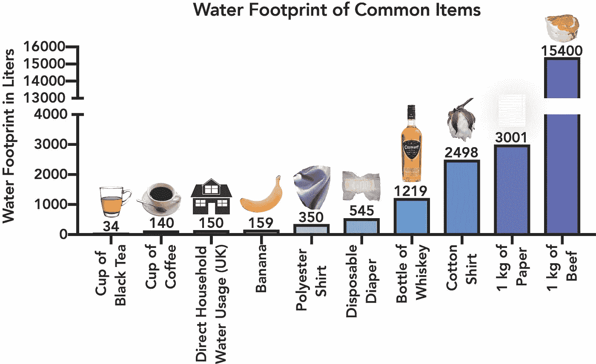
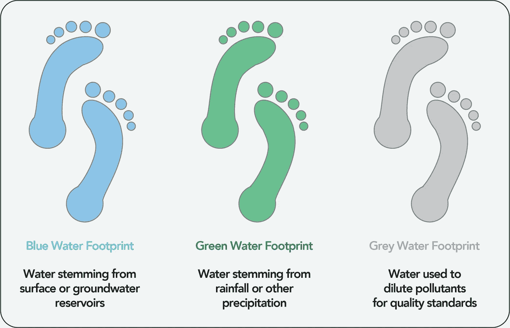

# 搅浑水:你的用水并没有发生在你认为它发生的地方

> 原文：<https://towardsdatascience.com/muddying-the-waters-your-water-usage-doesnt-happen-where-you-think-it-does-d4516ee7b1df?source=collection_archive---------17----------------------->

## 循证政策比你或你的感觉更重要——第四部分

你曾经在水的问题上花了很多心思吗？不一定要喝，但是要用。就像我们大量拥有的其他东西一样，我们通常不会想到水。然而它在我们的生活中无处不在，必不可少。我们确实需要它来生活，我们需要它来满足其他基本的卫生需求，当然我们也需要它来做饭和洗衣。然而另一方面，我们敏锐地意识到干旱和水资源短缺甚至被预测为未来战争的[主要原因之一。因此，关于用水问题的讨论似乎是适当的。鉴于我们每天都在自由地用水，我们是否需要为了环境重新考虑我们的习惯？不要浪费太多，但是节约用水对环境有很大的好处——即使你可以节约用水的地方可能和你想象的不一样。在某些方面，节约用水甚至会给你带来经济上的好处。但是在我们考虑回报之前，我们首先需要看看我们实际上是如何直接和间接地使用水的。](https://www.weforum.org/agenda/2018/10/where-the-water-wars-of-the-future-will-be-fought/)

**家庭直接用水**

在英国这样的欧洲国家，普通人每天在家中直接使用大约 150 升水，而在 T2，像澳大利亚和美国这样的国家，这个数字要高得多。这听起来可能不多，但在欧洲，家庭用水量占总用水量的 18%(T4)。特别值得注意的是，如果你考虑到 150 升大约是人类基本需求估计量的三倍。人们在家庭中花费这些水的相对比例各不相同，但大约四分之一分别用于淋浴、冲厕所和厨房用品。其他项目比如说包括洗衣服&灌溉。相比之下，像卢旺达或海地这样的贫穷国家，每人每天只有 2 到 15 升水可供使用。甚至不到我们日常用水量的十分之一！

关于水的使用，这里有几个趋势需要解释。首先，显而易见的是:一个国家越富裕，人均日用水量就越高。你可以在二战后不断增加的用水量中清楚地观察到这一点。从简陋的抽水马桶到洗碗机和游泳池，所有这些花哨的用水设备按全球标准来看都很昂贵。另一个明显的趋势是，人均用水量随着家庭规模的扩大而减少(其他条件相同)。将一个人在半空的洗衣机里洗三件衬衫和一条牛仔裤与一个家庭正确地装上洗衣机相比，你很容易明白为什么会这样。我们的许多用水都可以很好地衡量(当然，像厕所这样的项目在家庭中的衡量并不比单身人士好)。直接用水的最后一个趋势是技术。幸运的是，技术在进步，我们的家用电器也在进步。总的来说，这导致了洗碗机、马桶等[更高效的版本](https://www.theguardian.com/lifeandstyle/2014/aug/06/best-domestic-water-saving-gadgets)。使用更少的水(特别是在最近的生态友好年)。当然，定性的新技术是个例外(比如第一个抽水马桶的发明，最初可能增加了用水量)，这种技术在开始时需要进一步调整，以达到节能和节水的状态。

鉴于这些趋势，什么主导着家庭用水？总体来说，似乎是财富。尽管有一段时间，尤其是最近，水消耗量增长缓慢，甚至有所下降。那么有没有节约用水的可能性呢？绝对的。出于我们将在下一节探讨的原因，减少直接用水对环境没有多大好处。但它肯定可以帮助你节省一些钱！显而易见的第一步当然是淋浴，而不是洗澡&刷牙时关掉水龙头。稍微不太明显的是，在英国大约有 75%的 T2 家庭经常烧开比他们需要的更多的水，这相当于每年大约 6800 万英镑的不必要开支。在美国，大约 17%的 T4 家庭给花园浇水过多。解决这一问题可以减少约 16%的室外用水量，这对加州等干旱地区尤为重要。不要低估细节:一个[滴水的水龙头](https://www.edenproject.com/learn/for-everyone/water-saving-tips)每天可以浪费大约 15 升的水！总体而言，通过消除浪费，我们大约三分之一的直接用水量可以大幅削减。据估计，如果你每月节约大约 3500 升水，每年可以节省大约 140 美元。一个四口之家的用水量不到平均月用水量的 20%,如果你生活在一个家庭用水量很大的国家，比如美国，这个数字就更低了。

The water footprint is various items is certainly not intuitive and can be incredibly large. Data [source](http://mentalfloss.com/article/59480/surprising-water-footprints-15-common-things).

**家庭间接用水量**

那么，为什么减少直接用水量不会显著影响环境呢？原因当然是其他因素造成了绝大部分的用水量。在全球范围内，我们每年使用大约 9 万亿立方米的水。一立方米的水等于 1000 升。你算算。与这些数字相比，家庭每天 150 升的用水量相形见绌。此外，大多数国家不像英国那样富裕，因此人均每天用水量较少。因此，从全球来看，这 9 万亿立方米中有惊人的 92%用于农业目的[。因此，你吃的食物对全球用水量的影响比你直接用水的影响要大得多。让你看一下这个世界:一公斤牛肉的水足迹超过 15 000 升。对于一个英国公民来说，这超过了他们 3 个月的直接用水量。一根香蕉的间接用水量比普通英国公民每天的直接用水量还要多！](https://waterfootprint.org/en/water-footprint/what-is-water-footprint/)

你有很好的理由来关心这个水足迹。通常，[水足迹](https://waterfootprint.org/en/water-footprint/what-is-water-footprint/)分为三类:蓝色(来自地表或地下水库的水)、绿色(来自降水的水)和灰色(用于稀释污染物的水)。农产品大多有绿色的蓝水足迹，蓝水每年占全球用水量的大约一万亿立方米。你可以把这想象成从土地上借走的贷款，然后以某种形式回到循环中。然而，如果你遇到流动性问题，一笔足够大的贷款可以让任何一家银行破产。因为在郁郁葱葱的风景中或在干旱的沙漠中，一升水肯定是不等价的。在某种程度上，这又回到了种植食物的争论，在那里你有种植食物的最佳条件。由于需要灌溉，在干燥的环境中种植番茄将会有更高的水足迹。

The three types of water footprint. Global usage of water is [split into](https://waterfootprint.org/en/water-footprint/what-is-water-footprint/) 11% blue, 74% green and 15% grey water.

那么，如果银行破产，到底会发生什么？如果我们从一个地区取了过多的水？一个后果是盐水侵入枯竭的地下水库，把它们变成不适合饮用的咸水。这在海岸线上经常可以看到。地中海沿岸的大片地区都受到这个问题的困扰，因为西班牙或意大利等国家的这些地区一开始就非常干燥，需要从地下水矿床中获得大量贷款。

记住这一点，让我们来谈谈此时此地你可以做些什么来管理你的水足迹。最普遍的一点当然是意识到间接用水，这比你实际的直接用水重要得多。注意你生活中那些[水足迹过高](https://waterfootprint.org/en/water-footprint/what-is-water-footprint/)的消费品。以牛肉为例。一个 200 克的牛肉汉堡馅饼会有大约 3000 升的水足迹，而同样数量的鸡肉只能携带大约四分之一的水分[。就生产所需的水而言，用大豆制成的同等馅饼甚至会更“便宜”。如果你正在寻找的话，有一个支持素食主义的论点。但是即使你不知道，想想你的牛肉馅饼来自哪里，因为来自干旱地区的牛肉必然比来自多雨地区的牛肉有更大的水足迹。它不止于牛肉。基本上，你拥有或消费的所有东西都有水足迹，而且通常比你想象的要大得多。](https://waterfootprint.org/en/water-footprint/personal-water-footprint/)

如果你还不担心，考虑一下这个:根据估计，到 2030 年，全球淡水需求将超过供给 40%。更少的战争爆发了。一年中至少有一个月，水资源短缺已经影响了 T2 数十亿人口。为了对消费者行为产生真正的影响，法律应该要求公开某一特定商品[的水足迹。就像卡路里的数量一样，这个数字将有助于功能相当的产品之间的比较，并使水足迹意识变得容易。在我们得到它之前，这里是 TL；博士:](https://waterfootprint.org/en/water-footprint/personal-water-footprint/)

如果你关心你的水/能源账单:减少你家庭的直接用水。如果你关心环境:通过有意识地消费低水足迹的物品来减少间接用水。