# 多臂土匪与强化学习

> 原文：<https://towardsdatascience.com/multi-armed-bandits-and-reinforcement-learning-dc9001dcb8da?source=collection_archive---------2----------------------->

## 用 Python 例子温和地介绍了经典问题


Photo by [Carl Raw](https://unsplash.com/@carltraw?utm_source=medium&utm_medium=referral) on [Unsplash](https://unsplash.com?utm_source=medium&utm_medium=referral)

多臂土匪问题是一些最简单的强化学习(RL)问题来解决。我们有一个代理，我们允许它选择行动，每个行动都有一个回报，这个回报是根据一个给定的、潜在的概率分布返回的。这个游戏有很多集(在这种情况下是单个动作)，目标是最大化你的奖励。

一个简单的图片是考虑在*k*-许多 [*独臂强盗*](https://en.wikipedia.org/wiki/Slot_machine) (即老虎机)或一个带 *k* 手臂的大老虎机之间进行选择。你拉的每一只手臂都有不同的奖励。你有 1000 个 25 美分的硬币，所以你需要制定一些策略来获得最大的收益。

解决这个问题的一个方法是依次选择每一个，记录你得到了多少，然后继续回到付出最多的那个。这是可能的，但是，如前所述，每个 bandit 都有一个与之相关的潜在概率分布，这意味着在找到正确的样本之前，您可能需要更多的样本。但是，你每花一点时间去找出最好的强盗，都会让你失去最大的回报。这种基本的平衡行为被称为**探索-利用困境**。这个基本问题的形式出现在 AI 和 RL 之外的领域，例如在[选择职业](https://joshkaufman.net/explore-exploit/)、[金融](https://www.aaai.org/ocs/index.php/IJCAI/IJCAI15/paper/viewFile/10972/10798)、[人类心理学](https://econ.arizona.edu/sites/econ/files/wilsonetal_jepgeneral2014_print.pdf)，甚至[医学伦理](http://www.pnas.org/content/106/52/22387)(尽管，我认为我最喜欢的提议用例与建议有关，由于其丰富性，它在二战期间被给予纳粹德国，[“作为智力破坏的最终形式。”](https://people.eecs.berkeley.edu/~russell/classes/cs294/s11/readings/Gittins:1979.pdf))。

# TL；速度三角形定位法(dead reckoning)

我们按照萨顿和巴尔托的书的框架介绍了多臂强盗问题，并开发了一个解决这些问题的框架和例子。在本帖中，我们将关注ϵ−greedy、ϵ−decay 和乐观策略。一如既往，你可以在这里找到[的原帖](https://www.datahubbs.com/multi_armed_bandits_reinforcement_learning_1/)(适当支持 LaTeX)。

# 问题设置

首先，让我们用一点技术细节来描述这个问题。我们希望做的是开发一个估计值 *Qt (a)* :

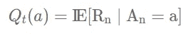

其中 *Qt(a)* 是当在步骤 *n* 采取动作 *An* 时，估计的期望回报( *Rn* )。我们将反复构建一个模型，这个模型将向每个行为的真实价值靠拢。我们将对所有潜在的概率分布使用高斯(正态)分布，以便平均值对应于真实值(毕竟，给定足够的样本，我们会期望我们的奖励收敛于所选行动的平均值)。

最简单的方法是采取**贪婪的行动**或者采取我们认为会在每个时间点最大化我们的回报的行动。另一种写法是:

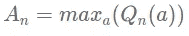

我们可以将这种最大期望或贪婪行为表示为 *A*n* 。这是我们前面提到的探索-利用困境的*利用*方面，如果目标是最大化我们的回报，这就很有意义。当然，只有当我们对每个行动的预期回报有了一个很好的感觉时(除非我们相当幸运)，重复这样做才会有好的效果。因此，我们需要找出一种算法来探索足够的搜索空间，以便我们可以采取最佳行动。

在开始之前，还有最后一个概念要介绍。在典型的 RL 应用中，我们可能需要数十万次迭代，甚至数百万次以上。运行此类模拟并跟踪所有数据来计算平均回报，很快就会变得非常计算密集型。为了避免这种情况，我们可以使用一个方便的公式，这样我们只需要跟踪两个值:平均值和所走的步数。如果我们需要计算步骤 *n，m_n* 的平均值，我们可以用前面的平均值*m _ n-1*和 *n* 来计算，如下所示:

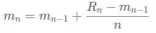

有了这些，我们就可以开始制定解决 k 线问题的策略了。

# ϵ-Greedy 方法

我们简单地讨论了一个纯粹贪婪的方法，我指出它本身不会很好地工作。考虑如果你实现一个纯贪婪的方法，你在 *n=1* 采取一个行动 *A_n=a_1* 并得到一个奖励。那么，这就成为了你的最高奖励(假设它是正的)，你只需重复 *a_1 ∀ n* (对所有步骤 *n* 采取行动 *a_1* )。为了鼓励一点探索，我们可以使用ϵ-greedy，这意味着我们探索另一个ϵ.概率的选项这给算法带来了一点噪音，以确保你继续尝试其他值，否则，你会继续利用你的最大回报。

让我们转向 Python 来实现我们的 *k-* 武装强盗。

# 建造一个贪婪的 k 臂强盗

我们将定义一个名为`eps_bandit`的类来运行我们的实验。该类将臂数、`k`、ε值`eps`、迭代次数`iter`作为输入。我们还将定义一个术语`mu`，我们可以用它来调整每支队伍的平均奖励。

首先是模块:

```
# import modules 
import numpy as np 
import matplotlib.pyplot as plt 
import pandas as pd 
%matplotlib inline
```

如果你在 Jupyter 之外建造这个，忽略`%matplotlib inline`。

```
class eps_bandit:
    '''
    epsilon-greedy k-bandit problem

    Inputs
    =====================================================
    k: number of arms (int)
    eps: probability of random action 0 < eps < 1 (float)
    iters: number of steps (int)
    mu: set the average rewards for each of the k-arms.
        Set to "random" for the rewards to be selected from
        a normal distribution with mean = 0\. 
        Set to "sequence" for the means to be ordered from 
        0 to k-1.
        Pass a list or array of length = k for user-defined
        values.
    '''

    def __init__(self, k, eps, iters, mu='random'):
        # Number of arms
        self.k = k
        # Search probability
        self.eps = eps
        # Number of iterations
        self.iters = iters
        # Step count
        self.n = 0
        # Step count for each arm
        self.k_n = np.zeros(k)
        # Total mean reward
        self.mean_reward = 0
        self.reward = np.zeros(iters)
        # Mean reward for each arm
        self.k_reward = np.zeros(k)

        if type(mu) == list or type(mu).__module__ == np.__name__:
            # User-defined averages            
            self.mu = np.array(mu)
        elif mu == 'random':
            # Draw means from probability distribution
            self.mu = np.random.normal(0, 1, k)
        elif mu == 'sequence':
            # Increase the mean for each arm by one
            self.mu = np.linspace(0, k-1, k)

    def pull(self):
        # Generate random number
        p = np.random.rand()
        if self.eps == 0 and self.n == 0:
            a = np.random.choice(self.k)
        elif p < self.eps:
            # Randomly select an action
            a = np.random.choice(self.k)
        else:
            # Take greedy action
            a = np.argmax(self.k_reward)

        reward = np.random.normal(self.mu[a], 1)

        # Update counts
        self.n += 1
        self.k_n[a] += 1

        # Update total
        self.mean_reward = self.mean_reward + (
            reward - self.mean_reward) / self.n

        # Update results for a_k
        self.k_reward[a] = self.k_reward[a] + (
            reward - self.k_reward[a]) / self.k_n[a]

    def run(self):
        for i in range(self.iters):
            self.pull()
            self.reward[i] = self.mean_reward

    def reset(self):
        # Resets results while keeping settings
        self.n = 0
        self.k_n = np.zeros(k)
        self.mean_reward = 0
        self.reward = np.zeros(iters)
        self.k_reward = np.zeros(k)
```

有很多不同的方法来定义这个类。我这样做是为了一旦我们初始化了我们的问题，我们只需调用`run()`方法就可以检查输出。默认情况下，每只手臂的平均奖励来自 0 左右的正态分布。设置`mu="sequence"`将使奖励范围从 0 到 *k-1* ，以便在评估结果时了解哪些行动提供了最佳奖励，以及采取了哪些行动。最后，您还可以通过将值传递给`mu`来设置自己的平均奖励。

让我们用不同的ϵ\epsilonϵ.值来做一些比较对于其中的每一个，我们将设置 k=10，每集运行 1000 步，运行 1000 集。每集之后，我们将重置盗匪，并复制不同盗匪的平均值，以保持事情的一致性。

```
k = 10
iters = 1000

eps_0_rewards = np.zeros(iters)
eps_01_rewards = np.zeros(iters)
eps_1_rewards = np.zeros(iters)

episodes = 1000
# Run experiments
for i in range(episodes):
    # Initialize bandits
    eps_0 = eps_bandit(k, 0, iters)
    eps_01 = eps_bandit(k, 0.01, iters, eps_0.mu.copy())
    eps_1 = eps_bandit(k, 0.1, iters, eps_0.mu.copy())

    # Run experiments
    eps_0.run()
    eps_01.run()
    eps_1.run()

    # Update long-term averages
    eps_0_rewards = eps_0_rewards + (
        eps_0.reward - eps_0_rewards) / (i + 1)
    eps_01_rewards = eps_01_rewards + (
        eps_01.reward - eps_01_rewards) / (i + 1)
    eps_1_rewards = eps_1_rewards + (
        eps_1.reward - eps_1_rewards) / (i + 1)

plt.figure(figsize=(12,8))
plt.plot(eps_0_rewards, label="$\epsilon=0$ (greedy)")
plt.plot(eps_01_rewards, label="$\epsilon=0.01$")
plt.plot(eps_1_rewards, label="$\epsilon=0.1$")
plt.legend(bbox_to_anchor=(1.3, 0.5))
plt.xlabel("Iterations")
plt.ylabel("Average Reward")
plt.title("Average $\epsilon-greedy$ Rewards after " + str(episodes) 
    + " Episodes")
plt.show()
```

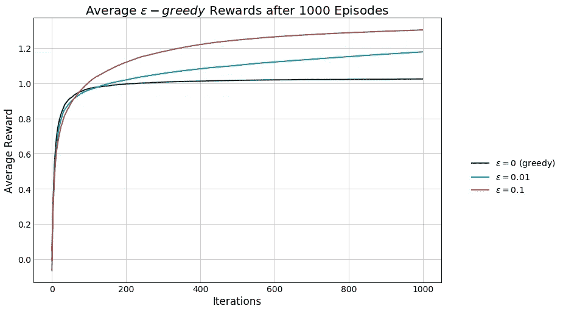

从结果来看，贪婪函数在其他两个函数中表现一致，ϵ=0.01 在这两个函数之间，ϵ=0.1 在这三个函数中表现最好。下面，我们可以看到使用`sequence`参数的效果更加清晰，并且可以感受到每集采取最佳行动的频率，因为每集的平均值保持一致。

```
k = 10
iters = 1000

eps_0_rewards = np.zeros(iters)
eps_01_rewards = np.zeros(iters)
eps_1_rewards = np.zeros(iters)
eps_0_selection = np.zeros(k)
eps_01_selection = np.zeros(k)
eps_1_selection = np.zeros(k)

episodes = 1000
# Run experiments
for i in range(episodes):
    # Initialize bandits
    eps_0 = eps_bandit(k, 0, iters, mu='sequence')
    eps_01 = eps_bandit(k, 0.01, iters, eps_0.mu.copy())
    eps_1 = eps_bandit(k, 0.1, iters, eps_0.mu.copy())

    # Run experiments
    eps_0.run()
    eps_01.run()
    eps_1.run()

    # Update long-term averages
    eps_0_rewards = eps_0_rewards + (
        eps_0.reward - eps_0_rewards) / (i + 1)
    eps_01_rewards = eps_01_rewards + (
        eps_01.reward - eps_01_rewards) / (i + 1)
    eps_1_rewards = eps_1_rewards + (
        eps_1.reward - eps_1_rewards) / (i + 1)

    # Average actions per episode
    eps_0_selection = eps_0_selection + (
        eps_0.k_n - eps_0_selection) / (i + 1)
    eps_01_selection = eps_01_selection + (
        eps_01.k_n - eps_01_selection) / (i + 1)
    eps_1_selection = eps_1_selection + (
        eps_1.k_n - eps_1_selection) / (i + 1)

plt.figure(figsize=(12,8))
plt.plot(eps_0_rewards, label="$\epsilon=0$ (greedy)")
plt.plot(eps_01_rewards, label="$\epsilon=0.01$")
plt.plot(eps_1_rewards, label="$\epsilon=0.1$")
for i in range(k):
    plt.hlines(eps_0.mu[i], xmin=0,
              xmax=iters, alpha=0.5,
              linestyle="--")
plt.legend(bbox_to_anchor=(1.3, 0.5))
plt.xlabel("Iterations")
plt.ylabel("Average Reward")
plt.title("Average $\epsilon-greedy$ Rewards after " + 
     str(episodes) + " Episodes")
plt.show()
```

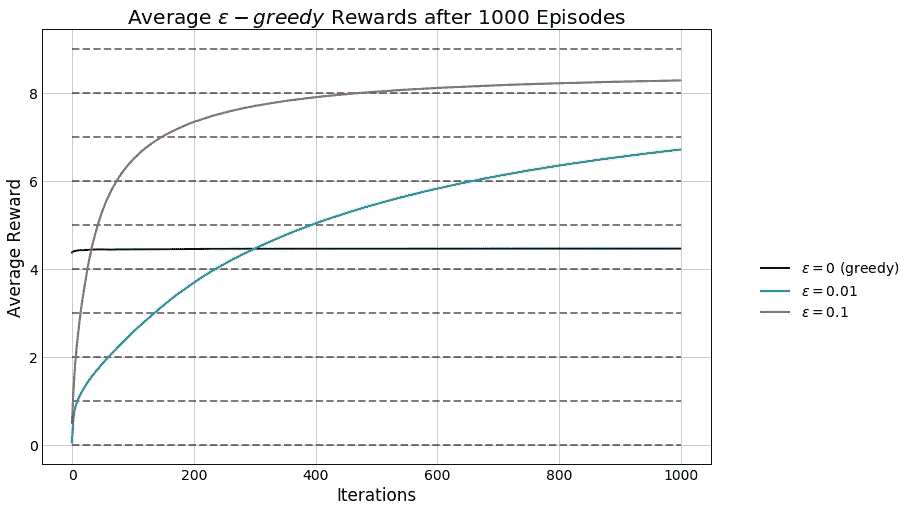

```
bins = np.linspace(0, k-1, k)

plt.figure(figsize=(12,8))
plt.bar(bins, eps_0_selection, 
        width = 0.33, color='b', 
        label="$\epsilon=0$")
plt.bar(bins+0.33, eps_01_selection,
        width=0.33, color='g', 
        label="$\epsilon=0.01$")
plt.bar(bins+0.66, eps_1_selection, 
        width=0.33, color='r',
        label="$\epsilon=0.1$")
plt.legend(bbox_to_anchor=(1.2, 0.5))
plt.xlim([0,k])
plt.title("Actions Selected by Each Algorithm")
plt.xlabel("Action")
plt.ylabel("Number of Actions Taken")
plt.show()

opt_per = np.array([eps_0_selection, eps_01_selection,
                   eps_1_selection]) / iters * 100
df = pd.DataFrame(opt_per, index=['$\epsilon=0$', 
    '$\epsilon=0.01$', '$\epsilon=0.1$'],
                 columns=["a = " + str(x) for x in range(0, k)])
print("Percentage of actions selected:")
df
```

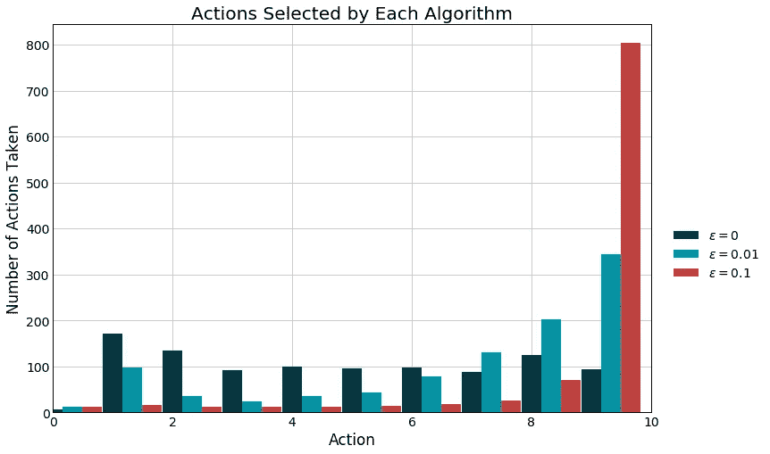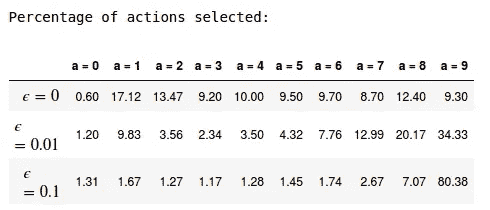

查看算法的平均选择，我们看到为什么较大的ϵ值表现良好，它采取最佳选择 80%的时间。

试验ϵ和 k 的不同值，看看这些结果如何变化。例如，缩小搜索空间可能有利于较小的ϵ值，因为勘探的益处较少，反之亦然。此外，增加迭代次数将开始有利于较低的ϵ值，因为它将具有较少的随机噪声。

# ϵ-Decay 战略

ϵ-greedy 策略有一个明显的弱点，那就是无论他们看到多少例子，他们都会继续包含随机噪声。对这些人来说，最好确定一个最佳解决方案，并继续利用它。为此，我们可以引入ϵ-decay，它减少了每一步探索的概率。其工作原理是将ϵ定义为步数的函数 *n* 。

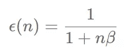

其中β <1 is introduced as a scaling factor to reduce the scaling rate so that the algorithm has sufficient opportunity to explore. In this case, we also include +1 in the denominator to prevent infinities from appearing. Given this, we can make a few small changes to our previous class of bandits to define an 【 class that works on the same principles.

```
class eps_decay_bandit:
    '''
    epsilon-decay k-bandit problem

    Inputs
    =====================================================
    k: number of arms (int)
    iters: number of steps (int)
    mu: set the average rewards for each of the k-arms.
        Set to "random" for the rewards to be selected from
        a normal distribution with mean = 0\. 
        Set to "sequence" for the means to be ordered from 
        0 to k-1.
        Pass a list or array of length = k for user-defined
        values.
    '''

    def __init__(self, k, iters, mu='random'):
        # Number of arms
        self.k = k
        # Number of iterations
        self.iters = iters
        # Step count
        self.n = 0
        # Step count for each arm
        self.k_n = np.zeros(k)
        # Total mean reward
        self.mean_reward = 0
        self.reward = np.zeros(iters)
        # Mean reward for each arm
        self.k_reward = np.zeros(k)

        if type(mu) == list or type(mu).__module__ == np.__name__:
            # User-defined averages            
            self.mu = np.array(mu)
        elif mu == 'random':
            # Draw means from probability distribution
            self.mu = np.random.normal(0, 1, k)
        elif mu == 'sequence':
            # Increase the mean for each arm by one
            self.mu = np.linspace(0, k-1, k)

    def pull(self):
        # Generate random number
        p = np.random.rand()
        if p < 1 / (1 + self.n / self.k):
            # Randomly select an action
            a = np.random.choice(self.k)
        else:
            # Take greedy action
            a = np.argmax(self.k_reward)

        reward = np.random.normal(self.mu[a], 1)

        # Update counts
        self.n += 1
        self.k_n[a] += 1

        # Update total
        self.mean_reward = self.mean_reward + (
            reward - self.mean_reward) / self.n

        # Update results for a_k
        self.k_reward[a] = self.k_reward[a] + (
            reward - self.k_reward[a]) / self.k_n[a]

    def run(self):
        for i in range(self.iters):
            self.pull()
            self.reward[i] = self.mean_reward

    def reset(self):
        # Resets results while keeping settings
        self.n = 0
        self.k_n = np.zeros(k)
        self.mean_reward = 0
        self.reward = np.zeros(iters)
        self.k_reward = np.zeros(k)
```

Now running the code:

```
k = 10
iters = 1000eps_decay_rewards = np.zeros(iters)
eps_1_rewards = np.zeros(iters)episodes = 1000
# Run experiments
for i in range(episodes):
    # Initialize bandits
    eps_decay = eps_decay_bandit(k, iters)
    eps_1 = eps_bandit(k, 0.1, iters, eps_decay.mu.copy())

    # Run experiments
    eps_decay.run()
    eps_1.run()

    # Update long-term averages
    eps_decay_rewards = eps_decay_rewards + (
        eps_decay.reward - eps_decay_rewards) / (i + 1)
    eps_1_rewards = eps_1_rewards + (
        eps_1.reward - eps_1_rewards) / (i + 1)

plt.figure(figsize=(12,8))
plt.plot(eps_decay_rewards, label="$\epsilon-decay$")
plt.plot(eps_1_rewards, label="$\epsilon=0.1$")
plt.legend(bbox_to_anchor=(1.2, 0.5))
plt.xlabel("Iterations")
plt.ylabel("Average Reward")
plt.title("Average $\epsilon-decay$ and" + 
    "$\epsilon-greedy$ Rewards after " 
    + str(episodes) + " Episodes")
plt.show()
```

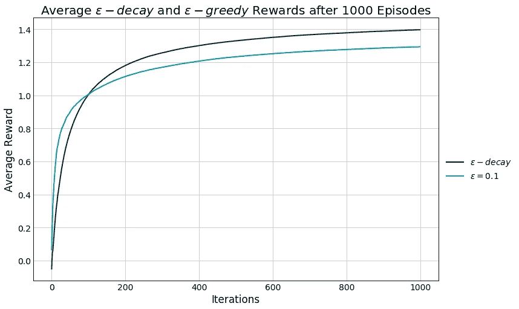

The ϵ-decay strategy outperforms our previous best algorithm as it sticks to the optimal action once it is found.

There’s one last method to balance the explore-exploit dilemma in *k-bandit* 问题，**乐观初始值**。

# 乐观初始值

这种方法与我们之前探索的例子有很大不同，因为它没有引入随机噪声来寻找最佳动作， *A*_n* 。相反，我们高估了所有行为的回报，并不断选择最大值。在这种情况下，算法会在早期探索，寻求最大化其回报，同时附加信息允许值收敛到其真实均值。这种方法确实需要一些额外的背景知识，因为我们至少需要一些回报的概念，这样我们才能高估它们。

对于这个实现，我们不需要新的类。相反，我们可以简单地使用我们的`eps_bandit`类，设置ϵ=0，并为估计值提供高的初始值。此外，我喜欢将每个臂的拉计数初始化为 1，而不是 0，以鼓励稍微慢一些的收敛，并确保良好的探索。

```
k = 10
iters = 1000oiv_rewards = np.zeros(iters)
eps_decay_rewards = np.zeros(iters)
eps_1_rewards = np.zeros(iters)# Select initial values
oiv_init = np.repeat(5., k)episodes = 1000
# Run experiments
for i in range(episodes):
    # Initialize bandits
    oiv_bandit = eps_bandit(k, 0, iters)
    oiv_bandit.k_reward = oiv_init.copy()
    oiv_bandit.k_n = np.ones(k)
    eps_decay = eps_decay_bandit(k, iters, oiv_bandit.mu.copy())
    eps_1 = eps_bandit(k, 0.1, iters, oiv_bandit.mu.copy())

    # Run experiments
    oiv_bandit.run()
    eps_decay.run()
    eps_1.run()

    # Update long-term averages
    oiv_rewards = oiv_rewards + (
        oiv_bandit.reward - oiv_rewards) / (i + 1)
    eps_decay_rewards = eps_decay_rewards + (
        eps_decay.reward - eps_decay_rewards) / (i + 1)
    eps_1_rewards = eps_1_rewards + (
        eps_1.reward - eps_1_rewards) / (i + 1)

plt.figure(figsize=(12,8))
plt.plot(oiv_rewards, label="Optimistic")
plt.plot(eps_decay_rewards, label="$\epsilon-decay$")
plt.plot(eps_1_rewards, label="$\epsilon=0.1$")
plt.legend(bbox_to_anchor=(1.2, 0.5))
plt.xlabel("Iterations")
plt.ylabel("Average Reward")
plt.title("Average Bandit Strategy Rewards after " + 
    str(episodes) + " Episodes")
plt.show()
```

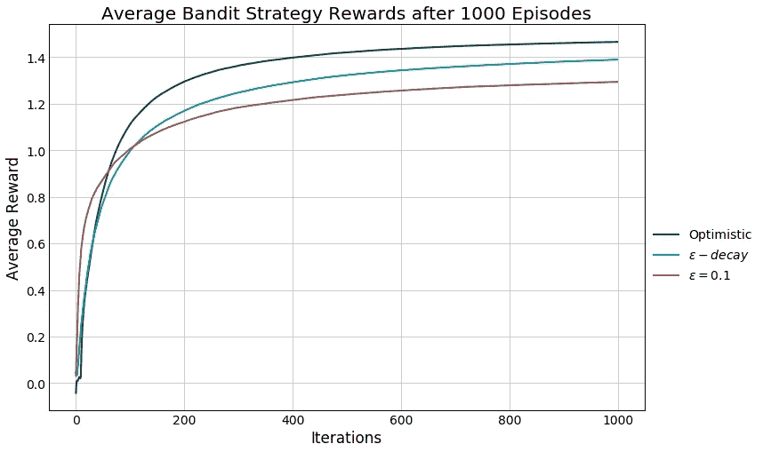

我们可以看到，在这种情况下，乐观初始值方法优于我们的ϵ−greedy 和ϵ−decay 算法。我们也可以看到，在最后一集里，算法对每个手臂的估计。

```
df = pd.DataFrame({"number of selections": oiv_bandit.k_n - 1,
                  "actual reward": oiv_bandit.mu,
                  "estimated reward": oiv_bandit.k_reward})
df = df.applymap(lambda x: np.round(x, 2))
df['number of selections'] = df['number of selections'].astype('int')
df
```

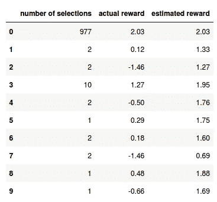

除了 977 次拉动之外，所有情况下的估计都与实际回报相差甚远。这突出了我们将在更普遍的强化学习中做的许多事情。我们不一定关心获得我们正在互动的环境的准确描述。相反，我们打算[学习在这些情况下的最佳行为](https://www.cs.cmu.edu/afs/cs/project/jair/pub/volume4/kaelbling96a-html/node23.html)，并寻求相应的行为。这将开启一场关于无模型学习和基于模型学习的讨论，我们将不得不推迟到下一次。

还有[其他土匪方法](https://www.datahubbs.com/multi-armed-bandits-reinforcement-learning-2/)我们将探讨，如梯度土匪，上限置信(UCB)方法，和非平稳问题。此外，还有许多其他类似[决斗土匪](http://www.sciencedirect.com/science/article/pii/S0022000012000281?via%3Dihub)、[集群土匪](https://arxiv.org/abs/1401.8257)、[协同过滤土匪](https://arxiv.org/abs/1502.03473)、[空间相关土匪](http://www.biorxiv.org/content/biorxiv/early/2017/04/28/106286.full.pdf)、[分布式土匪](https://arxiv.org/abs/1604.07706)、[对抗性土匪](http://mercurio.srv.dsi.unimi.it/~cesabian/Pubblicazioni/J18.pdf)、[上下文土匪](http://proceedings.mlr.press/v32/agarwalb14.pdf)的土匪，这些都是值得探索的。开始怀疑我们是否没有遭到[智力破坏……](https://mlwave.com/multi-armed-bandits-algorithms-made-easy/)