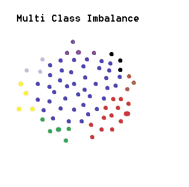
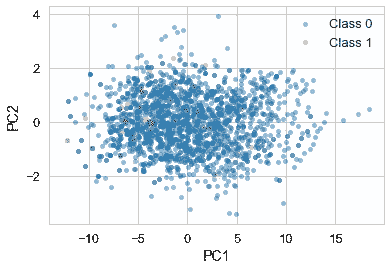
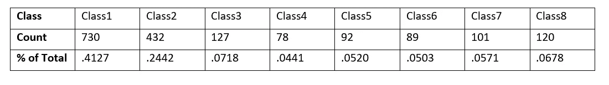
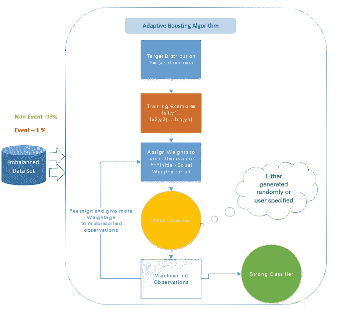
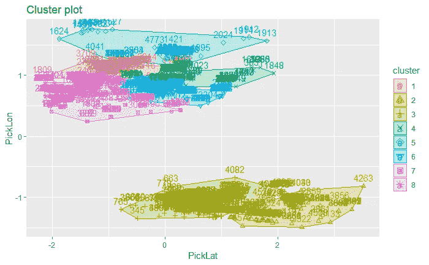

# 多阶层失衡

> 原文：<https://towardsdatascience.com/multi-class-imbalance-154ef2b15816?source=collection_archive---------13----------------------->



Made this in Microsoft Paint

因此，在我的第一篇文章中，我正在解决我在公司从事第一个数据科学项目时遇到的一个问题。我在 ALC 创新交通解决方案公司担任机器学习研究员，我的问题出现在一个预测建模项目中。多阶层失衡。我以前在课堂项目中遇到过班级不平衡的问题，并且使用过 ROSE 软件包，但是我从来没有接触过多班级不平衡的问题。



Google Images: Binary class imbalance. I’ve dealt with binary class imbalance before and there are plenty of tools and articles about tackling this common data issue.

二进制类不平衡是数据科学中一个常见的头痛问题，但可以很容易地解决(关于它的伟大文章:[https://machine learning mastery . com/tactics-to-combat-balanced-classes-in-your-machine-learning-dataset/](https://machinelearningmastery.com/tactics-to-combat-imbalanced-classes-in-your-machine-learning-dataset/))。不幸的是，对于我手头的这个项目，没有太多的资源。我想分享我克服多阶级不平衡的思考过程，这样其他人可能会发现它对调解他们自己的分配冲突有用。

**分销**

我公司的数据不开放共享，但以下是我所面临问题的模拟版本:



这种跨类的数据分布是完全不平衡的。这很糟糕，因为我的项目的目标是建立一个多类分类器，它可以正确地分配一个数据点属于哪个“类”。具体来说，这种不平衡是一个问题，因为无论我最终采用哪种预测模型，都将偏向第 1 类，尽管程度较小，但仍然偏向第 2 类。由于不平衡，通过将大部分训练和测试集分类为类 1 或类 2，它将获得相当好的准确度；这就是“准确性悖论”。我的模型可能在分类上达到很好的准确性，但那是因为模型只会模拟不平衡的分布。


Google Images: Confusion Matrix. If a ML model trains on an imbalanced data set it will over-classify towards the majority class. In the image, for reference, the model would predict all classes to be ‘P’ while some of those should have been ‘N.’ In the case of multi-class imbalance the effects would be even more drastic where the model would predict ‘P’ (because it’s the majority class in this example) when the actual class was ’N’ or ‘O’ or ‘M’ etc.

在我的实际工作项目中，类之间的区别特征很少，这一事实使得这个问题更加复杂。它们的经度/纬度特征只有微小的差异。当然，还有其他预测功能，但地理空间数据构成了该模型预测和解释能力方面的主体。然而，这种类别的差异对公司和模型的决策非常重要，因此必须解决这个问题。



Google Images: Imbalanced Classifier. This image is an example of how an imbalanced data set would create an ‘accurate’ classifier that, in production, would really be a weak classification model hiding behind the guise of ‘High Accuracy.’

**玫瑰**

ROSE，或者说随机过采样实验，是一个非常棒的 R 包，可以很好地处理类不平衡，但是只能处理二进制类不平衡(两个类)。我如何使用这个包来修复我正在查看的多类数据？

在反复试验、研究各种选项并给我的一位优秀教授发了一封电子邮件之后，我确定了最佳行动方案:编写一个函数，该函数采用整个数据集，使用“Class”作为划分特征将其划分为 6 个子集，然后使用 ROSE 将这些子集平衡到我想要的分布。然后它们将被重新编译成一个合理平衡的数据集。每个子集包含 Class1 和一个少数类。第二类被排除在外，因为它没有被代表。

然后将子集赋予 ROSE 自变量，以对少数类进行过采样。这样做的 ROSE 代码可以在下面看到。将少数类的身份用作公式，参数“p”是对稀有类进行采样的概率，另一种方法是将 N 设置为数据集的所需大小。下面，当 p=0.5 时，这些参数返回一个数据集，其中少数民族类现在占数据的 50%。

```
library(ROSE)BalancedData <- ovun.sample(MinorityClassi~, ImbalancedData, method="over", p=0.5, subset=options("subset")$subset, na.action=options("na.action")$na.action, seed)index = createDataPartition(y=BalancedData$Class, p=0.7, list=FALSE)
train = BalancedData[index,]
test = BalancedData[-index,]BalTrain <- droplevels.data.frame(train) 
BalTest <- droplevels.data.frame(test)
```

在对少数类进行过采样并将分布从不平衡的地狱中带出来之后，我通过我的分类器运行了这个平衡的数据集。最佳模型是随机森林(与作为基线的逻辑回归模型、基尼标准决策树、信息增益决策树和神经网络相比)。结果很好，但在测试集上就没那么好了。为什么？因为过采样的少数类数据不是新的数据点。所以这个模型无法设想新的点能够适合那个类。

我考虑使用 SMOTE，合成少数过采样技术，但它的结果充其量可以忽略不计。我决定使用 ROSE 包中的 ROSE 公式:“通过扩大少数类和多数类示例的特征空间来创建合成数据的样本”(cran . r-project . org/web/packages/ROSE/ROSE . pdf)。

```
SynthBalData <- ROSE(MinorityClassi~, ImbalancedData, p=0.5, hmult.majo=1, hmult.mino=1, subset=options("subset")$subset, na.action=options("na.action")$na.action, seed)index = createDataPartition(y=SynthBalData$Class, p=0.7, list=FALSE)
SynthBalTrain = SynthBalData[index,]
SynthBalTest = SynthBalData[-index,]SynthBalTrain <- droplevels.data.frame(SynthBalTrain) 
SynthBalTest <- droplevels.data.frame(SynthBalTest)
```

通过坚持我最初的子集创建方法，并应用 ROSE，我得到了合成但平衡的数据样本，并编译了一个新的数据集。我用一个简单的随机样本对数据进行 70:30 的训练/测试分割来训练所有的模型。精确度很高，模型对来自我公司服务器的新数据点反应很好。



Multi-Class imbalance, initially challenging, ultimately defeated. This is a cluster plot showing the imbalanced data now proportioned into even clusters. My next article will focus on modelling geo-spaital data as seen above.