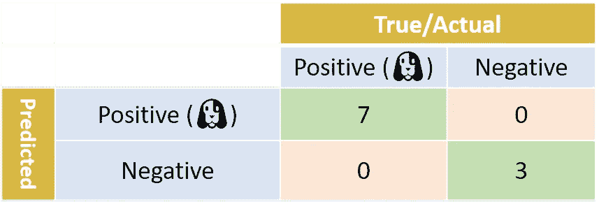
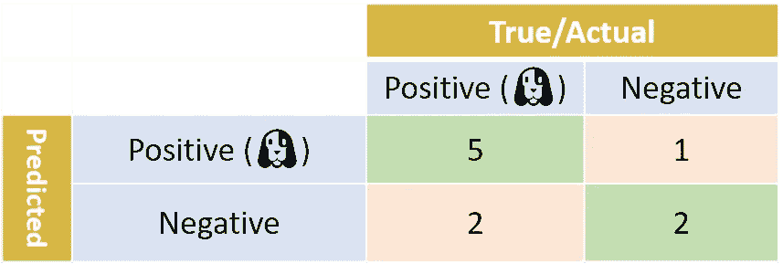
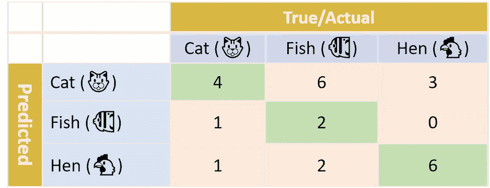
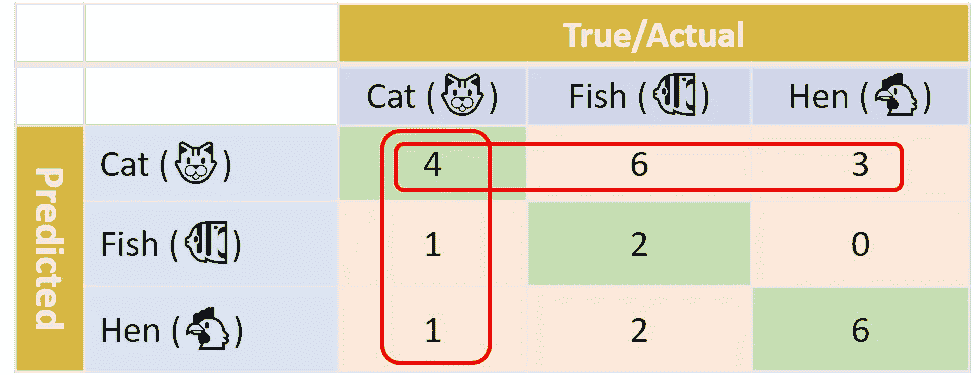
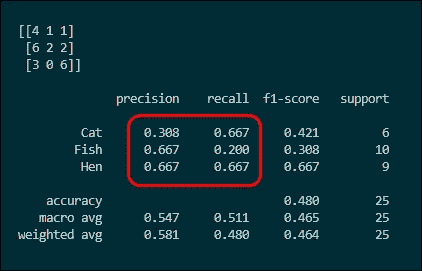

# 多类度量变得简单，第一部分:精度和召回率

> 原文：<https://towardsdatascience.com/multi-class-metrics-made-simple-part-i-precision-and-recall-9250280bddc2?source=collection_archive---------1----------------------->

多类分类中精度和召回率的性能测量可能有点——或者非常——令人困惑，所以在这篇文章中，我将解释精度和召回率是如何使用的，以及它们是如何计算的。其实挺简单的！但是首先，让我们快速回顾一下二进制分类的精度和召回率。(还有[第二部分:F1 分数](https://medium.com/@shmueli/multi-class-metrics-made-simple-part-ii-the-f1-score-ebe8b2c2ca1)，但我建议你从第一部分开始)。

在二元分类中，我们通常有两个类别，通常称为正类和负类，我们试图预测每个样本的类别。让我们看一个简单的例子:我们的数据是一组图像，其中一些包含一只狗。我们对检测有狗的照片感兴趣。在这种情况下，我们的正类是所有狗的照片的类，负类包括所有其他照片。换句话说，如果样本照片包含一只狗，它就是一个积极的。如果不是，那就是否定的。我们的分类器预测，对于每张照片，如果它是正面的(P)或负面的(N):照片中有狗吗？

给定一个分类器，我发现考虑分类器性能的最好方法是使用所谓的“混淆矩阵”。对于二元分类，混淆矩阵具有两行和两列，并显示有多少阳性样本被预测为阳性或阴性(第一列)，以及有多少阴性照片被预测为阳性或阴性(第二列)。因此，它总共有 4 个单元。每当我们的分类器做出一个预测，表中的一个单元格就加 1。在过程结束时，我们可以确切地看到我们的分类器是如何执行的(当然，只有当我们的测试数据被标记时，我们才能做到这一点)。

这里有一个简单的例子。假设我们有 10 张照片，其中正好有 7 张有狗。如果我们的分类器是完美的，混淆矩阵应该是这样的:

我们完美的分类器没有产生任何错误。所有的正面照片被归类为正面，所有的负面照片被归类为负面。

然而，在现实世界中，分类器会出错。二元分类器会产生两种错误:一些正样本被分类为负样本；一些阴性样本被归类为阳性。让我们来看一个来自更现实的分类器的混淆矩阵:

在这个例子中，2 张有狗的照片被归类为负面的(没有狗！)，还有 1 张不带狗的照片被归为正面(狗！).

当一个阳性样本被*错误地*归类为阴性，我们称之为假阴性(FN)。同样，当一个阴性样本被错误地归类为阳性样本时，它被称为假阳性。下面我们复制混淆矩阵，但是添加 TP、FP、FN 和 TN 来指定真阳性、假位置、假阴性和真负值:

既然我们已经掌握了混淆矩阵和各种数字，我们可以开始查看性能指标:我们的分类器有多好？(在我们内心深处，我们总是需要记住，“好”可以有不同的含义，这取决于我们需要解决的实际现实问题。)

让我们从*精度*开始，它回答了下面的问题:**预测阳性**真正为阳性的比例是多少？我们需要查看预测阳性的总数(真阳性加上假阳性，TP+FP)，看看其中有多少是真阳性(TP)。在我们的例子中，5+1=6 张照片被预测为阳性，但其中只有 5 张是真阳性。在我们的例子中，精度是 5/(5+1)= **83.3%** 。一般来说，精度是 TP/(TP+FP)。注意 TP+FP 是**第一行**的和。

另一个非常有用的衡量标准是*召回*，它回答了一个不同的问题:有多少比例的**实际阳性**被正确分类？查看表格，我们看到实际阳性的数量是 2+5=7 (TP+FN)。在这 7 张照片中，有 5 张被预测为阳性。召回率因此是 5/7 = **71.4%** 。一般来说，召回是 TP/(TP+FN)。注意 TP+FN 是第**列**的和。

人们也可能对*准确性*感兴趣:有多少比例的照片——包括正面的和负面的——被正确分类？在我们的例子中，总共 10 张照片中有 5+2=7 张被正确分类。因此，准确率为 70.0%。一般来说，在 TP+TN+FP+FN 张照片中，总共有 TP+TN 张正确分类的照片，因此准确度的一般公式为(TP+TN)/(TP+TN+FP+FN)。

精准和召回哪个更重要？这个真的要看你具体的分类问题了。例如，想象一下，你的分类器需要检测人类患者中的糖尿病。“阳性”表示患者患有糖尿病。“阴性”意味着患者是健康的。(我知道，很混乱。但那是医学术语！).在这种情况下，您可能希望确保您的分类器具有高召回率，以便正确检测尽可能多的糖尿病患者。再举一个例子——假设你正在构建一个视频推荐系统，你的分类器对相关视频的预测是肯定的，对不相关视频的预测是否定的。你要确保几乎所有的推荐视频都与用户相关，所以你要高精度。生活中充满了取舍，分类器也是如此。在良好的精确度和良好的召回率之间通常有一个平衡。你通常不能两者兼得。

我们的狗的例子是一个二元分类问题。二分类问题通常集中在我们想要检测的一个正类上。相反，在典型的多类分类问题中，我们需要将每个样本分为 N 个不同类中的一个。回到我们的照片例子，想象现在我们有一个照片集合。每张照片展示一种动物:要么是一只**猫**，一条**鱼**，要么是一只**母鸡**。我们的分类器需要预测每张照片中显示的是哪种动物。这是一个 N=3 类的分类问题。

让我们来看看对 25 张照片进行分类后产生的混淆矩阵示例:

类似于我们的二进制情况，我们可以为每个类定义精度和召回率。例如，猫类的*精度*是所有预测的猫照片(4+3+6=13)中正确预测的猫照片(4)的数量，总计 4/13=30.8%。因此，只有大约 1/3 的照片，我们的预测分类为猫实际上是猫！

另一方面，猫的*召回*是实际猫照片数(4+1+1=6)中正确预测的猫照片数(4)，即 4/6=66.7%。这意味着我们的分类器将 2/3 的猫照片归类为猫。

以类似的方式，我们可以计算另外两个类的精度和召回率:鱼和母鸡。对于鱼类，这两个数字分别为 66.7%和 20.0%。对于 Hen 来说，准确率和召回率都是 66.7%。继续验证这些结果。你可以用下面两张图片来帮助你。

在 Python 的 scikit-learn 库(也称为 **sklearn** )中，您可以轻松计算多类分类器中每个类的精度和召回率。这里使用的一个方便的函数是**sk learn . metrics . class ification _ report**。

下面是一些使用我们的猫/鱼/母鸡例子的代码。我首先创建了一个包含图像真实类别(y_true)和预测类别(y_pred)的列表。通常使用分类器生成 y _ pred 这里我手动设置它的值以匹配混淆矩阵。

在第 14 行，打印混淆矩阵，然后在第 17 行，打印三个类的精度和召回率。

这是输出。注意混淆矩阵在这里被调换了——这就是 sklearn 的工作方式。注意**支持**列:它列出了每类的样本数量(6 个用于猫，10 个用于鱼，等等)。

**classification_report** 还报告其他指标(例如，F1 分数)。在接下来的帖子中，我会解释多类情况下的 F1 分数，以及为什么不应该使用它:)

希望你觉得这篇文章有用并且容易理解！

[继续第二部分:F1 分数](https://medium.com/@shmueli/multi-class-metrics-made-simple-part-ii-the-f1-score-ebe8b2c2ca1)