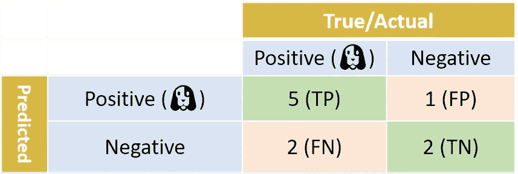
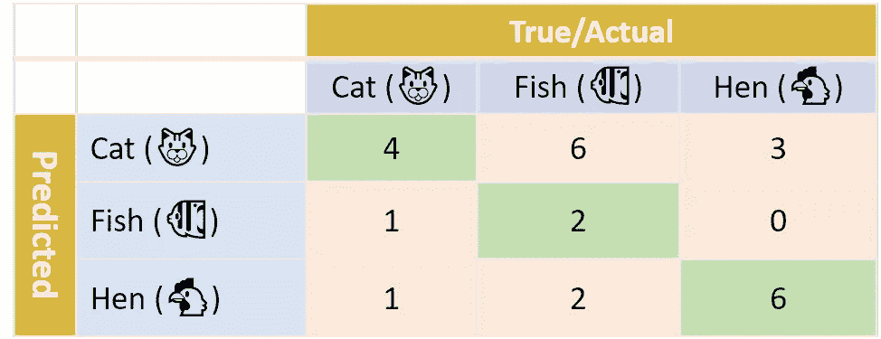
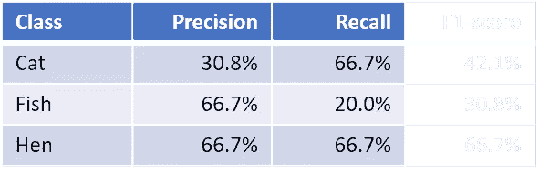
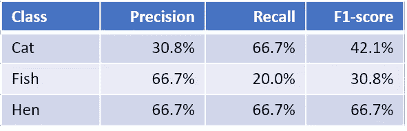
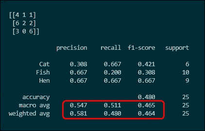

# 简化多类度量，第二部分:F1 分数

> 原文：<https://towardsdatascience.com/multi-class-metrics-made-simple-part-ii-the-f1-score-ebe8b2c2ca1?source=collection_archive---------0----------------------->

在 [**的**](https://medium.com/@shmueli/multi-class-metrics-made-simple-part-i-precision-and-recall-9250280bddc2) **[**第一部分**](https://medium.com/@shmueli/multi-class-metrics-made-simple-part-i-precision-and-recall-9250280bddc2) 中，多类度量做了简单的** ，我解释了精度和召回，以及如何为一个*多类*分类器计算它们。在这篇文章中，我将解释另一个流行的绩效衡量指标，F1 得分，或者更确切地说 F1 得分，因为至少有 3 个变量。我将解释为什么使用 F1 分数，以及如何在多班级设置中计算 F1 分数。

但是首先，一个**大警告:**F1-分数被广泛用作一种度量，但通常是比较分类器的错误方式。你经常会在学术论文中发现他们，研究人员使用较高的 F1 分数作为他们的模型比分数较低的模型更好的“证据”。然而，更高的 F1 分数并不一定意味着更好的分类器。慎用，对 F1 成绩半信半疑！稍后将详细介绍。

如同在第一部分中一样，我将从一个简单的二进制分类设置开始。提醒一下:这是使用我们的二元分类器为狗狗照片生成的混淆矩阵。我们在上一部分计算的准确率和召回率分别为 83.3%和 71.4%。

一般来说，我们更喜欢具有更高精度和召回分数的分类器。然而，在精确度和召回率之间有一个权衡:当调整一个分类器时，提高精确度分数通常会导致降低召回率分数，反之亦然——没有免费的午餐。

现在想象你有两个分类器——分类器 A 和分类器 B——每个都有自己的精度和召回率。一个具有更好的回忆分数，另一个具有更好的精确度。我们想谈谈它们的相对性能。换句话说，我们希望将模型的性能总结成一个单一的指标。这就是 F1 分数的用途。这是一种将精确度和召回率结合成一个数字的方法。f1-分数是使用一个*平均值*(“平均值”)计算的，而不是通常的*算术平均值*。它使用*谐波平均值*，该平均值由以下简单公式给出:

**F1-score = 2** × **(精度** × **召回)/(精度+召回)**

在上面的例子中，我们的二元分类器的 F1 分数是:

f1-得分= 2×(83.3%×71.4%)/(83.3%+71.4%)= 76.9%

类似于算术平均值，F1 分数总是介于精确度和召回率之间。但它的表现有所不同:F1 分数给予较低的数字更大的权重。例如，当精确度为 100%，召回率为 0%时，F1 分数将为 0%，而不是 50%。或者比如说**分类器 A** 的精度=召回率=80%，而**分类器 B** 的精度=60%，召回率=100%。从算术上来说，两种模型的精确度和召回率的平均值是相同的。但是当我们使用 F1 的调和平均公式时，**分类器 A** 的得分将为 80%，而**分类器 B** 的得分将仅为 75%。车型 B 的低精度得分拉低了其 F1 得分。

现在我们知道了如何计算二进制分类器的 F1 值，让我们回到第一部分中的多类示例。快速提醒:我们有 3 个类(猫、鱼、母鸡)和对应的分类器混淆矩阵:

我们现在要计算 F1 的分数。我们如何做到这一点？

记住 F1 分数是精确度和回忆的函数。在第一部分**中，我们已经学习了如何计算每类的精度和召回率。下面是我们三个类的精度和召回率的总结:**

有了上面的公式，我们现在可以计算每个级别的 F1 分数。例如，卡特彼勒的 F1 分数为:

f1-得分(Cat)= 2×(30.8%×66.7%)/(30.8%+66.7%)= 42.1%

鱼和母鸡也是如此。我们现在已经有了完整的每级 F1 分数:

下一步是将每个类别的 F1 分数合并成一个数字，即分类器的总体 F1 分数。有几种方法可以做到这一点。让我们从最简单的开始:每个班级 F1 分数的算术平均值。这被称为**宏观平均 F1 分数**，或简称为**宏观 F1 分数**，并被计算为我们每个级别 F1 分数的简单算术平均值:

**宏 F1 =(42.1%+30.8%+66.7%)/3 = 46.5%**

同理，我们也可以计算出*的宏观平均精度和**的宏观平均召回率:***

***宏精度= (31% + 67% + 67%) / 3 = 54.7%***

***宏观召回率= (67% + 20% + 67%) / 3 = 51.1%***

*(2019 . 8 . 20:我刚发现不止一个宏-F1 指标！上面描述的宏 F1 是最常用的，但是请看我的帖子[两个宏 F1 的故事](/a-tale-of-two-macro-f1s-8811ddcf8f04?source=your_stories_page---------------------------)*

*当对宏 F1 取平均值时，我们给了每个类相同的权重。我们不需要这样做:在**加权平均 F1 分数**或**加权 F1 分数**中，我们根据每个类别的样本数量对该类别的 F1 分数进行加权。在我们的例子中，我们总共有 25 个样本:6 只猫、10 条鱼和 9 只母鸡。加权 F1 分数的计算方法如下:*

***加权-F1 =(6**×42.1%+10×30.8%+9×66.7%)/25 = 46.4%*

*类似地，我们可以计算加权精度和加权召回率:*

***加权精度=(6**×30.8%+10×66.7%+9×66.7%)/25 = 58.1%*

***加权召回=(6**×66.7%+10×20.0%+9×66.7%)/25 = 48.0%*

*最后一个变体是**微平均 F1 分数**，或**微 F1** 。为了计算微 F1，我们首先计算所有样本的微平均*精度*和微平均*召回*，然后将两者结合。我们如何「微平均」？我们只是一起看所有的样本。请记住，precision 是预测阳性中真实阳性的比例(TP/(TP+FP))。在多类情况下，我们认为所有正确预测的样本都是真阳性。让我们再次看看我们的困惑矩阵:*

**

*有 4+2+6 个样本被正确预测(沿对角线的绿色单元)，总共 TP=12。我们现在需要计算假阳性的数量。因为我们一起查看所有的类，所以对于被预测的类，每个预测错误都是假阳性。例如，如果猫样本被预测为鱼，则该样本对于鱼是假阳性。因此，假阳性的总数就是预测错误的总数，我们可以通过对所有非对角线单元格(即粉色单元格)求和来找到该总数。在我们的例子中，这是 FP=6+3+1+0+1+2=13。因此，我们的精度是 12/(12+13)= 48.0%。*

*On to recall，这是实际阳性中真阳性的比例(TP/(TP+FN))。TP 和之前一样:4+2+6=12。我们如何计算假阴性的数量？以我们之前的例子为例，如果一个猫样本被预测为鱼，则该样本对于猫是假阴性的。更广泛地说，每个预测错误(X 被误分类为 Y)对于 Y 是假阳性，对于 X 是假阴性。因此，假阴性的总数再次是预测错误(即，粉色单元格)的总数，因此召回率与精确度相同:48.0%。*

*因为在微平均的情况下，精度=召回，所以它们也等于它们的调和平均值。换句话说，在微型 F1 赛事中:*

****微 F1* = *微精密* = *微召回****

*此外，这也是分类器的整体**准确度:**正确分类的样本占所有样本的比例**。**总而言之，以下内容始终适用于微型 F1 案例:*

****微 F1* = *微精度* = *微召回=精度****

*我之前提到过 F1 分数应该小心使用。为什么？尽管它们确实便于进行快速、高水平的比较，但它们的主要缺陷是对精确度和召回率给予了同等的重视。正如著名的统计学家戴维·汉德[向](https://app.dimensions.ai/details/publication/pub.1084928040)解释的那样，“赋予精确度和召回率的相对重要性应该是问题的一个方面”。将病人归类为健康人与将健康人归类为病人具有不同的成本，这应该反映在使用权重和成本为您试图解决的特定问题选择最佳分类器的方式中。这对于二进制分类器来说是真实的，并且当计算多类 F1 分数，例如宏观、加权或微观 F1 分数时，问题变得复杂。在多类情况下，不同的预测误差有不同的含义。将 X 预测为 Y 可能与将 Z 预测为 W 有不同的成本，依此类推。标准 F1 分数不考虑任何领域知识。*

*最后，让我们再次看看我们的脚本和 Python 的 sk-learn 输出。*

*这也是脚本的输出。下面两行显示的是*宏观平均*和*加权平均*精度、召回率和 F1 分数。还计算了准确度(48.0%)，其等于 micro-F1 分数。*

**

*这就结束了我对多类度量的两部分简短介绍。*

*我希望这些帖子对你有用。*

*[继续第三部分:Kappa 评分](/multi-class-metrics-made-simple-the-kappa-score-aka-cohens-kappa-coefficient-bdea137af09c)*