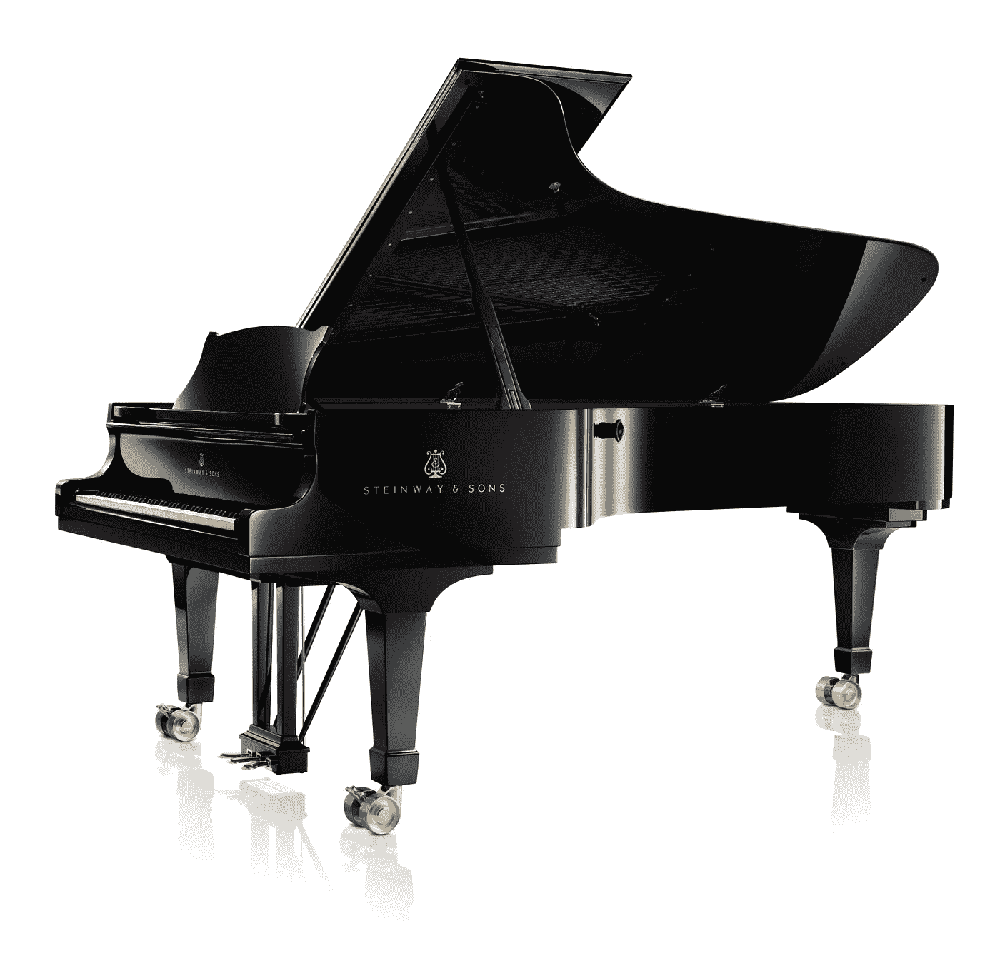
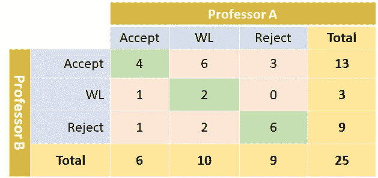
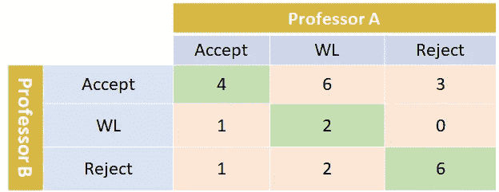
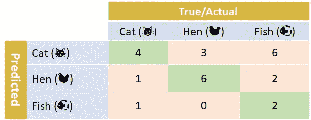

# 多类度量变得简单，第三部分:Kappa 分数(又名科恩的 Kappa 系数)

> 原文：<https://towardsdatascience.com/multi-class-metrics-made-simple-the-kappa-score-aka-cohens-kappa-coefficient-bdea137af09c?source=collection_archive---------2----------------------->

## 韵律学

## 衡量预测值和真实值之间的一致性

在我之前的**多类度量简单的**帖子中，我写了关于[精度和召回](https://www.google.com/url?sa=t&rct=j&q=&esrc=s&source=web&cd=1&cad=rja&uact=8&ved=2ahUKEwiGvcyA3bvmAhWSZt4KHZhFDf4QFjAAegQIBRAB&url=https%3A%2F%2Ftowardsdatascience.com%2Fmulti-class-metrics-made-simple-part-i-precision-and-recall-9250280bddc2&usg=AOvVaw3IZlPlxiAv7zI8t1IUB5tS)，以及 [F1 分数](/multi-class-metrics-made-simple-part-ii-the-f1-score-ebe8b2c2ca1)。我从许多读者那里收到了令人鼓舞的反馈。所以首先谢谢大家！在这篇文章中，我写了另一个流行的衡量标准:kappa 评分。你可能会发现 kappa 分数对你的申请很有用。

kappa 分数是一个有趣的指标。它起源于心理学领域:在对*受试者*(患者)进行评分时，用于测量两个人*评价者*或*评分者*(如心理学家)之间的*一致度*。它后来被机器学习社区“挪用”来衡量分类性能。也被称为*科恩的卡帕系数*，卡帕分数是以[雅各布·科恩](https://en.wikipedia.org/wiki/Jacob_Cohen_(statistician))的名字命名的，雅各布·科恩是一位美国统计学家和心理学家，他写了关于这个主题的开创性论文。这一指标的其他名称包括*科恩的 kappa* 和 *kappa 统计*。在这个帖子里，我简单的用 *kappa 评分*。

我首先解释什么是*一致性*以及 kappa 评分如何用于衡量一致性，以提供这一指标背后的直觉。然后我继续分类。

# 什么是协议？

想象一下，我们在一所著名的音乐学校(出于某种原因，我想到了茱莉亚音乐学院)管理钢琴系。现在是招生季节，25 名紧张的候选人准备在漂亮的斯坦威三角钢琴上展示他们的技能。我们请两位经验丰富的教授——被称为 A 教授和 B 教授——给每位候选人打分，看他们是**接受**、**等待名单(WL)、**还是**拒绝**。

以下是 25 位候选人的试镜结果:

每个候选人现在有两个评级，每个教授一个。自然，教授们对一些候选人意见一致，对另一些人意见不一。教授之间的高度一致增加了我们对评级可靠性的信心。低水平的一致意味着我们不能相信评级。kappa 分数衡量两个评估者之间的*一致程度*，也称为*评分者间可靠性*。

为了计算 kappa 分数，首先在矩阵中总结评级是方便的:

列显示教授 a 的评分。行显示教授 b 的评分。每个单元格中的值是两位教授相应评分的候选人数量。

衡量一致程度的一个简单方法是看两位教授之间的一致评级比例。姑且称这个数字为 ***同意*** 。计算 ***同意*** 很简单:我们只需要查看绿色单元格(对角线)中值的总和，然后除以学生总数:在我们的例子中，25 个评级中有 4+2+6=12 个是一致的，所以:

> ***同意*** *=12/25 =0.48*

就是这样！我们刚刚找到了达成一致的完美标准。或者我们有吗？嗯，我们的衡量标准并不复杂，因为它没有考虑到协议也可能是偶然发生的。这就是 kappa 分数的由来；*kappa 评分考虑协议比偶然协议好多少*。由此可见，除了 ***同意*** 之外，卡帕公式还使用了*机会协议的预期比例；*姑且称这个数字为***chance agree****。*

我们已经知道如何计算 ***同意*** 。目前，让我们假设我们知道 ***ChanceAgree*** 的值。我们将这两个数字结合起来计算 kappa 分数，如下所示

> ***KappaScore =(Agree-chance Agree)/(1-chance Agree)***

注意，分子计算的是 ***同意*和*机会同意之间的差值。*** 如果 ***一致*** *=* 1，我们有完美一致，对应一个矩阵，其中所有非对角线(粉色)的单元格都是 0。在这种情况下，kappa 值为 1，不考虑 ***ChanceAgree*** 。相比之下，如果***Agree = chance Agree***，kappa 为 0，表示教授们的约定是偶然的。如果 ***同意*** 小于 ***偶然同意*** ，则 kappa 值为负，表示同意程度低于偶然同意*。*

回到我们的例子:在我们的例子中(如我们不久前计算的那样)， ***ChanceAgree*** 是 0.3024。换句话说，我们预计约 30%的协议是偶然发生的，也就是说约 7-8 名学生(25 名学生中的 30%)。教授们同意 25 名学生中的 12 名，因此 kappa 分数为正:

> *KappaScore =(同意-机会同意)/(1-机会同意)
> =(0.48–0.3024)/(1–0.3024)
> = 0.2546*

在下一节中，我将解释 ***ChanceAgree*** 是如何计算的。

为了计算 ***ChanceAgree*** ，我们首先来看看每位教授将学生评为 **Accept** 的概率。我们再来看看评级矩阵；为了方便起见，我们添加了行和列的总计:

对于 A 教授来说，25 个评分中 4+1+1=6 被**接受**；对于 B 教授来说，这个数字是 4+6+3=13。因此，对于教授 A 和 B，将学生评定为**接受**的概率为:

> *ProbA(接受)= 6/25=0.24
> ProbB(接受)=13/25=0.52*

两位教授偶然同意一个**接受** *的概率*等于 ProbA 和 ProbB 的乘积:

> *chance agree(Accept)= ProbA(Accept)×ProbB(Accept)= 0.24×0.52 =****0.1248***

同样，我们计算 **WL** 和**拒绝**的同意概率:

> *普罗巴(WL)=10/25=0.4
> 普罗布(WL)=3/25=0.12
> 钱斯·阿科雷(WL)=普罗巴(WL)×普罗布(WL)= 0.4×0.12 =****0.048***
> 
> *ProbA(Reject)= 9/25 = 0.36
> ProbB(Reject)= 9/25 = 0.36
> chance agree(Reject)= ProbA(Reject)×ProbB(Reject)= 0.36×0.36 =****0.1188***

将上述三种概率相加，我们得到协议中任何一个事件——**接受**、**、**拒绝**——偶然发生的概率:**

> *机会同意=
> =机会同意(接受)+机会同意(WL)+机会同意(拒绝)
> = 0.1248+0.0480+0.1188 =****0.3024***

就是这样！我们学习了如何计算 ***机会一致*** 。结合 ***同意*** ，我们现在可以使用 kappa 评分来衡量同意程度。但是我们如何用它来衡量分类性能呢？

# 使用 Kappa 评分进行分类

要了解 kappa 评分如何用作分类器性能的衡量标准，让我们再次查看评级矩阵:

嗯，你可能已经猜到了:它非常类似于一个混淆矩阵！将其与我在其他帖子中使用的混淆矩阵进行比较( [Precision and Recall](https://medium.com/@shmueli/multi-class-metrics-made-simple-part-i-precision-and-recall-9250280bddc2) ， [F1-score](/multi-class-metrics-made-simple-part-ii-the-f1-score-ebe8b2c2ca1) )，在那里我们构建了一个分类器，可以检测照片中的:“猫”、“母鸡”或“鱼”。注意到“深刻”的相似性了吗？单元格值完全相同。

要用 kappa 进行分类，我们可以简单的把每个评级看成一个类；另外，A 教授的评分是真实/实际值；B 教授的评分就是预测值(或者反过来——无所谓)。在这个实例中，*kappa 分数测量真实值和预测值之间的一致程度*，我们将其用作分类器的性能。在我们的例子中，我们可以使用之前计算的 kappa 值，因为单元值是相同的:

> KappaScore = 0.2546

因为 1 表示完全一致，0 表示偶然一致，所以我们通常会得到一个介于两者之间的值。如果值小于 0，我们做的*比机会一致(不一致)*差，所以分类器中的某些东西被严重破坏了。

kappa 分数可以使用 Python 的 scikit-learn 库来计算(R 用户可以使用 [cohen.kappa()函数](https://www.rdocumentation.org/packages/psych/versions/1.8.12/topics/cohen.kappa)，它是 psych 库的一部分)。

以下是我如何证实我的计算:

帖子到此结束。希望你觉得有用！