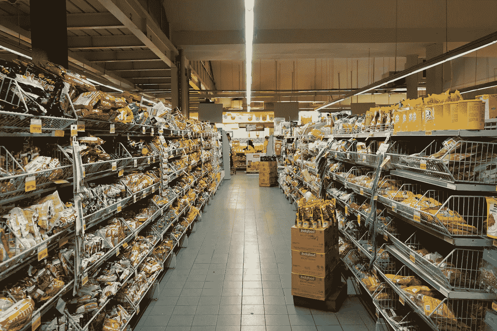
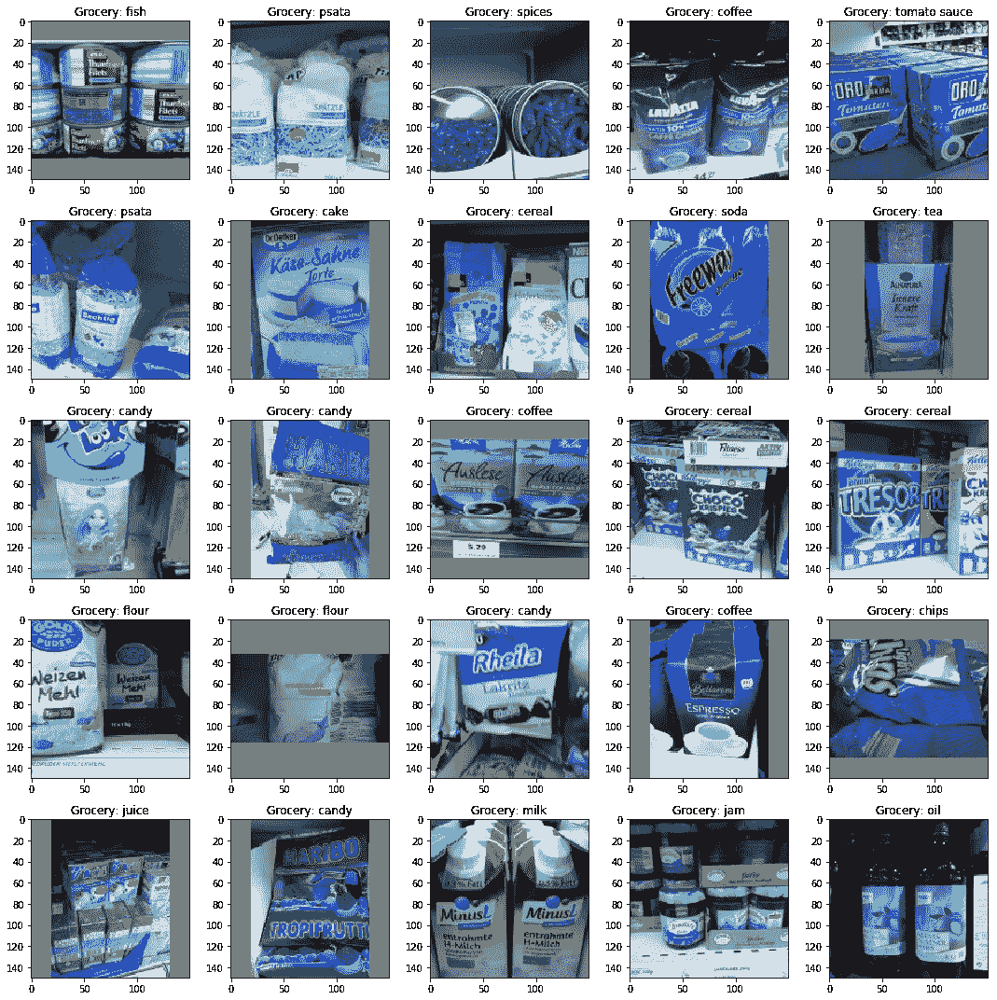
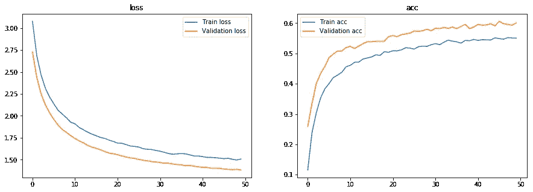
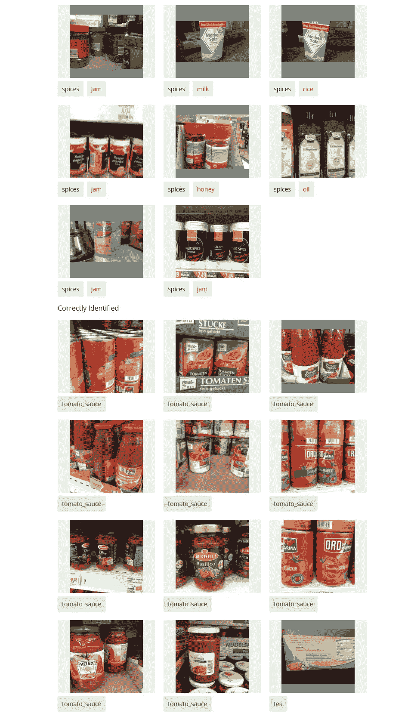

# 零售产品的多类对象分类

> 原文：<https://towardsdatascience.com/multi-class-object-classification-for-retail-products-aa4ecaaaa096?source=collection_archive---------10----------------------->

## 无摩擦商店体验的计算机视觉。

Photo by [Fikri Rasyid](https://unsplash.com/@fikrirasyid?utm_source=unsplash&utm_medium=referral&utm_content=creditCopyText) on [Unsplash](https://unsplash.com/search/photos/grocery-store?utm_source=unsplash&utm_medium=referral&utm_content=creditCopyText)

被困在付费墙后面？点击[这里](/multi-class-object-classification-for-retail-products-aa4ecaaaa096?source=friends_link&sk=a09cd7d1715635d2519b1f10a3bf06f6)阅读完整故事与我的朋友链接！

零售从来都不是一个停滞不前的行业。如果零售商想要成功，他们就不能停滞不前。他们必须适应和创新，否则就有被抛在后面的风险。

计算机视觉在零售业中的应用将从根本上改变客户和零售商的购物体验。在这篇博客中，我将为零售产品制作一个基于计算机视觉的多类对象分类模型。这个项目的灵感来自著名的[亚马逊 Go](https://www.amazon.com/b?ie=UTF8&node=16008589011) 商店。我希望你喜欢这篇文章，并发现它很有见地。

亚马逊将 Amazon Go 描述为一种不需要结账的新型商店。这意味着当你在 Amazon Go 购物时，你永远不必排队。该商店使用 Amazon Go 应用程序——你进入 Amazon Go，拿走你想要的产品，感谢该应用程序，只需再次离开。它通过使用自动驾驶汽车中发现的相同类型的技术来工作，如计算机视觉、传感器融合和深度学习。这项技术可以检测产品何时被拿走或放回货架，并在您的虚拟购物车中跟踪它们。当你带着商品离开商店时，你的亚马逊账户会被扣款，你会收到一张收据。

如果你想看的话，这是视频。

# 计算机视觉在零售业中的应用

1.  使用面部识别定制体验。
2.  让购物更人性化，减少交易。
3.  基于计算机视觉的库存管理。
4.  模糊了店内和网上的界限。
5.  无摩擦商店体验。

# 数据

我在这个项目中使用了弗赖堡杂货数据集。它由 25 种食物的 5000 张 256x256 RGB 图像组成。论文可以在[这里](https://arxiv.org/pdf/1611.05799.pdf)找到，数据集[这里](http://aisdatasets.informatik.uni-freiburg.de/freiburg_groceries_dataset)找到。

# 环境和工具

1.  Numpy
2.  熊猫
3.  sci kit-图像
4.  Matplotlib
5.  sci kit-学习
6.  克拉斯

# 图像分类

完整的图像分类管道可以形式化如下:

*   我们的输入是一个由 *N* 幅图像组成的训练数据集，每幅图像都标有 25 个不同类别中的一个。
*   然后，我们使用这个训练集来训练一个分类器，以学习每个类的样子。
*   最后，我们通过要求分类器预测一组它以前从未见过的新图像的标签来评估分类器的质量。然后，我们将这些图像的真实标签与分类器预测的标签进行比较。

# 代码在哪里？

事不宜迟，让我们从代码开始吧。github 上的完整项目可以在这里找到[。](https://github.com/abhinavsagar/Grocery-Image-Classification)

我从加载所有的库和依赖项开始。

接下来，我制作了一个函数来绘制损失和准确性，这将在训练模型后得到。

我还创建了几个函数来返回特定图像的标签并加载数据集。

我继续为每个产品创建单独的类，并调用函数来加载每个类的所有图像。

接下来，我将图像转换成分类格式，然后再对图像进行归一化。我还将数据集分成两部分——80%的数据用于训练集，20%的数据用于测试集。

由于数据集很小，我使用了旋转、缩放和翻转等数据扩充策略。这几乎使数据集的大小增加了一倍。

让我们展示每个类别中的一些示例。

Sample Products

到目前为止一切顺利。现在到了项目有趣的部分。我们来做深度学习模型。

我已经使用预训练的 VGG 重量转移学习。在此基础上，我使用了一个平均池层来减少前几层的学习权重的差异。此外，我用 30%的辍学，以减少过度拟合。最后，我使用了一个有 25 个神经元的密集层来表示我们数据集中的 25 类食品。我使用 softmax 作为激活函数，因为它是一个多类分类问题。

让我们将模型可视化。

我继续使用 keras 定义一些回调。如果验证准确性增加，我使用模型检查点来节省权重。如果验证损失开始趋于平稳，我还使用了提前停止标准。另外两个回调用于在 tensorboard 中可视化结果，以及在 csv 文件中保存日志。

接下来，我定义了 2 个优化器。第一个是随机梯度下降，学习率为 0.0001，动量值为 0.99。第二个是亚当，学习率略高，为 0.001。

对比两者，我发现亚当给出了更好的结果。我还使用分类交叉熵作为我们模型的损失函数。我对模型进行了 50 次迭代，批量大小为 128，我认为这是解决这个问题的最佳方法。

最后我画出了结果。

# 结果

## 损失/精度与历元

Loss/Accuracy vs Epoch

该模型能够达到 60%的验证准确性，考虑到每个类别中有 100-200 张图像的类别数量(25)，这已经是相当不错的了。您可以随意使用不同的架构或使用超参数来获得更好的结果。

## 正确与不正确的样本

Correct vs Incorrect Samples

可以注意到，我们的模型预测了相当多的错误分类样本。但我仍然觉得这应该是这个领域进一步工作的良好开端。

# 结论

虽然这个项目还远未完成，但在如此多样的现实世界问题中看到深度学习的成功是令人瞩目的。自动对象分类对于食品和杂货零售商非常有帮助，可以减少仓库和零售店的库存管理过程中的人力。无摩擦的商店体验也被认为是购物的未来。

# 参考资料/进一步阅读

 [## Amazon.com::亚马逊 Go

### Amazon Go 是一种新型商店，拥有世界上最先进的购物技术。没有排队，没有结账-只是…

www.amazon.com](https://www.amazon.com/b?ie=UTF8&node=16008589011)  [## 计算机视觉的主要零售用途及其如何增强购物

### 网络和网上购物的出现给零售业带来了巨大的冲击。然而，它从来没有…

searchenterpriseai.techtarget.com](https://searchenterpriseai.techtarget.com/feature/252463246/Top-computer-vision-retail-uses-and-how-they-enhance-shopping)  [## 零售业计算机视觉初学者指南

### 任何一个手指未干的人现在都应该听说过席卷发达国家的“零售业末日”…

hackernoon.com](https://hackernoon.com/a-beginners-guide-to-computer-vision-in-retail-b5a31cfd5283) 

# 在你走之前

相应的源代码可以在这里找到。

 [## abhinavsagar/杂货-图像-分类

### 弗莱堡食品数据集由 25 种食品的 5000 张 256x256 RGB 图像组成。我用过迁移学习…

github.com](https://github.com/abhinavsagar/Grocery-Image-Classification) 

# 联系人

如果你想了解我最新的文章和项目[，请关注我的媒体](https://medium.com/@abhinav.sagar)。以下是我的一些联系人详细信息:

*   [个人网站](https://abhinavsagar.github.io)
*   [领英](https://in.linkedin.com/in/abhinavsagar4)
*   [中等轮廓](https://medium.com/@abhinav.sagar)
*   [GitHub](https://github.com/abhinavsagar)
*   [卡格尔](https://www.kaggle.com/abhinavsagar)

快乐阅读，快乐学习，快乐编码！