# 基于 LSTM 的多类文本分类

> 原文：<https://towardsdatascience.com/multi-class-text-classification-with-lstm-1590bee1bd17?source=collection_archive---------0----------------------->


Photo credit: Pixabay

## 如何使用 Keras 深度学习库开发 Python 中文本分类问题的 LSTM 递归神经网络模型

自动文本分类或文档分类可以在机器学习中以许多不同的方式完成，如我们在之前看到的[。](/multi-class-text-classification-model-comparison-and-selection-5eb066197568)

本文旨在提供一个示例，说明如何使用 [Keras](https://keras.io/) 实现使用[长短期记忆](https://en.wikipedia.org/wiki/Long_short-term_memory) (LSTM)架构的[递归神经网络](https://en.wikipedia.org/wiki/Recurrent_neural_network) (RNN)。我们将使用与我们使用 Scikit-Lean 的[多类文本分类相同的数据源，即源自](/multi-class-text-classification-with-scikit-learn-12f1e60e0a9f)[data.gov](https://catalog.data.gov/dataset/consumer-complaint-database)的消费者投诉数据集。

# 数据

我们将使用一个较小的数据集，您也可以在 [Kaggle](https://www.kaggle.com/cfpb/us-consumer-finance-complaints) 上找到数据。在该任务中，给定一个消费者投诉叙述，该模型尝试预测投诉是关于哪个产品的。这是一个多类文本分类问题。我们走吧！

```
df = pd.read_csv('consumer_complaints_small.csv')
df.info()
```

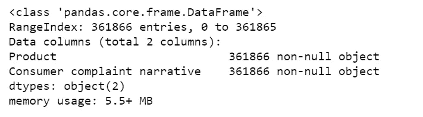

Figure 1

```
df.Product.value_counts()
```

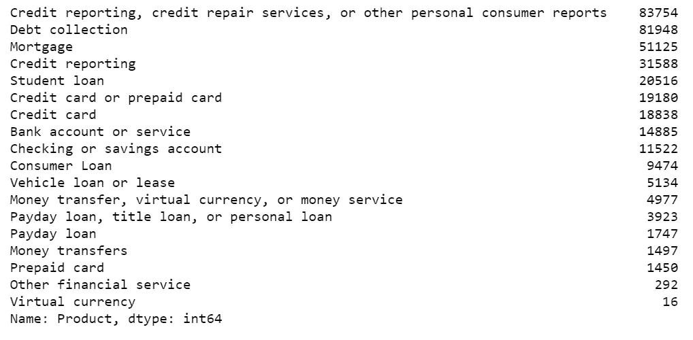

Figure 2

# 标签合并

第一眼看到标签后，我们意识到我们可以做些事情来让我们的生活变得更轻松。

*   将“信用报告”合并为“信用报告、信用修复服务或其他个人消费者报告”。
*   将“信用卡”合并为“信用卡或预付卡”。
*   将“发薪日贷款”合并为“发薪日贷款、产权贷款或个人贷款”。
*   将“虚拟货币”合并为“货币转移、虚拟货币或货币服务”。
*   “其他金融服务”的投诉数量很少，没有任何意义，所以，我决定删除它。

```
df.loc[df['Product'] == 'Credit reporting', 'Product'] = 'Credit reporting, credit repair services, or other personal consumer reports'
df.loc[df['Product'] == 'Credit card', 'Product'] = 'Credit card or prepaid card'
df.loc[df['Product'] == 'Payday loan', 'Product'] = 'Payday loan, title loan, or personal loan'
df.loc[df['Product'] == 'Virtual currency', 'Product'] = 'Money transfer, virtual currency, or money service'
df = df[df.Product != 'Other financial service']
```

整合后，我们有 13 个标签:

```
df['Product'].value_counts().sort_values(ascending=False).iplot(kind='bar', yTitle='Number of Complaints', 
                                                                title='Number complaints in each product')
```

Figure 3

# 文本预处理

让我们看看这些短信有多脏:

```
def print_plot(index):
    example = df[df.index == index][['Consumer complaint narrative', 'Product']].values[0]
    if len(example) > 0:
        print(example[0])
        print('Product:', example[1])print_plot(10)
```

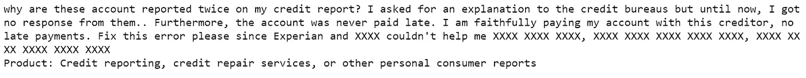

Figure 4

```
print_plot(100)
```

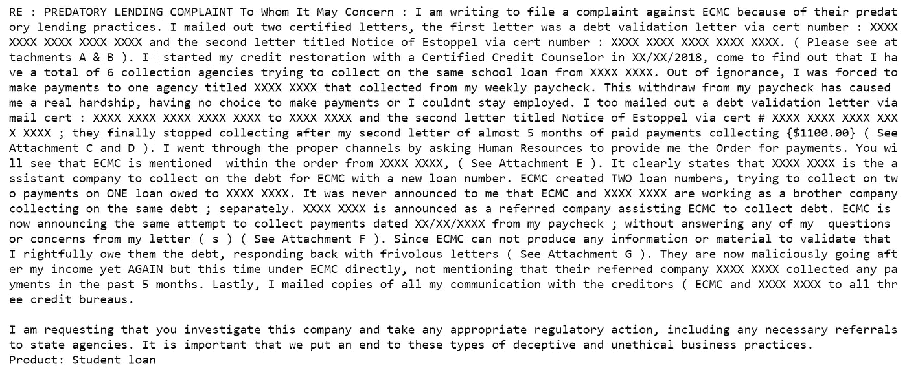

Figure 5

很脏，是吧！

我们的文本预处理将包括以下步骤:

*   将所有文本转换为小写。
*   在文本中用空格替换 REPLACE_BY_SPACE_RE 符号。
*   从文本中删除 BAD_SYMBOLS_RE 中的符号。
*   删除文本中的“x”。
*   删除停用词。
*   删除文本中的数字。

text_preprocessing_LSTM.py

现在回过头来检查我们的文本预处理的质量:

```
print_plot(10)
```

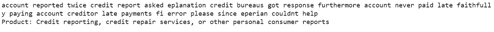

Figure 6

```
print_plot(100)
```

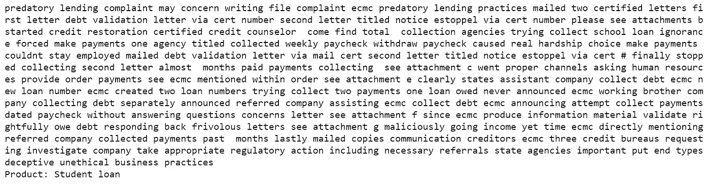

Figure 7

不错！我们完成了文本预处理。

# LSTM 造型

*   通过将每个文本转换成整数序列或向量，对消费者投诉文本进行矢量化。
*   将数据集限制在 50000 个单词以内。
*   将每个投诉的最大字数设置为 250。

```
# The maximum number of words to be used. (most frequent)
MAX_NB_WORDS = 50000
# Max number of words in each complaint.
MAX_SEQUENCE_LENGTH = 250
# This is fixed.
EMBEDDING_DIM = 100tokenizer = Tokenizer(num_words=MAX_NB_WORDS, filters='!"#$%&()*+,-./:;<=>?@[\]^_`{|}~', lower=True)
tokenizer.fit_on_texts(df['Consumer complaint narrative'].values)
word_index = tokenizer.word_index
print('Found %s unique tokens.' % len(word_index))
```


*   截断并填充输入序列，使它们在建模时长度相同。

```
X = tokenizer.texts_to_sequences(df['Consumer complaint narrative'].values)
X = pad_sequences(X, maxlen=MAX_SEQUENCE_LENGTH)
print('Shape of data tensor:', X.shape)
```

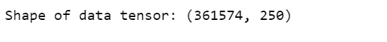

*   将分类标签转换为数字。

```
Y = pd.get_dummies(df['Product']).values
print('Shape of label tensor:', Y.shape)
```

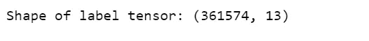

*   列车测试分离。

```
X_train, X_test, Y_train, Y_test = train_test_split(X,Y, test_size = 0.10, random_state = 42)
print(X_train.shape,Y_train.shape)
print(X_test.shape,Y_test.shape)
```

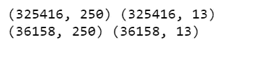

*   第一层是嵌入层，使用 100 个长度向量来表示每个单词。
*   SpatialDropout1D 在 NLP 模型中执行变分丢失。
*   下一层是具有 100 个存储单元的 LSTM 层。
*   输出层必须创建 13 个输出值，每个类一个。
*   激活功能是 softmax 用于多类分类。
*   因为这是一个多类分类问题，所以使用 categorical _ crossentropy 作为损失函数。

consumer_complaint_lstm.py

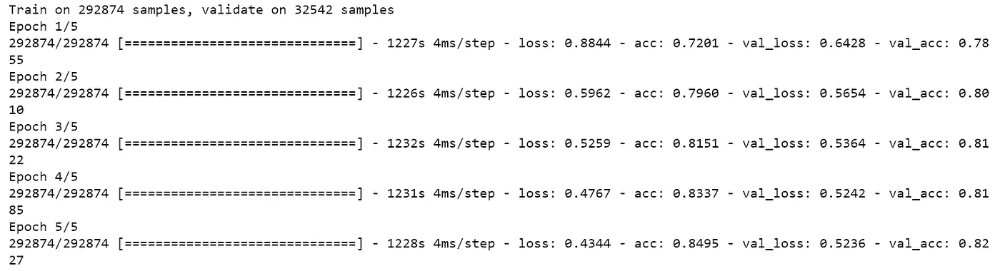

Figure 8

```
accr = model.evaluate(X_test,Y_test)
print('Test set\n  Loss: {:0.3f}\n  Accuracy: {:0.3f}'.format(accr[0],accr[1]))
```


```
plt.title('Loss')
plt.plot(history.history['loss'], label='train')
plt.plot(history.history['val_loss'], label='test')
plt.legend()
plt.show();
```

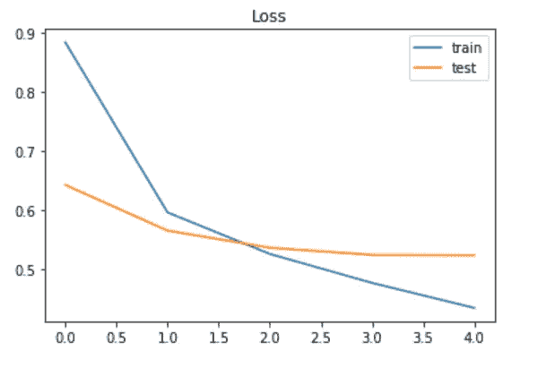

Figure 9

```
plt.title('Accuracy')
plt.plot(history.history['acc'], label='train')
plt.plot(history.history['val_acc'], label='test')
plt.legend()
plt.show();
```

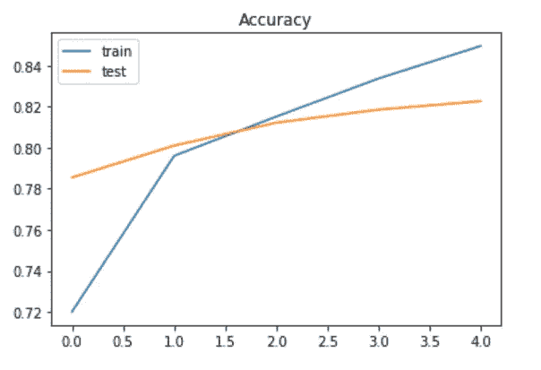

Figure 10

这些图表明，该模型有一点过度拟合的问题，更多的数据可能会有所帮助，但更多的时代不会有助于使用当前的数据。

# 用新投诉进行测试

test_new_complaint.py

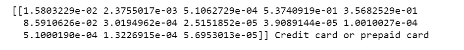

Jupyter 笔记本可以在 [Github](https://github.com/susanli2016/NLP-with-Python/blob/master/Multi-Class%20Text%20Classification%20LSTM%20Consumer%20complaints.ipynb) 上找到。享受这周剩下的时光吧！

参考:

[](https://machinelearningmastery.com/sequence-classification-lstm-recurrent-neural-networks-python-keras/) [## 基于 LSTM 递归神经网络的序列分类

### 序列分类是一个预测性的建模问题，在这个问题中，你在空间或时间上有一些输入序列，并且…

machinelearningmastery.com](https://machinelearningmastery.com/sequence-classification-lstm-recurrent-neural-networks-python-keras/)